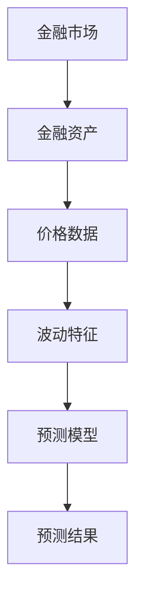
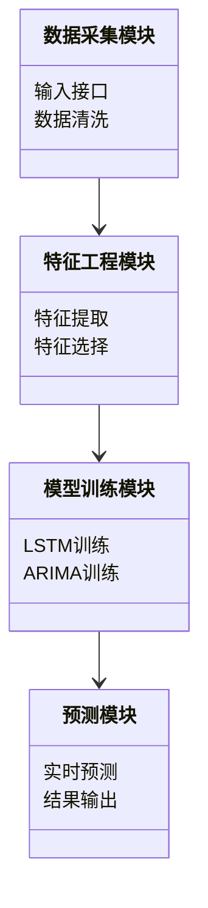
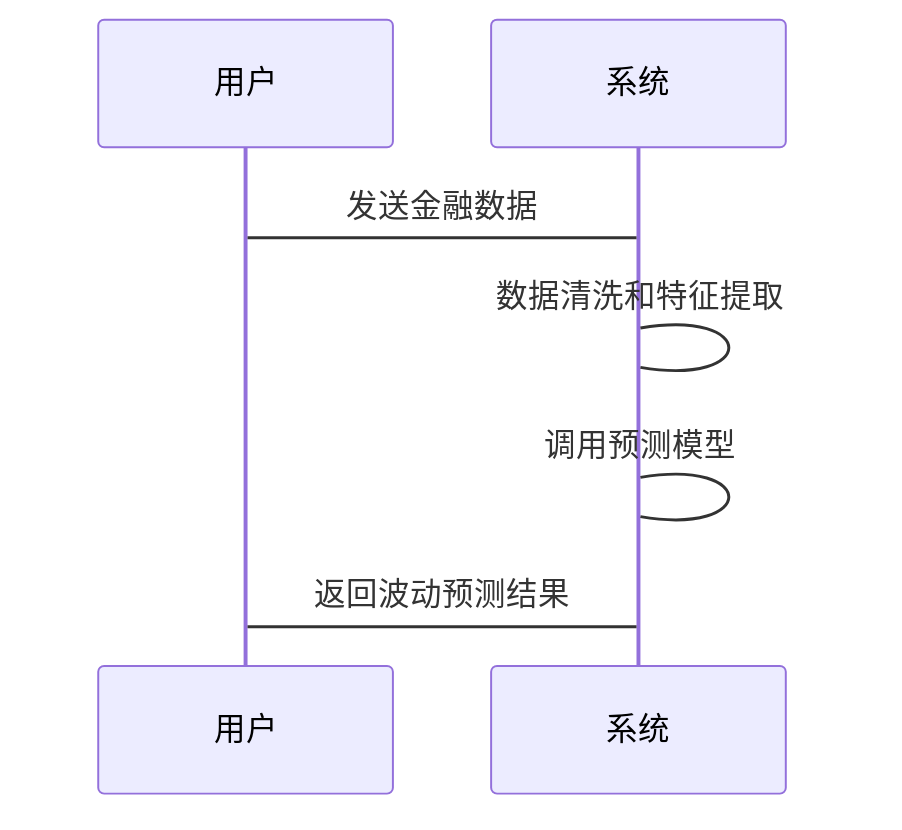

                 


# 金融市场波动预测模型

## 关键词：金融市场，波动预测，时间序列，机器学习，LSTM，ARIMA，风险管理

## 摘要：金融市场波动预测是投资决策中的重要环节，本文通过分析时间序列数据，结合传统统计方法与机器学习算法，构建高效的金融市场波动预测模型。文章详细探讨了特征工程、算法原理、系统架构设计及项目实战，为读者提供从理论到实践的全面指导。

---

## 第一部分: 金融市场波动预测模型概述

### 第1章: 金融市场波动预测的背景与概述

#### 1.1 金融市场的基本概念
- **1.1.1 金融市场的定义与分类**
  - 金融市场是资金流动的场所，分为货币市场和资本市场。
  - 货币市场交易短期金融工具，资本市场交易股票、债券等长期工具。
- **1.1.2 金融资产的波动性特征**
  - 股票、债券等金融资产的价格波动受多种因素影响，如经济指标、政策变化等。
- **1.1.3 金融市场波动对投资者的影响**
  - 波动性高的市场对投资者来说既是机会也是风险。

#### 1.2 金融市场波动预测的定义与重要性
- **1.2.1 波动预测的定义**
  - 预测金融资产价格波动的幅度和方向。
- **1.2.2 波动预测在投资决策中的作用**
  - 帮助投资者制定交易策略，规避风险。
- **1.2.3 波动预测的挑战与意义**
  - 数据复杂性、市场非线性关系等增加了预测难度，但成功的预测能带来显著收益。

#### 1.3 传统波动预测方法与机器学习的结合
- **1.3.1 传统统计方法简介**
  - 如移动平均法、指数平滑法，适用于简单的趋势预测。
- **1.3.2 机器学习在波动预测中的优势**
  - 高维度数据处理能力强，能捕捉复杂模式。
- **1.3.3 传统方法与机器学习的对比分析**
  - 传统方法适用于线性关系，机器学习适用于非线性复杂场景。

---

## 第二部分: 金融市场波动预测的核心概念与联系

### 第2章: 时间序列分析与特征工程

#### 2.1 时间序列分析的基本原理
- **2.1.1 时间序列的组成要素**
  - 趋势、周期性、季节性、随机性。
- **2.1.2 时间序列的平稳性与分解方法**
  - 平稳时间序列适合使用ARIMA等模型。
  - 分解方法包括移动平均法、差分法。

#### 2.2 金融市场波动预测的特征工程
- **2.2.1 数据特征的提取方法**
  - 均值、方差、最大值、最小值等统计指标。
- **2.2.2 常见的特征工程方法对比**
  - 表格对比：移动平均、指数平滑、自相关分析。
- **2.2.3 特征选择与降维技术**
  - 使用主成分分析（PCA）减少特征维度。

#### 2.3 金融市场波动预测的实体关系图


---

## 第三部分: 金融市场波动预测的算法原理

### 第3章: 常见波动预测算法介绍

#### 3.1 自回归积分滑动平均模型（ARIMA）
- **3.1.1 ARIMA模型的数学公式**
  $$ARIMA(p, d, q) = y_t - \phi_1 y_{t-1} - \dots - \phi_p y_{t-p} = \theta_1 \epsilon_{t-1} + \dots + \theta_q \epsilon_{t-q}$$
- **3.1.2 ARIMA模型的实现步骤**
  1. 数据平稳化：差分处理。
  2. 确定模型参数p和q。
  3. 模型训练与验证。

#### 3.2 长短期记忆网络（LSTM）
- **3.2.1 LSTM模型的基本结构**
  - 由输入门、遗忘门、输出门组成。
- **3.2.2 LSTM模型的数学公式**
  $$i_t = \sigma(w_{ix}x_t + w_{ih}h_{t-1} + b_i)$$
  $$f_t = \sigma(w_{fx}x_t + w_{fh}h_{t-1} + b_f)$$
  $$o_t = \sigma(w_{ox}x_t + w_{oh}h_{t-1} + b_o)$$
  $$h_t = i_t \cdot \tanh(w_{hx}x_t + w_{hh}h_{t-1} + b_h)$$
  $$c_t = f_t \cdot c_{t-1} + i_t \cdot h_t$$
- **3.2.3 LSTM模型的实现步骤**
  1. 数据预处理：归一化、分割训练集和测试集。
  2. 构建LSTM网络结构。
  3. 编译并训练模型。

---

## 第四部分: 系统架构设计与实现

### 第4章: 系统架构设计

#### 4.1 问题场景介绍
- 需要构建一个实时波动预测系统，支持多资产类型的数据输入，提供实时波动预测结果。

#### 4.2 项目介绍
- 系统名称：金融市场波动预测系统。
- 开发目标：提供准确的波动预测，辅助投资者决策。

#### 4.3 系统功能设计
- 领域模型：使用Mermaid类图展示各模块关系。


#### 4.4 系统架构设计
- 使用分层架构：数据采集层、特征处理层、模型训练层、预测层。

#### 4.5 系统接口设计
- 数据输入接口：接收JSON格式的金融数据。
- 预测结果接口：返回波动预测值和置信区间。

#### 4.6 系统交互设计
- 使用Mermaid序列图展示用户与系统的交互流程。


---

## 第五部分: 项目实战

### 第5章: 项目实战

#### 5.1 环境安装
- 安装Python、TensorFlow、Keras、Pandas等库。

#### 5.2 数据采集与预处理
- 使用Yahoo Finance API获取股票数据。
- 数据清洗：处理缺失值、异常值。

#### 5.3 特征工程
- 提取均值、方差、最大值、最小值等特征。
- 使用PCA降维。

#### 5.4 模型训练与评估
- LSTM模型训练代码示例：
```python
import numpy as np
from tensorflow.keras.models import Sequential
from tensorflow.keras.layers import LSTM, Dense, Dropout

# 数据准备
X_train, y_train = ...

model = Sequential()
model.add(LSTM(128, input_shape=(timesteps, features)))
model.add(Dropout(0.2))
model.add(Dense(1, activation='linear'))

model.compile(optimizer='adam', loss='mean_squared_error')
model.fit(X_train, y_train, epochs=100, batch_size=32)
```

#### 5.5 实际案例分析
- 使用真实股票数据训练模型，并评估预测效果。
- 对比ARIMA和LSTM模型的预测结果。

---

## 第六部分: 最佳实践与总结

### 第6章: 最佳实践与总结

#### 6.1 最佳实践
- 数据质量是模型性能的关键，确保数据清洗和特征提取的准确性。
- 模型调优：尝试不同的超参数组合，选择最优模型。
- 风险管理：结合波动预测结果制定风险管理策略。

#### 6.2 小结
- 金融市场波动预测是一个复杂但极具挑战性的任务。
- 综合使用传统统计方法和机器学习算法，能显著提高预测精度。

#### 6.3 注意事项
- 避免过度拟合，保持模型的泛化能力。
- 定期更新模型，适应市场变化。

#### 6.4 拓展阅读
- 推荐阅读《机器学习实战》和《时间序列分析》。

---

## 作者：AI天才研究院 & 禅与计算机程序设计艺术

---

通过以上详细的内容结构，您可以逐步完成整篇文章的撰写。每一章的内容都需要进一步丰富，加入具体的案例分析、代码实现和详细的技术解读，以确保文章内容的完整性和专业性。

