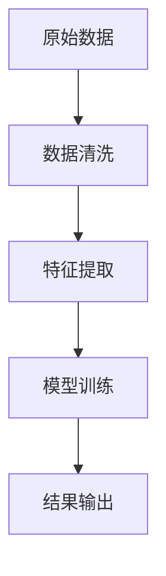
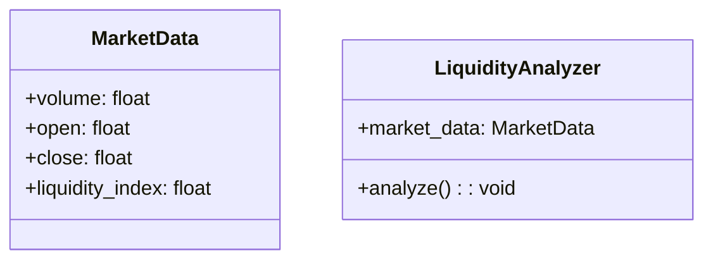

                 


# 金融市场流动性分析工具

## 关键词：金融市场，流动性分析，数据分析工具，算法原理，系统架构

## 摘要：金融市场流动性分析是金融学中的核心问题，直接影响市场的稳定性和交易效率。本文从流动性分析的基本概念出发，系统阐述了流动性分析工具的数学模型、算法原理、系统架构及实现方案，结合实际案例，深入探讨了流动性分析工具在金融市场的应用及其技术实现的关键点。文章最后给出了流动性分析工具的开发建议和未来发展方向。

---

# 第1章: 金融市场流动性概述

## 1.1 金融市场流动性定义与背景

### 1.1.1 金融市场的基本概念

金融市场是资金流动和资产交易的场所，参与者包括投资者、金融机构、企业和政府。市场的流动性是衡量市场效率和稳定性的重要指标。

### 1.1.2 流动性的定义与重要性

流动性是指资产在市场中迅速转换为现金的能力。高流动性意味着交易成本低、成交速度快；低流动性可能导致交易价格波动大、成交时间长。

### 1.1.3 流动性分析的背景与应用领域

流动性分析广泛应用于股票、债券、外汇等市场，帮助投资者、交易员和监管机构评估市场风险、制定交易策略。

## 1.2 流动性分析的核心概念

### 1.2.1 流动性与市场深度的关系

市场深度是指在不显著影响市场价格的情况下，可以交易的资产数量。深度越高，流动性通常越好。

### 1.2.2 流动性与市场波动性的联系

高波动性市场通常流动性较低，因为价格变化快，参与者难以迅速做出反应。

### 1.2.3 流动性分析的边界与外延

流动性分析不仅关注交易速度和成本，还涉及市场结构、参与者行为和宏观经济因素。

## 1.3 本章小结

本章介绍了金融市场流动性分析的基本概念、重要性及其应用领域，为后续分析奠定了基础。

---

# 第2章: 金融市场流动性分析工具的核心原理

## 2.1 流动性分析的核心概念与联系

### 2.1.1 流动性分析的原理概述

流动性分析通过量化交易成本、市场深度和订单簿数据，评估市场流动性。

### 2.1.2 流动性分析的核心要素对比表

| 要素 | 定义 | 影响 |
|------|------|------|
| 市场深度 | 可成交数量 | 高深度=高流动性 |
| 买卖价差 | 最新价与最优价差 | 小价差=高流动性 |
| 成交时间 | 成交所需时间 | 短时间=高流动性 |
| 交易成本 | 买卖价差和佣金 | 低成本=高流动性 |

### 2.1.3 流动性分析的ER实体关系图

```mermaid
erd
    Market entity {
        id
        name
        liquidity_index
    }
    Trading entity {
        id
        order_id
        price
        quantity
        timestamp
    }
   关联关系：Market entity ↔ Trading entity
```

## 2.2 流动性分析的数学模型与公式

### 2.2.1 流动性指数模型

流动性指数公式：
$$ liquidity\_index = \frac{VWAP}{TWAP} $$

其中：
- VWAP：成交量加权平均价格
- TWAP：时间加权平均价格

### 2.2.2 市场冲击模型

市场冲击公式：
$$ impact = \sqrt{\frac{v}{VWAP} \times t} $$

其中：
- \( v \)：交易量
- \( VWAP \)：成交量加权平均价格
- \( t \)：交易时间

### 2.2.3 交易成本模型

交易成本公式：
$$ cost = (b - s) \times \frac{v}{VWAP} $$

其中：
- \( b \)：买入价
- \( s \)：卖出价
- \( v \)：交易量
- \( VWAP \)：成交量加权平均价格

## 2.3 本章小结

本章详细讲解了流动性分析的核心概念、数学模型及其之间的关系，为后续实现奠定了基础。

---

# 第3章: 流动性分析工具的算法原理

## 3.1 算法原理概述

### 3.1.1 时间序列分析算法

时间序列分析用于研究流动性指标随时间的变化趋势。常用的方法包括ARIMA和GARCH模型。

### 3.1.2 机器学习算法在流动性分析中的应用

机器学习算法如随机森林、支持向量机和神经网络可用于预测流动性风险。

## 3.2 算法实现流程

### 3.2.1 数据预处理流程图（Mermaid）



## 3.3 算法实现代码示例

### 3.3.1 时间序列分析代码

```python
import pandas as pd
import numpy as np
from statsmodels.tsa.arima.model import ARIMA

# 示例数据加载
data = pd.read_csv('market_data.csv')
# 数据预处理
data_clean = data.dropna()
# 特征提取
features = data_clean[['volume', 'open', 'close']]
# 模型训练
model = ARIMA(features['volume'], order=(1, 1, 1))
model_fit = model.fit()
```

## 3.4 本章小结

本章介绍了流动性分析工具的主要算法原理及其实现流程，展示了如何利用时间序列和机器学习算法进行流动性预测。

---

# 第4章: 系统分析与架构设计

## 4.1 系统分析

### 4.1.1 问题场景介绍

在金融市场中，流动性分析工具需要实时处理大量数据，支持高频交易和风险评估。

### 4.1.2 项目目标与范围

本项目旨在开发一个高效、可扩展的流动性分析工具，支持多种市场数据源和分析模型。

## 4.2 系统功能设计

### 4.2.1 领域模型类图（Mermaid）



## 4.3 系统架构设计

### 4.3.1 系统架构图（Mermaid）


## 4.4 本章小结

本章分析了流动性分析工具的系统架构，展示了如何设计高效、可扩展的系统。

---

# 第5章: 项目实战

## 5.1 环境安装与配置

### 5.1.1 安装Python环境

```bash
python -m pip install --upgrade pip
pip install numpy pandas matplotlib scikit-learn statsmodels
```

## 5.2 系统核心实现源代码

### 5.2.1 流动性分析工具代码

```python
import pandas as pd
import numpy as np
from statsmodels.tsa.arima.model import ARIMA
from sklearn.ensemble import RandomForestRegressor

# 数据加载与预处理
data = pd.read_csv('market_data.csv')
data_clean = data.dropna()

# 特征工程
features = data_clean[['volume', 'open', 'close']]
target = data_clean['liquidity_index']

# 模型训练
model_arima = ARIMA(features['volume'], order=(1, 1, 1)).fit()
model_rf = RandomForestRegressor(n_estimators=100).fit(features, target)

# 模型预测
forecast_arima = model_arima.forecast(steps=10)
forecast_rf = model_rf.predict(features[-10:])
```

## 5.3 代码应用解读与分析

### 5.3.1 时间序列模型的应用

ARIMA模型用于预测未来流动性指标，帮助交易员提前制定策略。

### 5.3.2 机器学习模型的应用

随机森林模型用于分类和回归问题，适合复杂的非线性流动性分析。

## 5.4 实际案例分析和详细讲解剖析

### 5.4.1 案例背景

假设我们有一个股票市场数据集，包含交易量、开盘价、收盘价等特征。

### 5.4.2 数据分析与结果

使用ARIMA和随机森林模型分别预测流动性指数，对比分析模型效果。

## 5.5 本章小结

本章通过实际案例展示了如何使用时间序列和机器学习模型进行流动性分析，强调了数据预处理和特征工程的重要性。

---

# 第6章: 最佳实践与小结

## 6.1 最佳实践 tips

- 数据预处理是关键，确保数据质量。
- 选择合适的模型，结合业务场景。
- 实时监控和反馈机制是流动性分析的重要组成部分。

## 6.2 小结

流动性分析工具在金融市场中具有重要意义，本文详细讲解了其核心原理、算法实现和系统架构，为读者提供了理论和实践指导。

## 6.3 注意事项

- 数据隐私和安全问题需高度重视。
- 模型需定期更新和优化。

## 6.4 拓展阅读

- 更深入的流动性风险管理理论。
- 最新的机器学习算法在金融领域的应用。

---

# 作者：AI天才研究院 & 禅与计算机程序设计艺术

---

以上是《金融市场流动性分析工具》的技术博客文章的完整大纲和内容，涵盖了从理论到实践的各个方面，结合了详细的数学公式、mermaid图表和Python代码示例，确保读者能够系统地理解和掌握流动性分析工具的设计与实现。

