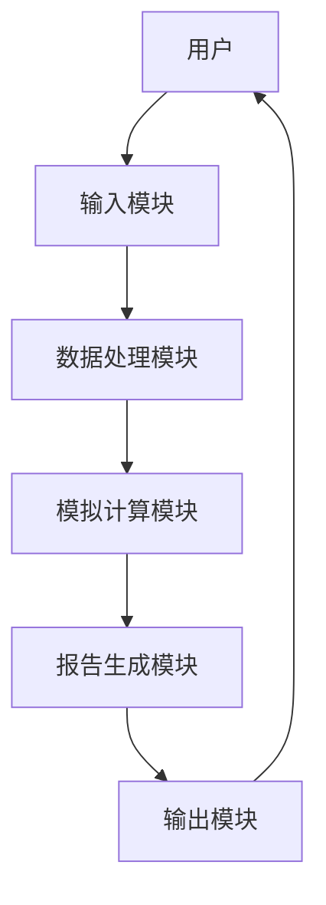
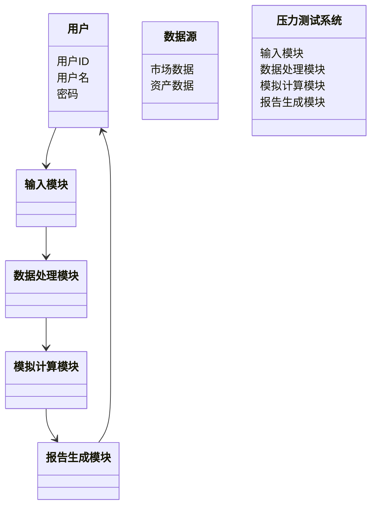
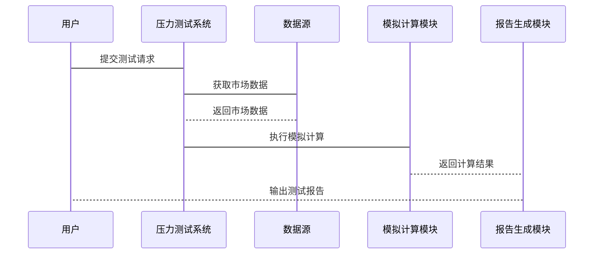

                 


# 金融市场流动性压力测试自动化平台

> 关键词：金融市场，流动性压力测试，自动化平台，大数据分析，机器学习，风险管理，金融监管

> 摘要：金融市场流动性压力测试是评估金融机构在极端市场条件下的资金流动性风险的重要工具。随着金融市场的复杂化和全球化，传统的压力测试方法逐渐显现出效率低下、耗时长、成本高等问题。本文将详细介绍如何构建一个基于大数据和人工智能技术的流动性压力测试自动化平台，探讨其核心算法、系统架构、实现细节以及实际应用场景。通过本文的阐述，读者将能够全面了解如何利用现代技术手段，提高流动性压力测试的效率和准确性，从而更好地应对金融市场中的流动性风险。

---

# 第一部分: 金融市场流动性压力测试概述

## 第1章: 金融市场流动性与压力测试概述

### 1.1 金融市场流动性基本概念

#### 1.1.1 金融市场的基本概念
金融市场是资金、证券、衍生品等金融资产交易的场所，包括股票市场、债券市场、外汇市场、衍生品市场等。流动性是指金融资产在短时间内以合理价格转换为现金的能力。高流动性意味着资产易于买卖且价格波动小，低流动性则意味着买卖难度大或价格波动剧烈。

#### 1.1.2 流动性在金融系统中的重要性
流动性是金融系统稳定运行的基础。流动性不足可能导致金融机构无法履行其负债义务，进而引发系统性风险。例如，2008年金融危机中，许多金融机构因流动性枯竭而面临破产。

#### 1.1.3 流动性风险的定义与特征
流动性风险是指金融机构在面临资金需求时，无法以合理成本及时获得足够资金的风险。其特征包括：
- **突发性**：流动性风险往往在市场波动加剧时突然出现。
- **传染性**：流动性风险可能从一家机构蔓延到整个金融系统。
- **复杂性**：流动性风险与市场、信用、操作等其他风险交织在一起。

### 1.2 压力测试的基本概念

#### 1.2.1 压力测试的定义与作用
压力测试是一种用于评估金融机构在极端市场条件下的稳健性的方法。其作用包括：
- 识别潜在的流动性风险。
- 评估金融机构在极端情况下的生存能力。
- 帮助金融机构制定应对策略。

#### 1.2.2 压力测试的分类与应用场景
压力测试主要分为以下几种：
- **情景分析**：基于假设的极端市场情景（如市场崩盘、经济衰退）进行测试。
- **敏感性分析**：分析资产价格、利率等关键变量的变化对流动性的影响。
- **反向压力测试**：从已知结果反推可能的情景。

压力测试的应用场景包括：
- 金融机构内部风险管理。
- 金融监管机构的监管要求。
- 投资者的决策支持。

#### 1.2.3 压力测试的实施流程
压力测试的实施流程通常包括以下步骤：
1. **定义目标**：明确测试的目的和范围。
2. **选择情景**：根据目标选择合适的情景。
3. **收集数据**：收集相关市场数据和金融机构的资产负债数据。
4. **模拟计算**：基于模型进行模拟计算。
5. **结果分析**：分析结果并提出改进建议。

### 1.3 自动化压力测试平台的必要性

#### 1.3.1 传统压力测试的局限性
传统的压力测试方法存在以下问题：
- **人工干预过多**：需要大量手动操作，效率低下。
- **数据处理复杂**：处理海量数据时耗时长且容易出错。
- **情景有限**：难以覆盖所有可能的极端情景。

#### 1.3.2 自动化平台的优势与价值
自动化压力测试平台的优势包括：
- **提高效率**：自动化处理数据和模拟计算，大幅缩短测试时间。
- **扩大覆盖范围**：可以快速测试多种情景，覆盖更多潜在风险。
- **提高准确性**：减少人为错误，确保测试结果的准确性。

#### 1.3.3 金融监管对自动化平台的需求
随着金融市场的复杂化，监管机构对金融机构的流动性管理要求越来越高。自动化压力测试平台能够帮助监管机构更好地评估金融机构的稳健性，确保金融系统的安全。

### 1.4 本章小结
本章介绍了金融市场流动性与压力测试的基本概念，分析了传统压力测试的局限性，并提出了自动化压力测试平台的必要性。

---

## 第2章: 金融市场流动性压力测试的核心概念与联系

### 2.1 核心概念原理

#### 2.1.1 流动性压力测试的框架
流动性压力测试的框架通常包括以下几个步骤：
1. **数据收集**：收集市场数据和金融机构的资产负债数据。
2. **情景选择**：选择合适的极端情景。
3. **模拟计算**：基于模型进行模拟计算。
4. **结果分析**：分析结果并提出改进建议。

#### 2.1.2 压力测试的主要方法
压力测试的主要方法包括：
- **情景分析法**：基于假设的极端市场情景进行测试。
- **敏感性分析法**：分析关键变量的变化对流动性的影响。
- **反向压力测试法**：从已知结果反推可能的情景。

#### 2.1.3 压力测试的关键指标
压力测试的关键指标包括：
- **净现金流缺口**：在一定时间内的净现金流变化。
- **流动性覆盖率（LCR）**：衡量金融机构在短期压力下的流动性状况。
- **流动性缺口**：金融机构在极端情景下的资金缺口。

### 2.2 核心概念属性特征对比

#### 2.2.1 不同压力测试方法的对比分析
以下表格对比了情景分析法、敏感性分析法和反向压力测试法的优缺点：

| 方法名称         | 优点                           | 缺点                           |
|------------------|--------------------------------|--------------------------------|
| 情景分析法       | 可以模拟极端市场情景           | 情景假设可能不够全面           |
| 敏感性分析法     | 可以识别关键变量的影响         | 情景单一，难以覆盖极端情况     |
| 反向压力测试法   | 可以从已知结果推导可能情景     | 实施复杂，计算成本高           |

#### 2.2.2 流动性风险与信用风险的关联
流动性风险与信用风险密切相关。当信用风险上升时，投资者可能更倾向于持有流动性较高的资产，导致流动性风险加剧。

#### 2.2.3 压力测试模型的复杂性与适用性
压力测试模型的复杂性取决于金融机构的规模和业务复杂性。复杂的模型能够提供更准确的结果，但也需要更多的数据和计算资源。

### 2.3 ER实体关系图架构

#### 2.3.1 流动性压力测试系统实体关系
以下是一个简单的ER实体关系图：

```mermaid
erDiagram
    participant 用户
    participant 压力测试系统
    participant 数据源
    participant 报告生成器
    用户 --> 压力测试系统 : 提交测试请求
    压力测试系统 --> 数据源 : 获取市场数据
    压力测试系统 --> 压力测试系统 : 执行模拟计算
    压力测试系统 --> 报告生成器 : 生成测试报告
```

#### 2.3.2 数据流与信息交互关系
以下是一个数据流图：

```mermaid
graph TD
    用户 --> 数据源 : 提供测试参数
    数据源 --> 压力测试系统 : 提供市场数据
    压力测试系统 --> 报告生成器 : 提供测试结果
    报告生成器 --> 用户 : 提供测试报告
```

#### 2.3.3 系统功能模块与实体关联
以下是一个功能模块图：



### 2.4 本章小结
本章详细介绍了流动性压力测试的核心概念与联系，包括框架、方法、指标以及不同方法的对比分析。

---

## 第3章: 流动性压力测试的数学模型与算法原理

### 3.1 压力测试的数学模型

#### 3.1.1 基于VaR（Value at Risk）的模型
VaR是一种常用的风险度量方法，表示在一定置信水平下，资产组合可能遭受的最大损失。例如，95%置信水平下的VaR为1000元，表示在95%的概率下，资产组合的最大损失为1000元。

#### 3.1.2 基于CVaR（Conditional Value at Risk）的模型
CVaR是VaR的扩展，表示在VaR水平超过一定值时的平均损失。CVaR通常用于优化问题，例如资产配置。

#### 3.1.3 其他常用模型简介
其他常用模型包括历史模拟法、蒙特卡洛模拟法等。

### 3.2 算法原理与流程图

#### 3.2.1 VaR计算流程图
以下是一个VaR计算流程图：

```mermaid
graph TD
    start --> 输入数据
    输入数据 --> 计算资产组合收益
    计算资产组合收益 --> 排序收益
    排序收益 --> 找出VaR对应的分位数
    找出VaR对应的分位数 --> 输出VaR值
    end
```

#### 3.2.2 CVaR计算流程图
以下是一个CVaR计算流程图：

```mermaid
graph TD
    start --> 输入数据
    输入数据 --> 计算资产组合收益
    计算资产组合收益 --> 排序收益
    排序收益 --> 找出CVaR对应的分位数
    找出CVaR对应的分位数 --> 计算平均损失
    输出CVaR值
    end
```

#### 3.2.3 蒙特卡洛模拟流程图
以下是一个蒙特卡洛模拟流程图：

```mermaid
graph TD
    start --> 生成随机数
    生成随机数 --> 计算资产组合收益
    计算资产组合收益 --> 重复多次
    重复多次 --> 排序收益
    排序收益 --> 找出VaR对应的分位数
    找出VaR对应的分位数 --> 输出VaR值
    end
```

### 3.3 算法实现的Python代码示例

#### 3.3.1 VaR计算的Python代码
```python
import numpy as np

def calculate VaR(returns, confidence_level):
    sorted_returns = np.sort(returns)
    percentile = 100 - confidence_level
    VaR = np.percentile(sorted_returns, percentile)
    return VaR
```

#### 3.3.2 CVaR计算的Python代码
```python
import numpy as np

def calculate CVaR(returns, confidence_level):
    sorted_returns = np.sort(returns)
    percentile = 100 - confidence_level
    VaR_index = np.where(np.percentile(sorted_returns, percentile))[0]
    CVaR = np.mean(sorted_returns[:VaR_index])
    return CVaR
```

#### 3.3.3 蒙特卡洛模拟的Python代码
```python
import numpy as np
import random

def monte_carlo_simulation(returns, num simulations):
    results = []
    for _ in range(num_simulations):
        random_sample = random.sample(returns, len(returns))
        sorted_returns = np.sort(random_sample)
        VaR = np.percentile(sorted_returns, 5)
        results.append(VaR)
    return results
```

### 3.4 本章小结
本章详细介绍了流动性压力测试的数学模型与算法原理，包括VaR、CVaR和蒙特卡洛模拟的实现方法。

---

## 第4章: 系统分析与架构设计

### 4.1 系统功能设计

#### 4.1.1 领域模型（mermaid类图）
以下是一个领域模型类图：



#### 4.1.2 系统架构设计（mermaid架构图）
以下是一个系统架构图：


#### 4.1.3 系统接口设计
系统接口设计包括：
- 用户输入接口：接收测试请求和参数。
- 数据接口：与数据源进行数据交互。
- 报告生成接口：生成并输出测试报告。

#### 4.1.4 系统交互流程（mermaid序列图）
以下是一个系统交互流程图：



### 4.2 本章小结
本章详细介绍了流动性压力测试自动化平台的系统分析与架构设计，包括功能设计、架构设计、接口设计和交互流程。

---

## 第5章: 项目实战

### 5.1 项目环境搭建

#### 5.1.1 环境要求
- 操作系统：Linux/Windows/MacOS
- 开发工具：Python、Jupyter Notebook
- 依赖库：NumPy、Pandas、Matplotlib

#### 5.1.2 数据准备
需要准备市场数据和金融机构的资产负债数据。

### 5.2 系统核心实现

#### 5.2.1 数据处理模块实现
```python
import pandas as pd

def load_data(file_path):
    data = pd.read_csv(file_path)
    return data
```

#### 5.2.2 模拟计算模块实现
```python
import numpy as np

def simulate(returns, num_simulations):
    results = []
    for _ in range(num_simulations):
        sample = np.random.choice(returns, len(returns))
        sorted_returns = np.sort(sample)
        VaR = np.percentile(sorted_returns, 5)
        results.append(VaR)
    return results
```

#### 5.2.3 报告生成模块实现
```python
import matplotlib.pyplot as plt

def generate_report(results):
    plt.hist(results, bins=20)
    plt.xlabel('VaR Value')
    plt.ylabel('Frequency')
    plt.title('VaR Distribution')
    plt.show()
```

### 5.3 代码应用解读与分析
通过上述代码，我们可以实现一个简单的流动性压力测试系统。数据处理模块负责加载数据，模拟计算模块负责生成随机样本并计算VaR值，报告生成模块负责生成可视化报告。

### 5.4 实际案例分析

#### 5.4.1 案例背景
假设我们有一个股票组合，需要测试其在市场崩盘情况下的流动性风险。

#### 5.4.2 数据处理
加载股票组合的收益率数据。

#### 5.4.3 模拟计算
生成随机样本并计算VaR值。

#### 5.4.4 结果分析
通过可视化报告，我们可以看到VaR值的分布情况，从而评估股票组合的流动性风险。

### 5.5 本章小结
本章通过实际案例展示了如何利用自动化平台进行流动性压力测试，包括环境搭建、代码实现和结果分析。

---

## 第6章: 总结与展望

### 6.1 本章总结
本文详细介绍了金融市场流动性压力测试自动化平台的构建过程，包括核心概念、数学模型、系统架构和项目实战。通过自动化平台，我们可以显著提高流动性压力测试的效率和准确性。

### 6.2 未来展望
未来，随着人工智能和大数据技术的不断发展，流动性压力测试自动化平台将更加智能化和高效化。可能的研究方向包括：
- 更加复杂的模型和算法。
- 更多的数据源和数据类型。
- 更加个性化的测试方案。

### 6.3 注意事项
在实际应用中，需要注意数据的准确性和模型的适用性。同时，要定期更新模型和数据，以适应市场的变化。

### 6.4 拓展阅读
推荐阅读以下书籍和论文：
- 《金融市场风险管理》
- 《压力测试方法论》
- 《大数据与人工智能在金融中的应用》

### 6.5 本章小结
本章总结了全文内容，并展望了未来的研究方向。

---

# 作者：AI天才研究院/AI Genius Institute & 禅与计算机程序设计艺术 /Zen And The Art of Computer Programming

---

通过以上目录结构和内容概述，您可以根据需要进一步扩展每个章节的具体内容，添加更多细节和实例，以完成一篇完整的《金融市场流动性压力测试自动化平台》技术博客文章。

