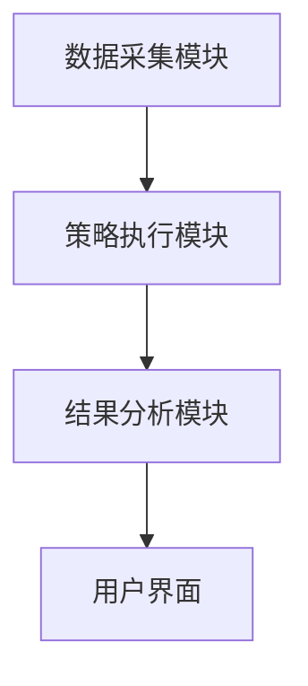

                 


# 金融市场流动性提供策略优化

> 关键词：金融市场流动性，流动性提供策略，算法优化，系统架构，项目实战

> 摘要：金融市场流动性提供策略优化是保障市场稳定运行的关键环节。本文从金融市场的基本概念出发，分析流动性提供策略的核心原理与实现机制，探讨TWAP和VWAP算法的优化方法，并结合系统架构设计与实际案例，深入解析流动性提供策略的优化路径。文章内容涵盖市场微观结构、算法原理、系统设计与实现，旨在为金融市场参与者提供理论与实践相结合的优化策略。

---

# 第一部分: 金融市场流动性提供策略概述

# 第1章: 金融市场流动性提供策略概述

## 1.1 金融市场的基本概念

### 1.1.1 金融市场的定义与分类

金融市场是资金供需双方进行交易的场所，分为场内市场和场外市场。场内市场如证券交易所，提供标准化的交易产品；场外市场则以非标准化产品为主。

### 1.1.2 流动性的定义与重要性

流动性是指资产在市场中快速转化为现金的能力。高流动性意味着交易容易执行且成本低，对市场稳定运行至关重要。

### 1.1.3 流动性提供者的角色与作用

流动性提供者包括做市商和机构投资者，他们在市场中提供买卖报价，维持市场深度，防止价格剧烈波动。

## 1.2 市场流动性问题的背景与挑战

### 1.2.1 市场流动性不足的负面影响

流动性不足会导致买卖价差扩大，交易执行困难，影响市场效率。

### 1.2.2 市场波动对流动性的影响

市场波动性增加时，参与者可能减少流动性提供，进一步加剧市场波动。

### 1.2.3 当前市场环境下的流动性优化需求

随着高频交易的普及，市场结构复杂化，对流动性优化的需求日益迫切。

## 1.3 流动性提供策略的目标与边界

### 1.3.1 流动性提供策略的核心目标

策略的核心目标是平衡市场流动性，降低交易成本，提高市场效率。

### 1.3.2 策略的边界与适用场景

策略的边界在于市场深度、波动性和参与者行为的限制，适用于高流动性和低波动性环境。

### 1.3.3 相关概念的对比分析

对比分析市场深度、交易成本和市场冲击，明确流动性提供策略与其他概念的区别与联系。

## 1.4 本章小结

总结本章内容，流动性在金融市场中扮演关键角色，优化流动性提供策略有助于提升市场稳定性和效率。

---

# 第2章: 市场微观结构与流动性机制

## 2.1 市场微观结构的核心要素

### 2.1.1 市场参与者分析

市场参与者包括投资者、做市商和交易所，不同角色的行为影响市场流动性。

### 2.1.2 市场信息结构与价格形成

价格形成机制依赖于订单流和市场参与者的信息处理能力，影响流动性。

### 2.1.3 订单簿机制与交易执行

订单簿记录所有未成交的订单，交易执行基于订单匹配和价格优先规则。

## 2.2 流动性提供中的订单处理策略

### 2.2.1 市场订单与限价订单的流动性贡献

市场订单立即成交，而限价订单等待匹配，两者对流动性贡献不同。

### 2.2.2 订单簿深度与价差分析

订单簿深度反映市场流动性，价差变化影响交易成本和流动性提供者收益。

### 2.2.3 流动性提供者的订单策略优化

优化订单策略，如动态调整订单量和价格，提升流动性提供效率。

## 2.3 市场冲击与交易成本分析

### 2.3.1 市场冲击的定义与影响

市场冲击指大额交易对价格的影响，增加交易成本和市场波动。

### 2.3.2 交易成本的构成与优化

交易成本包括佣金、买卖价差和滑点，优化策略可降低交易成本。

### 2.3.3 流动性提供中的成本-收益平衡

平衡策略执行成本与收益，优化流动性提供效果。

## 2.4 本章小结

分析市场微观结构对流动性的影响，强调优化订单策略和成本管理的重要性。

---

# 第3章: 流动性提供策略的核心概念与联系

## 3.1 流动性提供策略的原理

### 3.1.1 流动性提供策略的分类

策略分为时间加权平均价格（TWAP）和成交量加权平均价格（VWAP）等类型。

### 3.1.2 策略的核心目标

降低交易成本，提高订单执行效率，维护市场流动性。

### 3.1.3 策略实现的关键因素

包括订单量、价格、执行时间和市场环境。

## 3.2 TWAP和VWAP算法的原理与实现

### 3.2.1 TWAP算法的原理

TWAP策略在指定时间段内均匀分配订单，降低市场冲击。

### 3.2.2 VWAP算法的原理

VWAP根据成交量加权平均价格，动态调整订单执行节奏。

### 3.2.3 两种算法的对比分析

TWAP适用于低波动环境，VWAP适用于高波动环境，各有优劣。

## 3.3 算法优化的数学模型与公式

### 3.3.1 TWAP的数学模型

$$TWAP = \frac{1}{T} \int_{t_0}^{t_1} P(t) dt$$

### 3.3.2 VWAP的数学模型

$$VWAP = \frac{\int_{t_0}^{t_1} P(t) \cdot Q(t) dt}{\int_{t_0}^{t_1} Q(t) dt}$$

### 3.3.3 优化策略的数学表达

$$\text{优化目标} = \min \text{交易成本} + \max \text{流动性贡献}$$

## 3.4 本章小结

分析TWAP和VWAP算法的原理与优化方法，为策略实现提供理论基础。

---

# 第4章: 系统分析与架构设计

## 4.1 系统分析

### 4.1.1 问题场景介绍

高频交易环境下的流动性优化，需要高效的系统支持。

### 4.1.2 系统需求分析

包括高实时性、低延迟和高稳定性。

## 4.2 系统架构设计

### 4.2.1 系统架构设计

使用分层架构，包括数据采集、策略执行和结果分析模块。



### 4.2.2 接口设计

定义数据接口、策略接口和结果显示接口。

### 4.2.3 交互设计

展示用户与系统模块的交互流程。

## 4.3 本章小结

系统架构设计为策略优化提供高效支持，确保策略实现的稳定性和可靠性。

---

# 第5章: 项目实战与案例分析

## 5.1 项目背景

### 5.1.1 项目目标

优化TWAP算法实现，提升流动性提供效果。

### 5.1.2 项目环境配置

安装Python和相关库，配置交易接口。

## 5.2 核心代码实现

### 5.2.1 TWAP算法实现

```python
def twap(price_data, start_time, end_time):
    selected_prices = [p for p in price_data if start_time <= p.timestamp <= end_time]
    average_price = sum(p.price for p in selected_prices) / len(selected_prices)
    return average_price
```

### 5.2.2 VWAP算法实现

```python
def vwap(price_volume, start_time, end_time):
    selected_data = [ (p.price, p.volume) for p in price_volume if start_time <= p.timestamp <= end_time]
    total_volume = sum(volume for _, volume in selected_data)
    weighted_sum = sum(price * volume for price, volume in selected_data)
    average_price = weighted_sum / total_volume
    return average_price
```

## 5.3 案例分析

### 5.3.1 策略实现效果分析

对比优化前后的交易成本和市场冲击。

### 5.3.2 参数调整与优化

根据市场环境动态调整策略参数，提升策略效果。

## 5.4 本章小结

通过实际案例展示策略优化的实现过程和效果，验证策略的有效性。

---

# 第6章: 最佳实践与总结

## 6.1 最佳实践

### 6.1.1 风险管理

控制市场冲击和交易成本，确保策略稳健运行。

### 6.1.2 参数优化

根据市场环境动态调整策略参数，提升策略效果。

## 6.2 总结

总结全文内容，强调流动性提供策略优化的重要性。

## 6.3 展望

探讨未来研究方向，如AI在流动性优化中的应用。

## 6.4 注意事项

提醒读者注意策略实现中的风险和局限性，合理使用策略。

---

# 作者：AI天才研究院/AI Genius Institute & 禅与计算机程序设计艺术 /Zen And The Art of Computer Programming

---

这篇文章详细分析了金融市场流动性提供策略优化的关键问题，从理论到实践，为读者提供了全面的指导。通过系统架构设计和项目实战，展示了如何实现高效的流动性提供策略，为金融市场参与者提供了实用的优化方案。

