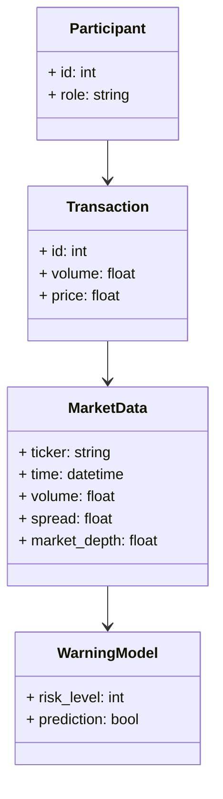
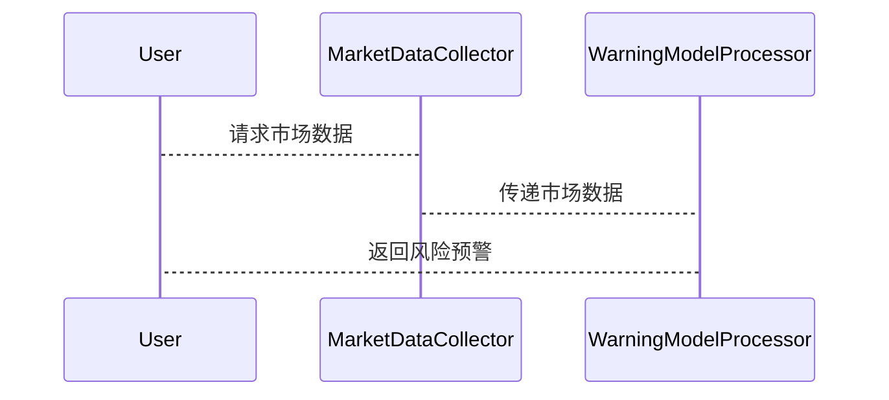

                 


# 金融市场流动性枯竭预警模型

> 关键词：金融市场、流动性枯竭、预警模型、时间序列分析、机器学习、系统架构

> 摘要：本文介绍了一种用于预警金融市场流动性枯竭的模型。通过分析流动性枯竭的特征，结合时间序列分析和机器学习算法，构建了一个有效的预警系统。文章详细探讨了模型的构建过程，包括数据采集、特征工程、算法选择和系统架构设计，最后通过实际案例展示了模型的应用效果。

---

# 第一部分：金融市场流动性问题的背景与挑战

## 第1章：金融市场流动性问题的背景与挑战

### 1.1 金融市场的流动性概念

#### 1.1.1 流动性的定义与内涵
流动性是指资产能够迅速转化为现金而不遭受重大损失的能力。在金融市场中，流动性是衡量市场健康程度的重要指标，通常表现为交易量大、价差小、市场深度足。

#### 1.1.2 流动性在金融市场中的重要性
流动性是市场参与者进行交易的基础，决定了市场的活跃程度和价格的稳定性。流动性不足可能导致市场波动加剧，影响投资者信心和市场稳定。

#### 1.1.3 流动性枯竭的定义与特征
流动性枯竭是指市场参与者无法以合理价格迅速出售资产，导致交易量骤减、价差扩大、市场深度下降。其特征包括市场深度不足、交易量急剧减少、价差扩大等。

### 1.2 金融市场流动性问题的现状

#### 1.2.1 全球金融市场流动性现状分析
近年来，全球金融市场流动性总体充裕，但部分新兴市场因经济波动和政策不确定性面临流动性压力。

#### 1.2.2 金融危机中的流动性问题回顾
2008年金融危机中，流动性枯竭是导致市场恐慌和危机蔓延的重要原因。流动性问题在银行间市场尤为突出。

#### 1.2.3 数字化时代的流动性挑战
随着金融市场的数字化，高频交易和算法交易成为主流，市场参与者行为的变化加剧了流动性波动，增加了流动性管理的难度。

### 1.3 流动性枯竭对金融市场的影响

#### 1.3.1 市场波动性加剧
流动性枯竭会导致市场波动性加剧，价格大幅波动，影响市场稳定。

#### 1.3.2 投资者行为变化
流动性不足会改变投资者行为，可能导致投资者恐慌性抛售，进一步加剧市场流动性问题。

#### 1.3.3 金融机构的运营风险
流动性枯竭会增加金融机构的运营风险，尤其是银行和资产管理机构，可能面临资金链断裂的风险。

### 1.4 构建流动性枯竭预警模型的意义

#### 1.4.1 提前预警的重要性
提前预警流动性枯竭可以帮助市场参与者及时采取措施，降低风险。

#### 1.4.2 保护投资者与金融机构的作用
通过预警模型，投资者和金融机构可以提前规避风险，保护资金安全。

#### 1.4.3 维护金融市场稳定的价值
预警模型有助于及时发现潜在风险，维护金融市场的稳定运行。

---

## 第2章：流动性枯竭预警模型的核心概念与联系

### 2.1 核心概念原理

#### 2.1.1 流动性枯竭的多维度特征
流动性枯竭可以从市场深度、交易量、价差等多个维度进行衡量。例如，市场深度不足会导致交易量减少，价差扩大。

#### 2.1.2 预警模型的基本原理
预警模型通过分析市场数据，识别流动性枯竭的早期信号，提前发出预警。

#### 2.1.3 模型的输入与输出关系
模型的输入包括市场数据（如交易量、价差等），输出为流动性风险等级。

### 2.2 核心概念属性特征对比表

| 特征维度 | 流动性充足 | 流动性枯竭 |
|----------|------------|------------|
| 市场深度 | 高         | 低         |
| 交易量   | 大         | 小         |
| 报价价差 | 窄         | 宽         |
| 市场参与者活跃度 | 高 | 低 |

### 2.3 ER实体关系图

```mermaid
erd
    Market
    Participant
    Liquidity
    WarningModel
    Transaction
    MarketDepth
    Spread
    Volume
    define
        Market --|{m:1,n}--> Liquidity
        Participant --|{m:1,n}--> Transaction
        Transaction --|{m:1,n}--> MarketDepth
        Spread --|{m:1,n}--> WarningModel
        Volume --|{m:1,n}--> WarningModel
```

---

## 第3章：流动性枯竭预警模型的算法原理

### 3.1 算法选择与流程

#### 3.1.1 时间序列分析
时间序列分析适用于预测市场流动性变化趋势。常用模型包括ARIMA和GARCH。

#### 3.1.2 机器学习算法（如LSTM、XGBoost）
LSTM适用于捕捉时间序列中的长期依赖关系，适合处理非线性数据。XGBoost在分类任务中表现优异，适合用于流动性风险分类。

### 3.2 时间序列分析模型（ARIMA）

#### 3.2.1 ARIMA模型介绍
ARIMA模型由自回归（AR）、差分（I）和移动平均（MA）部分组成。其数学公式为：

$$ ARIMA(p, d, q) $$

其中，p为自回归阶数，d为差分阶数，q为移动平均阶数。

#### 3.2.2 ARIMA模型的实现步骤
1. 数据预处理：检查数据的平稳性，进行差分处理。
2. 参数选择：通过AIC准则选择最优参数。
3. 模型训练：使用训练数据拟合ARIMA模型。
4. 预测与检验：预测未来值并检验模型准确性。

### 3.3 机器学习模型（LSTM）

#### 3.3.1 LSTM模型介绍
LSTM是一种特殊类型的RNN，通过门控机制解决梯度消失问题，适合处理时间序列数据。

#### 3.3.2 LSTM模型的实现步骤
1. 数据预处理：归一化数据，分割训练集和测试集。
2. 模型构建：定义LSTM网络结构，包括输入层、LSTM层、全连接层和输出层。
3. 模型训练：使用训练数据训练模型，调整超参数。
4. 预测与评估：预测未来流动性风险，并评估模型性能。

---

## 第4章：系统分析与架构设计方案

### 4.1 问题场景介绍

#### 4.1.1 项目背景
本项目旨在构建一个实时监测金融市场流动性风险的预警系统，帮助投资者和金融机构提前规避风险。

#### 4.1.2 项目目标
实时监测市场数据，构建预警模型，提供风险预警服务。

### 4.2 系统功能设计

#### 4.2.1 领域模型类图



### 4.3 系统架构设计

#### 4.3.1 分层架构


### 4.4 系统接口设计

#### 4.4.1 API接口
- 数据接口：从数据源获取市场数据。
- 预警接口：调用预警模型，返回风险等级。
- 用户接口：展示预警结果，提供交互功能。

### 4.5 系统交互序列图



---

## 第5章：项目实战

### 5.1 环境安装

#### 5.1.1 数据采集工具
使用Python的`pandas`和`numpy`库进行数据处理。

#### 5.1.2 算法实现工具
使用`keras`或`tensorflow`进行模型训练，`scikit-learn`进行数据预处理。

### 5.2 系统核心实现源代码

#### 5.2.1 数据预处理代码

```python
import pandas as pd
import numpy as np

def preprocess_data(data):
    # 数据归一化
    data_norm = (data - data.min()) / (data.max() - data.min())
    return data_norm
```

#### 5.2.2 LSTM模型实现代码

```python
from keras.models import Sequential
from keras.layers import LSTM, Dense

model = Sequential()
model.add(LSTM(64, input_shape=(timesteps, features)))
model.add(Dense(1, activation='sigmoid'))
model.compile(optimizer='adam', loss='binary_crossentropy', metrics=['accuracy'])
model.fit(X_train, y_train, epochs=10, batch_size=32)
```

### 5.3 实际案例分析

#### 5.3.1 数据来源与特征选择
选择某股票市场过去5年的交易数据，特征包括交易量、价差、市场深度等。

#### 5.3.2 模型训练与验证
使用历史数据训练模型，验证模型在测试集上的准确性。

#### 5.3.3 结果解读与优化
分析模型预测结果，优化模型参数，提高预警准确率。

### 5.4 项目小结

通过实际案例分析，验证了模型的有效性，为后续优化提供了方向。

---

## 第6章：最佳实践与注意事项

### 6.1 小结

构建流动性枯竭预警模型的关键在于数据采集、特征工程和算法选择。

### 6.2 注意事项

- 数据质量：确保数据准确、完整。
- 模型选择：根据实际需求选择合适的算法。
- 模型维护：定期更新模型，适应市场变化。

### 6.3 拓展阅读

建议阅读相关文献，深入研究时间序列分析和机器学习算法的应用。

---

作者：AI天才研究院/AI Genius Institute & 禅与计算机程序设计艺术 /Zen And The Art of Computer Programming

