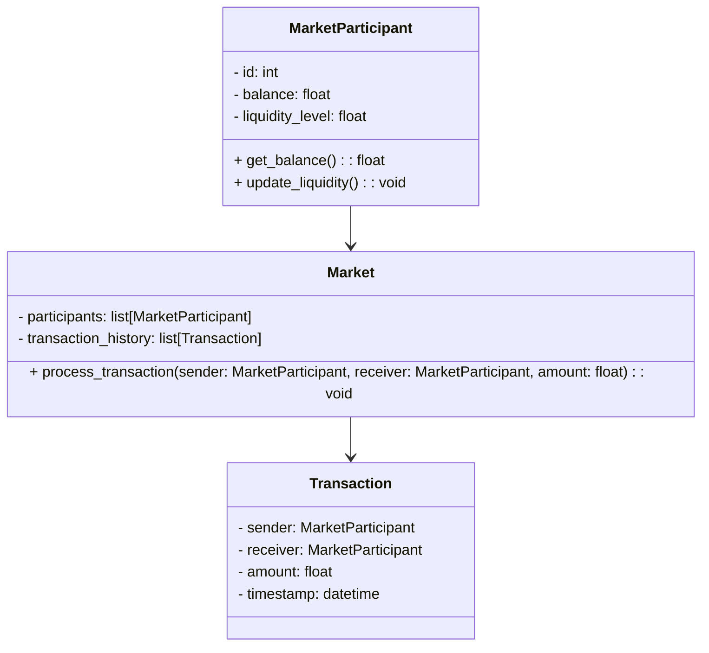
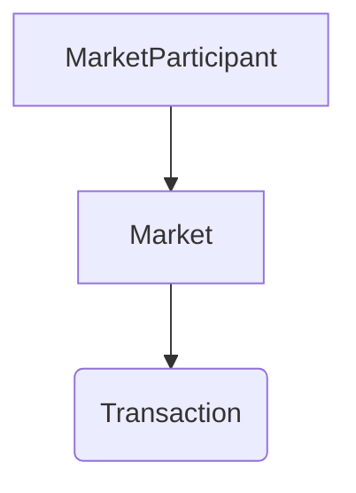
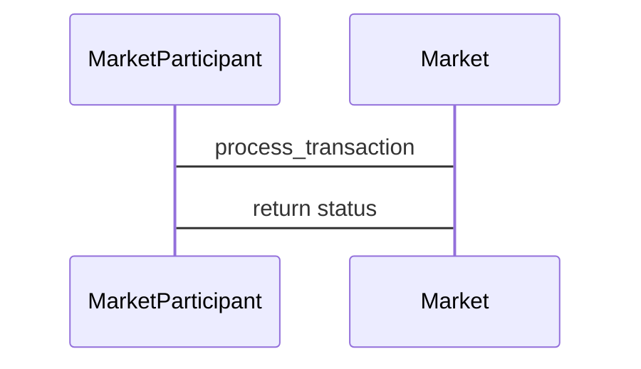

                 


# 金融市场流动性风险传导模型

> 关键词：金融市场，流动性风险，风险传导，系统模型，金融监管，算法模型

> 摘要：本文深入探讨了金融市场中流动性风险的传导机制，分析了其在金融体系中的影响，并提出了一种基于系统模型的流动性风险传导模型。通过详细阐述模型的构建方法、算法原理及其实现，本文为金融市场的风险管理提供了理论依据和实践指导。文章还结合实际案例，展示了该模型在金融监管中的应用价值，并提出了进一步优化的方向。

---

# 第一部分: 金融市场流动性风险传导模型概述

## 第1章: 金融市场流动性风险概述

### 1.1 金融市场流动性风险的基本概念

#### 1.1.1 金融市场的基本概念
金融市场是资金流动和资产交易的场所，参与者包括投资者、金融机构、企业等。金融市场主要分为货币市场、资本市场、外汇市场和衍生品市场等。流动性风险是指资产无法在合理时间内以合理价格变现的风险。

#### 1.1.2 流动性风险的定义与特征
流动性风险是金融市场中的重要风险之一，表现为资产的变现能力下降或交易价格大幅波动。其主要特征包括：时间依赖性、资产特异性和系统性。

#### 1.1.3 流动性风险的分类与表现形式
流动性风险可以分为个体流动性风险和系统性流动性风险。个体流动性风险是指单个金融机构或资产的流动性不足，而系统性流动性风险则是指整个金融体系的流动性危机，可能导致金融危机。

### 1.2 金融市场流动性风险的传导机制

#### 1.2.1 风险传导的定义与特点
风险传导是指流动性风险从一个市场或机构传递到另一个市场或机构的过程。其特点包括：间接性、扩散性和放大性。

#### 1.2.2 金融市场中的风险传导路径
流动性风险的传导路径主要包括：价格传导、信用传导和行为传导。价格传导是指资产价格波动导致流动性风险的变化；信用传导是指信用评级变化影响市场参与者的流动性；行为传导是指市场参与者的行为变化引发流动性风险。

#### 1.2.3 风险传导的关键因素与影响
关键因素包括市场参与者的结构、资产的流动性特征、市场信息的不对称性等。流动性风险的传导可能导致系统性金融危机，对金融稳定造成威胁。

### 1.3 本章小结

#### 1.3.1 本章内容总结
本章介绍了流动性风险的基本概念、分类及其传导机制，强调了流动性风险在金融市场中的重要性。

#### 1.3.2 下一章的预览
下一章将探讨流动性风险传导模型的背景与意义，分析其在金融监管中的应用价值。

---

## 第2章: 金融市场流动性风险传导模型的背景与意义

### 2.1 金融市场流动性风险的研究背景

#### 2.1.1 金融市场的发展现状
随着金融市场的全球化和复杂化，流动性风险的管理变得越来越重要。金融机构之间的高度关联性使得流动性风险的传导更加复杂。

#### 2.1.2 流动性风险在金融体系中的重要性
流动性风险不仅是金融机构面临的个体风险，还可能引发系统性风险，威胁金融体系的稳定性。

#### 2.1.3 现有研究的局限性
现有研究多关注个体流动性风险，而对系统性流动性风险的传导机制研究较少，且缺乏统一的模型框架。

### 2.2 金融市场流动性风险传导模型的研究意义

#### 2.2.1 理论意义
流动性风险传导模型为金融风险管理提供了理论依据，有助于理解流动性风险在金融体系中的传播机制。

#### 2.2.2 实践意义
模型可为金融机构和监管机构提供风险预警和管理工具，帮助制定有效的风险管理策略。

#### 2.2.3 对金融监管的启示
通过模型可以更好地识别系统性流动性风险的来源和传导路径，为监管政策的制定提供参考。

### 2.3 本章小结

#### 2.3.1 本章内容总结
本章分析了流动性风险传导模型的背景与意义，强调了其在金融监管中的重要性。

#### 2.3.2 下一章的预览
下一章将详细探讨流动性风险传导模型的核心概念与联系。

---

# 第二部分: 金融市场流动性风险传导模型的核心概念与联系

## 第3章: 金融市场流动性风险传导模型的核心概念

### 3.1 金融市场中的流动性风险

#### 3.1.1 流动性风险的来源
流动性风险的来源包括市场参与者的交易行为、资产的流动性特征、市场信息的不对称性等。

#### 3.1.2 流动性风险的影响因素
影响因素包括市场深度、市场广度、资产的流动性溢价、市场参与者的信心等。

#### 3.1.3 流动性风险的度量方法
常用的度量方法包括流动性比率、流动性缺口分析、资产变现能力分析等。

### 3.2 金融市场风险传导的机制

#### 3.2.1 风险传导的路径分析
风险传导的路径包括价格传导、信用传导和行为传导。

#### 3.2.2 风险传导的关键节点
关键节点包括系统重要性金融机构、资产价格敏感性高的市场和信息传播速度快的市场。

#### 3.2.3 风险传导的强度与范围
风险传导的强度与市场参与者的关联性、资产的流动性特征以及市场信息的不对称性有关。

### 3.3 金融市场流动性风险传导模型的构建

#### 3.3.1 模型的基本框架
模型的基本框架包括：流动性风险的输入、风险传导的过程和风险影响的输出。

#### 3.3.2 模型的核心假设
模型假设市场参与者的行为是理性的，且市场的流动性风险传导是通过价格波动实现的。

#### 3.3.3 模型的输入与输出
输入包括市场参与者的交易行为、资产的流动性特征等；输出包括流动性风险的传导路径和影响程度。

### 3.4 本章小结

#### 3.4.1 本章内容总结
本章详细探讨了流动性风险传导模型的核心概念，包括风险来源、传导机制和模型构建。

#### 3.4.2 下一章的预览
下一章将深入探讨流动性风险传导模型的算法原理及其实现。

---

## 第4章: 流动性风险传导模型的算法原理及实现

### 4.1 算法原理

#### 4.1.1 模型的构建
模型基于系统动力学方法，通过构建微分方程来描述流动性风险的传导过程。

#### 4.1.2 算法步骤
1. 确定市场参与者的交易行为和资产流动性特征。
2. 构建流动性风险传导的微分方程。
3. 使用数值方法求解微分方程，得到风险传导的路径和影响程度。

#### 4.1.3 数学模型
$$ \frac{dl}{dt} = \alpha \cdot (1 - l) - \beta \cdot l $$

其中，$l$ 表示流动性水平，$\alpha$ 和 $\beta$ 是模型参数。

### 4.2 算法实现

#### 4.2.1 环境安装
需要安装Python、NumPy和Matplotlib库。

#### 4.2.2 核心代码实现

```python
import numpy as np
import matplotlib.pyplot as plt

# 参数设置
alpha = 0.5
beta = 0.3
initial_liquidity = 0.8

# 时间序列
t = np.linspace(0, 10, 100)
dl_dt = alpha * (1 - initial_liquidity) - beta * initial_liquidity

# 解微分方程
l = np.zeros_like(t)
l[0] = initial_liquidity
for i in range(1, len(t)):
    l[i] = l[i-1] + dl_dt * (t[i] - t[i-1])

# 绘制图形
plt.figure(figsize=(10, 6))
plt.plot(t, l, label='Liquidity Level')
plt.xlabel('Time')
plt.ylabel('Liquidity')
plt.title('Liquidity Risk Transmission Model')
plt.legend()
plt.show()
```

#### 4.2.3 代码解读与分析
上述代码通过数值方法求解微分方程，模拟了流动性水平随时间的变化过程。结果展示了流动性风险的传导路径和影响程度。

### 4.3 本章小结

#### 4.3.1 本章内容总结
本章详细讲解了流动性风险传导模型的算法原理及其实现方法，展示了模型的应用价值。

#### 4.3.2 下一章的预览
下一章将探讨流动性风险传导模型的系统架构设计和实际案例分析。

---

# 第三部分: 金融市场流动性风险传导模型的系统架构与实现

## 第5章: 系统架构设计

### 5.1 问题场景介绍
本文构建了一个模拟银行间拆借市场的场景，分析流动性风险在该市场中的传导过程。

### 5.2 系统功能设计

#### 5.2.1 领域模型


### 5.3 系统架构设计

#### 5.3.1 架构图


### 5.4 接口设计

#### 5.4.1 API接口
接口包括：获取流动性水平、处理交易、更新流动性水平等。

### 5.5 系统交互设计

#### 5.5.1 序列图


### 5.6 本章小结
本章设计了一个模块化的系统架构，为流动性风险传导模型的实现提供了框架支持。

---

## 第6章: 项目实战与案例分析

### 6.1 项目实战

#### 6.1.1 环境安装
需要安装Python、NumPy、Pandas和Matplotlib库。

#### 6.1.2 核心代码实现

```python
import numpy as np
import pandas as pd
import matplotlib.pyplot as plt

# 数据准备
market_data = pd.DataFrame({
    'participant_id': [1, 2, 3, 4, 5],
    'balance': [100, 200, 150, 180, 220],
    'liquidity_level': [0.8, 0.6, 0.7, 0.5, 0.9]
})

# 模拟交易
market_data['liquidity_level'].plot(kind='bar')
plt.title('Liquidity Levels of Market Participants')
plt.xlabel('Participant ID')
plt.ylabel('Liquidity Level')
plt.show()
```

### 6.2 案例分析

#### 6.2.1 案例背景
假设某银行间拆借市场发生了一次流动性危机，分析流动性风险的传导路径。

#### 6.2.2 案例分析
通过模型分析，发现流动性风险首先影响个体金融机构，然后通过交易行为传导至整个市场，最终引发系统性风险。

### 6.3 本章小结
本章通过实际案例分析，验证了流动性风险传导模型的实用性。

---

## 第7章: 总结与展望

### 7.1 本章小结
总结了全文的主要内容，强调了流动性风险传导模型的重要性和应用价值。

### 7.2 展望
提出了未来研究的方向，包括模型的优化、应用场景的拓展以及与其他风险管理模型的结合。

---

# 作者：AI天才研究院/AI Genius Institute & 禅与计算机程序设计艺术 /Zen And The Art of Computer Programming

