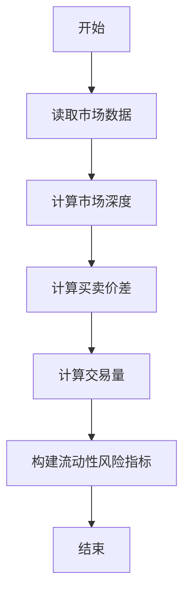
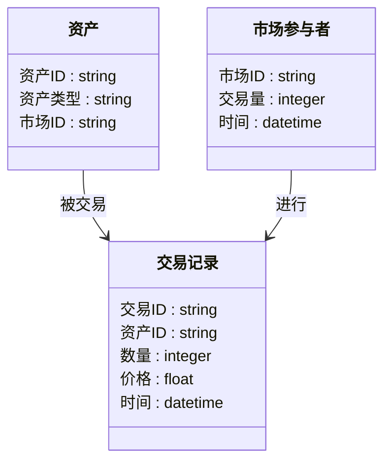
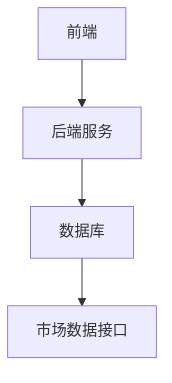

                 


# 金融市场流动性风险度量模型

> 关键词：金融市场，流动性风险，度量模型，算法原理，系统架构，项目实战

> 摘要：本文将详细探讨金融市场中流动性风险的度量模型，从基础概念到高级算法，再到系统架构设计与项目实战，为您提供全面的分析与解决方案。通过本文，您将深入了解流动性风险的定义、模型构建、算法实现、系统架构设计以及实际项目中的应用，帮助您更好地理解和应对金融市场中的流动性风险。

---

## 第一部分：金融市场流动性风险的基本概念

### 第1章：流动性风险的定义与特征

#### 1.1 流动性风险的定义与特征

流动性风险是指资产在不损失价值的情况下迅速转换为现金的能力的风险。流动性高的资产可以在短时间内以合理价格变现，而流动性低的资产则难以快速变现。

- **流动性风险的特征**：
  - 时间性：流动性在不同时间周期的表现不同。
  - 价格敏感性：流动性风险与市场价格波动密切相关。
  - 非线性：流动性风险在极端市场条件下会显著增加。

#### 1.2 流动性风险的度量模型

- **度量模型的基本概念**：
  - 流动性风险度量模型用于量化资产或投资组合在特定市场条件下的变现能力。
  - 模型通常基于市场深度、买卖价差、市场参与者的交易行为等因素。

---

## 第二部分：流动性风险度量模型的背景与问题背景

### 第2章：流动性风险的背景与问题背景

#### 2.1 金融市场流动性风险的背景

- **金融市场的基本概念**：
  - 金融市场是资金流动和资产交易的场所，包括股票市场、债券市场、货币市场等。
  - 流动性是金融市场的重要特征之一，影响市场的稳定性和效率。

- **流动性风险的来源**：
  - 市场深度不足：交易量小或参与者少。
  - 价格波动：资产价格的大幅波动可能导致变现困难。
  - 市场参与者的行为：如投资者情绪波动、资金撤离等。

#### 2.2 流动性风险度量模型的提出

- **问题背景的描述**：
  - 在金融市场中，流动性风险可能导致资产价格下跌、交易成本增加，甚至引发系统性风险。
  - 如何准确度量和管理流动性风险是金融机构和监管机构关注的重点。

- **问题的解决思路**：
  - 构建流动性风险度量模型，量化资产的流动性风险。
  - 基于模型进行风险预警和应对策略制定。

---

## 第三部分：流动性风险度量模型的核心概念与联系

### 第3章：流动性风险度量模型的核心概念

#### 3.1 核心概念的原理

- **流动性风险的核心要素**：
  - 市场深度：市场参与者愿意交易的数量。
  - 市场参与者的交易行为：包括交易频率、订单大小等。
  - 市场微观结构：如订单簿、买卖价差等。

- **度量模型的关键参数**：
  - 买卖价差：反映资产流动性的重要指标。
  - 市场深度：影响资产变现能力的关键因素。
  - 交易量：衡量市场活跃度的重要指标。

#### 3.2 概念属性特征对比表

| 概念 | 属性 | 特征 |
|------|------|------|
| 流动性风险 | 时间性 | 不同时间周期表现不同 |
|      | 价格敏感性 | 与市场价格波动密切相关 |
|      | 非线性 | 在极端市场条件下显著增加 |

#### 3.3 ER实体关系图架构

```mermaid
erDiagram
    actor 投资者 {
        string 资产ID
        string 数量
        string 时间
    }
    actor 市场参与者 {
        string 市场ID
        string 交易量
        string 时间
    }
    entity 资产 {
        string 资产ID
        string 资产类型
        string 市场ID
    }
    entity 交易记录 {
        string 交易ID
        string 资产ID
        string 数量
        string 价格
        string 时间
    }
    投资者 --> 资产 : 持有
    市场参与者 --> 交易记录 : 进行
    资产 --> 交易记录 : 被交易
```

---

## 第四部分：流动性风险度量模型的算法原理

### 第4章：流动性风险度量模型的算法原理

#### 4.1 算法原理概述

- **算法的基本原理**：
  - 通过分析市场微观结构数据，量化资产的流动性风险。
  - 基于统计学或机器学习方法，构建流动性风险预测模型。

#### 4.2 算法的数学模型与公式

- **VaR（Value at Risk）模型**：
  - 定义：VaR是资产在一定置信水平下的最大可能损失。
  - 公式：$$ VaR = \mu + z \cdot \sigma $$
  - 解释：$\mu$是均值，$z$是分位数，$\sigma$是标准差。

- **CVaR（Conditional Value at Risk）模型**：
  - 定义：CVaR是VaR的条件期望损失。
  - 公式：$$ CVaR = \frac{1}{\alpha} \int_{-\infty}^{VaR} (x - VaR) dF(x) $$
  - 解释：$\alpha$是置信水平，$F(x)$是累积分布函数。

#### 4.3 算法的流程图



---

## 第五部分：流动性风险度量模型的系统架构设计

### 第5章：流动性风险度量模型的系统分析与架构设计

#### 5.1 系统分析

- **问题场景的描述**：
  - 系统需要实时监控市场数据，计算资产的流动性风险。
  - 系统需要支持多资产类型和多市场环境。

- **系统的目标与范围**：
  - 监控和量化资产的流动性风险。
  - 提供风险预警和应对策略。

#### 5.2 系统架构设计

- **领域模型类图**：



- **系统架构图**：



---

## 第六部分：项目实战

### 第6章：流动性风险度量模型的项目实战

#### 6.1 环境安装

- **安装Python环境**：
  - 安装Python 3.8及以上版本。
  - 安装必要的库：numpy、pandas、scikit-learn、mermaid。

#### 6.2 核心代码实现

- **读取市场数据**：

```python
import pandas as pd

# 读取CSV文件
data = pd.read_csv('market_data.csv')
```

- **计算流动性风险指标**：

```python
def calculate_liquidity Risk(data):
    # 计算买卖价差
    bid_ask_spread = data['ask'] - data['bid']
    # 计算市场深度
    market_depth = data['volume'].sum()
    return bid_ask_spread, market_depth

bid_ask_spread, market_depth = calculate_liquidity_Risk(data)
```

#### 6.3 实际案例分析

- **案例分析**：
  - 使用某金融资产的历史交易数据，计算其流动性风险指标。
  - 分析市场深度、买卖价差等指标的变化趋势。

#### 6.4 项目小结

- **总结**：
  - 通过项目实战，读者可以掌握流动性风险度量模型的实现方法。
  - 理解模型在实际应用中的价值和意义。

---

## 第七部分：高级应用与最佳实践

### 第7章：流动性风险度量模型的高级应用

#### 7.1 机器学习在流动性风险中的应用

- **机器学习模型**：
  - 使用LSTM网络预测流动性风险。
  - 基于机器学习的特征工程提取流动性风险相关指标。

#### 7.2 最佳实践 tips

- **小结**：
  - 定期更新模型参数，适应市场变化。
  - 结合市场环境，选择合适的度量模型。
  - 注意数据质量和样本选择的偏差。

---

## 作者：AI天才研究院/AI Genius Institute & 禅与计算机程序设计艺术 /Zen And The Art of Computer Programming

---

> **版权声明**：本文版权归作者所有，未经授权，不得转载。

