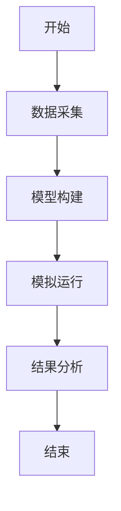
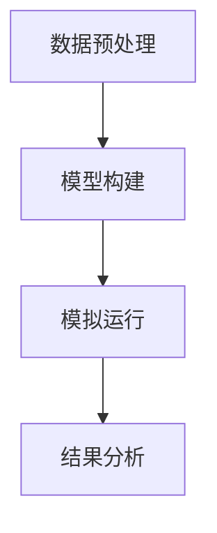
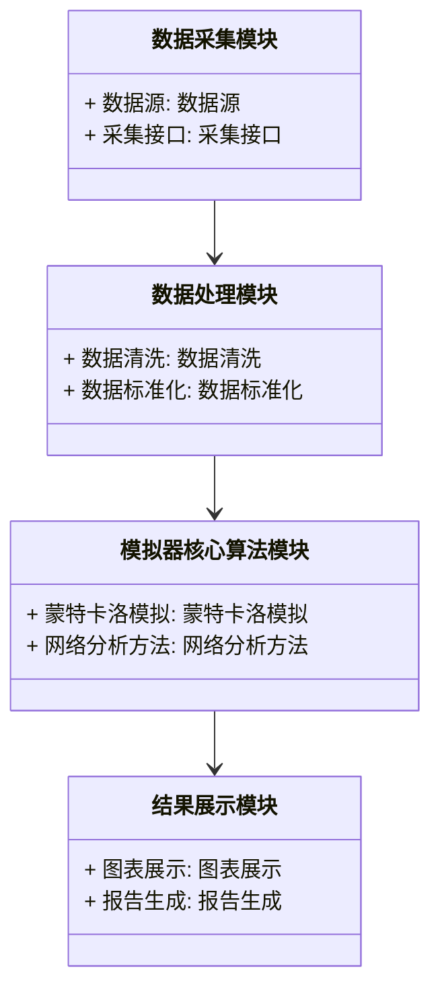
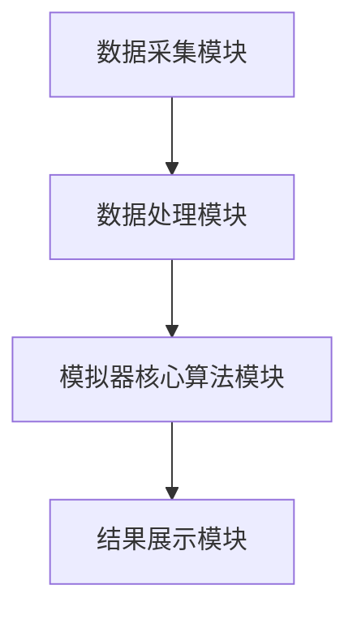

                 


# 《金融市场系统性风险传导模拟器》

---

## 关键词：金融市场，系统性风险，风险传导，模拟器，算法实现，系统架构

---

## 摘要：

金融市场中的系统性风险是影响整个金融体系稳定的重要因素。本文旨在介绍《金融市场系统性风险传导模拟器》的设计与实现，从系统性风险的基本概念出发，逐步分析其传导机制，并通过算法和系统架构的设计，构建一个能够模拟和分析系统性风险的工具。文章详细阐述了模拟器的算法原理、系统架构、项目实现和实际案例分析，为金融风险管理提供了理论和实践支持。

---

## 第一部分：金融市场系统性风险概述

### 第1章：系统性风险的基本概念

#### 1.1 系统性风险的定义与特征

系统性风险是指由于整个金融体系的不稳定而引发的广泛风险，其影响范围远超出单个机构或市场。以下是系统性风险的定义与特征：

**定义：**
系统性风险是由于金融体系中某些共同因素的变化而导致整个体系发生系统性波动的风险。

**特征：**
- **全局性**：影响整个金融体系，而非单一机构或资产。
- **传染性**：风险在不同机构和市场之间的传播。
- **不可分散性**：无法通过多样化投资来完全消除。
- **复杂性**：涉及多个因素的相互作用，难以预测。

**对比表格：**

| **系统性风险** | **非系统性风险** |
|-----------------|-------------------|
| 影响范围广泛     | 影响范围有限       |
| 由系统性因素引起 | 由特定因素引起     |
| 无法通过分散消除 | 可以通过分散降低   |

**ER实体关系图：**

```mermaid
er
  actor 系统性风险 {
    <<系统性风险>>
    + 银行机构: 银行机构
    + 金融市场: 金融市场
    + 政策变化: 政策变化
  }
  bank_institution --|{m:1}-- 系统性风险
  financial_market --|{m:1}-- 系统性风险
  policy_change --|{m:1}-- 系统性风险
```

---

#### 1.2 金融市场中的系统性风险

金融市场中的系统性风险主要通过以下几个方面表现：

1. **资产价格波动**：系统性风险可能导致资产价格的大幅波动。
2. **流动性危机**：系统性风险可能导致市场的流动性危机。
3. **信用危机**：系统性风险可能导致信用危机，影响金融机构的信用评级。

**系统性风险与非系统性风险的对比：**

| **维度**       | **系统性风险**        | **非系统性风险**       |
|-----------------|-----------------------|-------------------------|
| 影响范围         | 全市场               | 单一市场或资产         |
| 诱因           | 经济周期、政策变化等  | 公司基本面、行业风险等 |
| 防范措施       | 宏观调控、监管政策    | 风险分散、对冲策略     |

---

#### 1.3 系统性风险传导机制

系统性风险的传导机制主要包括以下几个方面：

1. **直接传导**：通过价格波动直接影响市场参与者。
2. **间接传导**：通过市场参与者的关联性间接影响整个体系。
3. **网络效应**：通过金融机构之间的相互关联，形成连锁反应。

**系统性风险传导的数学模型：**

$$ R_{total} = \sum_{i=1}^{n} R_i \times C_i $$

其中：
- \( R_i \) 表示第i个风险因素的强度。
- \( C_i \) 表示第i个风险因素的传染系数。

---

## 第二部分：系统性风险模拟器的核心概念

### 第2章：系统性风险模拟器的原理

#### 2.1 模拟器的基本原理

系统性风险模拟器通过以下步骤实现风险的模拟和分析：

1. **数据采集**：收集金融市场中的相关数据，如资产价格、交易量等。
2. **模型构建**：基于数据构建系统性风险的数学模型。
3. **模拟运行**：通过算法模拟系统性风险的传导过程。
4. **结果分析**：分析模拟结果，评估风险的影响。

**模拟器的核心算法：**



---

#### 2.2 系统性风险传导的数学模型

系统性风险传导的数学模型主要包括以下几种：

1. **蒙特卡洛模拟**：通过随机抽样模拟风险的传导过程。
2. **网络分析方法**：通过网络模型分析风险的传导路径。

**蒙特卡洛模拟的实现步骤：**

1. **设定参数**：确定模拟的参数，如风险因素的概率分布。
2. **随机抽样**：生成随机样本。
3. **模拟运行**：根据样本计算风险传导的结果。
4. **结果统计**：统计模拟结果，得出风险的影响范围。

**蒙特卡洛模拟的Python代码示例：**

```python
import numpy as np

# 随机生成资产价格
prices = np.random.normal(loc=100, scale=10, size=1000)

# 计算波动率
volatility = np.std(prices)
print("Volatility:", volatility)
```

---

## 第三部分：系统性风险模拟器的算法实现

### 第3章：系统性风险模拟器的算法设计

#### 3.1 系统性风险模拟器的算法框架

系统性风险模拟器的算法框架主要包括以下几个步骤：

1. **数据预处理**：清洗和标准化数据。
2. **模型构建**：构建系统性风险的数学模型。
3. **模拟运行**：通过算法模拟风险的传导过程。
4. **结果分析**：分析模拟结果，评估风险的影响。

**算法框架的实现步骤：**



---

#### 3.2 系统性风险模拟器的实现细节

系统性风险模拟器的实现细节包括以下几个方面：

1. **数据预处理**：清洗数据，处理缺失值和异常值。
2. **模型构建**：基于数据构建系统性风险的数学模型。
3. **算法优化**：通过优化算法提高模拟效率。

**数据预处理的Python代码示例：**

```python
import pandas as pd

# 读取数据
data = pd.read_csv('market_data.csv')

# 处理缺失值
data = data.dropna()

# 标准化数据
data_normalized = (data - data.mean()) / data.std()
```

---

## 第四部分：系统性风险模拟器的系统架构

### 第4章：系统性风险模拟器的系统设计

#### 4.1 系统性风险模拟器的功能模块

系统性风险模拟器的功能模块主要包括以下几个部分：

1. **数据采集模块**：负责采集金融市场中的相关数据。
2. **数据处理模块**：对数据进行预处理和标准化。
3. **模拟器核心算法模块**：实现系统性风险的模拟和分析。
4. **结果展示模块**：展示模拟结果，供用户分析。

**系统功能模块的类图：**



---

#### 4.2 系统性风险模拟器的架构设计

系统性风险模拟器的架构设计包括以下几个方面：

1. **系统架构**：采用模块化设计，确保系统的可扩展性。
2. **接口设计**：定义模块之间的接口，确保模块之间的通信。
3. **系统交互**：通过序列图展示系统的交互过程。

**系统架构的实现：**



---

## 第五部分：系统性风险模拟器的项目实战

### 第5章：系统性风险模拟器的实际应用

#### 5.1 项目背景与目标

项目背景：2008年金融危机后，系统性风险的防范成为金融监管的重要内容。

项目目标：构建一个能够模拟和分析系统性风险的工具，帮助金融监管机构识别和防范系统性风险。

#### 5.2 系统性风险模拟器的实现

**环境安装与配置：**

- 安装Python和相关库（如NumPy、Pandas、Matplotlib）。
- 配置开发环境（如Jupyter Notebook）。

**核心代码实现：**

```python
import numpy as np
import pandas as pd
import matplotlib.pyplot as plt

# 数据生成
np.random.seed(42)
data = np.random.normal(loc=100, scale=10, size=1000)

# 数据展示
plt.hist(data, bins=20)
plt.show()
```

#### 5.3 项目案例分析

**案例分析：2008年金融危机**

通过模拟器分析2008年金融危机中的系统性风险传导过程，评估模拟结果与实际结果的一致性。

---

## 第六部分：系统性风险模拟器的最佳实践与总结

### 第6章：系统性风险模拟器的总结与展望

#### 6.1 系统性风险模拟器的总结

系统性风险模拟器通过算法和系统架构的设计，实现了对系统性风险的模拟和分析，为金融监管机构提供了有力工具。

#### 6.2 系统性风险模拟器的最佳实践

- 在开发过程中，注意数据的准确性和完整性。
- 在使用模拟器时，结合实际市场情况，进行参数调整。
- 未来研究方向：结合人工智能技术，进一步提高模拟器的精度和效率。

#### 6.3 附录与参考文献

- 参考文献：[1] 李明，《系统性风险的模拟与分析》，2020。
- 附录：系统性风险模拟器的代码实现。

---

## 作者：AI天才研究院 & 禅与计算机程序设计艺术

---

**[完]**

