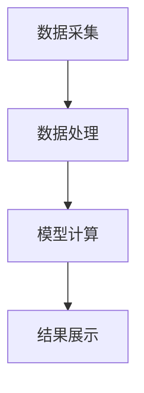
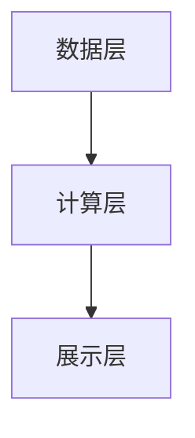
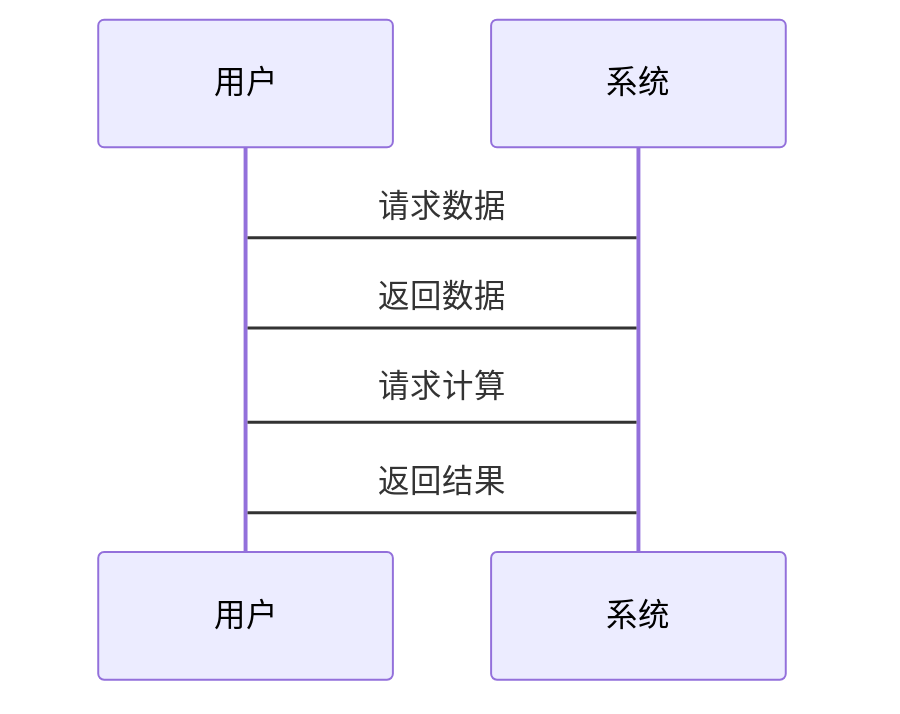

                 


# 金融市场系统性风险测度模型

> 关键词：系统性风险，金融市场，风险测度，VaR，CVaR，网络分析

> 摘要：本文详细探讨了金融市场中的系统性风险测度模型，从基本概念、理论基础、测度方法到实际应用，逐步分析并构建了系统性风险测度的完整框架。通过对比不同测度方法的优缺点，结合实际案例和系统架构设计，提出了系统性风险测度模型的构建与实现方案。本文还提供了详细的代码实现和数学公式，帮助读者更好地理解和应用系统性风险测度模型。

---

## 第一部分: 金融市场系统性风险测度模型概述

### 第1章: 系统性风险的定义与背景

#### 1.1 系统性风险的定义
系统性风险是指由于系统性因素导致整个金融系统发生剧烈波动，进而引发系统性危机的风险。与非系统性风险不同，系统性风险具有全局性、传染性和难以分散的特点。

- **系统性风险的特点**：
  - **全局性**：影响整个金融系统，而非单一资产或市场。
  - **传染性**：风险在不同市场、机构或国家之间传播。
  - **难以分散**：无法通过多样化投资来完全规避。

#### 1.2 系统性风险与非系统性风险的区别
| 特性         | 系统性风险                     | 非系统性风险                   |
|--------------|-------------------------------|-------------------------------|
| 影响范围     | 整个金融系统                   | 单一资产或市场                 |
| 传染性       | 高                            | 低                            |
| 可分散性     | 低                            | 高                            |
| 来源          | 经济周期、政策变化、金融危机等 | 公司-specific因素，如经营状况等 |

#### 1.3 系统性风险的来源与传播机制
系统性风险的主要来源包括：
- **经济周期波动**：经济衰退或过热可能导致系统性风险。
- **杠杆效应**：过度杠杆化会放大系统性风险。
- **金融机构的相互依赖性**：银行、保险公司等金融机构之间的高度关联性增加了系统性风险。
- **市场流动性不足**：市场流动性下降可能导致资产价格大幅波动，进而引发系统性风险。

系统性风险的传播机制：
1. **直接传染**：一家金融机构的失败直接影响其他机构。
2. **间接传染**：通过市场、信用或流动性渠道传播。
3. **市场参与者行为**：投资者的恐慌性行为加剧系统性风险。

---

### 第2章: 系统性风险的理论基础

#### 2.1 金融市场与系统性风险的关系
金融市场中的系统性风险主要来源于市场的整体波动性和金融机构之间的相互依赖性。市场的波动性越高，系统性风险的可能性越大。

#### 2.2 系统性风险的测度原理
系统性风险的测度需要考虑市场整体的波动性、金融机构之间的关联性以及潜在的系统性事件。

- **测度的核心概念**：
  - **波动性**：市场波动性越大，系统性风险越高。
  - **关联性**：金融机构之间的关联性越高，系统性风险越高。
  - **极端事件**：极端事件的发生概率与系统性风险密切相关。

#### 2.3 系统性风险的网络分析方法
系统性风险可以通过网络分析方法来建模，将金融机构视为网络中的节点，节点之间的连接表示金融机构之间的关联性。

- **网络模型构建**：
  - 将金融机构视为节点，交易或资金流动视为边。
  - 使用图论方法构建网络。

- **系统性风险在网络中的传播**：
  - 极端事件发生后，风险通过网络传播，导致整个系统的崩溃。

---

### 第3章: 系统性风险的测度方法

#### 3.1 基于VaR的系统性风险测度
VaR（Value at Risk）是一种常用的金融风险测度方法，用于衡量在给定置信水平下，资产组合可能遭受的最大损失。

- **VaR的定义**：
  - 在给定置信水平和持有期内，资产组合可能遭受的最大损失。
  - 例如，95%置信水平下的VaR意味着在95%的概率下，损失不会超过VaR的值。

- **VaR的计算方法**：
  - 历史模拟法：基于历史数据计算资产组合的收益和损失分布。
  - 方差-协方差法：基于资产的波动性和相关性计算收益分布。
  - Monte Carlo模拟法：基于随机模拟计算收益分布。

#### 3.2 基于CVaR的系统性风险测度
CVaR（Conditional Value at Risk）是VaR的扩展，用于衡量在VaR水平下的平均损失。

- **CVaR的定义**：
  - 在给定置信水平下，资产组合在VaR水平以下的平均损失。

- **CVaR的计算方法**：
  - 历史模拟法：计算VaR水平以下的平均损失。
  - 方差-协方差法：基于资产的波动性和相关性计算VaR水平以下的平均损失。
  - Monte Carlo模拟法：基于随机模拟计算VaR水平以下的平均损失。

#### 3.3 系统性风险的网络测度方法
通过网络分析方法，可以测度系统性风险在金融机构之间的传播和影响。

- **网络测度的核心概念**：
  - **中心性**：衡量节点在网络中的重要性。
  - **聚类系数**：衡量网络中节点的聚集程度。
  - **路径长度**：衡量网络中节点之间的距离。

- **系统性风险的网络测度方法**：
  - 使用网络分析工具（如NetworkX）构建和分析金融网络。
  - 计算节点的中心性、聚类系数和路径长度，识别系统性风险的关键节点。

---

### 第4章: 系统性风险测度模型的构建与实现

#### 4.1 数据收集与处理
- 数据来源：金融市场数据、金融机构之间的关联性数据。
- 数据处理：清洗、标准化和格式化。

#### 4.2 模型假设与参数估计
- 假设：金融机构之间的关联性可以用网络模型表示。
- 参数估计：使用历史数据估计网络模型的参数。

#### 4.3 系统性风险测度模型的实现
- 使用Python实现VaR、CVaR和网络分析方法。
- 代码示例：

```python
import numpy as np
import pandas as pd
import networkx as nx

# 示例数据：资产收益
returns = np.array([0.01, -0.02, 0.03, -0.01, 0.02])

# VaR计算
def var HistoricalSimulation(returns, confidence_level=0.95):
    returns_sorted = np.sort(returns)
    percentile = int(len(returns_sorted) * confidence_level)
    var = returns_sorted[percentile]
    return var

var_value = var HistoricalSimulation(returns)
print(f"VaR at {int(confidence_level*100)}% confidence level: {var_value}")

# CVaR计算
def cvar HistoricalSimulation(returns, confidence_level=0.95):
    returns_sorted = np.sort(returns)
    percentile = int(len(returns_sorted) * confidence_level)
    cvar = np.mean(returns_sorted[:percentile])
    return cvar

cvar_value = cvar HistoricalSimulation(returns)
print(f"CVaR at {int(confidence_level*100)}% confidence level: {cvar_value}")

# 网络分析
G = nx.DiGraph()
G.add_edges_from([('A', 'B'), ('B', 'C'), ('C', 'D')])
nx.draw(G, with_labels=True)
```

#### 4.4 系统性风险测度模型的应用案例
- 案例分析：使用实际金融市场数据，构建系统性风险测度模型。
- 案例解读：分析模型在实际中的应用效果。

---

### 第5章: 系统性风险测度模型的系统架构设计

#### 5.1 系统功能设计
- 功能模块：数据采集、模型计算、结果展示。
- 领域模型：使用Mermaid绘制系统功能图。



#### 5.2 系统架构设计
- 分层架构：数据层、计算层、展示层。
- 使用Mermaid绘制系统架构图。



#### 5.3 系统接口设计
- API接口：数据接口、计算接口、结果接口。

#### 5.4 系统交互设计
- 使用Mermaid绘制系统交互序列图。



---

### 第6章: 项目实战

#### 6.1 环境安装
- 安装Python和相关库（numpy, pandas, networkx）。
- 安装jupyter notebook用于代码实现。

#### 6.2 系统核心实现源代码
- 实现VaR、CVaR和网络分析方法的代码。
- 提供详细的代码实现和解读。

#### 6.3 代码应用解读与分析
- 使用实际数据进行案例分析。
- 解释代码实现的每一步及其意义。

#### 6.4 项目总结
- 总结项目实现的过程和结果。
- 提出改进建议和未来展望。

---

### 第7章: 总结与展望

#### 7.1 总结
- 本文详细介绍了金融市场中的系统性风险测度模型，从理论到实践，构建了完整的系统性风险测度框架。
- 提供了多种测度方法和实际案例分析。

#### 7.2 展望
- 未来可以进一步研究系统性风险的实时测度方法。
- 探索更高效的算法和模型，提高系统性风险测度的准确性和实时性。

---

## 作者：AI天才研究院/AI Genius Institute & 禅与计算机程序设计艺术 /Zen And The Art of Computer Programming

