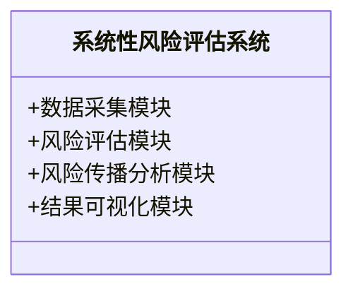

                 

# 金融市场系统性风险评估工具

## 关键词  
- 金融市场  
- 系统性风险  
- 风险评估工具  
- 宏观经济指标  
- 系统性风险模型  

## 摘要  
金融市场系统性风险是指由于系统性因素导致的整个金融市场发生崩溃或剧烈波动的风险。本文将从系统性风险的核心概念、评估方法、算法原理、系统架构设计、项目实战案例到最佳实践等多个方面，全面解析金融市场系统性风险评估工具的设计与实现。通过深入分析系统性风险的来源、传播机制及其对金融市场的影响，结合实际案例和最佳实践，为读者提供一套实用的系统性风险评估工具设计方案。

---

## 目录大纲

### 第一部分: 系统性风险的背景与核心概念

#### 第1章: 系统性风险的背景与概念

##### 1.1 系统性风险的定义与特征
- 系统性风险的定义  
- 系统性风险的核心特征  
- 系统性风险与非系统性风险的对比  

##### 1.2 系统性风险的来源与影响
- 宏观经济因素对系统性风险的影响  
- 市场结构变化对系统性风险的推动  
- 投资者行为对系统性风险的作用  

##### 1.3 系统性风险的评估意义
- 系统性风险对金融稳定的影响  
- 系统性风险评估的现实需求  
- 系统性风险工具的应用前景  

#### 第2章: 系统性风险的核心要素

##### 2.1 系统性风险的构成要素
- 宏观经济指标  
- 市场结构特征  
- 投资者行为模式  

##### 2.2 系统性风险的属性特征对比
- 系统性风险与非系统性风险的对比分析  
- 使用表格展示系统性风险与非系统性风险的对比  

##### 2.3 系统性风险的ER实体关系图
- 使用Mermaid流程图展示系统性风险评估的实体关系  

---

### 第二部分: 系统性风险评估的算法原理

#### 第3章: 系统性风险评估的数学模型

##### 3.1 系统性风险的度量方法
- 使用VaR（Value at Risk）模型  
- 使用CVaR（Conditional Value at Risk）模型  

##### 3.2 系统性风险的传播机制
- 使用网络模型分析风险传播  
- 使用系统性风险指数（SRI）进行评估  

#### 第4章: 系统性风险评估算法的实现

##### 4.1 系统性风险评估算法的步骤分解
- 数据采集与预处理  
- 系统性风险指标的计算  
- 风险传播网络的构建  

##### 4.2 系统性风险评估算法的代码实现
- 使用Python代码实现VaR模型的计算  
- 使用Python代码实现风险传播网络的构建  

---

### 第三部分: 系统性风险评估系统的架构设计

#### 第5章: 系统性风险评估系统的功能设计

##### 5.1 系统性风险评估系统的需求分析
- 系统功能需求  
- 系统性能需求  

##### 5.2 系统性风险评估系统的功能模块设计
- 数据采集模块  
- 风险评估模块  
- 风险传播分析模块  
- 结果可视化模块  

#### 第6章: 系统性风险评估系统的架构设计

##### 6.1 系统架构设计概述
- 采用分层架构设计  
- 使用微服务架构实现  

##### 6.2 系统架构设计的类图展示
- 使用Mermaid类图展示系统架构设计  

##### 6.3 系统接口设计
- API接口设计  
- 接口调用流程  

---

### 第四部分: 项目实战与案例分析

#### 第7章: 系统性风险评估工具的项目实战

##### 7.1 项目环境安装
- 安装Python环境  
- 安装相关依赖库  

##### 7.2 项目核心代码实现
- 数据采集与预处理代码  
- 系统性风险评估算法的实现代码  
- 风险传播网络的构建代码  

##### 7.3 项目实战案例分析
- 使用实际数据进行案例分析  
- 讨论案例结果的合理性  

---

### 第五部分: 最佳实践与总结

#### 第8章: 系统性风险评估工具的最佳实践

##### 8.1 系统性风险评估工具的使用注意事项
- 数据质量的重要性  
- 模型选择的合理性  

##### 8.2 系统性风险评估工具的优化建议
- 数据处理的优化方法  
- 算法性能的优化建议  

##### 8.3 系统性风险评估工具的未来发展方向
- 新算法的探索与应用  
- 系统架构的优化与升级  

#### 第9章: 总结与展望

##### 9.1 总结
- 本文的核心内容回顾  
- 本文的创新点总结  

##### 9.2 展望
- 未来的研究方向  
- 未来系统的优化方向  

---

## 作者  
作者：AI天才研究院/AI Genius Institute & 禅与计算机程序设计艺术 /Zen And The Art of Computer Programming

