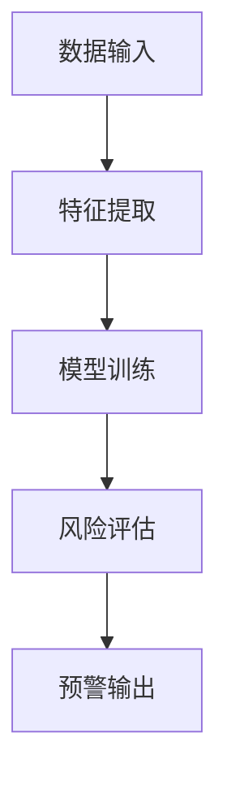
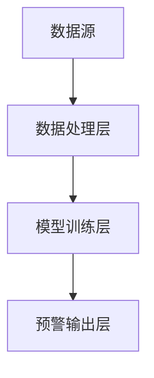
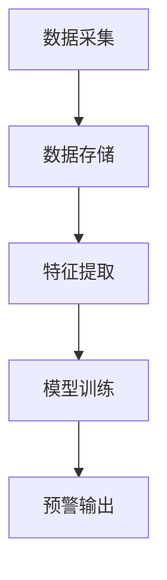
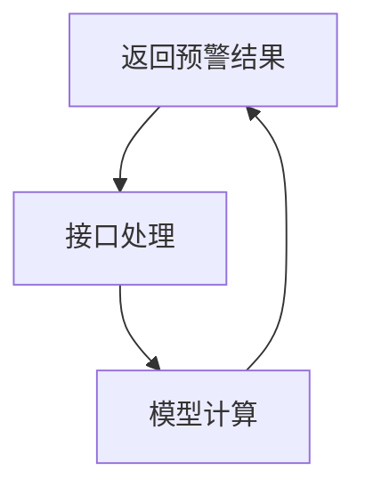

                 


# 金融市场系统性风险预警模型

> 关键词：金融市场，系统性风险，预警模型，风险管理，金融监管，人工智能

> 摘要：本文详细探讨了金融市场系统性风险预警模型的构建与应用。通过分析系统性风险的核心概念、算法原理、系统架构设计、项目实战以及最佳实践，展示了如何利用先进的技术手段对金融市场系统性风险进行有效预警，为金融监管部门和投资者提供科学决策支持。

---

## 第一章 系统性风险的背景与重要性

### 1.1 系统性风险的定义与特征

#### 1.1.1 系统性风险的定义
系统性风险是指由于整个金融系统或经济体系的某些共同因素导致的金融资产价格波动，这种风险无法通过分散投资来完全消除。

#### 1.1.2 系统性风险的核心特征
- **广泛性**：影响整个金融体系。
- **传染性**：风险在金融机构之间快速传播。
- **不可分散性**：无法通过多样化投资来降低。
- **复杂性**：涉及多个因素和参与者。

#### 1.1.3 系统性风险与非系统性风险的对比
| 特性 | 系统性风险 | 非系统性风险 |
|------|------------|--------------|
| 影响范围 | 整个金融体系 | 单一资产或小范围 |
| 可分散性 | 不能 | 可以 |

### 1.2 金融市场中的系统性风险

#### 1.2.1 金融市场的基本结构
- 机构投资者、个人投资者、上市公司、金融机构等构成金融市场的主体。
- 股票、债券、基金等是主要的金融工具。

#### 1.2.2 系统性风险在金融体系中的传导机制
- **直接传导**：通过价格波动直接影响市场。
- **间接传导**：通过关联机构的影响传递风险。

#### 1.2.3 历史案例分析
- 2008年金融危机：系统性风险导致全球性金融危机。

### 1.3 系统性风险预警模型的必要性

#### 1.3.1 系统性风险预警的目的
- 提前发现潜在风险。
- 减少系统性危机的发生。

#### 1.3.2 预警模型在金融监管中的作用
- 为监管机构提供决策支持。
- 监测金融市场整体风险。

#### 1.3.3 预警模型对投资者的价值
- 帮助投资者做出更明智的投资决策。

---

## 第二章 系统性风险预警模型的核心概念

### 2.1 系统性风险预警模型的基本原理

#### 2.1.1 模型的输入与输出
- **输入**：市场数据、宏观经济指标。
- **输出**：风险预警信号。

#### 2.1.2 模型的假设与限制
- 数据的完整性和准确性。
- 模型的有效性和可解释性。

### 2.2 系统性风险预警模型的关键要素

#### 2.2.1 数据来源与处理
- **数据来源**：股票价格、债券收益率、经济指标等。
- **数据处理**：清洗、标准化、特征提取。

#### 2.2.2 风险指标的构建
- **VaR模型**：衡量投资组合的潜在损失。
- **CVaR模型**：在VaR的基础上考虑尾部风险。

#### 2.2.3 预警阈值的设定
- 根据历史数据和市场情况设定阈值。

### 2.3 系统性风险预警模型的分类

#### 2.3.1 基于统计的方法
- **Z值模型**：用于评估金融机构的破产风险。

#### 2.3.2 基于机器学习的方法
- **神经网络模型**：通过深度学习捕捉复杂关系。
- **随机森林**：用于特征重要性分析。

#### 2.3.3 混合模型
- 结合统计和机器学习方法，提高模型准确性。

---

## 第三章 系统性风险预警模型的数学基础

### 3.1 系统性风险的度量方法

#### 3.1.1 方差-协方差矩阵的构建
- 用于衡量资产之间的相关性。

#### 3.1.2 主成分分析（PCA）
- 通过PCA提取主要风险因子。

#### 3.1.3 系统性风险指数的计算
- 使用因子分析构建风险指数。

### 3.2 统计模型与数学公式

#### 3.2.1 多因素模型的数学表达
$$ R_i = \alpha_i + \beta_i R_m + \gamma_i M + \epsilon_i $$

#### 3.2.2 系统性风险的马科维茨均值-方差模型
- 用于优化投资组合的风险和收益。

#### 3.2.3 系统性风险的转移矩阵模型
- 通过马尔可夫链描述风险状态转移。

### 3.3 算法原理与流程图

#### 3.3.1 系统性风险预警算法的流程图


---

## 第四章 系统性风险预警模型的系统架构设计

### 4.1 系统功能模块划分

#### 4.1.1 数据采集模块
- 收集市场数据和宏观经济指标。

#### 4.1.2 特征提取模块
- 提取关键风险特征。

#### 4.1.3 模型训练模块
- 训练预警模型。

#### 4.1.4 预警输出模块
- 生成预警信号。

### 4.2 系统架构设计

#### 4.2.1 分层架构设计


#### 4.2.2 系统架构图


### 4.3 系统接口设计

#### 4.3.1 RESTful API接口
- 提供数据接口和预警结果接口。

### 4.4 系统交互设计

#### 4.4.1 系统交互流程图


---

## 第五章 系统性风险预警模型的项目实战

### 5.1 环境安装与配置

#### 5.1.1 Python环境安装
- 安装Python和相关库（如Pandas、Scikit-learn）。

#### 5.1.2 数据获取
- 从金融数据源获取数据。

### 5.2 核心代码实现

#### 5.2.1 数据处理代码
```python
import pandas as pd

# 读取数据
data = pd.read_csv('market_data.csv')

# 数据清洗
data = data.dropna()
```

#### 5.2.2 模型训练代码
```python
from sklearn.ensemble import RandomForestClassifier

# 特征选择
features = data[['returns', 'volatility', 'market_cap']]
target = data['risk_flag']

# 训练模型
model = RandomForestClassifier()
model.fit(features, target)
```

### 5.3 案例分析与结果解读

#### 5.3.1 案例分析
- 使用历史数据训练模型，预测未来风险。

#### 5.3.2 结果解读
- 预警信号的解读和应对策略。

### 5.4 优化与改进

#### 5.4.1 模型调优
- 使用网格搜索优化模型参数。

#### 5.4.2 数据增强
- 引入更多的数据源和特征。

---

## 第六章 系统性风险预警模型的最佳实践

### 6.1 实践中的注意事项

#### 6.1.1 数据质量的重要性
- 确保数据的完整性和准确性。

#### 6.1.2 模型的可解释性
- 选择可解释的模型，便于分析和优化。

#### 6.1.3 持续监控
- 定期更新模型和数据，保持预警的有效性。

### 6.2 小结与展望

#### 6.2.1 小结
- 总结模型的核心优势和应用场景。

#### 6.2.2 展望
- 未来的研究方向和应用前景。

---

## 作者：AI天才研究院/AI Genius Institute & 禅与计算机程序设计艺术 /Zen And The Art of Computer Programming

