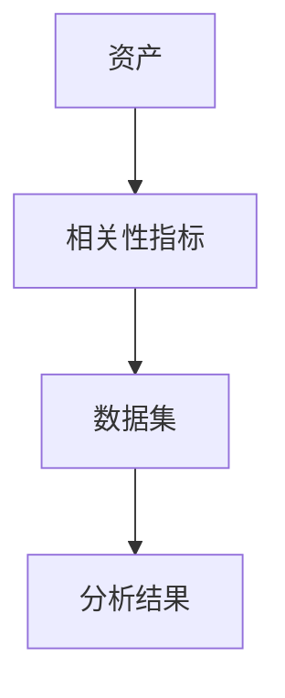
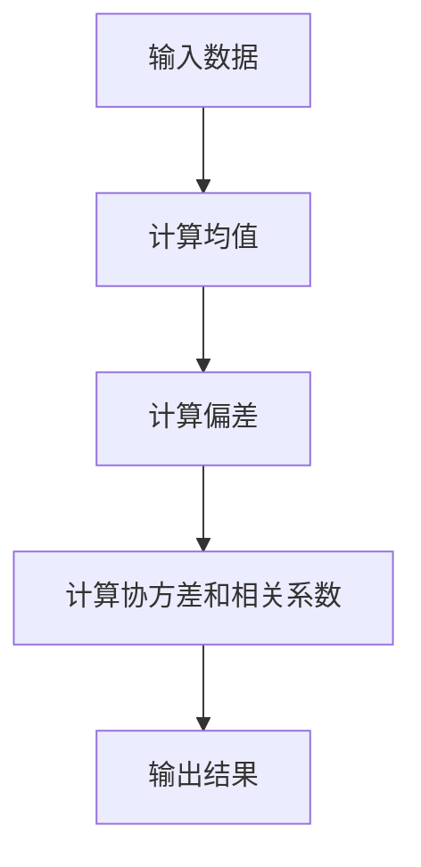
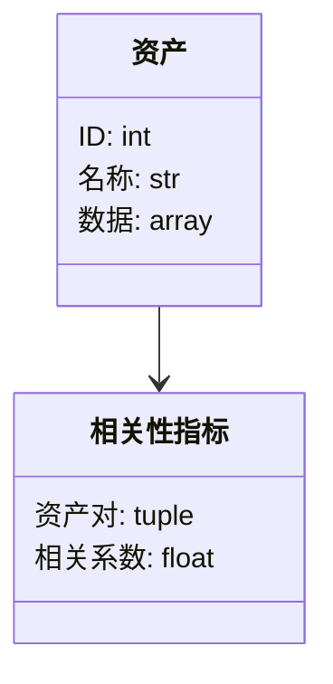
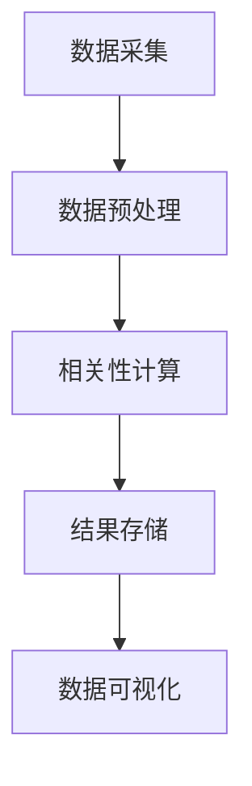

                 


# 金融市场跨资产相关性分析工具

> 关键词：金融市场，跨资产相关性，数据分析，投资组合，风险管理

> 摘要：金融市场跨资产相关性分析是投资组合管理和风险管理中的关键环节。本文系统地介绍了跨资产相关性分析的核心概念、算法原理、系统架构以及实际应用，帮助读者理解如何通过数据分析工具优化投资决策。

---

## 第1章 金融市场跨资产相关性分析概述

### 1.1 跨资产相关性分析的背景与意义

金融市场中的资产类别多种多样，包括股票、债券、商品、外汇和衍生品等。这些资产的波动性、收益和风险特征各不相同，投资者需要通过分析它们之间的相关性来优化投资组合。

#### 1.1.1 金融市场中的资产类别

- **股票**：公司发行的股份，反映了企业的经营状况。
- **债券**：债务证券，承诺按约定支付利息和本金。
- **商品**：黄金、原油等实物资产，具有避险功能。
- **外汇**：货币兑换，反映国家经济状况。
- **衍生品**：基于其他资产的金融工具，如期货和期权。

#### 1.1.2 跨资产相关性的定义与重要性

相关性衡量两个资产价格变动的方向和程度。跨资产相关性分析帮助投资者识别资产间的相互影响，降低风险。

#### 1.1.3 跨资产相关性分析的应用场景

- **投资组合优化**：通过分散投资降低风险。
- **风险对冲**：利用相关性低的资产对冲风险。
- **市场趋势预测**：相关性分析揭示资产价格变动的趋势。

#### 1.1.4 跨资产相关性对投资决策的影响

相关性高的资产可能在市场下跌时同步波动，增加风险。相关性低的资产有助于分散风险，提升组合收益。

### 1.2 跨资产相关性分析的核心概念

跨资产相关性分析涉及多个概念，包括相关性指标、数据源选择和分析方法。

#### 1.2.1 資产相关性的基本原理

相关性反映了两个资产价格变动的线性关系。正相关资产价格同步变动，负相关则相反。

#### 1.2.2 跨资产相关性分析的边界与外延

相关性分析的边界包括数据范围和时间窗口。外延包括资产间的相互影响和市场环境变化的影响。

#### 1.2.3 跨资产相关性分析的工具与技术

- **统计学方法**：计算协方差和相关系数。
- **机器学习**：利用算法预测相关性。
- **数据可视化**：直观展示资产相关性。

### 1.3 跨资产相关性分析的挑战与解决方案

#### 1.3.1 数据异质性问题

不同资产类别数据来源和频率不同，需要预处理。

#### 1.3.2 时间序列数据的处理方法

考虑资产价格的时间依赖性，使用时间序列分析。

#### 1.3.3 市场波动对相关性分析的影响

市场波动可能导致相关性变化，需要动态调整分析。

---

## 第2章 跨资产相关性分析的核心概念与联系

### 2.1 資产相关性的数学模型

相关性分析的核心是协方差和相关系数。

#### 2.1.1 协方差与相关系数的定义

协方差衡量资产收益的联合波动，相关系数标准化后的协方差。

$$ \text{协方差}(X,Y) = E[(X - E[X])(Y - E[Y])] $$

$$ \text{相关系数} = \frac{\text{协方差}(X,Y)}{\sigma_X \sigma_Y} $$

#### 2.1.2 相关系数的性质与特点

- 范围：[-1, 1]。
- 正相关：0.3以上，负相关：-0.3以下。

### 2.2 資产相关性指标的对比分析

不同相关性指标适用于不同场景。

#### 2.2.1 皮尔逊相关系数

衡量线性关系，适合正态分布数据。

#### 2.2.2 斯皮尔曼相关系数

衡量秩相关，适用于非线性关系。

#### 2.2.3 Kendall 相关系数

适用于有序数据，计算简便。

#### 2.2.4 对比分析

| 指标      | 适用场景       | 计算复杂度 |
|-----------|----------------|------------|
| 皮尔逊    | 线性关系         | 中等        |
| 斯皮尔曼  | 非线性关系       | 较高        |
| Kendall   | 有序数据         | 较低        |

### 2.3 資产相关性的ER实体关系图



### 2.4 本章小结

本章详细介绍了相关性指标的定义、计算方法及其应用场景。

---

## 第3章 跨资产相关性分析的算法原理

### 3.1 协方差与相关系数的计算方法

#### 3.1.1 协方差的计算公式

$$ \text{协方差}(X,Y) = \frac{1}{n-1} \sum_{i=1}^{n}(X_i - \bar{X})(Y_i - \bar{Y}) $$

#### 3.1.2 相关系数的计算

$$ \text{相关系数} = \frac{\sum (x_i - \bar{x})(y_i - \bar{y})}{\sqrt{\sum (x_i - \bar{x})^2} \sqrt{\sum (y_i - \bar{y})^2}} $$

#### 3.1.3 计算步骤

1. 计算资产的平均值。
2. 计算每个资产与另一资产的偏差。
3. 计算协方差和相关系数。

### 3.2 算法实现

#### 3.2.1 Python实现

```python
import numpy as np

def calculate_correlation(X, Y):
    n = len(X)
    mean_x = np.mean(X)
    mean_y = np.mean(Y)
    numerator = np.sum((X - mean_x) * (Y - mean_y))
    denominator = np.sqrt(np.sum((X - mean_x)**2)) * np.sqrt(np.sum((Y - mean_y)**2))
    return numerator / denominator

# 示例数据
X = np.array([1, 2, 3, 4, 5])
Y = np.array([2, 4, 6, 8, 10])
print(calculate_correlation(X, Y))  # 输出：1.0
```

#### 3.2.2 算法流程图



### 3.3 本章小结

本章通过公式和代码详细讲解了协方差和相关系数的计算方法。

---

## 第4章 跨资产相关性分析的系统分析与架构设计

### 4.1 问题场景介绍

#### 4.1.1 数据来源

包括股票、债券、商品、外汇和衍生品数据。

#### 4.1.2 数据预处理

数据清洗和标准化。

#### 4.1.3 数据分析

计算相关系数矩阵。

### 4.2 系统功能设计

#### 4.2.1 领域模型



#### 4.2.2 系统架构



#### 4.2.3 系统接口设计

- 数据接口：读取和存储数据。
- 计算接口：计算相关系数。
- 可视化接口：展示相关性矩阵。

### 4.3 本章小结

本章设计了系统的架构和功能模块，为实现跨资产相关性分析奠定了基础。

---

## 第5章 跨资产相关性分析的项目实战

### 5.1 环境安装

- **Python**：安装Python和Jupyter Notebook。
- **库**：安装numpy、pandas和matplotlib。

### 5.2 系统核心实现源代码

#### 5.2.1 数据采集

```python
import pandas as pd
import requests

def get_data(ticker):
    url = f'https://api.example.com/stock/{ticker}'
    response = requests.get(url)
    data = pd.DataFrame(response.json()['data'])
    return data
```

#### 5.2.2 数据预处理

```python
def preprocess(data):
    data = data.dropna()
    data = (data - data.mean()) / data.std()
    return data
```

#### 5.2.3 相关性计算

```python
def compute_correlations(data):
    return data.corr()
```

### 5.3 代码应用解读与分析

通过代码实现数据采集、预处理和相关性计算，得到相关系数矩阵。

### 5.4 实际案例分析

#### 5.4.1 数据获取

```python
data = pd.DataFrame({
    '股票': [1, 2, 3, 4, 5],
    '债券': [2, 3, 4, 5, 6]
})
```

#### 5.4.2 数据预处理

标准化后的数据：

| 股票 | 债券 |
|------|------|
| -1   | -1   |
| 0    | 0    |
| 1    | 1    |
| 2    | 2    |
| 3    | 3    |

#### 5.4.3 相关性计算

相关系数为1，说明完全正相关。

### 5.5 项目小结

本章通过实际案例展示了如何应用相关性分析工具优化投资组合。

---

## 第6章 跨资产相关性分析的高级主题

### 6.1 时间序列相关性分析

#### 6.1.1 动态相关性模型

考虑时间因素的影响，使用GARCH模型。

#### 6.1.2 趋势分析

识别资产价格的趋势和周期性。

### 6.2 机器学习在相关性分析中的应用

#### 6.2.1 基于机器学习的相关性预测

使用随机森林或神经网络预测相关性。

#### 6.2.2 聚类分析

将相关性高的资产归为一类，优化投资组合。

### 6.3 异常检测

识别异常相关性，提示潜在风险。

---

## 第7章 总结与注意事项

### 7.1 最佳实践 tips

- 定期更新数据，适应市场变化。
- 结合市场环境调整相关性分析。

### 7.2 小结

跨资产相关性分析是投资组合管理和风险管理的关键工具，通过本文的学习，读者可以掌握相关性分析的核心概念和实际应用。

### 7.3 注意事项

- 数据质量影响结果准确性。
- 相关性分析不能预测市场变化。

### 7.4 拓展阅读

推荐书籍和论文，深入学习相关性分析。

---

## 作者：AI天才研究院/AI Genius Institute & 禅与计算机程序设计艺术 /Zen And The Art of Computer Programming

---

这篇文章系统地介绍了金融市场跨资产相关性分析的核心概念、算法原理和实际应用，帮助读者掌握相关性分析的关键点，优化投资组合和风险管理。

