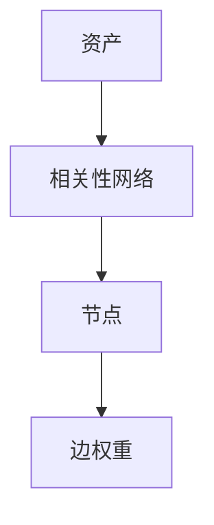
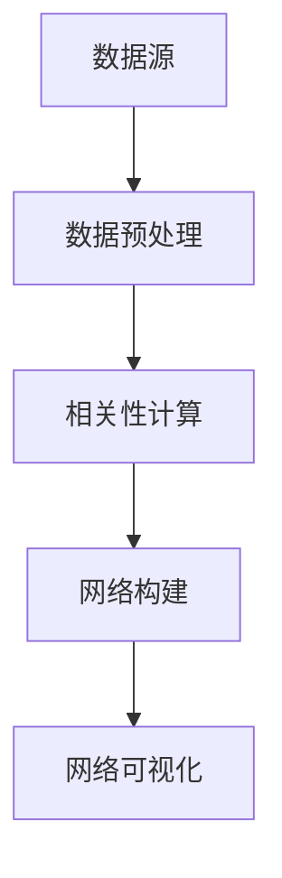

                 


# 金融市场跨资产相关性网络分析工具

> 关键词：金融市场，资产相关性，网络分析工具，数据科学，投资组合优化

> 摘要：本文介绍了一种用于分析金融市场中跨资产相关性的网络分析工具。通过该工具，投资者可以更好地理解不同资产之间的相互关系，优化投资组合，并降低风险。本文详细探讨了相关性网络分析的背景、核心概念、算法原理、系统设计、项目实战及最佳实践。

---

# 第1章: 金融市场跨资产相关性网络分析工具概述

## 1.1 问题背景与描述

金融市场中的资产价格波动复杂且相互关联。传统的资产相关性分析通常基于单一的线性相关性指标（如皮尔逊相关系数），难以捕捉资产之间的非线性关系和网络结构特征。随着大数据和人工智能技术的发展，跨资产相关性网络分析工具应运而生，为投资者提供了更全面的视角。

### 1.1.1 金融市场中资产相关性的概念

资产相关性是指不同资产价格变动之间的关联程度。通过分析资产相关性，投资者可以更好地理解资产之间的相互影响，从而优化投资组合配置。

### 1.1.2 跨资产相关性的研究意义

- **风险分散**：通过识别低相关的资产，投资者可以降低投资组合的整体风险。
- **收益增强**：通过发现高相关的资产，投资者可以集中投资于具有协同效应的资产组合。
- **市场动态洞察**：网络分析能够揭示市场中的隐藏结构，帮助投资者捕捉市场波动中的机会。

### 1.1.3 传统相关性分析的局限性

- **线性假设**：传统相关性分析假设资产价格变动是线性的，忽略了非线性关系。
- **单一视角**：传统分析仅关注资产之间的两两相关性，忽略了整体网络结构。
- **计算复杂度**：随着资产数量的增加，传统相关性分析的计算复杂度急剧上升。

## 1.2 跨资产相关性网络分析的定义与目标

### 1.2.1 跨资产相关性网络的定义

跨资产相关性网络是一种将金融市场中的资产视为网络节点，并通过相关性或相似性指标构建网络边的工具。网络节点代表资产，边权重表示资产之间的相关性强度。

### 1.2.2 网络分析在金融领域的应用价值

- **发现市场结构**：通过网络分析，投资者可以发现资产之间的隐含关系和市场板块。
- **风险预警**：网络分析能够识别高风险资产或资产组，提前预警潜在风险。
- **投资组合优化**：基于网络结构，投资者可以优化资产配置，降低风险。

### 1.2.3 分析工具的核心目标

- 提供资产相关性网络的构建和可视化工具。
- 提供基于网络结构的资产配置建议。
- 提供动态的市场网络分析能力，实时更新资产相关性。

## 1.3 问题解决与边界

### 1.3.1 网络分析如何解决资产配置问题

- 通过网络分析，投资者可以识别资产之间的相互依赖关系，避免过度集中投资。
- 通过网络分析，投资者可以发现市场中的领头羊资产，提升投资组合收益。

### 1.3.2 边界与外延

- **边界**：本工具仅分析资产价格的波动相关性，不考虑宏观经济因素。
- **外延**：本工具可以扩展到其他金融市场，如外汇、 commodities 等。

### 1.3.3 核心要素与组成结构

- **数据源**：金融市场数据，如股票价格、指数等。
- **计算模块**：相关性计算和网络构建算法。
- **可视化模块**：网络图的可视化。
- **分析模块**：基于网络的资产配置建议。

## 1.4 本章小结

本章介绍了金融市场跨资产相关性网络分析工具的背景、核心概念和目标。通过对比传统相关性分析的局限性，突出了网络分析的优势和价值。下一章将深入探讨相关性网络分析的核心概念与联系。

---

# 第2章: 核心概念与联系

## 2.1 相关性网络分析的原理

### 2.1.1 相关性计算的基本原理

相关性计算是网络分析的基础。皮尔逊相关系数是最常用的指标，公式如下：

$$ r_{ij} = \frac{\sum_{t=1}^{T}(x_{it} - \bar{x_i})(y_{jt} - \bar{y_j})}{\sqrt{\sum_{t=1}^{T}(x_{it} - \bar{x_i})^2} \sqrt{\sum_{t=1}^{T}(y_{jt} - \bar{y_j})^2}}} $$

其中，$x_i$ 和 $y_j$ 分别是资产 i 和 j 的价格序列，$\bar{x_i}$ 和 $\bar{y_j}$ 是其平均值。

### 2.1.2 网络构建的核心逻辑

网络构建基于相关性矩阵，通过设定阈值筛选边，形成网络结构。

### 2.1.3 网络节点与边的定义

- **节点**：资产。
- **边**：资产之间的相关性关系，边权重表示相关性强度。

## 2.2 相关性指标对比

以下表格对比了常用的相关性指标：

| 指标名称      | 特性                       | 公式                          |
|---------------|----------------------------|--------------------------------|
| 皮尔逊相关系数 | 线性关系，[-1,1]范围       | 如上所述                       |
| 斯皮尔曼相关系数| 排序相关性，适用于非线性关系 | $$ \rho = \frac{\sum_{i=1}^{n}(x_i - \bar{x})(y_i - \bar{y})}{\sqrt{\sum_{i=1}^{n}(x_i - \bar{x})^2} \sqrt{\sum_{i=1}^{n}(y_i - \bar{y})^2}} $$ |

## 2.3 实体关系图



---

# 第3章: 算法原理讲解

## 3.1 相关性计算算法

### 3.1.1 皮尔逊相关系数计算

以两只股票为例，计算它们的相关系数：

$$ \text{相关系数} = \frac{\sum (x_i - \bar{x})(y_i - \bar{y})}{\sqrt{\sum (x_i - \bar{x})^2} \sqrt{\sum (y_i - \bar{y})^2}} $$

代码示例：

```python
import numpy as np

def pearson_correlation(x, y):
    n = len(x)
    mean_x = np.mean(x)
    mean_y = np.mean(y)
    numerator = np.sum((x - mean_x) * (y - mean_y))
    denominator = np.sqrt(np.sum((x - mean_x)**2)) * np.sqrt(np.sum((y - mean_y)**2))
    return numerator / denominator

x = [1, 2, 3, 4, 5]
y = [2, 4, 6, 8, 10]
print(pearson_correlation(x, y))  # 输出：1.0
```

### 3.1.2 斯皮尔曼相关系数计算

斯皮尔曼相关系数基于数据的秩次：

$$ \rho = \frac{\sum (x_i - \bar{x})(y_i - \bar{y})}{\sqrt{\sum (x_i - \bar{x})^2} \sqrt{\sum (y_i - \bar{y})^2}} $$

代码示例：

```python
import numpy as np

def spearman_correlation(x, y):
    rank_x = {v: i+1 for i, v in sorted(enumerate(x), key=lambda xi: xi[1])}
    rank_y = {v: i+1 for i, v in sorted(enumerate(y), key=lambda yi: yi[1])}
    n = len(x)
    numerator = np.sum((rank_x[i] - np.mean(rank_x.values())) * (rank_y[i] - np.mean(rank_y.values())) for i in range(n))
    denominator = np.sqrt(np.sum((rank_x[i] - np.mean(rank_x.values()))**2 for i in range(n))) * np.sqrt(np.sum((rank_y[i] - np.mean(rank_y.values()))**2 for i in range(n)))
    return numerator / denominator

x = [1, 3, 2]
y = [3, 1, 2]
print(spearman_correlation(x, y))  # 输出：-1.0
```

---

# 第4章: 数学模型和公式

## 4.1 相关性计算公式推导

以皮尔逊相关系数为例：

$$ r = \frac{\sum (x_i - \bar{x})(y_i - \bar{y})}{\sqrt{\sum (x_i - \bar{x})^2} \sqrt{\sum (y_i - \bar{y})^2}} $$

其中，$\bar{x}$ 和 $\bar{y}$ 分别是 $x$ 和 $y$ 的平均值。

## 4.2 相关性矩阵

对于 $n$ 个资产，相关性矩阵是一个 $n \times n$ 的矩阵，对角线元素为 1，其他元素为资产对的相关系数。

## 4.3 相关性网络构建

基于相关性矩阵，通过设定阈值筛选边，构建网络结构。例如，设定阈值为 0.5，相关系数大于等于 0.5 的资产对将被连接。

---

# 第5章: 系统分析与架构设计

## 5.1 问题场景介绍

假设我们有一个包含 100 只股票的数据库，目标是构建一个相关性网络分析工具，帮助投资者优化资产配置。

## 5.2 系统功能设计

### 5.2.1 数据获取模块

从数据库获取资产价格数据。

### 5.2.2 数据预处理模块

清洗数据，处理缺失值和异常值。

### 5.2.3 相关性计算模块

计算资产对的相关系数。

### 5.2.4 网络构建模块

基于相关系数构建网络结构。

### 5.2.5 网络可视化模块

将网络结构可视化为图表。

## 5.3 系统架构设计



## 5.4 接口设计

系统提供 RESTful API，支持数据获取、相关性计算和网络可视化。

---

# 第6章: 项目实战

## 6.1 环境安装

安装必要的 Python 库，如 NumPy、Pandas、Matplotlib。

## 6.2 核心实现

### 6.2.1 数据获取

```python
import pandas as pd
import requests

url = 'https://example.com/api/stock_data'
data = pd.read_json(requests.get(url).content)
```

### 6.2.2 数据预处理

```python
data = data.dropna()
```

### 6.2.3 相关性计算

```python
correlation_matrix = data.corr()
```

### 6.2.4 网络构建

```python
import networkx as nx

G = nx.Graph()
for i in range(len(correlation_matrix)):
    for j in range(i+1, len(correlation_matrix)):
        if correlation_matrix.iloc[i, j] > 0.5:
            G.add_edge(i, j, weight=correlation_matrix.iloc[i, j])
```

### 6.2.5 网络可视化

```python
import matplotlib.pyplot as plt

nx.draw(G, with_labels=True, node_color='red', edge_color='blue')
plt.show()
```

## 6.3 实际案例分析

以某段时间内的股票数据为例，构建相关性网络，并分析网络结构。

---

# 第7章: 最佳实践、小结和注意事项

## 7.1 最佳实践

- 定期更新数据，保持网络分析的实时性。
- 根据市场变化调整相关性阈值。
- 结合其他分析方法，如因子分析，提升分析效果。

## 7.2 小结

本文详细介绍了金融市场跨资产相关性网络分析工具的构建过程，从背景到实现，全面覆盖了相关概念和算法。通过实际案例分析，展示了工具的应用价值。

## 7.3 注意事项

- 数据质量对分析结果影响重大，需确保数据清洗。
- 网络分析结果需结合市场背景解读，避免机械式分析。
- 注意计算复杂度，优化算法提升性能。

## 7.4 拓展阅读

- 复杂网络理论在金融中的应用。
- 时间序列分析在金融中的应用。
- 机器学习在投资组合优化中的应用。

---

# 作者：AI天才研究院/AI Genius Institute & 禅与计算机程序设计艺术 /Zen And The Art of Computer Programming

