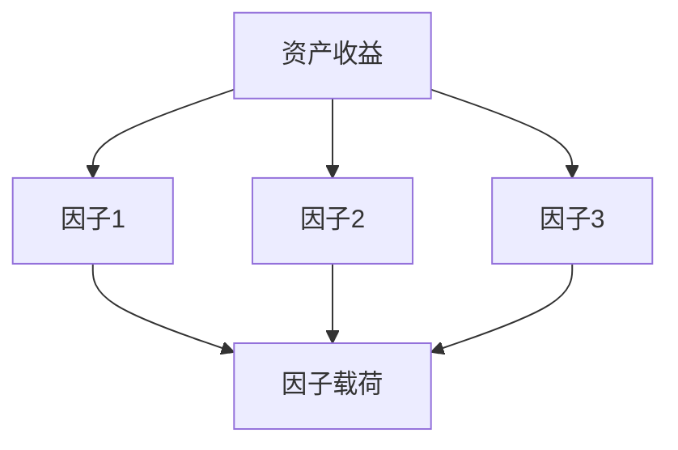
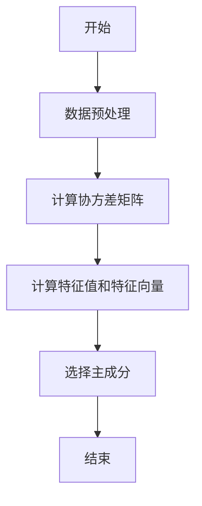
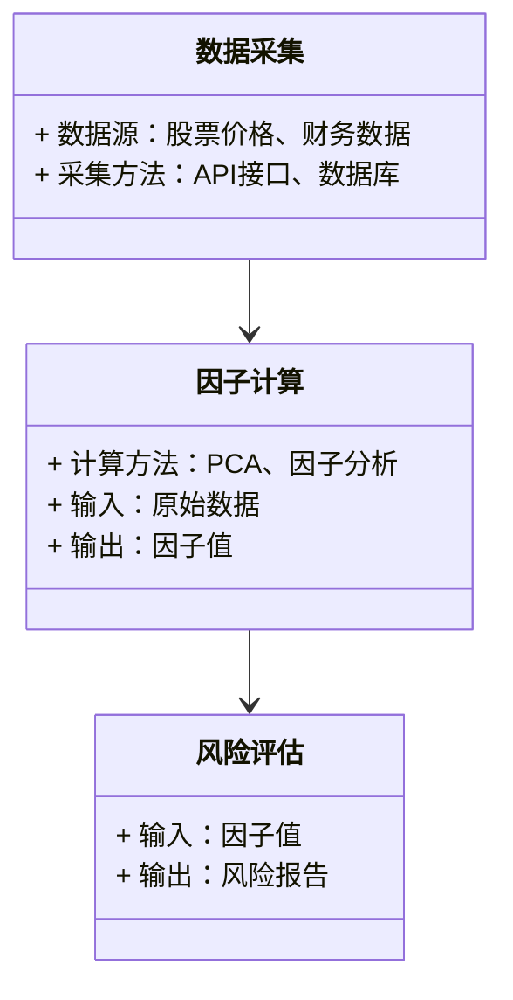

                 


# 金融市场风险因子分解与分析

> 关键词：金融市场风险因子分解，风险因子，主成分分析（PCA），因子分析模型，系统性风险，非系统性风险

> 摘要：金融市场风险因子分解是理解金融市场波动性和风险管理的重要工具。本文从基础概念出发，详细讲解风险因子的分类、数学模型、分解算法，结合实际案例分析，探讨风险因子分解的应用和意义。通过系统化的分析与实战项目，帮助读者掌握金融市场风险因子分解的核心方法和技术。

---

# 第1章 金融市场风险因子概述

## 1.1 金融市场风险的基本概念

### 1.1.1 金融市场风险的定义
金融市场风险是指在金融市场中，由于价格波动、利率变化、市场不确定性等因素，导致投资组合或资产价值遭受损失的可能性。风险是金融市场的重要组成部分，理解和管理风险是投资者和金融机构的核心任务。

### 1.1.2 风险因子的定义与分类
风险因子是指影响资产或投资组合收益变化的变量。常见的风险因子包括市场整体波动、利率、通货膨胀、行业风险等。风险因子可以分为系统性风险（如市场风险）和非系统性风险（如公司特有风险）。

### 1.1.3 风险因子分解的背景与意义
风险因子分解是一种将资产收益分解为多个潜在因子的方法，这些因子代表了影响收益变化的主要因素。通过分解风险因子，投资者可以更好地识别和量化风险来源，从而进行更有效的风险管理和投资决策。

## 1.2 风险因子的分类与特征

### 1.2.1 系统性风险因子
系统性风险是指影响整个市场的风险，如经济衰退、通货膨胀、利率变化等。这些风险无法通过分散化投资来消除。

### 1.2.2 非系统性风险因子
非系统性风险是指特定于某个资产或行业的风险，如公司业绩下滑、管理问题等。这些风险可以通过分散化投资来降低。

### 1.2.3 风险因子的数学表达与属性特征对比表

| 风险因子类型 | 系统性风险因子 | 非系统性风险因子 |
|--------------|-----------------|-------------------|
| 影响范围     | 整个市场         | 特定资产或行业     |
| 是否可分散   | 不能            | 可以              |
| 示例         | 市场波动、利率变化 | 公司特有风险       |

## 1.3 风险因子分解的意义与应用

### 1.3.1 风险因子分解在金融分析中的作用
风险因子分解帮助投资者识别影响资产收益的主要因素，量化这些因素对收益的贡献程度，从而更好地进行风险管理和投资决策。

### 1.3.2 风险因子分解的实际应用场景
- 量化投资：构建因子投资策略。
- 风险管理：识别和量化投资组合的风险来源。
- 金融建模：用于信用风险、市场风险等模型的构建。

### 1.3.3 风险因子分解的边界与外延
风险因子分解关注的是资产收益的系统性部分，而非系统性风险需要通过其他方法进行管理。分解的因子数量通常远小于资产数量，便于简化分析。

## 1.4 本章小结
本章介绍了金融市场风险的基本概念，系统性风险和非系统性风险的分类，以及风险因子分解的意义和应用场景。理解这些内容是进一步学习风险因子分解方法的基础。

---

# 第2章 风险因子分解的核心概念与联系

## 2.1 风险因子分解的数学模型

### 2.1.1 因子分解的基本原理
风险因子分解假设资产的收益可以表示为多个因子的线性组合，这些因子反映了影响收益的主要因素。

### 2.1.2 因子分解的数学表达式
资产收益可以表示为因子的线性组合，公式为：
$$ r_i = \beta_{i1}f_1 + \beta_{i2}f_2 + \cdots + \beta_{ik}f_k + \epsilon_i $$
其中，$r_i$ 是资产i的收益，$f_j$ 是因子j，$\beta_{ij}$ 是因子载荷，$\epsilon_i$ 是特异因子。

### 2.1.3 因子分解的变量关系图（Mermaid流程图）


## 2.2 风险因子的ER实体关系图

### 2.2.1 数据表结构设计
- 事实表：记录资产收益、因子值等数据。
- 维度表：包括资产信息、因子信息等。

### 2.2.2 实体关系图（Mermaid图）
```mermaid
erd
    客户
    维度
    事实
    客户 --> 维度
    事实 --> 维度
```

## 2.3 风险因子分解的算法原理

### 2.3.1 主成分分析（PCA）算法原理
PCA是一种统计方法，用于降维和识别数据的主要成分。其步骤包括：
1. 计算协方差矩阵。
2. 计算协方差矩阵的特征值和特征向量。
3. 选择前k个主成分。

### 2.3.2 因子分析模型（Factor Analysis）的数学推导
因子分析模型假设观测变量与潜在因子相关联，公式为：
$$ X = \Lambda F + \epsilon $$
其中，$X$ 是观测变量，$\Lambda$ 是因子载荷矩阵，$F$ 是因子，$\epsilon$ 是特异因子。

### 2.3.3 算法流程图（Mermaid图）


## 2.4 本章小结
本章介绍了风险因子分解的数学模型和算法原理，重点讲解了主成分分析（PCA）和因子分析模型的实现方法，为后续章节的算法实现奠定了基础。

---

# 第3章 风险因子分解的算法实现

## 3.1 主成分分析（PCA）算法实现

### 3.1.1 PCA算法的数学推导
PCA的核心在于找到数据的主要成分，通过协方差矩阵的特征向量实现降维。

### 3.1.2 PCA算法的步骤分解
1. 数据标准化。
2. 计算协方差矩阵。
3. 计算特征值和特征向量。
4. 选择前k个主成分。

### 3.1.3 PCA算法的Python实现代码（示例）
```python
import numpy as np

def pca(X, n_components):
    # 数据标准化
    X_mean = X.mean(axis=0)
    X_centered = X - X_mean
    # 计算协方差矩阵
    cov_matrix = np.cov(X_centered.T)
    # 计算特征值和特征向量
    eigenvalues, eigenvectors = np.linalg.eigh(cov_matrix)
    # 选择前n_components个主成分
    eigenvalues = eigenvalues[::-1][:n_components]
    eigenvectors = eigenvectors.T[::-1][:n_components]
    return eigenvalues, eigenvectors

# 示例数据
X = np.array([[2.5, 2.4],
              [4.7, 7.6],
              [2.2, 3.9],
              [8.7, 8.2],
              [5.6, 4.6]])
# 调用PCA函数
eigenvalues, eigenvectors = pca(X, 2)
print("特征值：", eigenvalues)
print("特征向量：", eigenvectors)
```

## 3.2 因子分析模型的实现

### 3.2.1 因子分析模型的数学公式
$$ X = \Lambda F + \epsilon $$
其中，$F$ 是因子，$\Lambda$ 是因子载荷矩阵，$\epsilon$ 是特异因子。

### 3.2.2 因子分析模型的参数估计
因子分析模型的参数通常通过极大似然估计法进行估计。

### 3.2.3 因子分析模型的Python实现代码（示例）
```python
import factor_analyzer

# 示例数据
X = np.random.randn(100, 5)
# 构建因子分析模型
model = factor_analyzer.FactorAnalyzer(n_factors=2)
model.fit(X)
# 提取因子载荷矩阵
loading_matrix = model.loadings_
print("因子载荷矩阵：\n", loading_matrix)
```

## 3.3 本章小结
本章通过具体的Python代码展示了主成分分析（PCA）和因子分析模型的实现过程，帮助读者理解风险因子分解的算法细节。

---

# 第4章 风险因子分解的系统分析与架构设计

## 4.1 问题场景介绍
本章以股票市场风险因子分析为案例，介绍如何构建一个基于风险因子分解的分析系统。

### 4.1.1 项目介绍
项目目标是通过风险因子分解方法，识别影响股票收益的主要因子，并进行风险评估。

### 4.1.2 系统功能设计（领域模型Mermaid类图）


### 4.1.3 系统架构设计（Mermaid架构图）


### 4.1.4 系统接口设计
系统接口包括数据输入接口、因子计算接口和风险报告生成接口。

### 4.1.5 系统交互设计（Mermaid序列图）
```mermaid
sequenceDiagram
    用户 --> 数据采集模块：请求数据
    数据采集模块 --> 数据源：获取数据
    数据采集模块 --> 因子计算模块：传递数据
    因子计算模块 --> 风险评估模块：传递因子值
    风险评估模块 --> 用户界面：显示风险报告
```

## 4.2 本章小结
本章通过构建一个股票市场风险因子分析系统，详细讲解了系统架构设计和接口设计，为后续的项目实现提供了理论基础。

---

# 第5章 风险因子分解的项目实战

## 5.1 项目环境安装与配置

### 5.1.1 Python环境安装
安装Python和必要的库：
```bash
pip install numpy pandas factor_analyzer
```

### 5.1.2 数据集准备
使用股票价格数据作为示例数据。

## 5.2 系统核心实现源代码

### 5.2.1 数据采集模块
```python
import requests

def get_stock_data(api_key, stock ticker):
    url = f"https://api.example.com/stock/{stock_ticker}?api_key={api_key}"
    response = requests.get(url)
    return response.json()
```

### 5.2.2 因子计算模块
```python
import factor_analyzer

def calculate_factors(data, n_factors):
    model = factor_analyzer.FactorAnalyzer(n_factors)
    model.fit(data)
    return model.loadings_
```

### 5.2.3 风险评估模块
```python
def risk_assessment(factor_loadings):
    # 示例风险评估逻辑
    risk_score = np.mean(factor_loadings)
    return risk_score
```

## 5.3 代码应用解读与分析

### 5.3.1 数据采集模块解读
通过API接口获取股票数据，包括价格、交易量等信息。

### 5.3.2 因子计算模块解读
使用因子分析模型提取影响股票收益的主要因子。

### 5.3.3 风险评估模块解读
根据因子载荷矩阵计算风险评分，评估投资组合的风险。

## 5.4 实际案例分析

### 5.4.1 数据来源与预处理
使用某段时间内的股票价格数据，进行标准化处理。

### 5.4.2 因子分解与结果分析
通过PCA或因子分析模型提取主要因子，并分析这些因子对股票收益的影响。

## 5.5 项目小结
本章通过实际案例展示了风险因子分解的实现过程，帮助读者理解理论知识的实际应用。

---

# 第6章 总结与展望

## 6.1 本章总结
总结全文，回顾风险因子分解的核心概念、算法实现和系统设计。

## 6.2 学习建议
建议读者深入学习因子分析模型和主成分分析（PCA）算法，结合实际数据进行实践。

## 6.3 未来展望
展望风险因子分解技术的未来发展，包括更多因子的引入、机器学习技术的结合等。

---

# 作者：AI天才研究院 & 禅与计算机程序设计艺术

---

通过以上目录大纲，我们可以看到，文章从基础概念出发，逐步深入讲解风险因子分解的核心理论、算法实现和系统设计，最后结合实际案例进行实战分析，帮助读者全面掌握金融市场风险因子分解与分析的相关知识。

