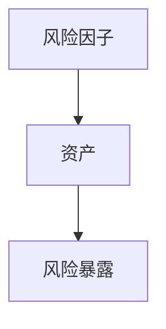
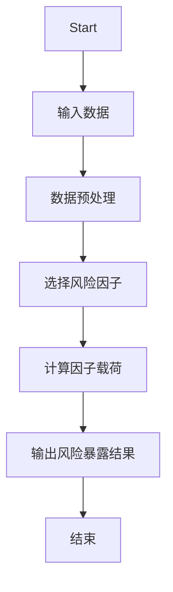
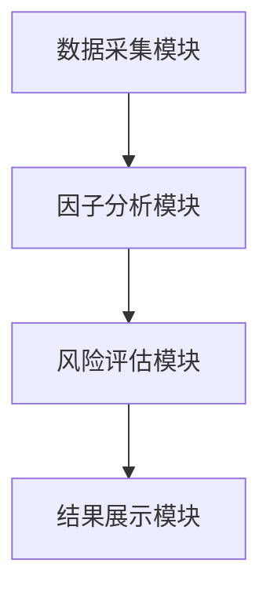
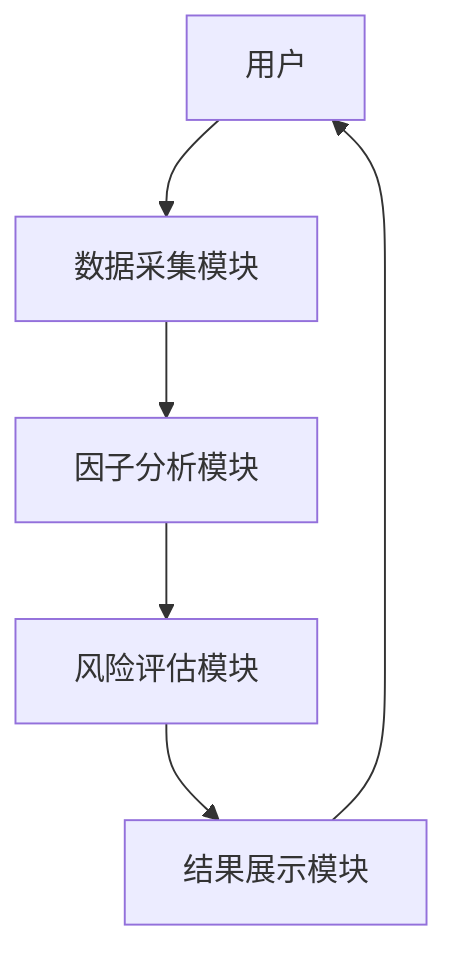

                 


# 金融市场风险因子暴露分析工具

## 关键词：金融市场、风险因子、暴露分析、金融工具、风险管理

## 摘要：金融市场风险因子暴露分析工具是一种用于识别和量化金融资产在不同风险因子上的暴露程度的工具。本文详细介绍了风险因子暴露分析的核心概念、算法原理、系统架构设计以及实际项目实现，帮助读者更好地理解和应用这一工具。

---

## 第一部分: 风险因子暴露分析工具概述

### 第1章: 风险因子暴露分析工具的背景与意义

#### 1.1 金融市场风险分析的背景
金融市场是一个复杂且动态变化的环境，投资者和机构需要面对各种风险，包括市场风险、信用风险、流动性风险等。这些风险可能对投资组合的价值产生重大影响，因此，如何有效识别和量化这些风险成为金融市场的重要课题。

#### 1.2 风险因子暴露分析工具的定义与特点
风险因子暴露分析工具是一种用于量化金融资产或投资组合在不同风险因子上的暴露程度的工具。其核心特点包括：
- **数据驱动**：基于历史数据和市场数据进行分析。
- **多因子模型**：考虑多个风险因子，如市值、价值、动量等。
- **动态分析**：能够实时更新和跟踪风险暴露情况。

#### 1.3 风险因子暴露分析工具的应用场景
- **机构投资者**：用于风险管理、投资组合优化和对冲策略。
- **金融监管**：帮助监管机构评估金融机构的风险暴露情况。
- **学术研究**：用于金融理论和实证研究。

---

### 第2章: 风险因子暴露分析的核心概念与联系

#### 2.1 风险因子的属性特征对比
风险因子可以分为系统性风险因子和非系统性风险因子。系统性风险因子影响整个市场，如市场整体波动；非系统性风险因子影响特定资产或行业。以下是几种常见风险因子的特征对比：

| 风险因子 | 特征描述                        |
|----------|---------------------------------|
| 市值因子 (Size) | 资产规模的大小，小盘股通常风险更高。 |
| 价值因子 (Value) | 基于市盈率、市净率等估值指标。       |
| 动量因子 (Momentum) | 过去一段时间的收益表现。             |
| 行业因子 (Industry) | 所属行业的风险特征。               |

#### 2.2 风险因子暴露的实体关系图
以下是一个简单的实体关系图（ER图），展示了风险因子、资产和风险暴露之间的关系：



#### 2.3 风险因子暴露的业务流程图
以下是风险因子暴露分析的业务流程图：



---

## 第二部分: 风险因子暴露分析的算法原理

### 第3章: 风险因子暴露分析的算法原理

#### 3.1 风险因子分析的数学模型
风险因子分析通常基于多因子模型，例如Fama-French三因子模型。模型的核心思想是将资产的超额收益归因于多个风险因子。

#### 3.2 风险因子暴露的计算公式
风险因子暴露的计算公式如下：

$$ \text{风险暴露} = \sum_{i=1}^{n} \beta_i \times Factor_i $$

其中，$\beta_i$ 是第$i$个风险因子的载荷，$Factor_i$ 是第$i$个风险因子的值。

#### 3.3 风险因子分析的算法流程图
以下是风险因子分析的算法流程图：


---

## 第三部分: 风险因子暴露分析系统的架构设计

### 第4章: 风险因子暴露分析系统的架构设计

#### 4.1 系统功能设计
风险因子暴露分析系统主要包括以下几个模块：
- **数据采集模块**：从数据库或外部接口获取金融数据。
- **因子分析模块**：计算资产的风险因子载荷。
- **风险评估模块**：根据因子载荷和风险因子值计算风险暴露。
- **结果展示模块**：以可视化的方式展示风险暴露结果。

#### 4.2 系统架构设计
以下是系统的架构图：



#### 4.3 系统接口设计
系统需要提供以下接口：
- **数据接口**：与数据库或外部API对接。
- **用户接口**：供用户输入参数和查看结果。

#### 4.4 系统交互流程图
以下是系统的交互流程图：



---

## 第四部分: 风险因子暴露分析工具的项目实战

### 第5章: 项目实战

#### 5.1 环境配置
- **编程语言**：Python
- **库的安装**：pandas、numpy、scipy、matplotlib

#### 5.2 核心实现代码
以下是风险因子分析的核心代码：

```python
import pandas as pd
import numpy as np

# 示例数据
assets = ['Asset1', 'Asset2', 'Asset3']
factors = ['Market', 'Value', 'Momentum']

# 创建因子载荷矩阵
beta = pd.DataFrame({
    'Market': [0.5, 0.7, 0.3],
    'Value': [0.2, 0.4, 0.1],
    'Momentum': [0.3, 0.2, 0.6]
})

# 计算风险暴露
risk_exposure = beta.dot(factor_values)
```

#### 5.3 案例分析
以下是一个简单的案例分析：

假设我们有三个资产，每个资产在三个风险因子上的载荷如下：

| 资产 | 市场因子载荷 | 价值因子载荷 | 动量因子载荷 |
|------|--------------|--------------|--------------|
| 资产1 | 0.5          | 0.2          | 0.3          |
| 资产2 | 0.7          | 0.4          | 0.2          |
| 资产3 | 0.3          | 0.1          | 0.6          |

假设市场因子、价值因子和动量因子的值分别为1.2、0.8和1.5。那么资产1的风险暴露为：

$$ \text{风险暴露} = 0.5 \times 1.2 + 0.2 \times 0.8 + 0.3 \times 1.5 = 0.6 + 0.16 + 0.45 = 1.21 $$

---

## 第五部分: 风险因子暴露分析工具的最佳实践

### 第6章: 最佳实践

#### 6.1 小结
风险因子暴露分析工具是一种强大的风险管理工具，能够帮助投资者和机构更好地识别和量化风险。

#### 6.2 注意事项
- 确保数据的准确性和完整性。
- 定期更新风险因子模型。
- 结合实际业务需求进行定制化开发。

#### 6.3 拓展阅读
- Fama-French三因子模型
- 主成分分析（PCA）在风险因子分析中的应用
- 金融时间序列分析

---

## 作者：AI天才研究院/AI Genius Institute & 禅与计算机程序设计艺术 /Zen And The Art of Computer Programming

---

以上是文章的完整内容，涵盖了从背景介绍、核心概念、算法原理、系统架构设计到项目实战的最佳实践。

