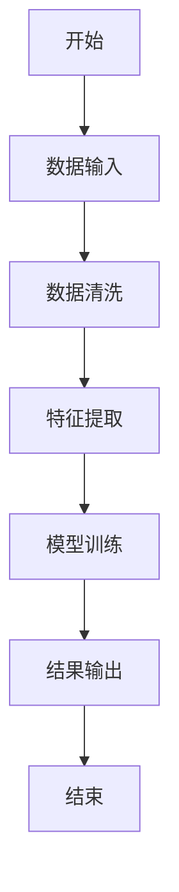
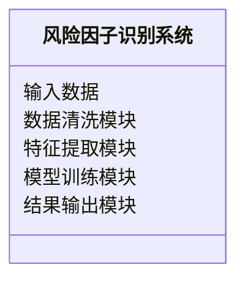

                 


# 金融市场风险因子识别系统

## 关键词：金融市场、风险因子、系统架构、算法原理、数学模型、机器学习

## 摘要：  
金融市场风险因子识别系统旨在通过技术手段识别和量化金融市场中的各类风险因子，帮助投资者和金融机构更好地理解和管理风险。本文将从系统背景、核心概念、算法原理、数学模型、系统架构、项目实战等多个维度展开，深入剖析风险因子识别系统的构建过程，探讨其实现方法和应用场景，为读者提供全面的技术解读。

---

## 第1章: 金融市场风险因子识别系统背景介绍

### 1.1 问题背景与描述
金融市场是一个复杂的系统，受到多种因素的影响，如经济指标、政策变化、市场情绪等。投资者和金融机构需要准确识别和量化这些风险因子，以制定有效的风险管理策略。然而，传统的风险管理方法往往依赖于经验判断，难以应对金融市场中高频交易和复杂数据带来的挑战。

#### 1.1.1 金融市场风险的定义与重要性
- **风险的定义**：金融市场风险是指由于市场波动、资产价格变化或其他不可预见事件导致的投资损失。
- **风险的重要性**：准确识别和量化风险是制定投资策略、优化资产配置和确保金融稳定的核心。

#### 1.1.2 风险因子识别的必要性
- 风险因子是影响资产价格的核心因素，识别这些因子可以帮助投资者更好地预测市场变化。
- 随着金融市场的复杂化，传统的定性分析方法已难以满足需求，技术驱动的风险因子识别成为必然趋势。

#### 1.1.3 当前金融市场中的主要风险类型
- **市场风险**：资产价格波动导致的损失。
- **信用风险**：债务人或交易对手违约的风险。
- **操作风险**：由于内部流程或系统故障导致的损失。
- **流动性风险**：资产难以快速变现的风险。

### 1.2 风险因子识别系统的核心概念
#### 1.2.1 风险因子的定义与分类
- **风险因子**：影响资产价格的关键变量，如市场指数、行业因子、风格因子等。
- **分类**：
  - 市场因子（如大盘走势）。
  - 行业因子（如金融、科技等）。
  - 风格因子（如市值、波动率）。
  - 非系统性因子（如公司特定事件）。

#### 1.2.2 系统的目标与功能
- **目标**：识别和量化影响金融市场的主要风险因子，构建风险评估模型。
- **功能**：
  - 数据采集与处理。
  - 风险因子提取。
  - 风险评估与预警。
  - 报告生成与可视化。

#### 1.2.3 系统的边界与外延
- **边界**：系统专注于风险因子的识别，不涉及具体的投资策略或交易执行。
- **外延**：系统输出的风险因子可作为其他金融系统的输入，如投资组合优化、风险对冲等。

### 1.3 风险因子识别系统的概念结构
#### 1.3.1 系统的核心要素组成
- 数据源：市场数据（如股票价格、指数）、经济指标、新闻数据等。
- 数据处理模块：数据清洗、特征提取。
- 模型训练模块：统计模型、机器学习模型。
- 结果输出：风险因子列表、风险评估报告。

#### 1.3.2 系统的逻辑架构
- 数据输入 → 数据清洗 → 特征提取 → 模型训练 → 风险因子识别 → 报告生成。

#### 1.3.3 系统的关键性能指标
- 数据处理速度：系统能否实时处理高频数据。
- 模型准确性：风险因子识别的准确率和稳定性。
- 可扩展性：系统能否适应数据量的增加和新因子的引入。

---

## 第2章: 风险因子识别系统的核心概念与联系

### 2.1 核心概念原理
#### 2.1.1 风险因子的识别方法
- **统计学方法**：如主成分分析（PCA）。
- **机器学习方法**：如随机森林、支持向量机（SVM）。
- **深度学习方法**：如长短时记忆网络（LSTM）。

#### 2.1.2 系统的输入与输出
- **输入**：市场数据、经济指标、新闻数据等。
- **输出**：风险因子列表、风险评估结果、预警信息。

#### 2.1.3 系统的关键算法
- 线性回归：用于分析因子与资产收益之间的线性关系。
- 聚类分析：用于识别具有相似特征的因子。
- 稀疏性方法：用于降维和特征选择。

### 2.2 核心概念属性特征对比
#### 2.2.1 风险因子的特征分析
| 特征维度 | 市场因子 | 行业因子 | 风格因子 |
|----------|----------|----------|----------|
| 时间依赖性 | 高       | 中       | 中       |
| 波动性     | 高       | 中       | 高       |
| 可解释性   | 高       | 中       | 低       |

#### 2.2.2 不同风险因子的对比
- 市场因子：如大盘指数，影响所有资产。
- 行业因子：如科技行业，影响特定行业内的资产。
- 风格因子：如小盘股，影响特定风格的资产。

#### 2.2.3 系统功能的对比分析
- 数据处理模块：核心功能是数据清洗和特征提取。
- 模型训练模块：核心功能是因子识别和风险评估。

### 2.3 实体关系图架构


---

## 第3章: 风险因子识别系统的算法原理

### 3.1 算法原理概述
#### 3.1.1 统计学方法
- **主成分分析（PCA）**：用于降维和提取主要风险因子。
- **多元回归分析**：用于分析因子与资产收益之间的关系。

#### 3.1.2 机器学习方法
- **随机森林**：用于特征重要性分析。
- **支持向量机（SVM）**：用于分类和回归分析。

#### 3.1.3 深度学习方法
- **LSTM**：用于时间序列分析和预测。

### 3.2 算法实现流程
#### 3.2.1 数据预处理
- 数据清洗：去除缺失值和异常值。
- 标准化：将数据标准化到同一范围。

#### 3.2.2 特征提取
- 使用PCA提取主成分。

#### 3.2.3 模型训练
- 训练随机森林模型，提取特征重要性。

#### 3.2.4 结果分析
- 通过特征重要性排序，确定主要风险因子。

### 3.3 算法流程图


---

## 第4章: 风险因子识别系统的数学模型与公式

### 4.1 时间序列分析
#### 4.1.1 ARIMA模型
$$ ARIMA(p, d, q) $$
- p：自回归阶数。
- d：差分阶数。
- q：移动平均阶数。

#### 4.1.2 GARCH模型
$$ GARCH(p, q) $$
- p：自回归阶数。
- q：移动平均阶数。

### 4.2 多元回归分析
#### 4.2.1 线性回归模型
$$ y = \beta_0 + \beta_1x_1 + ... + \beta_nx_n + \epsilon $$

#### 4.2.2 逐步回归法
$$ R^2 = \frac{SSR}{SST} $$

### 4.3 机器学习模型
#### 4.3.1 支持向量机
$$ \text{最大化} \quad \frac{1}{\|w\|^2} $$

#### 4.3.2 随机森林
$$ \text{特征重要性} = \sum_{i=1}^{n} (impurity\_decrease) $$

---

## 第5章: 风险因子识别系统的系统分析与架构设计

### 5.1 系统功能设计
#### 5.1.1 领域模型


### 5.2 系统架构设计
#### 5.2.1 分层架构
- 数据层：存储原始数据和清洗后的数据。
- 逻辑层：实现数据处理和模型训练。
- 展示层：展示风险因子识别结果和报告。

#### 5.2.2 系统架构图


---

## 第6章: 项目实战

### 6.1 环境安装
- **Python版本**：3.8及以上。
- **依赖库安装**：`pandas`, `numpy`, `scikit-learn`, `matplotlib`。

### 6.2 核心代码实现
#### 6.2.1 数据清洗模块
```python
import pandas as pd
import numpy as np

# 读取数据
data = pd.read_csv('market_data.csv')

# 去除缺失值
data = data.dropna()

# 标准化处理
from sklearn.preprocessing import StandardScaler
scaler = StandardScaler()
data_scaled = scaler.fit_transform(data)
```

#### 6.2.2 模型训练模块
```python
from sklearn.ensemble import RandomForestRegressor

# 训练模型
model = RandomForestRegressor()
model.fit(data_scaled, target)

# 提取特征重要性
importances = model.feature_importances_
```

### 6.3 实际案例分析
#### 6.3.1 案例描述
分析某段时间内科技行业的风险因子。

#### 6.3.2 案例实现
```python
# 数据预处理
data = pd.read_csv('tech_sector.csv')
data_cleaned = data.dropna()

# 特征提取
from sklearn.decomposition import PCA
pca = PCA(n_components=5)
principal_components = pca.fit_transform(data_cleaned)

# 模型训练
model = RandomForestRegressor()
model.fit(principal_components, target)
```

### 6.4 结果解读与分析
通过特征重要性分析，识别出科技行业的主要风险因子，如市值波动、技术创新等。

---

## 第7章: 总结与展望

### 7.1 总结
本文详细介绍了金融市场风险因子识别系统的构建过程，从背景到实现，从理论到实践，全面阐述了系统的各个部分。

### 7.2 注意事项
- 数据质量：确保数据的完整性和准确性。
- 模型调优：根据实际需求调整模型参数。
- 风险管理：结合系统输出制定有效的风险管理策略。

### 7.3 拓展阅读
- 《Python机器学习实战》
- 《时间序列分析与应用》
- 《金融市场风险管理》

---

## 作者：AI天才研究院/AI Genius Institute & 禅与计算机程序设计艺术 /Zen And The Art of Computer Programming

