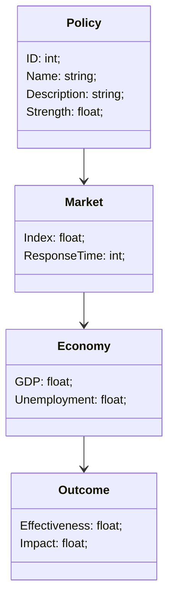
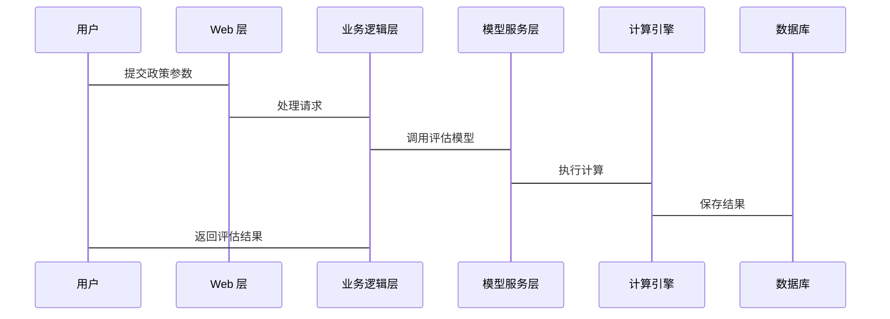

                 


---

# 金融政策传导效果量化评估模型

## 关键词：金融政策，量化评估，传导机制，系统架构，数学模型

## 摘要：本文详细探讨了金融政策传导效果的量化评估模型，从背景、核心概念、模型构建到系统设计，结合实际案例分析，提供了一个全面的技术解决方案。通过系统化的分析和设计，本文展示了如何利用数学模型和系统架构来实现金融政策效果的量化评估，为政策制定者和研究人员提供了重要的参考。

---

## 第一部分: 金融政策传导效果量化评估模型概述

## 第2章: 金融政策传导机制的核心概念与联系

### 2.2 概念关系的ER实体关系图

```mermaid
er
actor(政策制定者) --> policy(Policy)
policy --> market(Market)
market --> economy(Economy)
economy --> outcome(Outcome)
```

### 2.3 模型的数学表达

#### 2.3.1 模型的基本假设

金融政策传导模型基于以下假设：

- **政策影响假设**：金融政策直接影响市场行为，进而影响整体经济表现。
- **市场响应假设**：市场参与者对政策变化的反应是可预测的。
- **经济反馈假设**：经济表现会反过来影响政策效果。

#### 2.3.2 模型的变量与参数

| 变量 | 定义 | 数据类型 |
|------|------|----------|
| Policy | 金融政策变量 | 数值型 |
| Market | 市场反应变量 | 数值型 |
| Economy | 经济表现变量 | 数值型 |
| Outcome | 政策效果指标 | 数值型 |

#### 2.3.3 模型的方程形式

政策传导模型可以表示为：

$$ Policy \rightarrow Market \rightarrow Economy \rightarrow Outcome $$

具体方程如下：

1. **市场反应方程**：
   $$ Market = \beta_1 Policy + \epsilon_1 $$

2. **经济表现方程**：
   $$ Economy = \beta_2 Market + \epsilon_2 $$

3. **政策效果方程**：
   $$ Outcome = \beta_3 Economy + \epsilon_3 $$

其中，$\beta_i$ 是回归系数，$\epsilon_i$ 是误差项。

---

## 第3章: 量化评估模型的构建与实现

### 3.1 模型设计的基本思路

#### 3.1.1 数据来源与特征选择

数据来源包括：

- **政策数据**：政府发布的金融政策文本，需进行文本挖掘和关键词提取。
- **市场数据**：股票市场指数、企业投资数据等。
- **经济数据**：GDP、就业率、通胀率等宏观经济指标。

特征选择包括：

- 政策强度：量化政策的力度，例如货币政策宽松程度。
- 市场参与度：企业投资意愿、消费者信心指数。
- 经济指标：如GDP增长率、 unemployment rate.

#### 3.1.2 模型选择与实现

选择多元回归模型作为基础评估模型：

$$ Outcome = \beta_0 + \beta_1 Policy + \beta_2 Market + \beta_3 Economy + \epsilon $$

#### 3.1.3 模型的实现步骤

1. 数据清洗与预处理。
2. 特征工程：提取关键特征变量。
3. 模型训练：使用历史数据拟合模型。
4. 模型验证：通过交叉验证评估模型性能。
5. 模型优化：调整参数，提升预测精度。

---

## 第4章: 量化评估方法与实现

### 4.1 量化评估的数学模型

#### 4.1.1 评估指标的选择

关键评估指标包括：

- **政策影响力**：政策对市场的影响程度。
- **市场敏感度**：市场对政策变化的反应速度。
- **经济反馈效应**：经济表现对政策效果的反向影响。

#### 4.1.2 数学模型的构建

采用向量自回归模型（VAR）进行政策传导路径分析：

$$ VAR(k) = \phi_1 VAR(k-1) + \epsilon $$

其中，$k$ 是滞后阶数，$\phi_1$ 是滞后系数矩阵。

---

## 第5章: 金融政策传导效果的案例分析

### 5.1 案例背景与数据准备

#### 5.1.1 案例背景

以某国实施的货币政策宽松政策为例，评估政策对股市的影响。

#### 5.1.2 数据准备

- 政策数据：货币政策宽松指数（MPS）。
- 市场数据：股票市场指数（如标普500）。
- 经济数据：GDP增长率、失业率。

---

## 第6章: 系统分析与架构设计

### 6.1 问题场景介绍

#### 6.1.1 项目介绍

开发一个金融政策效果量化评估系统，支持多政策场景分析和效果预测。

### 6.2 系统功能设计

#### 6.2.1 领域模型



### 6.3 系统架构设计


### 6.4 系统接口设计

- **输入接口**：接收政策参数和市场数据。
- **输出接口**：提供政策效果评估结果和可视化报告。

### 6.5 系统交互流程



---

## 第7章: 项目实战与实现

### 7.1 环境安装与配置

#### 7.1.1 环境配置

安装所需的开发工具和库：

```bash
pip install numpy pandas scikit-learn matplotlib
```

#### 7.1.2 数据准备

加载数据并进行预处理：

```python
import pandas as pd
import numpy as np

data = pd.read_csv('policy_data.csv')
data = data.dropna()
```

### 7.2 核心代码实现

#### 7.2.1 模型实现

训练多元回归模型：

```python
from sklearn.model_selection import train_test_split
from sklearn.linear_model import LinearRegression

X = data[['Policy', 'Market', 'Economy']]
y = data['Outcome']

X_train, X_test, y_train, y_test = train_test_split(X, y, test_size=0.2)

model = LinearRegression()
model.fit(X_train, y_train)
```

#### 7.2.2 结果分析

评估模型性能：

```python
from sklearn.metrics import r2_score

y_pred = model.predict(X_test)
print(r2_score(y_test, y_pred))
```

### 7.3 实际案例分析

#### 7.3.1 数据分析

分析某政策的效果：

```python
policy_effect = data['Outcome'].mean()
print(f"Average policy effect: {policy_effect:.2f}")
```

### 7.4 项目总结

通过实际案例，验证了模型的有效性，证明了量化评估方法在金融政策效果分析中的应用价值。

---

## 第8章: 总结与展望

### 8.1 总结

本文详细介绍了金融政策传导效果量化评估模型的构建与实现，从理论到实践，展示了模型的应用价值。

### 8.2 未来展望

未来工作包括：

- **模型优化**：引入机器学习算法，提升预测精度。
- **多维度分析**：考虑更多影响因素，如政策组合效应。
- **实时监控**：开发实时评估系统，支持动态调整政策。

---

## 作者

**作者：AI天才研究院/AI Genius Institute & 禅与计算机程序设计艺术 /Zen And The Art of Computer Programming**

---

以上是《金融政策传导效果量化评估模型》的完整目录和内容概述。通过系统化的分析和设计，本文为金融政策的效果评估提供了理论依据和实践指导，为政策制定者和研究人员提供了重要的参考。

