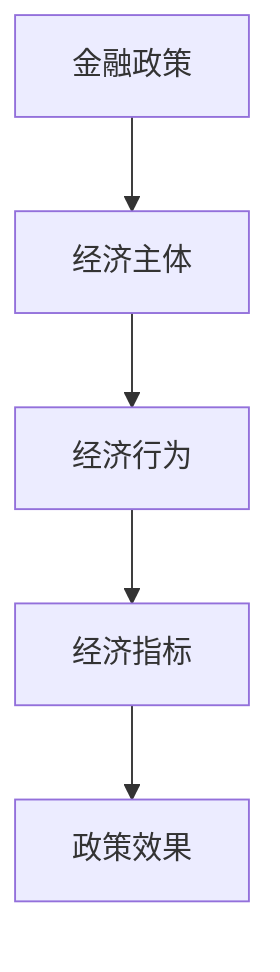
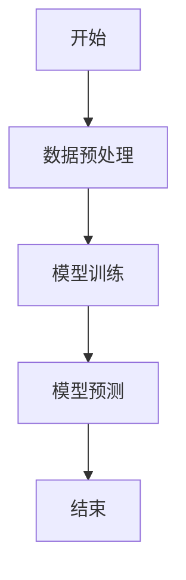
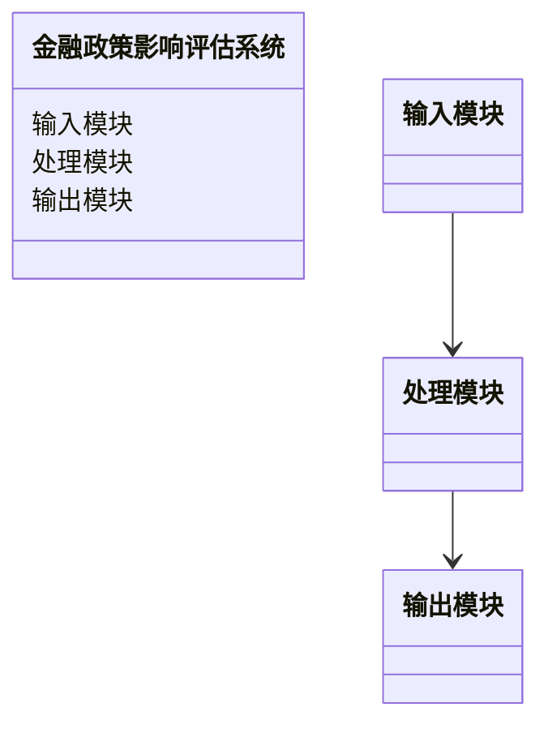
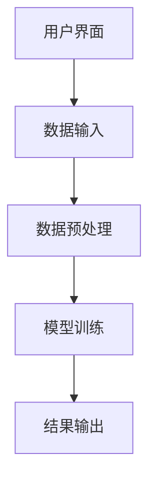
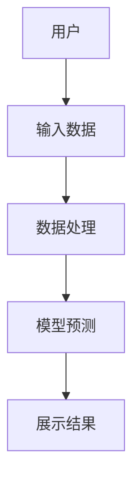

                 


# 金融政策影响评估模型

## 关键词：金融政策，影响评估，模型构建，算法原理，系统架构，项目实战

## 摘要：本文系统介绍了金融政策影响评估模型的构建方法，从背景概述、核心概念、算法原理到系统架构和项目实战，详细阐述了模型的设计思路和实现过程，帮助读者理解如何利用技术手段评估金融政策的经济影响。

---

## 第一部分: 金融政策影响评估模型概述

### 第1章: 金融政策与影响评估概述

#### 1.1 金融政策的基本概念
##### 1.1.1 金融政策的定义与分类
金融政策是指政府或中央银行为实现特定经济目标而制定的货币政策和财政政策。货币政策主要包括调整利率、货币供应量和汇率等工具，而财政政策则包括政府支出和税收调整。金融政策的分类通常包括扩张性政策、紧缩性政策和中性政策。

##### 1.1.2 金融政策的实施主体与目标
金融政策的主要实施主体是中央银行和政府。货币政策通常由中央银行通过调整基准利率和货币供应量来实施，而财政政策则由政府通过调整税收和支出进行。金融政策的主要目标包括控制通货膨胀、促进经济增长、保持就业和平衡国际收支等。

##### 1.1.3 金融政策与经济发展的关系
金融政策对经济发展具有重要影响。扩张性政策可以刺激经济增长，而紧缩性政策可以抑制通货膨胀。合理的金融政策有助于实现经济稳定和可持续发展，而错误的政策选择可能导致经济波动。

#### 1.2 影响评估的基本概念
##### 1.2.1 影响评估的定义与范围
影响评估是对金融政策实施后可能产生的经济和社会影响进行预测和分析的过程。其范围包括对GDP、就业、通货膨胀、投资等多个经济指标的影响。

##### 1.2.2 金融政策对经济、社会、环境的影响
金融政策不仅影响经济指标，还可能对社会福利和环境产生影响。例如，宽松的货币政策可能刺激投资和消费，但也可能导致资产泡沫和通货膨胀。

##### 1.2.3 影响评估的必要性与重要性
影响评估是制定科学金融政策的重要工具。通过评估，决策者可以预测政策效果，优化政策组合，避免负面效应。

#### 1.3 金融政策影响评估模型的基本框架
##### 1.3.1 模型的基本构成要素
模型通常包括输入模块、处理模块和输出模块。输入模块包括金融政策变量和经济指标，处理模块包括数据预处理和模型训练，输出模块则生成评估结果。

##### 1.3.2 模型的输入、处理、输出模块
- **输入模块**：包括政策变量（如利率、货币供应量）和经济指标（如GDP、通货膨胀率）。
- **处理模块**：包括数据预处理、模型训练和参数调整。
- **输出模块**：生成评估结果，如政策对GDP的影响预测。

##### 1.3.3 模型的假设与限制条件
模型假设经济变量之间的线性关系，且数据具有一定的平稳性。限制条件包括模型无法预测突发事件的影响和数据获取的局限性。

### 第2章: 金融政策影响评估的核心概念与联系

#### 2.1 核心概念原理
##### 2.1.1 金融政策的传导机制
金融政策通过影响利率、信贷和货币供应量，进而影响投资、消费和产出。货币政策传导机制包括利率渠道、信贷渠道和资产价格渠道。

##### 2.1.2 经济变量的相互关系
经济变量如GDP、通货膨胀率和失业率之间存在相互影响。例如，低失业率通常伴随着较高的通货膨胀率。

##### 2.1.3 模型的数学表达式
模型通常采用线性回归的形式，如：
$$ GDP = \beta_0 + \beta_1 \times 利率 + \beta_2 \times 通胀率 + \epsilon $$

#### 2.2 核心概念属性特征对比表格
| 概念         | 特征               |
|--------------|--------------------|
| 货币政策工具   | 利率、货币供应量   |
| 经济指标       | GDP、通胀率、失业率 |
| 模型参数       | 回归系数、误差项   |

#### 2.3 ER实体关系图架构


### 第3章: 金融政策影响评估模型的算法原理

#### 3.1 算法原理概述
##### 3.1.1 模型的输入变量与输出变量
输入变量包括政策变量和经济指标，输出变量是政策对经济指标的影响预测。

##### 3.1.2 模型的假设条件
假设经济变量服从线性关系，数据具有平稳性。

##### 3.1.3 模型的数学表达式
线性回归模型：
$$ y = \beta_0 + \beta_1 x_1 + \beta_2 x_2 + \epsilon $$

#### 3.2 算法流程图


#### 3.3 算法实现
```python
# 数据预处理
import pandas as pd
import numpy as np
from sklearn.linear_model import LinearRegression

data = pd.read_csv('economic_data.csv')
X = data[['利率', '通胀率']]
y = data['GDP']

# 模型训练
model = LinearRegression()
model.fit(X, y)

# 模型预测
new_policy = np.array([[5, 2]])
prediction = model.predict(new_policy)
print("预测的GDP增长率为：", prediction[0])
```

---

## 第二部分: 系统分析与架构设计

### 第4章: 系统架构与实现

#### 4.1 项目背景
本项目旨在开发一个能够评估金融政策对经济影响的系统，帮助决策者优化政策选择。

#### 4.2 领域模型设计


#### 4.3 系统架构设计


#### 4.4 接口设计与交互


---

## 第三部分: 项目实战

### 第5章: 项目实战

#### 5.1 环境安装
需要安装Python、Pandas、NumPy和Scikit-learn库。

#### 5.2 核心实现
```python
import pandas as pd
from sklearn.linear_model import LinearRegression

# 数据预处理
data = pd.read_csv('economic_data.csv')
X = data[['利率', '通胀率']]
y = data['GDP']

# 模型训练
model = LinearRegression()
model.fit(X, y)

# 案例分析：评估货币政策对GDP的影响
new_policy = [[5, 2]]
prediction = model.predict(new_policy)
print("预测的GDP增长率为：", prediction[0])
```

#### 5.3 数据分析与结果解读
通过实际案例分析，展示模型预测结果，并解释其经济含义。

#### 5.4 项目小结
总结项目实施过程，讨论模型的优缺点，并提出改进建议。

---

## 总结与展望

### 第6章: 总结与展望

#### 6.1 总结
本文详细介绍了金融政策影响评估模型的构建方法，包括背景概述、核心概念、算法原理、系统架构和项目实战。

#### 6.2 展望
未来可以结合机器学习和大数据分析，提升模型的预测精度和适用性，更好地支持政策制定。

---

## 作者：AI天才研究院/AI Genius Institute & 禅与计算机程序设计艺术 /Zen And The Art of Computer Programming

---

通过本文，读者可以全面了解金融政策影响评估模型的构建与应用，掌握其技术实现的核心方法，并能够在实际项目中灵活运用。

