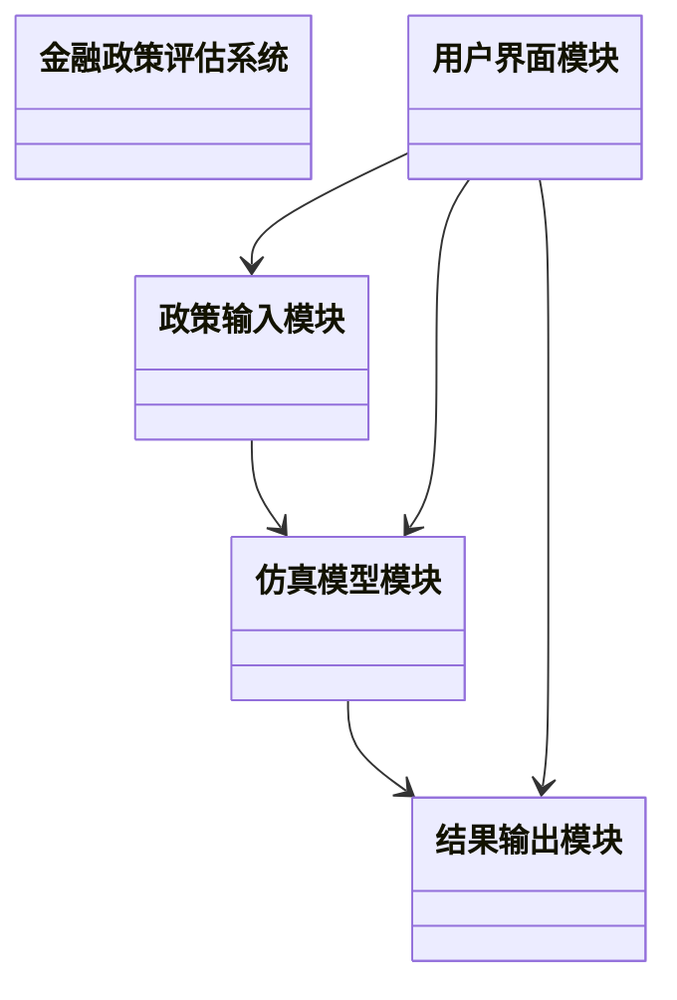
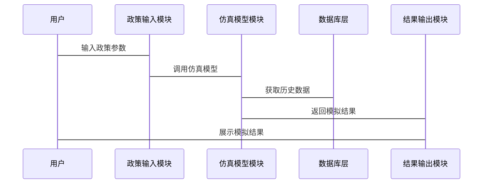

                 


# 《金融政策效果评估仿真平台》

> **关键词**：金融政策，效果评估，仿真平台，算法原理，系统架构

> **摘要**：本文旨在探讨金融政策效果评估仿真平台的设计与实现，从背景与概念、算法原理、系统架构到项目实战，全面解析如何构建一个高效的金融政策效果评估系统。通过理论与实践结合，为读者提供从理解到实现的完整指南。

---

## 第一部分：金融政策效果评估仿真平台概述

### 第1章：金融政策效果评估的背景与意义

#### 1.1 金融政策的基本概念

- **金融政策的定义**：金融政策是指政府或相关机构为实现特定经济目标而制定的货币政策、财政政策等措施。
- **金融政策的分类**：
  - 货币政策：如利率调整、货币发行等。
  - 财政政策：如税收调整、政府支出等。
- **金融政策的作用**：
  - 稳定经济：通过调节货币供应量和利率，控制通货膨胀或通货紧缩。
  - 促进增长：通过降低融资成本，鼓励投资和消费。
  - 调节市场：通过政策工具干预金融市场，维护市场稳定。

#### 1.2 仿真平台的基本概念

- **仿真平台的定义**：仿真平台是一种通过模拟实际系统运行，预测其行为和结果的工具或系统。
- **仿真平台的特点**：
  - 虚拟性：在虚拟环境中模拟真实系统的运行。
  - 可控性：用户可以调整输入参数，观察系统反应。
  - 可视化：通过图形界面展示系统运行状态和结果。
- **仿真平台的应用领域**：
  - 金融：评估政策效果、风险管理。
  - 工程：模拟设备运行、优化生产流程。
  - 医疗：模拟手术过程、疾病传播。

---

## 第二部分：金融政策效果评估的核心概念与联系

### 第2章：金融政策效果评估的核心概念

#### 2.1 金融政策效果评估的理论基础

- **经济学基础理论**：
  - 供需理论：解释市场中商品和服务的供给与需求关系。
  - 边际效用理论：分析政策对个体效用的影响。
- **金融学基础理论**：
  - 资本资产定价模型（CAPM）：评估资产的风险和收益。
  - 市场流动性理论：分析政策对市场流动性的冲击。
- **政策评估的基本方法**：
  - 定量分析：通过数据和模型预测政策效果。
  - 定性分析：通过专家判断和案例研究评估政策效果。

#### 2.2 仿真平台的构建原理

- **仿真模型的构建方法**：
  - 系统建模：将实际系统抽象为数学模型。
  - 参数设定：根据历史数据或专家意见设定模型参数。
  - 模拟运行：通过算法模拟系统在不同条件下的运行结果。
- **仿真平台的运行机制**：
  - 输入参数：用户输入政策参数和初始条件。
  - 模型计算：模型根据输入参数运行，计算系统在不同时间点的状态。
  - 结果输出：展示模拟结果，如经济指标的变化趋势。

#### 2.3 核心概念的联系与对比

- **核心概念的属性特征对比**（表格形式）：

| 概念 | 定义 | 特性 | 应用 |
|------|------|------|------|
| 金融政策 | 政府为实现特定经济目标而制定的政策 | 虚拟性、可调整性 | 支持经济增长、稳定金融市场 |
| 仿真平台 | 模拟实际系统运行的工具 | 可视化、可控性 | 评估政策效果、优化系统设计 |

- **ER实体关系图架构**（Mermaid流程图）：

```mermaid
erd
  章节1.1.1
    章节1.1.2
      章节1.1.3
  章节1.2.1
    章节1.2.2
      章节1.2.3
```

---

## 第三部分：金融政策效果评估的算法原理

### 第3章：金融政策效果评估的算法原理

#### 3.1 金融政策效果评估的基本算法

- **蒙特卡洛模拟**：
  - **定义**：通过多次随机采样，模拟系统在不同条件下的运行结果。
  - **应用场景**：评估政策效果时，考虑多种不确定因素的影响。
  - **算法步骤**：
    1. 确定输入参数的分布。
    2. 随机采样生成参数值。
    3. 计算系统在不同参数下的运行结果。
    4. 统计结果，分析政策效果。

- **回归分析**：
  - **定义**：通过建立变量之间的回归关系，预测系统在不同条件下的行为。
  - **应用场景**：分析政策变量对经济指标的影响。
  - **数学模型**：
    $$y = \beta_0 + \beta_1x + \epsilon$$
    其中，$y$为因变量，$x$为自变量，$\beta_0$和$\beta_1$为回归系数，$\epsilon$为误差项。

- **时间序列分析**：
  - **定义**：通过分析历史数据，预测系统未来的运行状态。
  - **应用场景**：评估政策效果时，分析经济指标的时间变化趋势。
  - **数学模型**：
    $$ARIMA(p, d, q)$$
    其中，$p$为自回归阶数，$d$为差分阶数，$q$为移动平均阶数。

#### 3.2 算法实现的步骤与流程

- **蒙特卡洛模拟的实现流程**（Mermaid流程图）：

```mermaid
graph TD
    A[开始] -> B[设定输入参数分布]
    B -> C[随机采样生成参数值]
    C -> D[计算系统运行结果]
    D -> E[统计结果]
    E -> F[结束]
```

---

## 第四部分：系统分析与架构设计

### 第4章：金融政策效果评估仿真平台的系统架构

#### 4.1 项目介绍

- **项目目标**：构建一个能够评估金融政策效果的仿真平台。
- **项目范围**：涵盖货币政策、财政政策等主要金融政策的评估。
- **项目利益相关者**：政府决策者、金融机构、研究人员。

#### 4.2 系统功能设计

- **领域模型**（Mermaid类图）：



#### 4.3 系统架构设计

- **系统架构图**（Mermaid架构图）：


#### 4.4 系统接口设计

- **主要接口**：
  - 政策参数输入接口：用户输入政策参数。
  - 模型调用接口：调用仿真模型进行计算。
  - 结果展示接口：展示模拟结果。

#### 4.5 系统交互设计

- **系统交互流程**（Mermaid序列图）：



---

## 第五部分：项目实战

### 第5章：金融政策效果评估仿真平台的实现

#### 5.1 环境安装

- **安装Python环境**：使用Anaconda或PyCharm安装Python。
- **安装仿真平台依赖库**：如NumPy、Pandas、Matplotlib等。

#### 5.2 核心代码实现

- **仿真模型实现**：
  ```python
  import numpy as np
  import matplotlib.pyplot as plt

  def policy_simulation(initial_conditions, parameters):
      # 模拟过程
      results = []
      for _ in range(1000):
          # 计算每一步的结果
          results.append(calculate_result(initial_conditions, parameters))
      return results

  def calculate_result(initial_conditions, parameters):
      # 具体的计算逻辑
      return np.mean(initial_conditions) * parameters['factor']
  ```

- **结果可视化**：
  ```python
  def plot_results(results):
      plt.figure(figsize=(10, 6))
      plt.plot(results, label='Simulation Results')
      plt.xlabel('Iteration')
      plt.ylabel('Value')
      plt.legend()
      plt.show()
  ```

#### 5.3 案例分析

- **案例背景**：假设政府调整利率政策，评估其对GDP的影响。
- **案例分析步骤**：
  1. 输入初始条件：当前利率、GDP增长率等。
  2. 调用仿真模型进行模拟。
  3. 分析模拟结果，评估政策效果。

#### 5.4 项目小结

- **项目总结**：仿真平台能够有效评估金融政策效果，为决策者提供科学依据。
- **经验分享**：在实际应用中，需根据具体需求调整模型参数和算法。

---

## 第六部分：最佳实践与注意事项

### 第6章：最佳实践与注意事项

#### 6.1 小结

- **核心要点**：仿真平台是金融政策评估的重要工具，需结合理论与实践。
- **关键收获**：理解金融政策、仿真平台的基本概念，掌握核心算法，熟悉系统架构设计。

#### 6.2 注意事项

- **数据质量**：确保输入数据的准确性和完整性。
- **模型选择**：根据具体需求选择合适的仿真算法。
- **结果验证**：通过多次模拟和对比分析，验证结果的可靠性。

#### 6.3 拓展阅读

- 推荐书籍：《金融工程》、《系统仿真技术》。
- 推荐课程：在线平台上的相关课程，如Coursera上的《金融政策分析》。

---

## 作者

作者：AI天才研究院/AI Genius Institute & 禅与计算机程序设计艺术/Zen And The Art of Computer Programming

---

以上为《金融政策效果评估仿真平台》的技术博客文章的完整大纲，涵盖了从背景到实现的各个方面，旨在为读者提供一个系统性的指导。

