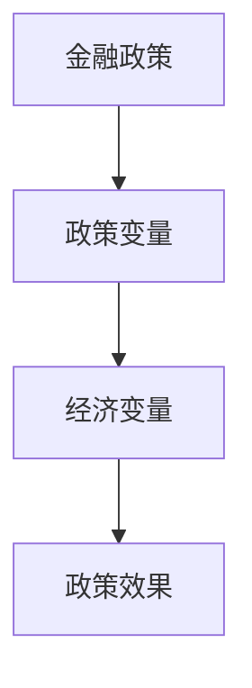
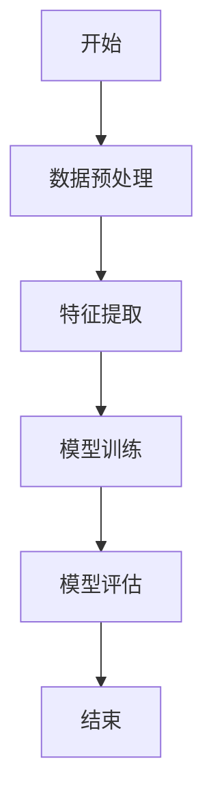
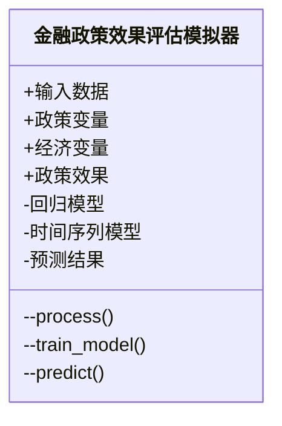
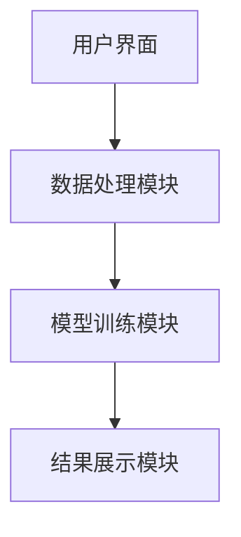
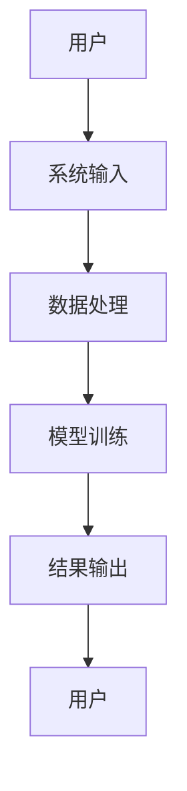

                 


# 金融政策效果评估模拟器

## 关键词：金融政策、效果评估、模拟器、算法、系统架构、项目实战

## 摘要：本文系统地介绍了金融政策效果评估模拟器的设计与实现。从金融政策的背景与意义出发，详细讲解了核心概念、算法原理、系统架构，并通过项目实战和案例分析展示了模拟器的应用价值。本文旨在为金融领域的研究人员和实践者提供一个全面的技术参考，帮助他们更好地评估和优化金融政策效果。

---

# 第一部分: 金融政策效果评估模拟器概述

## 第1章: 金融政策效果评估的背景与意义

### 1.1 金融政策的基本概念

#### 1.1.1 金融政策的定义与分类

金融政策是指政府或金融机构为实现特定经济目标而制定的规则和措施。常见的金融政策包括货币政策、财政政策、外汇政策等。这些政策可以通过调整利率、货币供应量、税收等手段影响经济运行。

#### 1.1.2 金融政策的目标与作用机制

金融政策的主要目标包括稳定经济、促进经济增长、调节通货膨胀等。政策的作用机制通常涉及市场参与者的预期和行为变化，例如，降低利率可以刺激借贷和投资。

#### 1.1.3 金融政策在经济中的地位与影响

金融政策是宏观调控的重要工具，对经济运行具有深远影响。例如，宽松的货币政策可以缓解企业融资难问题，而紧缩的货币政策则可能抑制通货膨胀。

### 1.2 金融政策效果评估的重要性

#### 1.2.1 金融政策效果评估的必要性

金融政策的效果往往受到多种因素的影响，直接观察和测量其影响较为困难。因此，建立一个模拟器来评估政策效果显得尤为重要。

#### 1.2.2 金融政策效果评估的挑战与难点

政策效果的不确定性、数据的复杂性以及模型的简化假设是评估过程中的主要挑战。例如，政策实施后可能产生滞后效应，难以在短期内观察到效果。

#### 1.2.3 金融政策效果评估的现实意义

有效的政策评估可以帮助政府优化政策设计，提高政策实施的效果，促进经济的健康发展。

### 1.3 金融政策效果评估模拟器的概念与特点

#### 1.3.1 金融政策效果评估模拟器的定义

金融政策效果评估模拟器是一种基于模型和算法的工具，用于模拟不同金融政策实施后的经济效果。

#### 1.3.2 模拟器的核心功能与优势

模拟器可以快速生成政策实施后的经济指标变化，帮助决策者进行政策优化。其优势包括高效性、可重复性和可调整性。

#### 1.3.3 模拟器的应用场景与目标用户

模拟器适用于政策制定者、经济学家、金融从业者等人群，可以在政策设计、效果预测和风险评估中发挥作用。

## 1.4 本章小结

### 1.4.1 核心概念回顾

金融政策是宏观调控的重要工具，其效果评估具有重要意义。

### 1.4.2 模拟器的定位与价值

模拟器为政策评估提供了一种高效、可靠的工具。

### 1.4.3 后续章节的框架与内容

后续章节将详细介绍模拟器的核心概念、算法原理、系统架构和实际应用。

---

## 第2章: 金融政策效果评估的核心概念与联系

### 2.1 金融政策效果评估的基本原理

#### 2.1.1 政策效果的定义与衡量标准

政策效果是指政策实施后对经济和社会产生的实际影响。衡量标准包括经济增长率、就业率、通货膨胀率等。

#### 2.1.2 政策效果的驱动因素与影响路径

驱动因素包括政策本身的设计、实施环境、市场参与者的反应等。影响路径通常涉及政策-市场-经济结果的链条。

#### 2.1.3 政策效果的量化方法与模型

常用的量化方法包括回归分析、计量经济学模型等。

### 2.2 金融政策效果评估的核心要素

#### 2.2.1 政策变量的选取与处理

政策变量包括利率、货币供应量等，需要进行标准化处理。

#### 2.2.2 经济变量的关联与分析

经济变量包括GDP、失业率等，需要分析其与政策变量的关系。

#### 2.2.3 数据来源与数据质量要求

数据来源包括政府统计机构、金融机构等，数据质量要求包括准确性、完整性和及时性。

### 2.3 核心概念的ER实体关系图



---

## 第3章: 金融政策效果评估模拟器的算法原理

### 3.1 算法原理概述

#### 3.1.1 算法的基本思路与流程

1. 数据预处理：清洗和标准化数据。
2. 特征提取：选择相关特征变量。
3. 模型训练：建立回归模型或其他模型。
4. 模型评估：验证模型的准确性。

#### 3.1.2 算法的核心思想与创新点

采用机器学习算法，结合时间序列分析，提高预测的准确性。

#### 3.1.3 算法的适用范围与局限性

适用于短期预测，长期预测效果可能较差。

### 3.2 算法的数学模型与公式

#### 3.2.1 线性回归模型

$$ y = \beta_0 + \beta_1x_1 + \beta_2x_2 + ... + \beta_nx_n + \epsilon $$

#### 3.2.2 非线性回归模型

$$ y = f(x_1, x_2, ..., x_n) $$

#### 3.2.3 时间序列分析模型

$$ ARIMA(p, d, q) $$

### 3.3 算法的实现步骤与流程图



### 3.4 算法的Python实现示例

#### 3.4.1 数据加载与处理

```python
import pandas as pd
data = pd.read_csv('data.csv')
```

#### 3.4.2 模型训练与评估

```python
from sklearn.linear_model import LinearRegression
model = LinearRegression()
model.fit(X_train, y_train)
score = model.score(X_test, y_test)
print("模型得分：", score)
```

---

## 第4章: 金融政策效果评估模拟器的系统架构设计

### 4.1 系统功能设计

#### 4.1.1 领域模型



#### 4.1.2 系统架构设计



#### 4.1.3 系统接口设计

接口包括数据输入接口、模型选择接口和结果输出接口。

#### 4.1.4 系统交互设计



---

## 第5章: 金融政策效果评估模拟器的项目实战

### 5.1 环境安装与配置

安装Python、Pandas、Scikit-learn等库。

### 5.2 系统核心实现源代码

```python
import pandas as pd
from sklearn.linear_model import LinearRegression

# 加载数据
data = pd.read_csv('data.csv')

# 特征选择
X = data[['interest_rate', 'gdp_growth']]
y = data['policy_effect']

# 数据分割
from sklearn.model_selection import train_test_split
X_train, X_test, y_train, y_test = train_test_split(X, y, test_size=0.2, random_state=42)

# 模型训练
model = LinearRegression()
model.fit(X_train, y_train)

# 模型预测
y_pred = model.predict(X_test)

# 模型评估
score = model.score(X_test, y_test)
print("模型得分：", score)
```

### 5.3 代码应用解读与分析

通过代码实现模拟器的核心功能，包括数据加载、特征选择、模型训练和预测。

### 5.4 实际案例分析

以某国的货币政策为例，模拟政策实施后的效果。

---

## 第6章: 金融政策效果评估模拟器的实际案例分析

### 6.1 案例背景介绍

选择一个具体的金融政策，例如降低基准利率。

### 6.2 数据准备与分析

收集相关数据，包括利率、GDP增长率、失业率等。

### 6.3 模拟器运行与结果解读

运行模拟器，观察预测结果，分析政策效果。

### 6.4 政策优化建议

根据模拟结果，提出优化政策的建议。

---

## 第7章: 金融政策效果评估模拟器的总结与注意事项

### 7.1 本章小结

总结模拟器的核心功能和实际应用价值。

### 7.2 注意事项与最佳实践

1. 数据质量是关键，确保数据准确性和完整性。
2. 模型选择要根据具体情况，避免过度拟合。
3. 结果解读要结合实际经济情况，避免片面结论。

### 7.3 拓展阅读与学习资源

推荐相关书籍和论文，供读者深入学习。

---

## 作者：AI天才研究院/AI Genius Institute & 禅与计算机程序设计艺术 /Zen And The Art of Computer Programming

---

以上是《金融政策效果评估模拟器》的技术博客文章的详细目录和内容框架，涵盖了从背景到实战的各个方面，适合技术研究人员和金融从业者阅读和参考。

