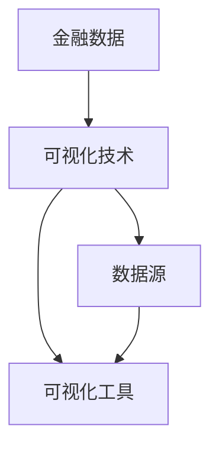
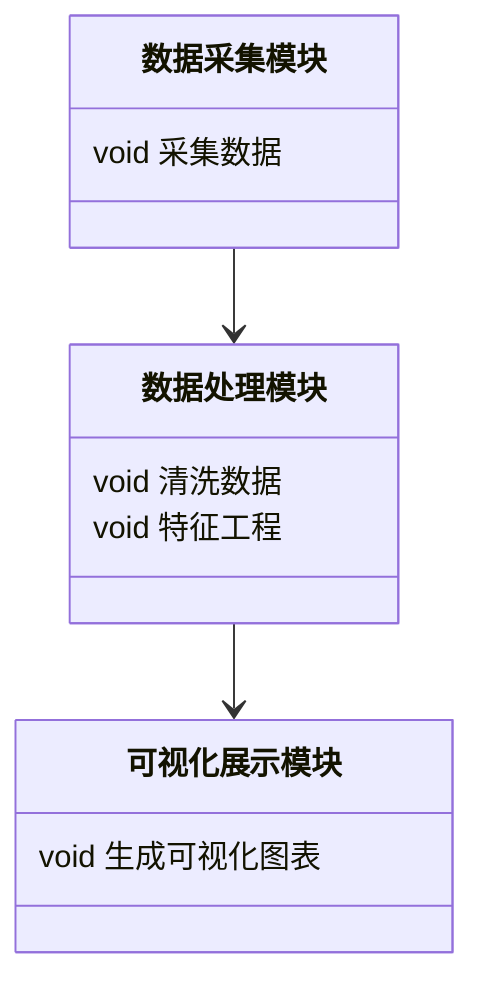
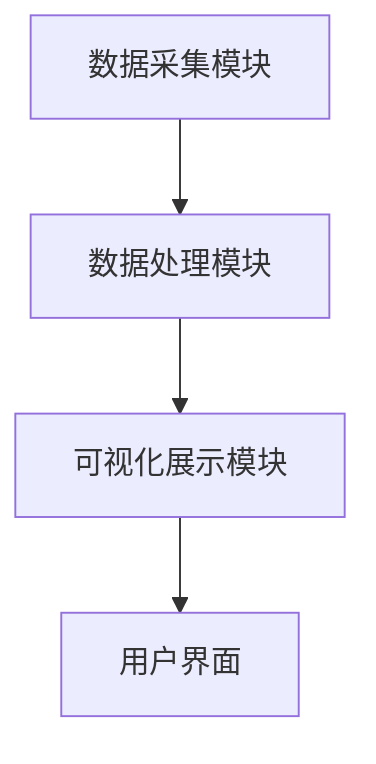
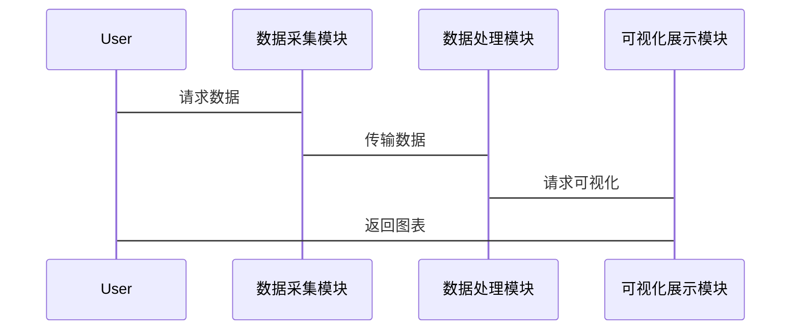

                 


# 《金融数据可视化技术应用》

> **关键词**: 金融数据可视化, 数据分析, 数据清洗, 特征工程, 数据可视化算法, 系统架构设计, 项目实战

> **摘要**:  
> 本文系统地探讨了金融数据可视化技术的应用与实践，从数据预处理、算法原理、系统架构到项目实战，深入分析了金融数据可视化的关键环节。通过具体案例，本文展示了如何利用数据清洗、特征工程、可视化算法等技术手段，将复杂的金融数据转化为直观、可理解的可视化形式，为金融分析、投资决策等提供了有力支持。文章还总结了金融数据可视化领域的最佳实践、注意事项及未来发展趋势，为读者提供了全面的指导。

---

# 第1章: 金融数据可视化技术背景与应用

## 1.1 金融数据可视化的背景与意义

### 1.1.1 金融数据可视化的定义  
金融数据可视化是通过图表、图形等视觉化手段，将复杂的金融数据转化为易于理解的直观形式，以便更好地进行数据分析、决策支持和风险控制。

### 1.1.2 金融数据可视化的核心目标  
- **数据洞察**: 发现数据中的隐藏规律和趋势。  
- **决策支持**: 帮助金融从业者做出更明智的决策。  
- **风险控制**: 及时发现异常数据，降低金融风险。  

### 1.1.3 金融数据可视化的价值  
- 提高数据分析效率。  
- 帮助非专业人员理解金融数据。  
- 为金融研究提供直观支持。

## 1.2 金融数据可视化的核心概念

### 1.2.1 数据可视化技术的分类  
- **统计可视化**: 如折线图、柱状图，用于展示数据分布和趋势。  
- **机器学习可视化**: 如t-SNE，用于高维数据的降维展示。  
- **地理可视化**: 如地图热力图，用于展示地理位置相关的金融数据。

### 1.2.2 金融数据的特性与挑战  
- **高维度**: 金融数据通常包含多个特征（如价格、成交量、技术指标等）。  
- **时序性**: 金融数据具有很强的时间序列特性。  
- **波动性**: 数据波动大，容易受到市场情绪影响。  

### 1.2.3 金融数据可视化的工具与方法  
- **工具**: Matplotlib、Seaborn、Plotly、Tableau等。  
- **方法**: 数据清洗、特征工程、可视化算法。

## 1.3 本章小结  
本章介绍了金融数据可视化的背景、核心概念及其应用价值，为后续章节奠定了基础。

---

# 第2章: 金融数据可视化技术的核心概念与联系

## 2.1 核心概念原理

### 2.1.1 数据可视化技术的原理  
数据可视化通过将数据转化为图形，帮助人类更高效地理解数据。其核心在于将复杂的数据关系简化为直观的视觉形式。

### 2.1.2 金融数据分析的流程  
1. 数据采集。  
2. 数据清洗。  
3. 数据预处理。  
4. 数据分析与建模。  
5. 数据可视化与解释。

### 2.1.3 可视化与数据分析的关系  
可视化是数据分析的延伸，数据分析的结果通过可视化技术得以直观呈现，而可视化又反哺数据分析，帮助发现新的数据模式。

## 2.2 核心概念对比与联系

### 2.2.1 数据可视化技术对比表  
```markdown
| 技术 | 描述 | 优缺点 | 适用场景 |
|------|------|--------|----------|
| 折线图 | 显示数据变化趋势 | 简单直观 | 时间序列分析 |
| 条形图 | 比较数据大小 | 易于对比 | 数据分布分析 |
| 饼图 | 显示数据构成比例 | 适合展示整体与部分关系 | 成分分析 |
| 热力图 | 显示数据分布密度 | 可视化复杂数据关系 | 高维数据展示 |
```

### 2.2.2 ER实体关系图架构  


## 2.3 本章小结  
本章通过对比分析和实体关系图，展示了金融数据可视化技术的核心概念及其相互联系。

---

# 第3章: 数据清洗与特征工程

## 3.1 数据清洗的必要性

### 3.1.1 数据清洗的定义  
数据清洗是指对数据进行预处理，剔除无效数据，填充缺失值，处理异常值等，以提高数据质量。

### 3.1.2 数据清洗的步骤  
1. 检测缺失值。  
2. 处理异常值。  
3. 去重与格式统一。  

### 3.1.3 数据清洗的工具与方法  
- **工具**: Pandas、NumPy。  
- **方法**: 删除法、插值法、分组法。

## 3.2 特征工程的核心原理

### 3.2.1 特征选择的策略  
- **过滤法**: 基于统计指标（如卡方检验）选择特征。  
- **包装法**: 通过模型性能评估特征重要性。  

### 3.2.2 特征提取的方法  
- **主成分分析(PCA)**: 降维技术，提取主要特征。  
- **词袋模型**: 将文本特征转化为数值特征。  

### 3.2.3 特征工程对可视化的影响  
特征工程能够简化数据维度，提高可视化效果。

## 3.3 数据清洗与特征工程的代码实现

```python
import pandas as pd

# 数据清洗
df = pd.read_csv('financial_data.csv')
df.dropna(inplace=True)
df = df[~df['date'].isnull()]

# 特征工程
from sklearn.preprocessing import StandardScaler
scaler = StandardScaler()
df_scaled = pd.DataFrame(scaler.fit_transform(df.select_dtypes(include=['float64', 'int64'])), columns=df.columns)
```

## 3.4 本章小结  
本章通过数据清洗和特征工程，为后续的可视化分析奠定了基础。

---

# 第4章: 数据可视化算法原理与实现

## 4.1 数据可视化算法的分类

### 4.1.1 基于统计的可视化算法  
- 折线图、柱状图等，用于展示数据分布和趋势。  

### 4.1.2 基于机器学习的可视化算法  
- t-SNE、UMAP，用于高维数据的降维可视化。  

### 4.1.3 基于深度学习的可视化算法  
- 深度卷积网络生成图像，用于复杂数据的可视化。

## 4.2 PCA算法原理与实现

### 4.2.1 PCA的数学模型  
$$
\text{最大化方差} = \argmax_{u} u^T \Sigma u
$$  
其中，$\Sigma$ 是数据的协方差矩阵，$u$ 是主成分方向的单位向量。

### 4.2.2 PCA的实现步骤  
```python
from sklearn.decomposition import PCA

pca = PCA(n_components=2)
principal_components = pca.fit_transform(df_scaled)
```

## 4.3 本章小结  
本章介绍了数据可视化算法的分类，并详细讲解了PCA算法的原理与实现。

---

# 第5章: 系统架构设计与实现

## 5.1 系统功能设计

### 5.1.1 功能模块  
- 数据采集模块。  
- 数据处理模块。  
- 可视化展示模块。  

### 5.1.2 领域模型  


## 5.2 系统架构设计

### 5.2.1 系统架构  


## 5.3 系统接口设计

### 5.3.1 数据接口  
- 数据输入接口。  
- 数据输出接口。  

### 5.3.2 数据交互  
- 用户输入查询条件。  
- 系统返回可视化结果。

## 5.4 系统交互设计

### 5.4.1 交互流程  


## 5.5 本章小结  
本章通过系统架构设计，展示了金融数据可视化技术的实现流程。

---

# 第6章: 项目实战与案例分析

## 6.1 项目环境与工具安装

### 6.1.1 环境配置  
- Python 3.8+。  
- 安装依赖：`pip install matplotlib pandas scikit-learn`。

## 6.2 系统核心实现

### 6.2.1 数据清洗与预处理  
```python
import pandas as pd

df = pd.read_csv('financial_data.csv')
df = df.dropna()
```

### 6.2.2 可视化实现  
```python
import matplotlib.pyplot as plt

plt.plot(df['date'], df['price'])
plt.title('Stock Price Trend')
plt.xlabel('Date')
plt.ylabel('Price')
plt.show()
```

## 6.3 项目实战案例分析

### 6.3.1 股票价格预测  
- 数据来源：股票历史价格数据。  
- 可视化目标：展示价格趋势。  

### 6.3.2 金融客户画像  
- 数据来源：客户交易记录。  
- 可视化目标：分析客户行为特征。

## 6.4 本章小结  
本章通过具体案例，展示了金融数据可视化的实际应用。

---

# 第7章: 总结与展望

## 7.1 本章总结  
金融数据可视化技术在金融领域具有重要价值，能够帮助从业者更好地理解和分析数据。

## 7.2 注意事项  
- 数据可视化结果需结合实际业务背景。  
- 可视化工具的选择需根据具体需求。  

## 7.3 未来展望  
- 更智能的可视化工具。  
- 更高效的可视化算法。  

## 7.4 本章小结  
本文总结了金融数据可视化技术的应用价值，并展望了未来的发展方向。

---

# 作者：AI天才研究院/AI Genius Institute & 禅与计算机程序设计艺术 /Zen And The Art of Computer Programming

---

**注**: 以上目录大纲为《金融数据可视化技术应用》的技术博客文章框架，具体内容需要根据实际数据和案例进行补充和完善。

