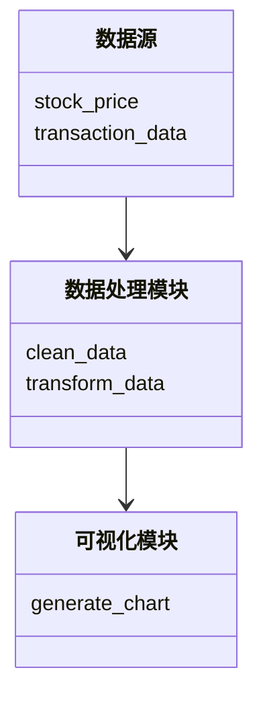
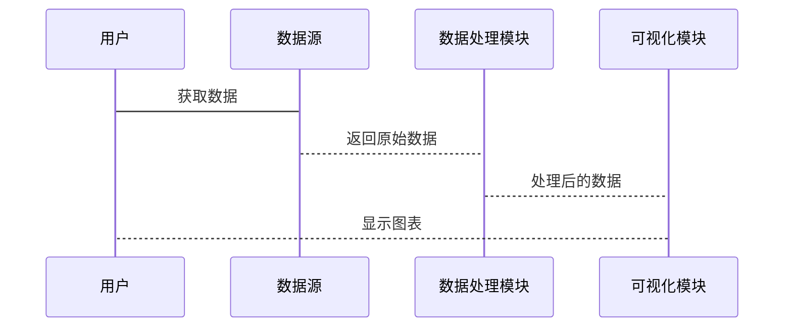

                 


# 《金融数据可视化：技术与最佳实践》

> **关键词**：金融数据可视化、数据可视化技术、数据预处理、交互设计、金融分析工具

> **摘要**：  
> 本文深入探讨了金融数据可视化的技术与最佳实践，从数据预处理、图表选择到交互设计，结合实际案例，详细讲解了如何在金融领域高效地进行数据可视化。文章内容涵盖数据处理算法、数学模型、系统架构设计以及项目实战，帮助读者从理论到实践全面掌握金融数据可视化的核心技术。

---

## 《金融数据可视化：技术与最佳实践》

### 第1章：金融数据可视化的重要性

#### 1.1 问题背景与核心概念

##### 1.1.1 数据可视化的必要性
在金融领域，数据量庞大且复杂，如何快速提取有价值的信息是关键。数据可视化通过图形化手段，将复杂的数据转化为易于理解的图表，帮助分析师快速识别趋势、异常和关键点。

##### 1.1.2 金融数据的独特性
金融数据具有时间序列特性、波动性大、关联性强等特点。这些特点使得金融数据的可视化需要更高的精度和交互性。

##### 1.1.3 金融数据可视化的目标
- 描述性分析：展示数据的分布和趋势。
- 预测性分析：通过模型预测未来的市场走势。
- 诊断性分析：识别数据中的异常和潜在问题。

#### 1.2 核心概念与问题描述

##### 1.2.1 数据可视化的定义与特点
数据可视化是将数据转化为图形化表示的过程，其特点包括直观性、交互性和动态性。

##### 1.2.2 金融数据的类型与结构
- 时间序列数据：股票价格、汇率等。
- 交易数据：订单量、成交额等。
- 市场数据：指数、行业分析等。

##### 1.2.3 金融数据可视化在决策中的作用
通过可视化，分析师可以快速识别市场趋势，评估投资风险，制定交易策略。

#### 1.3 问题解决与应用领域

##### 1.3.1 数据可视化的解决方法
- 使用工具：如Matplotlib、Plotly等。
- 选择合适的图表类型：如折线图、柱状图、散点图等。

##### 1.3.2 金融领域的具体应用
- 股票价格走势分析。
- 风险评估与预警。
- 投资组合优化。

#### 1.4 边界与外延

##### 1.4.1 金融数据可视化的边界
- 数据范围：仅限于金融数据。
- 时间范围：通常为历史数据。

##### 1.4.2 相关领域的延伸
- 与数据分析、数据挖掘的结合。
- 在金融监管和合规中的应用。

#### 1.5 核心要素与组成结构

##### 1.5.1 数据源的选择与处理
- 数据清洗：处理缺失值、异常值。
- 数据转换：标准化、归一化。

##### 1.5.2 可视化工具的选择
- 工具对比：Matplotlib、Seaborn、Plotly等。
- 工具优化：根据需求选择合适的工具。

##### 1.5.3 用户需求的分析
- 用户角色：分析师、决策者。
- 需求层次：基础分析、高级预测。

---

### 第2章：数据可视化技术的核心原理

#### 2.1 数据可视化的原理与方法

##### 2.1.1 数据预处理的重要性
- 数据清洗：确保数据质量。
- 数据转换：统一数据格式。

##### 2.1.2 数据可视化的层次模型
- 数据收集：获取原始数据。
- 数据处理：清洗和转换。
- 数据分析：提取有价值的信息。
- 数据可视化：将信息图形化。

##### 2.1.3 信息传递的有效性
- 图表设计：清晰传达信息。
- 用户感知：确保用户能够快速理解。

#### 2.2 数据可视化的核心技术

##### 2.2.1 数据编码与视觉通道
- 数据编码：将数据映射到视觉元素。
- 视觉通道：颜色、形状、大小等。

##### 2.2.2 图表类型的选择与优化
- 折线图：展示趋势。
- 柱状图：比较数值。
- 面积图：展示总量。

##### 2.2.3 交互设计的实现
- 数据点的悬停显示。
- 刷子工具：选择特定数据点。

#### 2.3 数据可视化的属性对比

##### 2.3.1 不同图表类型的对比分析
| 图表类型 | 适用场景 | 示例 |
|----------|----------|------|
| 折线图    | 时间序列数据 | 股票价格走势 |
| 柱状图    | 比较不同类别 | 各行业销售额对比 |
| 饼图      | 展示比例构成 | 各资产配置比例 |

##### 2.3.2 数据维度与图表类型的匹配
- 二维数据：柱状图、散点图。
- 高维数据：热力图、三维散点图。

##### 2.3.3 用户感知与数据表达的平衡
- 数据密度：避免信息过载。
- 视觉焦点：突出重要信息。

---

### 第3章：算法与数学模型

#### 3.1 数据预处理算法

##### 3.1.1 数据清洗
- 删除缺失值：`df.dropna()`
- 填充缺失值：`df.fillna()`。

##### 3.1.2 数据转换
- 标准化：`StandardScaler`。
- 归一化：`MinMaxScaler`。

#### 3.2 数据分析算法

##### 3.2.1 数据聚类
- K-means算法：用于客户分群。
- 层次聚类：用于市场细分。

##### 3.2.2 回归分析
- 线性回归：预测股票价格。
- 逻辑回归：分类问题，如信用评分。

##### 3.2.3 时间序列分析
- ARIMA模型：预测未来趋势。
- LSTM网络：处理时间序列数据。

#### 3.3 算法原理与代码实现

##### 3.3.1 聚类算法
- 算法流程：
  1. 初始化质心。
  2. 计算每个数据点到质心的距离。
  3. 重新计算质心。
  4. 重复直到收敛。

##### 3.3.2 代码示例
```python
from sklearn.cluster import KMeans
import pandas as pd

# 假设df是数据框，包含特征列
kmeans = KMeans(n_clusters=3, random_state=0)
kmeans.fit(df[['feature1', 'feature2']])
print(kmeans.labels_)
```

#### 3.4 数学模型与公式

##### 3.4.1 线性回归
- 模型公式：$$ y = \beta_0 + \beta_1x + \epsilon $$
- 损失函数：$$ L = \sum_{i=1}^{n}(y_i - (\beta_0 + \beta_1x_i))^2 $$

##### 3.4.2 时间序列模型
- ARIMA模型：$$ y_t = \phi_1y_{t-1} + \theta_1\epsilon_{t-1} + \epsilon_t $$

---

### 第4章：系统分析与架构设计

#### 4.1 系统功能设计

##### 4.1.1 领域模型


##### 4.1.2 系统架构


#### 4.2 系统接口设计

##### 4.2.1 数据获取接口
- REST API：`GET /api/data`

##### 4.2.2 数据处理接口
- 数据清洗：`POST /api/clean`

##### 4.2.3 可视化生成接口
- 生成图表：`POST /api/generate_chart`

#### 4.3 系统交互设计

##### 4.3.1 序列图


---

### 第5章：项目实战

#### 5.1 环境配置

##### 5.1.1 安装工具
```bash
pip install matplotlib pandas numpy
```

#### 5.2 核心实现

##### 5.2.1 数据获取
```python
import pandas as pd
import requests

url = 'https://api.example.com/stock_data'
data = requests.get(url).json()
df = pd.DataFrame(data)
```

##### 5.2.2 数据处理
```python
# 删除缺失值
df.dropna(inplace=True)
# 标准化处理
from sklearn.preprocessing import StandardScaler
scaler = StandardScaler()
df[['feature1', 'feature2']] = scaler.fit_transform(df[['feature1', 'feature2']])
```

##### 5.2.3 数据可视化
```python
import matplotlib.pyplot as plt

plt.figure(figsize=(10, 6))
plt.plot(df['date'], df['price'], 'b-')
plt.title('Stock Price Trend')
plt.xlabel('Date')
plt.ylabel('Price')
plt.show()
```

#### 5.3 案例分析

##### 5.3.1 需求分析
- 需求：分析某股票的价格走势。
- 数据：时间序列数据。

##### 5.3.2 系统实现
- 实现步骤：数据获取、清洗、可视化。

##### 5.3.3 总结
- 成功实现了股票价格的可视化。
- 可视化图表清晰展示了价格趋势。

---

### 第6章：最佳实践

#### 6.1 小结

##### 6.1.1 核心知识点回顾
- 数据预处理：清洗、转换。
- 图表选择：根据数据类型选择合适的图表。
- 交互设计：提升用户体验。

#### 6.2 注意事项

##### 6.2.1 数据可视化中的常见问题
- 数据过载：避免信息过多。
- 图表选择不当：导致误解。

##### 6.2.2 解决方案
- 简化图表：突出关键信息。
- 提供交互功能：允许用户深入探索数据。

#### 6.3 未来展望

##### 6.3.1 技术发展趋势
- AI驱动的可视化工具。
- 更加个性化的交互设计。

##### 6.3.2 业务应用前景
- 更加智能化的金融分析。
- 更加个性化的用户服务。

---

### 作者简介

**作者：AI天才研究院/AI Genius Institute & 禅与计算机程序设计艺术 /Zen And The Art of Computer Programming**

---

**注**：本文为技术博客文章，旨在为金融数据可视化领域提供深度的技术分析与实践指导，帮助读者从理论到实践全面掌握相关技术。

