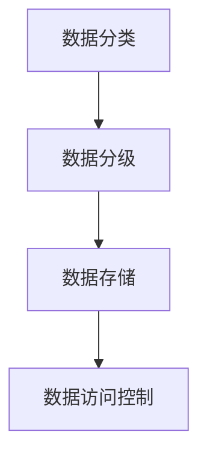
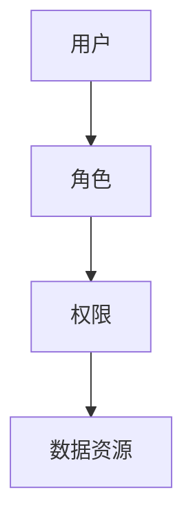
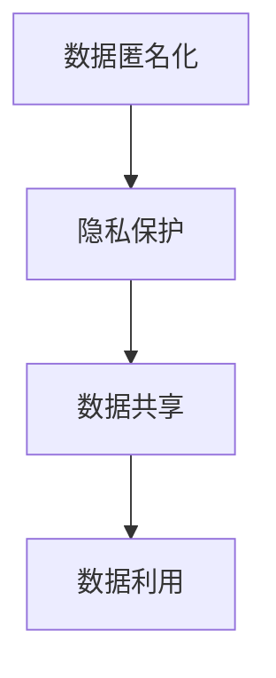
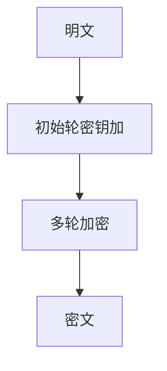
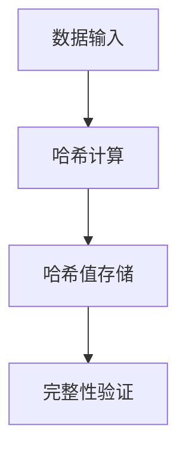
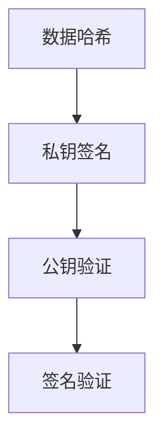
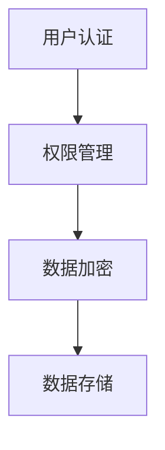
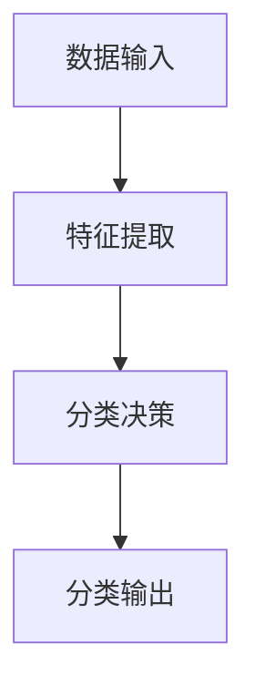
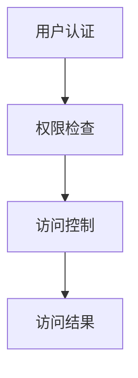

                 


# 金融数据安全与隐私保护框架设计

> 关键词：金融数据安全，隐私保护，数据分类，访问控制，加密算法，数据完整性，系统架构

> 摘要：本文详细探讨了金融数据安全与隐私保护的框架设计，涵盖了数据分类与分级、访问控制、加密算法、数据完整性校验、系统架构设计等方面。通过分析金融数据安全的核心概念、算法原理和系统架构，本文为金融行业提供了全面的隐私保护解决方案。

---

## 第1章 金融数据安全与隐私保护的背景与挑战

### 1.1 金融数据安全的重要性

#### 1.1.1 金融数据的敏感性与价值

金融数据是金融机构的核心资产，包括客户信息、交易记录、账户余额等。这些数据不仅涉及个人隐私，还关系到企业的财务安全和声誉。一旦数据泄露或被篡改，可能导致严重的经济损失和法律责任。

#### 1.1.2 数据泄露对金融行业的影响

数据泄露事件频发，给金融行业带来了巨大的挑战。例如，客户信息泄露可能导致身份盗窃、欺诈交易等问题，而交易记录的篡改可能影响金融市场的稳定性。此外，数据泄露还会损害企业的声誉，导致客户信任度下降。

#### 1.1.3 金融行业面临的隐私保护挑战

随着数字化转型的推进，金融行业面临的隐私保护挑战日益严峻。如何在保障数据隐私的同时，实现高效的数据共享和业务处理，是金融机构亟需解决的问题。此外，不同国家和地区的隐私保护法规（如GDPR、CCPA）也给金融机构提出了更高的合规要求。

### 1.2 金融数据安全的法律法规与合规要求

#### 1.2.1 全球主要金融数据保护法规

全球范围内，多个国家和地区出台了金融数据保护法规。例如：

- **欧盟《通用数据保护条例》（GDPR）**：要求企业明确数据处理目的，并获得数据主体的同意。
- **美国《加州消费者隐私法案》（CCPA）**：赋予消费者对其个人数据的更多控制权。
- **中国《个人信息保护法》（PIPL）**：规定了个人信息处理者的义务和责任。

#### 1.2.2 合规要求对企业的影响

合规要求的日益严格，迫使金融机构重新审视其数据安全策略。企业需要投入更多的资源，从技术、管理、人员培训等多方面进行调整，以确保符合相关法规要求。此外，合规不仅是法律义务，也是提升客户信任的重要手段。

#### 1.2.3 数据安全与隐私保护的边界与外延

数据安全与隐私保护的边界并非一成不变。随着技术的进步和法律法规的变化，数据安全的边界也在不断扩展。例如，数据匿名化技术的应用，使得数据在保护隐私的前提下仍能被利用。

### 1.3 本章小结

本章从金融数据安全的重要性出发，分析了数据泄露对金融行业的影响，并探讨了金融行业面临的隐私保护挑战。同时，介绍了全球主要的金融数据保护法规，并分析了合规要求对企业的影响。最后，阐述了数据安全与隐私保护的边界与外延。

---

## 第2章 金融数据安全与隐私保护的核心概念

### 2.1 数据分类与分级

#### 2.1.1 数据分类的定义与方法

数据分类是根据数据的性质和用途，将其划分为不同类别。例如，客户信息可以分为个人信息、账户信息和交易信息等。

#### 2.1.2 数据分级的标准与应用

数据分级是根据数据的重要性和敏感程度，将其划分为不同级别。例如，个人身份信息（PII）属于高度敏感数据，而交易记录则属于中度敏感数据。

#### 2.1.3 数据分类与分级的流程图



### 2.2 数据访问控制

#### 2.2.1 基于角色的访问控制（RBAC）

RBAC是一种常用的数据访问控制模型，通过定义用户角色和权限，限制用户对数据的访问范围。

#### 2.2.2 最小权限原则

最小权限原则要求用户仅获得完成任务所需的最小权限，以降低数据泄露风险。

#### 2.2.3 数据访问控制的实体关系图



### 2.3 数据加密与解密

#### 2.3.1 对称加密与非对称加密的原理

- **对称加密**：使用相同的密钥进行加密和解密，速度快，适用于大量数据加密。
- **非对称加密**：使用公钥和私钥进行加密和解密，安全性高，适用于身份认证和数字签名。

#### 2.3.2 哈希函数的作用与应用

哈希函数用于将数据映射为固定长度的哈希值，常用于数据完整性校验和密码存储。

#### 2.3.3 数据加密算法的对比表格

| 算法类型 | 特点 | 适用场景 |
|----------|------|----------|
| 对称加密 | 高效，密钥短 | 数据加密传输 |
| 非对称加密 | 安全性高，密钥长 | 数字签名，公钥分发 |
| 哈希函数 | 快速，不可逆 | 数据完整性校验 |

### 2.4 数据匿名化与隐私保护

#### 2.4.1 数据匿名化的定义与技术

数据匿名化是通过技术手段，去除数据中与个人身份相关的信息，降低数据泄露风险。

#### 2.4.2 数据脱敏的实现方法

数据脱敏是通过技术手段，将敏感数据进行变形处理，使其无法还原出真实数据。

#### 2.4.3 数据匿名化与隐私保护的关系图



### 2.5 本章小结

本章详细介绍了金融数据安全与隐私保护的核心概念，包括数据分类与分级、数据访问控制、数据加密与解密以及数据匿名化与隐私保护。通过这些核心概念的分析，读者可以更好地理解金融数据安全的实现方法。

---

## 第3章 金融数据安全与隐私保护的算法原理

### 3.1 加密算法的原理与实现

#### 3.1.1 AES加密算法的工作流程

AES（高级加密标准）是一种广泛使用的对称加密算法，其工作流程如下：

1. **明文输入**：将明文数据输入到加密算法中。
2. **初始轮密钥加**：将初始轮密钥与明文进行异或操作。
3. **多轮加密**：对数据进行多轮加密变换，包括字节代换、行移位、列混淆和轮密钥加。
4. **密文输出**：输出加密后的密文数据。



#### 3.1.2 RSA公钥加密算法的数学模型

RSA算法基于大整数分解的困难性，其数学模型如下：

- 选择两个大质数p和q，计算n = p * q。
- 选择一个公钥指数e，使得e和φ(n)互质，其中φ(n) = (p-1)(q-1)。
- 计算私钥指数d，满足d ≡ e^{-1} mod φ(n)。
- 公钥为(e, n)，私钥为(d, n)。

#### 3.1.3 椭圆曲线加密的原理与应用

椭圆曲线加密是一种基于椭圆曲线数学的公钥加密算法，其安全性依赖于椭圆曲线上的离散对数问题。

### 3.2 数据完整性校验

#### 3.2.1 哈希函数的数学模型

哈希函数是一个从任意长度的输入数据映射到固定长度输出的函数，其数学模型可以表示为：

$$ H: \{0,1\}^* \rightarrow \{0,1\}^n $$

其中，n是哈希值的长度。

#### 3.2.2 数据完整性校验的实现流程

1. **数据输入**：将原始数据输入到哈希函数中。
2. **哈希计算**：计算数据的哈希值。
3. **哈希值存储**：将哈希值与数据一起存储或传输。
4. **完整性验证**：在接收端重新计算数据的哈希值，并与存储的哈希值进行对比。



### 3.3 数据签名与认证

#### 3.3.1 数字签名的原理与流程

数字签名是一种通过哈希函数和公钥加密算法实现数据签名的技术，其流程如下：

1. **数据哈希**：对数据计算哈希值。
2. **私钥签名**：使用私钥对哈希值进行加密，生成数字签名。
3. **公钥验证**：在接收端，使用公钥对数字签名进行解密，并与数据哈希值进行对比。



#### 3.3.2 HMAC算法的实现与应用

HMAC（哈希消息认证码）是一种基于哈希函数的认证码生成算法，其数学模型如下：

$$ \text{HMAC}(K, x) = H(K \oplus \text{opad} \parallel H(K \oplus \text{ipad} \parallel x)) $$

其中，K是密钥，opad和ipad是固定的常量，H是哈希函数。

### 3.4 本章小结

本章详细介绍了金融数据安全与隐私保护的核心算法，包括AES加密算法、RSA公钥加密算法、椭圆曲线加密算法、哈希函数和HMAC算法的原理与实现。通过这些算法的分析，读者可以更好地理解金融数据安全的实现方法。

---

## 第4章 金融数据安全与隐私保护的系统架构设计

### 4.1 系统架构概述

#### 4.1.1 分层架构的设计原则

分层架构是一种将系统划分为多个层次的设计方法，包括表现层、业务逻辑层和数据访问层。每一层都有明确的功能划分，便于开发和维护。

#### 4.1.2 微服务架构的应用场景

微服务架构是一种将系统功能分解为多个独立服务的设计方法，适用于复杂的金融数据安全场景。

#### 4.1.3 系统架构的模块划分



### 4.2 数据分类与分级模块设计

#### 4.2.1 数据分类的实现流程

1. **数据输入**：将原始数据输入到分类模块中。
2. **特征提取**：提取数据的关键特征，如数据类型、敏感程度等。
3. **分类决策**：根据特征匹配预定义的分类规则，确定数据的分类结果。
4. **分类输出**：将分类结果输出到后续处理模块。



#### 4.2.2 数据分级的规则引擎设计

数据分级的规则引擎是一个基于规则的决策系统，用于自动判断数据的敏感级别。其设计如下：

1. **规则定义**：定义数据分级的规则，如敏感数据的定义、分级标准等。
2. **规则匹配**：根据输入数据匹配相应的规则。
3. **分级决策**：根据匹配的规则，确定数据的分级结果。
4. **规则执行**：将分级结果应用于后续的数据处理过程。

### 4.3 数据访问控制模块设计

#### 4.3.1 RBAC模型的实现

RBAC模型的实现包括用户角色管理、权限管理、访问控制等模块。其流程如下：

1. **用户认证**：验证用户的身份，获取用户的角色信息。
2. **权限检查**：根据用户的角色信息，检查用户是否具有访问数据的权限。
3. **访问控制**：根据权限检查结果，允许或拒绝用户的访问请求。



#### 4.3.2 最小权限原则的实现方法

最小权限原则的实现方法包括：

- **权限最小化**：为用户分配最小的权限，仅允许完成任务所需的操作。
- **权限审计**：定期审计用户的权限，确保权限的合理性和合规性。

### 4.4 数据加密与解密模块设计

#### 4.4.1 加密算法的选择与实现

加密算法的选择需要考虑数据的敏感级别、性能要求和安全性。例如，对于高度敏感数据，建议使用非对称加密算法；对于大量数据加密，建议使用对称加密算法。

#### 4.4.2 解密流程的设计

解密流程的设计包括：

1. **密钥管理**：管理和存储加密密钥，确保密钥的安全性。
2. **解密请求**：接收解密请求，获取密钥和密文数据。
3. **数据解密**：使用密钥对密文数据进行解密，恢复原始数据。

### 4.5 本章小结

本章详细介绍了金融数据安全与隐私保护的系统架构设计，包括分层架构、微服务架构、数据分类与分级模块、数据访问控制模块和数据加密与解密模块的设计。通过这些模块的设计，读者可以更好地理解金融数据安全的实现方法。

---

## 第5章 金融数据安全与隐私保护的项目实战

### 5.1 环境安装与配置

#### 5.1.1 开发环境的搭建

开发环境的搭建包括安装操作系统、开发工具、依赖库等。例如，可以使用Linux系统、Python编程语言和相关加密库（如cryptography库）。

#### 5.1.2 依赖管理

依赖管理可以通过使用包管理工具（如pip）来完成。例如，安装以下依赖：

```bash
pip install cryptography
pip install mermaid
```

### 5.2 核心系统实现

#### 5.2.1 数据分类与分级的实现

```python
from data_classification import DataClassifier

# 初始化数据分类器
classifier = DataClassifier()

# 数据分类
data = "信用卡交易记录"
classified_data = classifier.classify(data)
print(classified_data)
```

#### 5.2.2 数据访问控制的实现

```python
from access_control import RBAC

# 初始化RBAC模型
rbac = RBAC()

# 用户认证
user = "admin"
role = rbac.authenticate(user)
print(role)

# 权限检查
permission = "view_transactions"
result = rbac.check_permission(role, permission)
print(result)
```

#### 5.2.3 数据加密与解密的实现

```python
from encryption import AESCipher

# 初始化AES加密器
cipher = AESCipher()

# 数据加密
plaintext = "Sensitive data"
ciphertext = cipher.encrypt(plaintext)
print(ciphertext)

# 数据解密
decrypted_text = cipher.decrypt(ciphertext)
print(decrypted_text)
```

### 5.3 项目实战总结

本章通过实际案例，展示了金融数据安全与隐私保护框架的设计与实现。通过数据分类与分级、数据访问控制和数据加密与解密的实现，读者可以更好地理解金融数据安全的实现方法。

---

## 第6章 总结与展望

### 6.1 本章总结

本文详细探讨了金融数据安全与隐私保护的框架设计，涵盖了数据分类与分级、数据访问控制、数据加密与解密等方面。通过理论分析和实际案例的展示，本文为金融行业提供了全面的隐私保护解决方案。

### 6.2 未来展望

随着技术的进步和法律法规的不断完善，金融数据安全与隐私保护的框架设计将更加复杂和多样化。未来的研究方向包括：

- 更高级别的加密算法
- 更智能的数据分类与分级方法
- 更强大的数据访问控制模型

---

## 作者：AI天才研究院/AI Genius Institute & 禅与计算机程序设计艺术/Zen And The Art of Computer Programming

