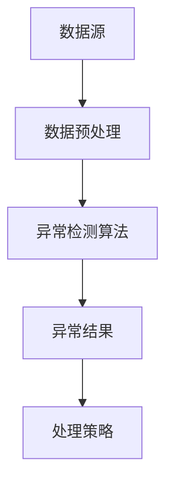

                 


# 《金融数据异常值检测与处理系统》

> **关键词**：金融数据、异常值检测、机器学习、时间序列分析、系统架构、Python、数据处理

> **摘要**：本文详细探讨了金融数据异常值检测与处理系统的构建与实现。从异常值检测的背景、核心概念、算法原理、系统架构设计到项目实战，系统性地分析了金融数据异常值检测的必要性、方法和实现路径。文章结合统计方法、机器学习和深度学习等多种方法，提出了基于时间序列分析的异常值检测系统，并通过实际案例展示了系统的应用效果和处理策略。本文旨在为金融领域的数据工程师和研究人员提供一套完整的技术解决方案。

---

## 第1章: 异常值检测的背景与问题背景

### 1.1 异常值检测的定义与概念

#### 1.1.1 什么是异常值
异常值（Outliers）是指在数据集中与大多数数据点显著不同的观测值。这些观测值可能由于数据采集错误、系统故障、人为操作或其他不可预见的因素产生。在金融领域，异常值可能表现为股价的突然波动、交易量的异常飙升或异常低谷等。

#### 1.1.2 异常值检测的定义
异常值检测是指通过统计方法或机器学习算法，识别数据集中偏离正常模式的观测值。其核心目标是发现这些异常值，并采取相应的处理策略，以降低对金融系统的影响。

#### 1.1.3 异常值检测的核心要素
- 数据特征：时间序列、多维数据等。
- 异常类型：单变量异常、多变量异常、集体异常等。
- 检测目标：发现异常、分类异常、预测异常等。

### 1.2 金融数据异常值的特殊性

#### 1.2.1 金融数据的特点
- 高频性：金融数据通常以秒、分钟为单位更新。
- 时间相关性：数据具有很强的时间依赖性。
- 波动性：市场波动较大，容易受到外部因素影响。

#### 1.2.2 异常值在金融领域的表现形式
- 价格剧烈波动：如股价突然上涨或下跌。
- 交易量异常：如某只股票的交易量突然激增。
- 关联性异常：如相关资产之间的关系突然发生变化。

#### 1.2.3 异常值对金融系统的潜在风险
- 影响交易决策：异常值可能导致错误的交易策略。
- 增加投资风险：异常值可能掩盖市场的真实情况。
- 影响系统稳定性：异常值可能导致金融系统的不稳定。

### 1.3 问题背景与问题描述

#### 1.3.1 金融数据异常值检测的必要性
- 保障金融系统的稳定运行。
- 提高交易决策的准确性。
- 降低投资风险。

#### 1.3.2 问题边界与外延
- 数据范围：单变量、多变量、时间序列数据。
- 时间范围：实时检测、历史数据检测。
- 检测粒度：单点异常、集体异常。

#### 1.3.3 核心问题与目标
- 如何高效地检测金融数据中的异常值？
- 如何设计一个能够实时处理异常值的系统？

---

## 第2章: 异常值检测的核心概念与联系

### 2.1 异常值检测的原理与方法

#### 2.1.1 统计方法
统计方法基于数据的分布特性，通过计算统计量（如均值、方差）来判断数据点是否为异常值。

- Z-score：计算数据点与均值的距离标准化值。
- IQR（四分位距）：基于数据分布的四分位数范围判断异常值。

#### 2.1.2 机器学习方法
机器学习方法通过训练模型来学习正常数据的分布，识别偏离正常分布的异常值。

- Isolation Forest：一种基于树结构的无监督学习算法。
- One-Class SVM：一种用于异常检测的支持向量机算法。

#### 2.1.3 深度学习方法
深度学习方法通过构建复杂的模型（如自动编码器、图神经网络）来捕捉数据的深层特征，识别异常值。

- Autoencoders：通过重建数据来识别异常值。
- 图神经网络：通过构建数据关系图来检测异常值。

### 2.2 核心概念对比分析

#### 2.2.1 统计方法与机器学习方法的对比

| 方法         | 统计方法          | 机器学习方法        |
|--------------|-------------------|--------------------|
| 优点         | 实现简单，计算速度快 | 能捕捉复杂模式      |
| 缺点         | 对数据分布假设敏感 | 需要大量数据，计算复杂 |

#### 2.2.2 不同算法的优缺点分析

| 算法         | 优点                          | 缺点                          |
|--------------|-------------------------------|-------------------------------|
| Z-score      | 实现简单，适合单变量数据      | 不适用于多变量数据            |
| IQR          | 对异常值鲁棒                   | 不适合高维数据                |
| Isolation Forest | 适用于高维数据，无须数据归一化 | 对异常值比例敏感              |
| Autoencoders | 能捕捉深层特征                | 训练时间长，需要大量数据       |

### 2.3 实体关系图



---

## 第3章: 统计方法与机器学习算法

### 3.1 统计方法

#### 3.1.1 Z-score方法

$$ Z = \frac{X - \mu}{\sigma} $$

其中，$\mu$ 是均值，$\sigma$ 是标准差。通常，绝对值超过3的Z-score表示异常值。

#### 3.1.2 IQR方法

$$ \text{IQR} = Q_3 - Q_1 $$

异常值的判断标准为：

$$ X < Q_1 - 1.5 \times \text{IQR} \quad \text{或} \quad X > Q_3 + 1.5 \times \text{IQR} $$

#### 3.1.3 算法实现与代码示例

```python
import numpy as np

def detect_outliers_zscore(data, threshold=3):
    mean = np.mean(data)
    std = np.std(data)
    z_scores = [(x - mean) / std for x in data]
    outliers = [x for x in data if abs((x - mean) / std) > threshold]
    return outliers

# 示例数据
data = np.random.normal(0, 1, 100)
outliers = detect_outliers_zscore(data)
print(outliers)
```

### 3.2 机器学习方法

#### 3.2.1 Isolation Forest算法

Isolation Forest通过构建随机树将数据点隔离，异常值更容易被隔离在树的叶子节点中。

#### 3.2.2 One-Class SVM算法

One-Class SVM是一种无监督学习算法，用于学习数据的分布，识别异常值。

#### 3.2.3 算法实现与代码示例

```python
from sklearn.ensemble import IsolationForest

def detect_outliers_if(data, contamination=0.01):
    model = IsolationForest(contamination=contamination)
    model.fit(data)
    outliers = model.predict(data)
    outliers = [i for i, val in enumerate(outliers) if val == -1]
    return outliers

# 示例数据
data = np.random.normal(0, 1, 100)
outliers = detect_outliers_if(data)
print(outliers)
```

---

## 第4章: 深度学习方法

### 4.1 Autoencoders

Autoencoders通过无监督学习方式学习数据的表示，异常值通常会导致重建误差较大。

#### 4.1.1 Autoencoder的原理

Autoencoder由编码器和解码器两部分组成，编码器将输入数据映射到低维空间，解码器再将低维空间的数据映射回高维空间。异常值通常会导致较大的重建误差。

#### 4.1.2 异常检测流程

1. 数据预处理：归一化、降维。
2. 模型训练：训练Autoencoder。
3. 异常检测：计算重建误差，判断是否为异常值。

#### 4.1.3 算法实现与代码示例

```python
from keras.layers import Dense, Input
from keras.models import Model

def build_autoencoder(input_dim):
    input_layer = Input(shape=(input_dim,))
    encoder = Dense(32, activation='relu')(input_layer)
    decoder = Dense(input_dim, activation='sigmoid')(encoder)
    model = Model(inputs=input_layer, outputs=decoder)
    model.compile(optimizer='adam', loss='binary_crossentropy')
    return model

# 示例数据
data = np.random.normal(0, 1, (100, 10))
autoencoder = build_autoencoder(10)
autoencoder.fit(data, data, epochs=100)
```

### 4.2 图神经网络

图神经网络通过构建数据关系图，分析数据点之间的关联性，识别异常值。

#### 4.2.1 图神经网络的基本概念

图神经网络将数据点表示为图的节点，边表示数据点之间的关系。通过聚合邻居节点的信息，识别异常值。

#### 4.2.2 在金融数据中的应用

通过分析交易数据的关系图，识别异常交易模式。

#### 4.2.3 算法实现与代码示例

```python
import networkx as nx

def build_graph(data):
    graph = nx.Graph()
    nodes = list(data.keys())
    graph.add_nodes_from(nodes)
    for i in range(len(nodes)):
        for j in range(i+1, len(nodes)):
            if abs(data[nodes[i]] - data[nodes[j]]) > threshold:
                graph.add_edge(nodes[i], nodes[j])
    return graph

# 示例数据
data = {'A': 100, 'B': 101, 'C': 102, 'D': 200}
graph = build_graph(data)
nx.draw(graph)
```

---

## 第5章: 系统分析与架构设计

### 5.1 问题场景介绍

#### 5.1.1 金融交易中的异常值检测
- 实时监控交易数据，发现异常交易行为。
- 识别市场操纵、内幕交易等非法行为。

#### 5.1.2 风险控制
- 通过异常值检测，及时发现市场波动，降低投资风险。

### 5.2 系统功能设计

#### 5.2.1 数据采集模块
- 实时采集金融数据（如股票价格、交易量）。
- 数据预处理（如归一化、降维）。

#### 5.2.2 异常检测模块
- 统计方法：Z-score、IQR。
- 机器学习方法：Isolation Forest、One-Class SVM。
- 深度学习方法：Autoencoders、图神经网络。

#### 5.2.3 异常处理模块
- 生成异常报告。
- 自动化处理策略（如暂停交易、调整投资组合）。

---

## 第6章: 项目实战

### 6.1 环境安装

```bash
pip install numpy pandas scikit-learn keras networkx
```

### 6.2 核心代码实现

```python
import numpy as np
import pandas as pd
from sklearn.ensemble import IsolationForest
from keras.models import Model
from keras.layers import Input, Dense

# 示例数据
data = pd.read_csv('financial_data.csv')
```

### 6.3 案例分析与详细解读

#### 6.3.1 股票价格异常检测

假设我们有一组股票价格数据，使用Isolation Forest算法进行异常检测：

```python
data = pd.read_csv('stock_prices.csv')
model = IsolationForest(contamination=0.01)
model.fit(data[['open', 'high', 'low', 'close']])
outliers = model.predict(data[['open', 'high', 'low', 'close']])
outliers_report = data[outliers == -1]
print(outliers_report)
```

---

## 第7章: 总结与展望

### 7.1 总结

本文详细探讨了金融数据异常值检测与处理系统的构建与实现。从异常值检测的背景、核心概念、算法原理到系统架构设计和项目实战，系统性地分析了金融数据异常值检测的必要性、方法和实现路径。通过对比统计方法、机器学习和深度学习等多种方法，提出了基于时间序列分析的异常值检测系统，并通过实际案例展示了系统的应用效果和处理策略。

### 7.2 小结

- 异常值检测是金融数据分析的重要组成部分。
- 统计方法适用于简单场景，机器学习方法适用于复杂场景，深度学习方法适用于深度特征提取场景。
- 系统设计需要结合实际业务需求，选择合适的算法和处理策略。

### 7.3 注意事项

- 数据预处理是关键，需注意数据的归一化、降维等问题。
- 异常值检测需结合业务场景，避免误报和漏报。
- 系统处理策略需灵活可配置，支持实时检测和历史数据检测。

### 7.4 拓展阅读

- 《异常检测：理论与实践》
- 《时间序列分析：方法与应用》
- 《深度学习在金融领域的应用》

---

**作者：AI天才研究院/AI Genius Institute & 禅与计算机程序设计艺术 /Zen And The Art of Computer Programming**

