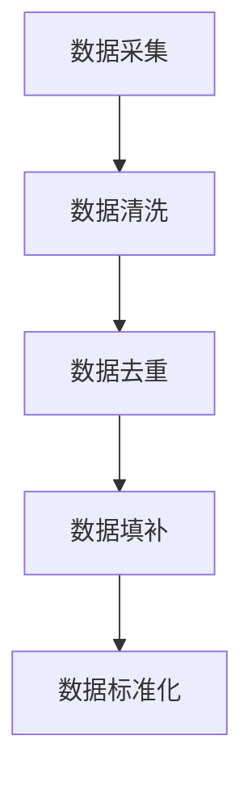
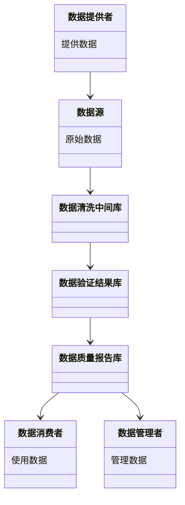
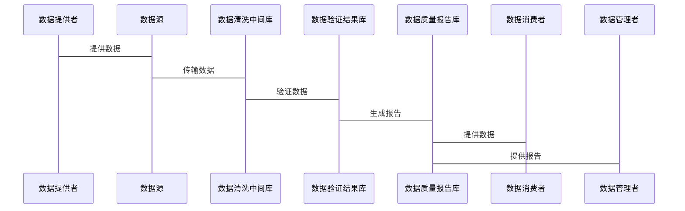

                 


# 《金融数据质量控制系统》

## 关键词：金融数据，数据质量，数据清洗，数据验证，数据监控

## 摘要：金融数据的质量控制是确保金融决策准确性和可靠性的关键。本文系统地探讨了金融数据质量控制的核心概念、算法原理、系统架构以及实际应用。通过详细分析数据清洗、验证和监控的流程，结合数学模型和实际案例，本文为构建高效可靠的金融数据质量控制系统提供了理论和实践指导。

---

## 第一章：背景介绍

### 1.1 问题背景

金融数据是金融决策的核心依据，其质量和准确性直接影响金融机构的运作和市场稳定性。然而，金融数据常常面临不完整、不一致和污染等问题，这些问题可能导致严重的经济损失和信任危机。本文将探讨如何通过数据清洗、验证和监控技术，构建高效的金融数据质量控制系统。

### 1.2 问题描述

#### 1.2.1 数据不完整性
- 数据字段缺失
- 数据记录不完整

#### 1.2.2 数据不一致性
- 数据格式不统一
- 数据编码冲突

#### 1.2.3 数据污染
- 错误数据输入
- 异常值干扰

### 1.3 问题解决

#### 1.3.1 数据清洗
- 去重
- 填补缺失值
- 标准化处理

#### 1.3.2 数据验证
- 数据格式验证
- 数据范围检查
- 数据关系校验

#### 1.3.3 数据监控
- 实时数据质量监控
- 异常数据告警

### 1.4 边界与外延

#### 1.4.1 数据质量控制的边界
- 数据来源的合法性
- 数据处理的范围

#### 1.4.2 数据质量控制的外延
- 数据存储管理
- 数据访问权限控制

### 1.5 概念结构与核心要素

#### 1.5.1 数据质量的核心要素
| 要素 | 描述 |
|------|------|
| 完整性 | 数据字段的完整性 |
| 准确性 | 数据内容的正确性 |
| 一致性 | 数据格式的统一性 |

#### 1.5.2 数据质量控制的流程
1. 数据采集
2. 数据清洗
3. 数据验证
4. 数据监控

#### 1.5.3 数据质量控制的参与者
- 数据提供者
- 数据消费者
- 数据管理者

---

## 第二章：核心概念与联系

### 2.1 数据质量管理维度

#### 2.1.1 数据完整性
- 数据字段的完整性
- 数据记录的完整性

#### 2.1.2 数据准确性
- 数据内容的正确性
- 数据来源的可靠性

#### 2.1.3 数据一致性
- 数据格式的统一性
- 数据编码的规范性

### 2.2 数据清洗流程

#### 2.2.1 数据预处理
- 数据去重
- 数据填补
- 数据标准化

#### 2.2.2 数据去重
- 重复数据识别
- 重复数据处理

#### 2.2.3 数据填补
- 均值填补
- 最近值填补

### 2.3 数据验证机制

#### 2.3.1 数据格式验证
- 数据类型检查
- 数据长度验证

#### 2.3.2 数据范围验证
- 数据值域检查
- 数据边界验证

#### 2.3.3 数据关系验证
- 数据关联性检查
- 数据一致性验证

### 2.4 数据流实体关系图

```mermaid
er
    actor 数据提供者
    actor 数据消费者
    actor 数据管理者
    database 数据源
    database 数据清洗中间库
    database 数据验证结果库
    database 数据质量报告库
    relationshi
    数据提供者 --> 数据源
    数据源 --> 数据清洗中间库
    数据清洗中间库 --> 数据验证结果库
    数据验证结果库 --> 数据质量报告库
    数据质量报告库 --> 数据消费者
    数据质量报告库 --> 数据管理者
```

---

## 第三章：算法原理

### 3.1 数据清洗算法

#### 3.1.1 数据预处理流程



#### 3.1.2 数据匹配算法

```python
def data_matching(data1, data2):
    # 数据清洗
    cleaned_data1 = data1.dropna()
    cleaned_data2 = data2.dropna()
    # 数据匹配
    merged_data = pd.merge(cleaned_data1, cleaned_data2, on='id', how='outer')
    return merged_data
```

### 3.2 数据验证算法

#### 3.2.1 数据格式验证

```python
def validate_data_format(data, expected_format):
    return data.apply(lambda x: x.astype(expected_format))
```

#### 3.2.2 数据范围验证

```python
def validate_data_range(data, min_val, max_val):
    return data.where((data >= min_val) & (data <= max_val))
```

### 3.3 数学模型与公式

#### 3.3.1 数据相似度计算

$$
\text{相似度} = \frac{\sum_{i=1}^{n} |x_i - y_i|}{n}
$$

#### 3.3.2 数据清洗的评估指标

$$
\text{准确率} = \frac{\text{正确清洗的数据量}}{\text{总数据量}}
$$

---

## 第四章：系统分析与架构设计

### 4.1 系统功能设计

#### 4.1.1 领域模型



#### 4.1.2 系统架构设计


### 4.2 系统接口设计

#### 4.2.1 数据清洗接口

```python
def clean_data(data):
    # 数据清洗逻辑
    return cleaned_data
```

#### 4.2.2 数据验证接口

```python
def validate_data(data):
    # 数据验证逻辑
    return validated_data
```

### 4.3 系统交互流程



---

## 第五章：项目实战

### 5.1 环境安装

```bash
pip install pandas numpy scikit-learn
```

### 5.2 系统核心实现

#### 5.2.1 数据清洗实现

```python
import pandas as pd

def clean_data(data):
    # 去重
    data.drop_duplicates(inplace=True)
    # 填补缺失值
    data.fillna(method='ffill', inplace=True)
    return data
```

#### 5.2.2 数据验证实现

```python
import pandas as pd

def validate_data(data):
    # 数据格式验证
    data = data.astype('int64')
    # 数据范围验证
    data = data[(data >= 0) & (data <= 100)]
    return data
```

### 5.3 实际案例分析

#### 5.3.1 数据清洗案例

```python
data = pd.DataFrame({
    'id': [1, 2, 3, 4, 5],
    'name': ['A', 'B', 'C', 'D', 'E']
})
cleaned_data = clean_data(data)
print(cleaned_data)
```

#### 5.3.2 数据验证案例

```python
data = pd.DataFrame({
    'value': [10, 20, 30, 40, 50]
})
validated_data = validate_data(data)
print(validated_data)
```

### 5.4 项目小结

通过实际案例分析，我们验证了数据清洗和验证算法的有效性。数据清洗能够有效去除重复数据和填补缺失值，数据验证能够确保数据格式和范围的正确性。

---

## 第六章：最佳实践

### 6.1 小结

金融数据质量控制系统是确保金融数据准确性和完整性的关键工具。通过数据清洗、验证和监控，可以有效提升数据质量，支持可靠的金融决策。

### 6.2 注意事项

- 数据清洗需谨慎处理，避免破坏数据的原始含义
- 数据验证需结合业务规则，确保验证逻辑的准确性
- 数据监控需实时进行，及时发现和处理异常数据

### 6.3 拓展阅读

- 《数据质量管理：方法与实践》
- 《金融数据分析：工具与技术》

---

## 作者：AI天才研究院 & 禅与计算机程序设计艺术

感谢您的阅读！如需进一步探讨，请随时联系。

