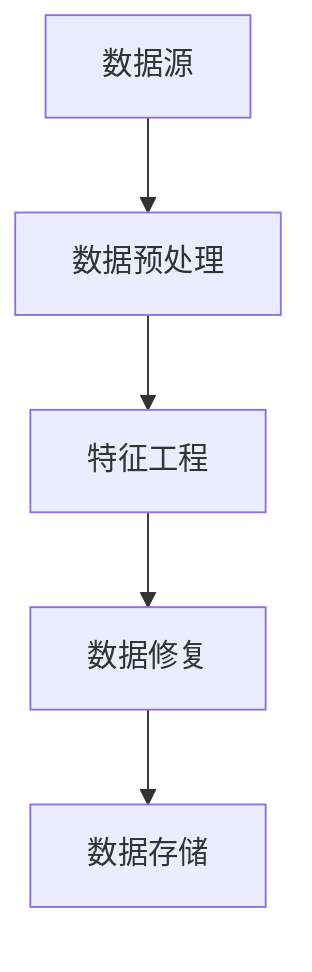
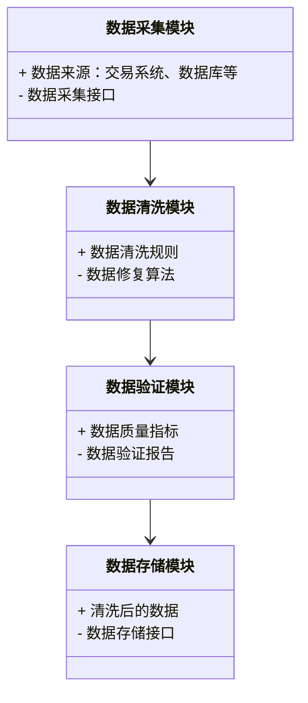

                 


# 金融数据质量自动化控制与修复平台

## 关键词：金融数据，数据质量，自动化控制，数据清洗，数据修复，机器学习

## 摘要：  
随着金融行业的快速发展，数据质量问题日益凸显，成为影响金融业务决策和风险管理的重要因素。本文将深入探讨金融数据质量的定义、核心概念，分析数据清洗与修复的算法原理，结合系统架构设计，提出一种基于机器学习的自动化控制与修复平台解决方案。文章通过实际案例分析，展示了该平台在金融数据质量管理中的应用效果，并展望了未来的发展方向。

---

## 第一章：背景与问题背景

### 1.1 数据质量管理的重要性

#### 1.1.1 金融数据质量问题的背景

金融行业高度依赖数据，从交易结算、风险管理到客户画像，数据的准确性和完整性直接影响业务决策。然而，金融数据在采集、传输和存储过程中，常常面临以下问题：

- **数据缺失**：部分字段未填写或缺失，导致数据不完整。
- **数据错误**：数据录入错误或格式不统一，例如日期格式不一致。
- **数据冗余**：重复数据或冗余字段，增加数据处理的复杂性。
- **数据不一致**：同一数据在不同系统中表示不一致，导致混淆。

这些问题不仅增加了数据处理的成本，还可能导致严重的经济损失，例如错误的交易决策或合规性问题。

#### 1.1.2 金融数据质量问题的现状

金融行业的数据来源多样，包括交易系统、客户数据库、外部数据接口等。数据的多样性和复杂性使得数据质量管理变得更加困难。传统依赖人工检查的方式效率低下，难以应对海量数据的处理需求。此外，金融机构对数据的实时性要求越来越高，数据质量管理必须与数据生命周期紧密结合，才能满足业务需求。

#### 1.1.3 数据质量对金融业务的影响

数据质量直接影响金融业务的多个方面：

- **风险管理**：错误的数据可能导致风险评估失误，进而引发重大风险事件。
- **客户信任**：数据错误可能影响客户体验，损害机构声誉。
- **合规性**：数据不合规可能导致法律纠纷或罚款。

因此，建立一套高效、自动化的数据质量管理与修复平台，成为金融机构的核心需求。

---

### 1.2 金融数据质量控制的需求

#### 1.2.1 金融行业的数据特点

金融数据具有以下特点：

- **实时性**：金融交易需要实时处理，数据必须及时准确。
- **多样性**：数据来源多样，包括结构化和非结构化数据。
- **敏感性**：金融数据往往涉及客户隐私，需严格保护。

#### 1.2.2 数据质量管理的必要性

数据质量管理是确保数据准确、完整、一致和安全的关键步骤。在金融行业，数据质量管理不仅需要检测数据中的问题，还需要提供修复方案，确保数据符合业务需求。

#### 1.2.3 自动化控制的迫切需求

传统的人工数据质量管理方式效率低下，难以应对海量数据的挑战。自动化控制可以显著提高数据处理效率，减少人为错误，降低运营成本。

---

## 第二章：核心概念与联系

### 2.1 数据质量管理的核心概念

#### 2.1.1 数据质量管理的定义

数据质量管理（Data Quality Management, DQM）是指通过一系列方法和技术，确保数据的准确性、完整性、一致性、及时性和安全性。在金融行业，数据质量管理不仅是技术问题，更是业务问题。

#### 2.1.2 数据质量管理的关键维度

数据质量管理可以从以下几个维度进行评估：

- **准确性**：数据是否正确反映真实情况。
- **完整性**：数据是否完整，无缺失。
- **一致性**：数据在不同系统中是否一致。
- **及时性**：数据是否及时更新。
- **安全性**：数据是否受到保护，防止未经授权的访问。

#### 2.1.3 数据质量管理的框架

数据质量管理的框架通常包括以下步骤：

1. 数据收集与存储。
2. 数据清洗与修复。
3. 数据验证与评估。
4. 数据监控与优化。

---

### 2.2 数据清洗与修复算法

#### 2.2.1 数据清洗的基本原理

数据清洗是数据质量管理的重要步骤，旨在识别和处理数据中的错误和异常值。常见的数据清洗方法包括：

- **删除法**：删除明显错误或无效的数据。
- **替换法**：用合理值替换错误值。
- **插值法**：利用其他数据估计缺失值。

#### 2.2.2 数据修复的核心算法

数据修复算法旨在自动识别和纠正数据中的错误。常见的修复算法包括：

- **基于规则的修复**：根据预定义的规则检测并修复错误。
- **基于机器学习的修复**：利用机器学习模型预测并修复数据错误。

#### 2.2.3 数据清洗与修复的对比分析

下表对比了数据清洗和修复的主要区别：

| 特性      | 数据清洗                     | 数据修复                     |
|-----------|------------------------------|------------------------------|
| 目标      | 识别和处理错误               | 自动修复错误                 |
| 方法      | 删除或替换错误数据           | 基于规则或模型修复错误数据   |
| 依赖      | 预定义规则                   | 机器学习模型                 |

---

### 2.3 数据质量管理的ER实体关系图

下图展示了金融数据质量管理的核心实体关系：

```mermaid
er
  entity 金融数据 {
    key 金融数据ID
    attribute 数据来源
    attribute 数据类型
    attribute 数据时间戳
  }
  entity 数据质量指标 {
    key 数据质量指标ID
    attribute 准确性
    attribute 完整性
    attribute 一致性
  }
  entity 数据清洗规则 {
    key 清洗规则ID
    attribute 清洗算法
    attribute 清洗目标
    attribute 清洗优先级
  }
  relationship 数据清洗规则 --> 金融数据: 应用规则
  relationship 数据质量指标 --> 金融数据: 评估指标
```

---

## 第三章：数据清洗与修复算法原理

### 3.1 数据清洗算法

#### 3.1.1 算法原理

数据清洗算法通常包括以下步骤：

1. 数据预处理：清洗数据，去除重复值和异常值。
2. 特征工程：提取有用特征，用于后续处理。
3. 数据修复：利用规则或模型修复数据错误。

#### 3.1.2 数据清洗流程图

下图展示了数据清洗的流程：



#### 3.1.3 数据清洗代码实现

以下是一个简单的数据清洗代码示例：

```python
import pandas as pd

# 数据加载
df = pd.read_csv('financial_data.csv')

# 删除重复值
df.drop_duplicates(inplace=True)

# 去除异常值
df = df[df['amount'] > 0]

# 保存清洗后的数据
df.to_csv('cleaned_data.csv', index=False)
```

---

### 3.2 数据修复算法

#### 3.2.1 基于规则的修复

基于规则的修复方法依赖于预定义的规则，例如：

```python
# 示例规则：修复缺失的交易时间
df['transaction_time'].fillna(method='ffill', inplace=True)
```

#### 3.2.2 基于机器学习的修复

基于机器学习的修复方法通常使用回归模型预测缺失值：

```python
from sklearn.impute import SimpleImputer

# 示例：修复缺失的金额
imputer = SimpleImputer(strategy='mean')
df['amount'] = imputer.fit_transform(df[['amount']])
```

---

## 第四章：数据质量管理的数学模型

### 4.1 数据质量评估指标

数据质量可以通过以下指标进行评估：

- 准确性：$准确率 = \frac{正确值}{总值}$
- 完整性：$完整性 = \frac{非空值}{总值}$
- 一致性：$一致性 = \frac{一致值}{总值}$

---

### 4.2 数据修复模型

基于机器学习的修复模型可以表示为：

$$
y = f(x) + \epsilon
$$

其中，$y$ 是目标变量，$x$ 是输入特征，$\epsilon$ 是误差项。

---

## 第五章：系统架构设计

### 5.1 模块划分

金融数据质量自动化控制与修复平台的模块划分如下：

- 数据采集模块：负责数据的采集和预处理。
- 数据清洗模块：执行数据清洗和修复。
- 数据验证模块：验证数据质量。
- 数据存储模块：存储清洗后的数据。

---

### 5.2 功能设计

下图展示了系统的功能设计：



---

## 第六章：项目实战

### 6.1 环境搭建

#### 6.1.1 安装依赖

```bash
pip install pandas scikit-learn mermaid4jupyter
```

---

### 6.2 核心代码实现

#### 6.2.1 数据清洗代码

```python
import pandas as pd
from sklearn.impute import SimpleImputer

# 数据加载
df = pd.read_csv('financial_data.csv')

# 删除重复值
df.drop_duplicates(inplace=True)

# 去除异常值
df = df[df['amount'] > 0]

# 填充缺失值
imputer = SimpleImputer(strategy='mean')
df['amount'] = imputer.fit_transform(df[['amount']])

# 保存清洗后的数据
df.to_csv('cleaned_data.csv', index=False)
```

---

### 6.3 案例分析

#### 6.3.1 数据修复案例

假设我们有以下数据：

| 交易ID | 交易时间 | 交易金额 |
|--------|----------|----------|
| 1      | NaN      | 100      |
| 2      | 2023-01-01 | 200      |
| 3      | NaN      | 300      |

使用基于均值的修复方法：

$$
\text{均值} = \frac{100 + 200 + 300}{3} = 200
$$

修复后的数据：

| 交易ID | 交易时间 | 交易金额 |
|--------|----------|----------|
| 1      | 2023-01-01 | 200      |
| 2      | 2023-01-01 | 200      |
| 3      | 2023-01-01 | 200      |

---

## 第七章：总结与展望

### 7.1 总结

本文详细探讨了金融数据质量管理的重要性，分析了数据清洗与修复的算法原理，并提出了一种基于机器学习的自动化控制与修复平台解决方案。通过实际案例分析，展示了该平台在金融数据质量管理中的应用效果。

---

### 7.2 展望

未来，随着人工智能和大数据技术的不断发展，金融数据质量管理将更加智能化和自动化。基于深度学习的修复算法、实时数据质量管理等技术将得到更广泛的应用。

---

## 作者：AI天才研究院/AI Genius Institute & 禅与计算机程序设计艺术 /Zen And The Art of Computer Programming

