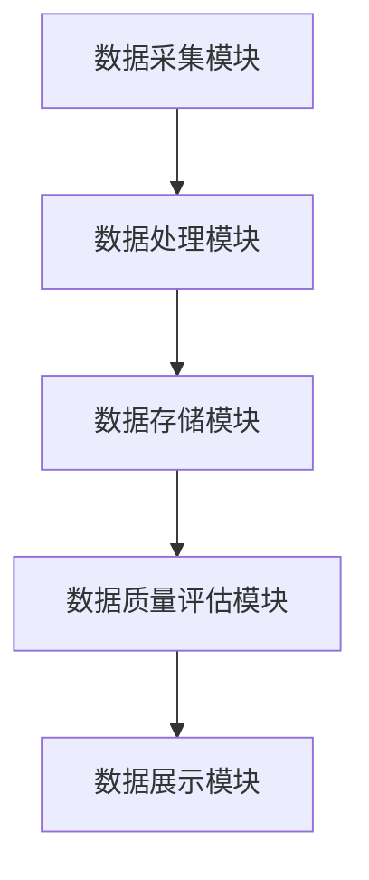
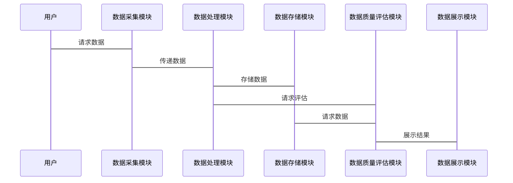

                 


# 金融数据质量自动化控制平台

> 关键词：金融数据，数据质量，数据清洗，异常检测，机器学习

> 摘要：金融数据的质量直接影响金融业务的决策和风险控制。本文章介绍了金融数据质量的重要性，详细讲解了数据质量管理的核心概念、算法原理、系统架构设计以及项目实战。通过分析金融数据的特点和挑战，提出了基于机器学习的金融数据质量自动化控制平台的设计与实现方案。

---

# 第1章: 金融数据质量概述

## 1.1 金融数据的特点与重要性

### 1.1.1 金融数据的定义与特点
金融数据是指与金融业务相关的各种数据，包括但不限于股票价格、交易数据、市场指数、用户行为数据等。其特点包括：
- 高实时性：金融数据需要快速采集和处理。
- 高准确性：金融决策依赖于准确的数据。
- 高关联性：金融数据之间往往存在复杂的关联关系。
- 高敏感性：金融数据通常涉及敏感信息，需要严格保护。

### 1.1.2 金融数据的重要性与应用场景
金融数据是金融业务的核心，广泛应用于以下场景：
- 金融交易：实时交易数据的处理和分析。
- 风险管理：通过数据分析识别和控制风险。
- 投资决策：基于历史数据进行投资策略的制定。
- 监管合规：满足金融监管机构的要求。

### 1.1.3 数据质量对金融业务的影响
数据质量直接影响金融业务的决策和风险控制。低质量的数据可能导致错误的交易决策、合规问题以及巨大的经济损失。

## 1.2 数据质量管理的背景与挑战

### 1.2.1 数据质量问题的背景
随着金融业务的复杂化和数据量的爆炸式增长，数据质量问题日益突出。数据来源多样化、数据格式不统一、数据采集过程中的错误等原因导致数据质量下降。

### 1.2.2 金融数据质量面临的挑战
- 数据源多样化：数据来自不同的系统和渠道，格式和标准不统一。
- 数据量大：金融数据通常以海量数据形式存在，处理和存储成本高。
- 数据准确性：数据采集和传输过程中可能出现错误。
- 数据一致性：不同系统中的数据可能不一致，导致数据冲突。

### 1.2.3 数据质量管理的必要性
- 提高数据准确性：确保数据的准确性和可靠性。
- 降低风险：避免因数据错误导致的决策失误和经济损失。
- 提高效率：通过自动化数据质量管理，减少人工干预，提高处理效率。

---

# 第2章: 数据质量管理的核心概念

## 2.1 数据质量管理的定义与目标

### 2.1.1 数据质量管理的定义
数据质量管理（Data Quality Management, DQM）是指通过一系列方法和技术，确保数据的准确性、一致性、完整性和有效性。

### 2.1.2 数据质量管理的目标
- 提高数据质量：确保数据的准确性、完整性和一致性。
- 降低数据风险：减少因数据错误导致的业务风险。
- 提高数据利用率：通过高质量的数据支持更高效的业务决策。

## 2.2 数据质量评估的关键指标

### 2.2.1 数据完整性
数据完整性是指数据的完整性和齐备性。例如，数据库中的记录是否缺失关键字段。

### 2.2.2 数据准确性
数据准确性是指数据与真实情况的一致性。例如，股票价格是否准确反映了市场情况。

### 2.2.3 数据一致性
数据一致性是指数据在不同系统或数据库中的统一性。例如，同一客户在不同系统中的信息是否一致。

### 2.2.4 数据及时性
数据及时性是指数据的更新速度和相关性。例如，交易数据是否及时更新。

## 2.3 数据质量管理的流程与方法

### 2.3.1 数据质量管理的流程
1. 数据收集：从多个数据源收集数据。
2. 数据清洗：去除错误数据，填补缺失数据。
3. 数据转换：将数据转换为统一的格式。
4. 数据验证：验证数据的准确性和一致性。
5. 数据存储：将清洗后的数据存储到数据库中。

### 2.3.2 数据质量管理的方法
- 基于规则的检查：根据预定义的规则检查数据质量。
- 基于统计的分析：通过统计方法识别数据异常。
- 基于机器学习的分析：利用机器学习模型自动识别数据质量问题。

---

# 第3章: 数据清洗算法

## 3.1 数据清洗的定义与作用

### 3.1.1 数据清洗的定义
数据清洗是指通过一系列方法和技术，去除或纠正数据中的错误和不一致。

### 3.1.2 数据清洗的作用
- 去除错误数据：例如，重复数据、无效数据。
- 填补缺失数据：例如，缺失的交易时间或价格。
- 数据标准化：将不同格式的数据统一化。

## 3.2 数据清洗的关键算法

### 3.2.1 基于规则的清洗算法
基于预定义的规则进行数据清洗。例如：
- 去除重复数据。
- 填补缺失值：使用均值、中位数或插值法填补缺失值。

### 3.2.2 基于统计的清洗算法
基于统计方法识别异常数据。例如：
- 使用Z-score方法识别异常值。
- 使用箱线图识别异常值。

### 3.2.3 基于机器学习的清洗算法
利用机器学习模型识别数据中的异常值。例如：
- 使用Isolation Forest算法识别异常值。
- 使用聚类算法识别异常值。

## 3.3 数据清洗的实现步骤

### 3.3.1 数据预处理
- 数据格式转换：将数据转换为统一格式。
- 数据去重：去除重复数据。

### 3.3.2 数据过滤
- 基于规则的过滤：例如，去除不符合业务规则的数据。
- 基于统计的过滤：例如，去除偏离均值过多的异常值。

### 3.3.3 数据修复
- 数据插值：使用均值、中位数或回归模型填补缺失值。
- 数据标准化：将数据转换为统一的格式。

## 3.4 本章小结

---

# 第4章: 数据增强与异常检测算法

## 4.1 数据增强的定义与作用

### 4.1.1 数据增强的定义
数据增强是指通过增加数据的多样性和丰富性，提高数据的质量。

### 4.1.2 数据增强的作用
- 提高模型的泛化能力。
- 降低过拟合的风险。

## 4.2 异常检测算法

### 4.2.1 基于统计的异常检测
- Z-score方法：计算数据点与均值的偏差程度。
- 箱线图方法：识别数据中的异常值。

### 4.2.2 基于机器学习的异常检测
- Isolation Forest算法：通过树状结构隔离异常值。
- One-Class SVM算法：通过支持向量机识别异常值。

### 4.2.3 基于深度学习的异常检测
- Autoencoder算法：通过自编码器重构数据，识别异常值。
- GAN算法：通过生成对抗网络识别异常值。

## 4.3 算法实现与优化

### 4.3.1 算法实现步骤
1. 数据预处理：清洗数据，去除异常值。
2. 数据增强：增加数据的多样性和丰富性。
3. 模型训练：使用机器学习或深度学习模型训练异常检测模型。
4. 模型评估：通过准确率、召回率等指标评估模型性能。

### 4.3.2 算法优化策略
- 调整模型参数：例如，调整Isolation Forest的树深度。
- 使用集成学习：例如，使用投票法集成多个模型的预测结果。

## 4.4 本章小结

---

# 第5章: 金融数据质量自动化控制平台的系统架构设计

## 5.1 问题场景介绍
金融数据质量自动化控制平台的目标是通过自动化技术，提高金融数据的质量和准确性。平台需要处理海量数据，实时监测数据质量，并自动修复数据中的错误和异常。

## 5.2 系统功能设计

### 5.2.1 数据采集模块
- 数据源管理：支持多种数据源（如数据库、API、文件）。
- 数据采集：实时采集金融数据。

### 5.2.2 数据处理模块
- 数据清洗：去除错误数据，填补缺失数据。
- 数据增强：增加数据的多样性和丰富性。
- 数据转换：将数据转换为统一的格式。

### 5.2.3 数据存储模块
- 数据库存储：将清洗后的数据存储到关系型数据库中。
- 数据仓库：存储海量数据，支持高效查询。

### 5.2.4 数据质量评估模块
- 数据质量检查：通过预定义的规则和算法检查数据质量。
- 异常检测：识别数据中的异常值。
- 数据报告：生成数据质量报告，展示数据问题。

### 5.2.5 数据展示模块
- 数据可视化：通过图表展示数据质量状况。
- 数据监控：实时监控数据质量，及时报警异常情况。

## 5.3 系统架构设计

### 5.3.1 系统架构图


### 5.3.2 系统交互流程图


## 5.4 接口设计与安全性

### 5.4.1 接口设计
- 数据采集接口：支持多种数据源的接入。
- 数据处理接口：提供数据清洗和增强的功能。
- 数据存储接口：支持高效的数据存储和查询。
- 数据展示接口：提供数据可视化和监控的功能。

### 5.4.2 安全性设计
- 数据加密：在数据传输和存储过程中加密数据。
- 权限控制：限制用户对敏感数据的访问权限。
- 日志记录：记录数据操作日志，便于审计和追溯。

---

# 第6章: 项目实战

## 6.1 环境安装

### 6.1.1 安装Python
```bash
python --version
pip install --upgrade pip
```

### 6.1.2 安装依赖库
```bash
pip install pandas numpy scikit-learn matplotlib
```

## 6.2 核心实现源代码

### 6.2.1 数据清洗代码
```python
import pandas as pd
import numpy as np

# 读取数据
df = pd.read_csv('data.csv')

# 去除重复数据
df.drop_duplicates(inplace=True)

# 填补缺失值
df['price'].fillna(df['price'].mean(), inplace=True)

# 数据标准化
from sklearn.preprocessing import StandardScaler
scaler = StandardScaler()
df['scaled_price'] = scaler.fit_transform(df['price'].values.reshape(-1, 1))
```

### 6.2.2 异常检测代码
```python
from sklearn.ensemble import IsolationForest

# 训练异常检测模型
model = IsolationForest(random_state=42)
model.fit(X)

# 预测异常值
y_pred = model.predict(X)
outliers = df[y_pred == -1]
```

## 6.3 代码应用解读与分析

### 6.3.1 数据清洗代码解读
- 使用Pandas库读取CSV格式的数据。
- 去除重复数据：`drop_duplicates`。
- 填补缺失值：使用均值填补缺失的`price`字段。
- 数据标准化：使用`StandardScaler`将`price`字段标准化。

### 6.3.2 异常检测代码解读
- 使用Isolation Forest算法训练异常检测模型。
- 预测数据中的异常值：`y_pred == -1`表示异常值。
- 输出异常数据：`outliers`包含被识别为异常的记录。

## 6.4 实际案例分析

### 6.4.1 数据清洗案例
假设我们有一个包含股票交易数据的CSV文件，其中有些交易时间字段缺失。通过数据清洗代码，我们可以填补缺失的交易时间。

### 6.4.2 异常检测案例
假设我们有一个包含客户交易数据的CSV文件，其中有些交易金额异常。通过异常检测代码，我们可以识别并隔离异常交易。

## 6.5 项目小结

---

# 第7章: 最佳实践与总结

## 7.1 最佳实践

### 7.1.1 数据质量管理的注意事项
- 定期检查数据质量：定期进行数据清洗和增强。
- 数据安全：确保数据的安全性和隐私性。
- 模型优化：不断优化数据清洗和异常检测算法。

### 7.1.2 项目总结
通过金融数据质量自动化控制平台的实现，我们可以显著提高金融数据的质量和准确性。平台的自动化功能降低了人工干预的成本，提高了数据处理的效率。

## 7.2 小结
金融数据质量是金融业务的核心，通过自动化控制平台，我们可以更高效地管理数据质量，降低数据风险，提高业务决策的准确性。

## 7.3 注意事项
- 数据质量管理需要持续进行，不能一劳永逸。
- 数据安全是数据质量管理的重要组成部分。
- 在实际应用中，需要根据具体业务需求调整数据质量管理策略。

## 7.4 拓展阅读
- 《数据质量管理：方法与实践》
- 《机器学习在金融领域的应用》
- 《数据可视化与分析》

---

# 作者：AI天才研究院/AI Genius Institute & 禅与计算机程序设计艺术/Zen And The Art of Computer Programming

