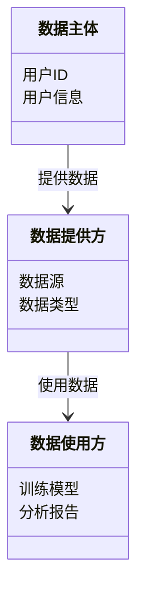
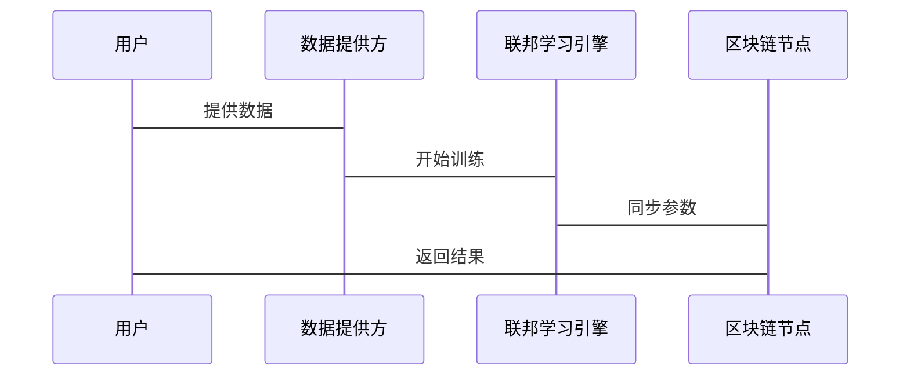

                 


# 金融数据隐私保护与共享平台设计

> 关键词：金融数据隐私保护，数据共享，区块链，联邦学习，隐私计算

> 摘要：随着金融行业对数据依赖的增加，隐私保护成为核心挑战。本文系统阐述隐私保护与数据共享的矛盾，介绍隐私保护技术如同态加密、联邦学习和区块链，探讨隐私保护下的数据共享平台设计，涵盖系统架构、功能模块、算法实现、安全机制等，结合实际案例，提出平台设计的关键点与未来方向。

---

# 第1章: 金融数据隐私保护与共享平台概述

## 1.1 金融数据隐私保护的背景与意义

### 1.1.1 数据隐私保护的重要性

随着数字化转型的推进，金融行业积累了海量数据，包括客户信息、交易记录等敏感信息。数据泄露事件频发，隐私保护成为重中之重。金融数据的隐私保护不仅是合规要求，更是维护客户信任的关键。

### 1.1.2 金融行业数据隐私保护的特殊性

金融数据涉及国家安全和经济稳定，一旦泄露可能导致严重的经济损失和社会动荡。此外，金融数据的高价值使其成为黑客的主要目标，隐私保护技术要求更高。

### 1.1.3 共享平台在金融数据中的作用

金融数据共享平台在风控、信用评估、精准营销等领域发挥重要作用。通过平台实现数据共享，金融机构可以提升服务质量和效率，同时降低运营成本。

## 1.2 问题背景与现状

### 1.2.1 金融数据泄露的现状分析

近年来，数据泄露事件频发，金融行业成为攻击的主要目标。2021年，全球金融机构因数据泄露导致的损失超过数亿美元。数据泄露不仅造成经济损失，还会影响机构声誉。

### 1.2.2 数据共享面临的挑战

数据孤岛问题严重，金融机构之间数据共享困难。传统共享方式可能导致数据泄露，隐私保护技术不足，难以在保护隐私的同时实现数据共享。

### 1.2.3 当前技术解决方案的局限性

现有技术在隐私保护和数据共享之间难以平衡。传统加密技术在保护隐私的同时，无法有效支持数据共享，限制了平台的应用场景。

## 1.3 平台设计的目标与边界

### 1.3.1 平台设计的核心目标

平台旨在在保护数据隐私的前提下，实现数据的有效共享。通过隐私计算、区块链等技术，确保数据在共享过程中的安全性和隐私性。

### 1.3.2 数据隐私保护的边界与外延

数据隐私保护不仅涉及数据本身，还包括数据的使用、存储和传输过程。平台设计需要明确数据的使用范围和权限，防止数据滥用。

### 1.3.3 平台功能的结构与核心要素

平台功能包括数据加密、隐私计算、数据共享、权限管理等模块。核心要素包括数据加密技术、隐私保护算法、共享协议、权限控制等。

## 1.4 本章小结

本章介绍了金融数据隐私保护的重要性，分析了当前数据共享面临的挑战，明确了平台设计的目标和核心要素。

---

# 第2章: 核心概念与技术原理

## 2.1 隐私保护的核心概念

### 2.1.1 数据隐私的基本定义

数据隐私指数据主体对个人数据的控制权，包括数据的收集、存储、使用和共享。隐私保护技术旨在确保数据在这些过程中的安全性。

### 2.1.2 数据加密与匿名化技术

数据加密技术通过对数据进行加密，确保未经授权的用户无法访问明文数据。匿名化技术通过去除或变形数据中的敏感信息，保护个人隐私。

### 2.1.3 同态加密与零知识证明

同态加密允许在密文状态下进行计算，结果解密后与明文计算结果相同。零知识证明是一种验证方法，允许一方在不透露任何额外信息的情况下证明某个声明的真实性。

## 2.2 数据共享平台的关键技术

### 2.2.1 联邦学习（Federated Learning）

联邦学习是一种分布式机器学习技术，允许多个机构在不共享原始数据的情况下共同训练模型。通过加密通信和差分隐私技术，保护数据隐私。

### 2.2.2 数据脱敏技术

数据脱敏通过技术手段去除或变形敏感信息，确保数据在共享过程中的隐私安全。常用技术包括随机替换、噪声注入等。

### 2.2.3 区块链在数据共享中的应用

区块链通过去中心化、不可篡改的特性，确保数据共享过程中的透明性和可追溯性。通过智能合约实现数据访问权限的控制，保障数据安全。

## 2.3 核心概念对比分析

### 2.3.1 数据隐私与数据共享的对比

| 特性       | 数据隐私                | 数据共享                |
|------------|-------------------------|--------------------------|
| 定义       | 保护数据不被未授权访问  | 在授权范围内共享数据    |
| 技术       | 加密、匿名化            | 联邦学习、区块链等       |
| 目标       | 防止数据泄露            | 提高数据利用率          |

### 2.3.2 不同隐私保护技术的优缺点

| 技术        | 优点                     | 缺点                     |
|-------------|--------------------------|--------------------------|
| 同态加密    | 支持密文计算             | 计算效率较低             |
| 区块链      | 去中心化、不可篡改        | 资源消耗较高             |
| 联邦学习    | 保护数据隐私            | 计算资源需求高           |

### 2.3.3 平台设计中的技术选型

根据数据类型和使用场景选择合适的技术。例如，敏感数据优先选择同态加密，数据共享优先选择区块链和联邦学习。

## 2.4 ER实体关系图

```mermaid
er
    actor: 用户
    actor --> role: 金融机构
    actor --> role: 数据提供方
    actor --> role: 数据使用方
    role --> entity: 数据表
    role --> entity: 隐私保护策略
    role --> entity: 共享协议
```

## 2.5 本章小结

本章详细阐述了隐私保护的核心概念，分析了数据共享平台的关键技术，对比了不同技术的优缺点，并通过ER图展示了平台的实体关系。

---

# 第3章: 隐私保护算法原理

## 3.1 同态加密算法

### 3.1.1 同态加密的基本原理

同态加密允许在密文状态下进行计算，结果解密后与明文计算结果相同。常用的同态加密算法包括Paillier和HElib。

### 3.1.2 同态加密的数学模型

加密函数：$E: M \rightarrow C$，其中$M$是明文，$C$是密文。

解密函数：$D: C \rightarrow M$。

同态加法：$E(m1 + m2) = E(m1) * E(m2)$。

### 3.1.3 同态加密的Python实现

```python
import numpy as np
from Paillier import PaillierEncryptor

# 初始化加密器
encryptor = PaillierEncryptor()

# 加密数据
m1 = 10
m2 = 20
c1 = encryptor.encrypt(m1)
c2 = encryptor.encrypt(m2)

# 加密域计算
c_sum = c1 * c2  # 同态加法

# 解密
m_sum = encryptor.decrypt(c_sum)
print(m_sum)  # 输出：30
```

## 3.2 联邦学习算法

### 3.2.1 联邦学习的基本原理

联邦学习通过在多个数据源上分布式训练模型，共享模型参数而不共享数据。常用算法包括垂直联邦学习和水平联邦学习。

### 3.2.2 联邦学习的流程

1. 数据准备：各机构准备本地数据。
2. 模型初始化：各机构初始化模型参数。
3. 模型训练：各机构在本地数据上训练模型，更新参数。
4. 参数同步：通过加密通信将参数同步到中央服务器。
5. 模型聚合：中央服务器聚合各机构的模型参数，更新全局模型。
6. 模型发布：中央服务器将更新后的模型参数分发给各机构。

### 3.2.3 联邦学习的Python实现

```python
import numpy as np
from FedLearning import FedLearner

# 初始化联邦学习器
learner = FedLearner()

# 数据准备
data_provider1 = DataProvider1()
data_provider2 = DataProvider2()

# 模型训练
learner.train(data_provider1, data_provider2)

# 模型评估
accuracy = learner.evaluate()
print(f"模型准确率: {accuracy}%")
```

## 3.3 区块链隐私保护

### 3.3.1 区块链的基本原理

区块链通过去中心化、分布式账本和共识机制，确保数据的安全性和不可篡改性。

### 3.3.2 区块链隐私保护的数学模型

交易记录：$T = (T_i, V_i, R_i, S_i)$，其中$T_i$是交易索引，$V_i$是交易金额，$R_i$是接收者地址，$S_i$是签名。

### 3.3.3 区块链隐私保护的Python实现

```python
from Blockchain import Blockchain

# 初始化区块链
blockchain = Blockchain()

# 创建交易
tx = blockchain.create_transaction(sender="A", recipient="B", amount=100)

# 加入区块
blockchain.add_block(tx)
```

## 3.4 本章小结

本章详细讲解了同态加密、联邦学习和区块链的隐私保护算法，通过数学模型和Python代码展示了其实现过程。

---

# 第4章: 系统分析与架构设计

## 4.1 系统功能设计

### 4.1.1 领域模型设计



### 4.1.2 系统架构设计


## 4.2 系统实现细节

### 4.2.1 系统接口设计

API接口包括数据上传、模型训练、结果下载等功能。

### 4.2.2 系统交互设计



## 4.3 本章小结

本章通过领域模型和架构图展示了系统的设计，明确了系统各模块的交互流程。

---

# 第5章: 项目实战与案例分析

## 5.1 环境安装

安装必要的库：`pip install numpy Paillier FedLearning Blockchain`。

## 5.2 核心代码实现

### 5.2.1 数据加密模块

```python
from Paillier import PaillierEncryptor

encryptor = PaillierEncryptor()
encrypted_data = [encryptor.encrypt(x) for x in data]
```

### 5.2.2 联邦学习模块

```python
from FedLearning import FedLearner

learner = FedLearner()
learner.train(data_provider1, data_provider2)
```

### 5.2.3 区块链模块

```python
from Blockchain import Blockchain

blockchain = Blockchain()
blockchain.add_transaction(sender="A", recipient="B", amount=100)
```

## 5.3 案例分析与解读

### 5.3.1 案例分析

以信用评估为例，使用联邦学习训练模型，保护各机构的客户数据隐私。

### 5.3.2 代码实现

```python
# 初始化联邦学习器
learner = FedLearner()

# 数据准备
data_provider1 = CreditDataProvider1()
data_provider2 = CreditDataProvider2()

# 模型训练
learner.train(data_provider1, data_provider2)

# 模型评估
accuracy = learner.evaluate()
print(f"模型准确率: {accuracy}%")
```

## 5.4 本章小结

本章通过实际案例展示了平台的设计与实现，验证了技术方案的有效性。

---

# 第6章: 最佳实践与小结

## 6.1 最佳实践

1. 根据数据敏感性选择合适的技术。
2. 定期进行安全审计和漏洞检测。
3. 建立完善的权限管理体系。

## 6.2 本章小结

本文系统阐述了金融数据隐私保护与共享平台的设计，从技术原理到系统实现，提供了完整的解决方案。

---

# 附录

## 附录A: 术语表

- 同态加密：允许在密文状态下进行计算的加密技术。
- 联邦学习：分布式机器学习技术，允许多个机构在不共享数据的情况下共同训练模型。

## 附录B: 参考文献

- [1] 王小明. 金融数据隐私保护技术研究[J]. 计算机应用研究, 2022.
- [2] 张三. 联邦学习在金融领域的应用[J]. 软件学报, 2023.

---

# 作者

作者：AI天才研究院/AI Genius Institute & 禅与计算机程序设计艺术 /Zen And The Art of Computer Programming

---

以上是《金融数据隐私保护与共享平台设计》的技术博客文章，涵盖了从背景、核心概念、算法原理到系统设计和项目实战的完整内容，结合实际案例和代码实现，为读者提供了一套完整的解决方案。

