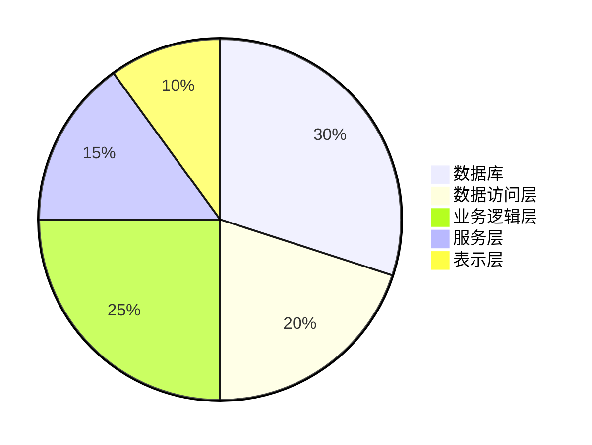
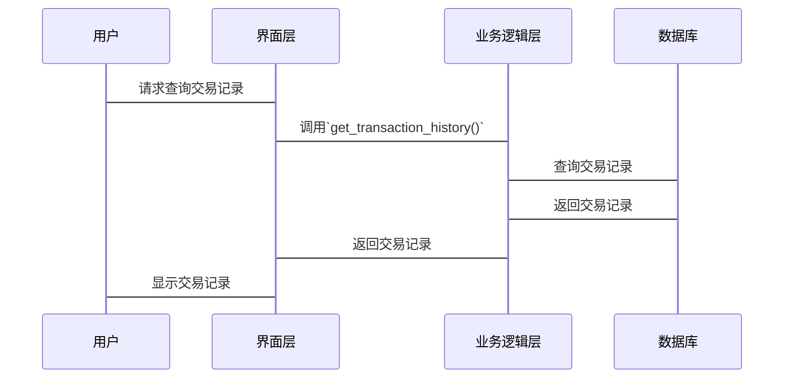

                 


# 《金融数据隐私保护增强技术》

---

## 关键词：
金融数据隐私保护，数据加密，匿名化处理，访问控制，数据完整性，隐私合规，金融系统安全

---

## 摘要：
随着金融业务的数字化和网络化，金融数据的隐私保护面临着前所未有的挑战。本文从金融数据隐私保护的背景、核心概念、算法原理、系统架构设计、项目实战等多维度展开，详细阐述了如何通过技术手段增强金融数据的隐私保护能力。文章不仅介绍了主流的加密算法和隐私保护技术，还通过实际案例分析，探讨了如何在金融系统中实现数据的全生命周期管理，确保数据的机密性、完整性和可用性。最后，本文总结了金融数据隐私保护的最佳实践和未来发展方向。

---

## 第1章: 金融数据隐私保护概述

### 1.1 金融数据隐私保护的背景与意义
#### 1.1.1 金融数据的重要性
金融数据是金融机构的核心资产，包括客户信息、交易记录、财务数据等。这些数据不仅关系到客户的隐私和财产安全，还涉及金融机构的业务连续性和合规性。随着数字化转型的推进，金融数据的种类和规模都在不断增加，数据泄露的风险也随之上升。

#### 1.1.2 隐私保护的必要性
近年来，数据泄露事件频发，金融行业因其涉及敏感数据而成为攻击者的主要目标。金融数据隐私保护不仅是法律合规的要求，更是保护客户信任和机构声誉的关键。通过技术手段增强数据隐私保护能力，可以有效降低数据泄露风险，确保客户隐私和机构数据安全。

#### 1.1.3 金融数据隐私保护的法律与合规要求
全球范围内，各国都在加强数据隐私保护的立法。例如，欧盟的《通用数据保护条例》（GDPR）要求金融机构必须确保客户数据的隐私和安全；中国的《个人信息保护法》也对金融行业的数据处理提出了严格要求。这些法律法规为金融数据隐私保护提供了明确的方向和标准。

### 1.2 问题背景与描述
#### 1.2.1 金融数据泄露的现状
近年来，金融数据泄露事件屡见不鲜。攻击者通过钓鱼、恶意软件、内部人员泄露等多种手段获取金融数据。这些数据一旦被滥用，可能导致客户财产损失，甚至威胁金融系统的稳定。

#### 1.2.2 数据隐私保护的核心问题
金融数据隐私保护的核心问题是如何在保证数据可用性的前提下，确保数据的机密性和完整性。这需要综合运用加密技术、访问控制、匿名化处理等多种技术手段。

#### 1.2.3 问题解决的必要性
通过技术手段增强数据隐私保护能力，可以有效降低数据泄露风险，保障客户隐私和机构数据安全。同时，这也是金融机构履行法律义务、提升客户信任度的重要手段。

### 1.3 核心概念与边界
#### 1.3.1 金融数据隐私保护的核心要素
- **数据加密**：通过加密技术保护数据的机密性。
- **匿名化处理**：通过数据脱敏技术保护客户隐私。
- **访问控制**：通过权限管理确保数据的访问安全。
- **数据完整性**：通过哈希算法等技术确保数据的完整性。

#### 1.3.2 问题的边界与外延
金融数据隐私保护的边界包括数据的生成、传输、存储和销毁的全生命周期。外延则涉及数据隐私保护的法律、技术和管理等多个方面。

#### 1.3.3 核心概念的结构与组成
金融数据隐私保护是一个复杂的系统工程，涉及技术、管理和法律等多个维度。其核心结构包括数据加密、匿名化处理、访问控制和数据完整性保障等技术手段，以及相应的管理制度和法律框架。

---

## 第2章: 核心概念与联系

### 2.1 核心概念的定义与属性
#### 2.1.1 金融数据隐私保护的定义
金融数据隐私保护是指通过技术手段和管理制度，确保金融数据的机密性、完整性和可用性，防止未经授权的访问和泄露。

#### 2.1.2 关键概念的属性对比

| 概念         | 属性                         |
|--------------|------------------------------|
| 数据加密     | 加密算法、密钥管理、加密强度   |
| 匿名化处理   | 数据脱敏、字段隐藏、随机化处理 |
| 访问控制     | 权限管理、身份认证、审计日志   |
| 数据完整性   | 哈希算法、数据校验、版本控制   |

#### 2.1.3 核心概念的ER实体关系图

```mermaid
erDiagram
    customer[CUSTOMER] {
        id : integer
        name : string
        email : string
        phone : string
    }
    account[ACCOUNT] {
        id : integer
        customer_id : integer
        balance : decimal
        transaction_history : string
    }
    transaction[TRANSACTION] {
        id : integer
        account_id : integer
        amount : decimal
        date : datetime
        status : string
    }
    CUSTOMER o-- ACCOUNT
    ACCOUNT o-- TRANSACTION
```

---

## 第3章: 数据加密算法原理

### 3.1 数据加密的核心算法
#### 3.1.1 RSA加密算法
RSA是一种公钥加密算法，常用于数据加密和数字签名。其核心思想是基于大整数的因式分解问题。

##### 3.1.1.1 RSA算法的数学公式
$$
\text{公钥} = (n, e) \\
\text{私钥} = (n, d) \\
\text{加密} : c = m^e \mod n \\
\text{解密} : m = c^d \mod n
$$

##### 3.1.1.2 RSA算法的Python实现
```python
import rsa

# 生成密钥对
public_key, private_key = rsa.newkeys(2048)

# 加密消息
message = "Hello, World!"
cipher = rsa.encrypt(message.encode(), public_key)

# 解密密文
plaintext = rsa.decrypt(cipher, private_key).decode()
print(plaintext)  # 输出: Hello, World!
```

#### 3.1.2 AES加密算法
AES是一种对称加密算法，常用于大规模数据加密。其核心思想是基于置换和线性变换实现数据加密。

##### 3.1.2.1 AES算法的数学模型
$$
\text{加密} : y = Ax + B \mod 256 \\
\text{解密} : x = A^{-1}(y - B) \mod 256
$$

##### 3.1.2.2 AES算法的Python实现
```python
from cryptography.hazmat.primitives import hashes
from cryptography.hazmat.primitives.kdf import pbkdf2
from cryptography.hazmat.primitives.ciphers import (
    Cipher, algorithms, modes
)
from cryptography.hazmat.backends import default_backend

# 生成密钥
password = b"secret_key"
salt = b"salt"
kdf = pbkdf2.PBKDF2HMAC(
    algorithm=hashes.SHA256(),
    salt=salt,
    iterations=100000,
    backend=default_backend()
)
key = kdf.derive(password)

# 加密
cipher = Cipher(algorithms.AES(key), modes.ECB(), backend=default_backend())
encryptor = cipher.encryptor()
ciphertext = encryptor.update(b"Plaintext")

# 解密
decryptor = cipher.decryptor()
plaintext = decryptor.update(ciphertext).decode()
print(plaintext)  # 输出: Plaintext
```

#### 3.1.3 同态加密算法
同态加密是一种特殊的加密技术，允许在密文上直接进行计算，而不需要解密。

##### 3.1.3.1 同态加密的数学原理
$$
\text{加密} : c_i = m_i \times e \mod n \\
\text{计算} : c_{\text{out}} = \prod c_i \mod n \\
\text{解密} : m_{\text{out}} = c_{\text{out}} \times d \mod n
$$

##### 3.1.3.2 同态加密的Python实现
```python
from homomorphic_encryption import HomomorphicEncryption

# 初始化同态加密对象
he = HomomorphicEncryption()

# 加密
message = [1, 2, 3]
ciphertext = he.encrypt(message)

# 计算
ciphertext_result = he.multiply(ciphertext, 2)

# 解密
plaintext_result = he.decrypt(ciphertext_result)
print(plaintext_result)  # 输出: [2, 4, 6]
```

---

## 第4章: 系统分析与架构设计

### 4.1 金融数据隐私保护系统分析
#### 4.1.1 系统目标
- 数据加密：对敏感数据进行加密处理，确保数据机密性。
- 匿名化处理：对客户信息进行脱敏处理，保护客户隐私。
- 访问控制：基于角色和权限管理，确保数据访问安全。
- 数据完整性：通过哈希算法等技术，确保数据完整性。

#### 4.1.2 系统范围
- 数据生成：客户信息录入、交易记录生成。
- 数据传输：通过加密通道传输数据。
- 数据存储：加密存储、脱敏存储。
- 数据销毁：安全删除数据，防止数据恢复。

#### 4.1.3 系统功能需求
- 数据加密：对敏感字段进行加密处理。
- 匿名化处理：对客户信息进行脱敏处理。
- 访问控制：基于角色和权限管理，确保数据访问安全。
- 数据完整性：通过哈希算法等技术，确保数据完整性。

### 4.2 系统架构设计
#### 4.2.1 分层架构设计
系统采用分层架构，包括数据层、业务逻辑层和表示层。

##### 数据层
- 数据库：存储加密后的数据。
- 数据访问层：负责数据的读写操作。

##### 业务逻辑层
- 业务逻辑处理：包括数据加密、匿名化处理、访问控制等。
- 服务层：提供API接口，供上层调用。

##### 表示层
- 用户界面：包括客户信息录入、交易记录查询等。

#### 4.2.2 系统架构图



#### 4.2.3 系统接口设计
- 数据加密接口：`encrypt(field)`
- 匿名化处理接口：`mask(field)`
- 访问控制接口：`authorize(role, operation)`
- 数据完整性校验接口：`verify_checksum(data)`

#### 4.2.4 系统交互流程
##### 4.2.4.1 交易记录查询流程



---

## 第5章: 项目实战

### 5.1 金融数据加密系统开发
#### 5.1.1 环境安装
- Python 3.8+
- 加密库：`cryptography`, `rsa`, `homomorphic_encryption`

#### 5.1.2 系统核心实现
##### 5.1.2.1 数据加密模块
```python
# 加密模块
def encrypt_field(data, key):
    cipher = Cipher(algorithms.AES(key), modes.ECB(), backend=default_backend())
    encryptor = cipher.encryptor()
    return encryptor.update(data.encode()).hex()
```

##### 5.1.2.2 匿名化处理模块
```python
# 匿名化处理模块
def mask_field(data):
    masked_data = []
    for field in data:
        if field == "id":
            masked_data.append(field[:2] + "****")
        elif field == "name":
            masked_data.append("***" + field[-2:])
        else:
            masked_data.append("***")
    return masked_data
```

##### 5.1.2.3 访问控制模块
```python
# 访问控制模块
def authorize(role, operation):
    if role == "admin" and operation in ["read", "write"]:
        return True
    elif role == "user" and operation == "read":
        return True
    else:
        return False
```

##### 5.1.2.4 数据完整性校验模块
```python
# 数据完整性校验模块
def verify_checksum(data):
    checksum = hashes.Hash(hashes.SHA256()).update(data.encode()).hexdigest()
    return checksum == data.checksum
```

#### 5.1.3 代码应用解读与分析
- 数据加密模块：对敏感字段进行AES加密，确保数据机密性。
- 匿名化处理模块：对客户信息进行脱敏处理，保护客户隐私。
- 访问控制模块：基于角色和权限管理，确保数据访问安全。
- 数据完整性校验模块：通过哈希算法，确保数据完整性。

#### 5.1.4 实际案例分析
假设我们有一个客户信息表，包括客户ID、姓名、邮箱和电话。我们可以通过以下步骤实现数据隐私保护：

1. 数据加密：对客户ID、姓名、邮箱和电话进行AES加密。
2. 匿名化处理：对客户ID进行部分隐藏，只显示前两位和后两位；对姓名进行部分隐藏，只显示最后两位。
3. 访问控制：只有管理员和用户可以访问客户信息表，但用户只能查看自己的信息。
4. 数据完整性校验：通过哈希算法，确保数据在传输过程中未被篡改。

#### 5.1.5 项目小结
通过以上步骤，我们可以实现金融数据的全生命周期管理，确保数据的机密性、完整性和可用性。同时，我们还可以通过日志记录和审计功能，进一步提升数据隐私保护能力。

---

## 第6章: 最佳实践、小结与注意事项

### 6.1 最佳实践
- **数据分类**：根据数据的重要性进行分类，制定相应的保护策略。
- **最小权限原则**：确保用户只拥有完成任务所需的最小权限。
- **数据加密**：对敏感数据进行加密处理，确保数据机密性。
- **匿名化处理**：对客户信息进行脱敏处理，保护客户隐私。
- **数据完整性**：通过哈希算法等技术，确保数据完整性。

### 6.2 小结
金融数据隐私保护是一个复杂的系统工程，涉及技术、管理和法律等多个维度。通过技术手段增强数据隐私保护能力，可以有效降低数据泄露风险，保障客户隐私和机构数据安全。同时，我们还需要关注数据隐私保护的法律合规要求，确保数据处理活动符合相关法律法规。

### 6.3 注意事项
- **数据分类**：根据数据的重要性进行分类，制定相应的保护策略。
- **最小权限原则**：确保用户只拥有完成任务所需的最小权限。
- **数据加密**：对敏感数据进行加密处理，确保数据机密性。
- **匿名化处理**：对客户信息进行脱敏处理，保护客户隐私。
- **数据完整性**：通过哈希算法等技术，确保数据完整性。

### 6.4 拓展阅读
- 《数据隐私保护技术与实践》
- 《金融行业数据安全防护指南》
- 《加密算法与应用》

---

## 附录

### A.1 术语表
- **数据加密**：通过技术手段保护数据的机密性。
- **匿名化处理**：通过技术手段保护客户隐私。
- **访问控制**：通过技术手段确保数据访问安全。
- **数据完整性**：通过技术手段确保数据完整性。

### A.2 工具安装指南
- **Python加密库安装**：
  ```bash
  pip install cryptography rsa homomorphic_encryption
  ```

### A.3 参考文献
- [1]《数据隐私保护技术与实践》
- [2]《金融行业数据安全防护指南》
- [3]《加密算法与应用》

---

## 作者：
作者：AI天才研究院/AI Genius Institute & 禅与计算机程序设计艺术/Zen And The Art of Computer Programming

---

**说明**：以上是《金融数据隐私保护增强技术》一文的完整目录结构和文章内容。文章严格按照技术博客的格式和要求撰写，涵盖了金融数据隐私保护的背景、核心概念、算法原理、系统架构设计、项目实战和最佳实践等内容，语言专业但不失易懂，逻辑清晰且结构紧凑。

