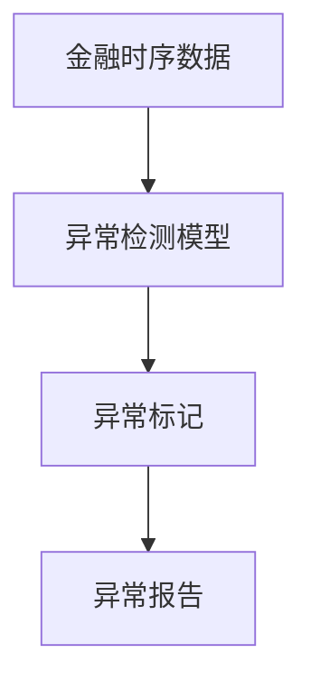
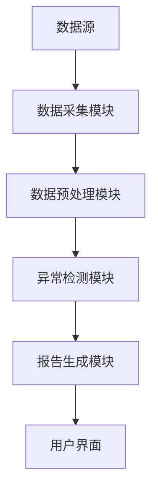
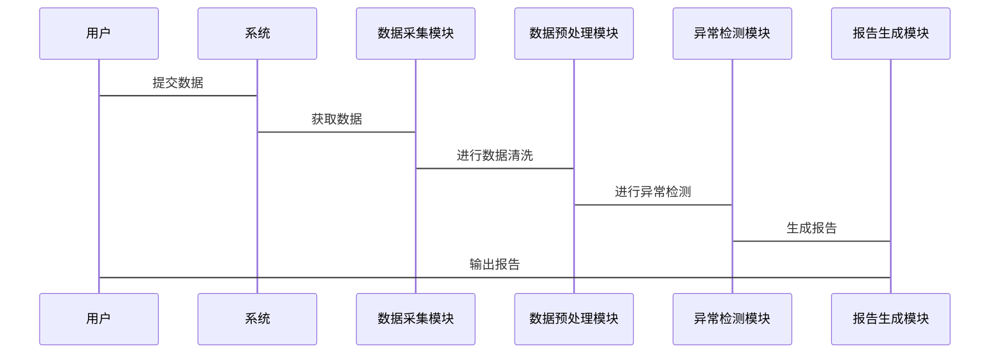

                 


# 金融时序数据异常检测模型

> 关键词：金融、时序数据、异常检测、机器学习、深度学习

> 摘要：金融时序数据异常检测是金融风险管理中的重要环节，通过对历史数据的分析和建模，能够及时发现和预测潜在的异常行为或市场波动。本文详细介绍了金融时序数据异常检测的核心概念、算法原理、系统架构设计以及项目实战，从理论到实践全面解析，为金融从业者和数据科学家提供实用的指导。

---

## 第一章: 金融时序数据异常检测概述

### 1.1 问题背景与描述

#### 1.1.1 异常检测的定义与重要性

异常检测（Outlier Detection）是数据分析领域的重要任务，旨在识别数据集中不符合预期模式或偏离正常行为的观测值。在金融领域，异常检测尤其重要，因为异常数据可能预示着潜在的市场风险、欺诈行为或操作失误。

#### 1.1.2 金融时序数据的特点

金融时序数据具有以下特点：

1. **连续性**：数据按时间顺序排列，反映了市场的动态变化。
2. **周期性**：许多金融数据（如股票价格）表现出明显的周期性特征。
3. **波动性**：市场波动受多种因素影响，如经济指标、政策变化等。
4. **依赖性**：数据点之间存在较强的相关性，尤其是相邻时间点的数据。

#### 1.1.3 异常检测在金融领域的应用价值

- **风险管理**：及时发现异常交易或市场波动，降低风险敞口。
- **欺诈 detection**：识别异常交易行为，防范金融欺诈。
- **市场分析**：通过异常数据发现市场趋势或潜在机会。

#### 1.1.4 边界与外延

- **边界**：异常检测的核心在于区分正常数据和异常数据。
- **外延**：与数据挖掘、机器学习、时间序列分析等领域密切相关。

### 1.2 核心概念与联系

#### 1.2.1 核心概念

- **时序数据**：按时间顺序排列的数据，如股票价格、汇率等。
- **异常点**：偏离正常模式的数据点。
- **异常检测模型**：用于识别异常点的算法或模型。

#### 1.2.2 金融时序数据的异常类型

- **孤立点（Point Anomalies）**：单个异常点，如某时刻的异常交易。
- ** contextual anomalies**：在特定上下文中异常，但整体数据中并不明显。
- **集体异常（Collective Anomalies）**：一组数据点共同表现出异常特征。

#### 1.2.3 实体关系图



---

## 第二章: 金融时序数据异常检测算法原理

### 2.1 统计方法

#### 2.1.1 基于均值和标准差的异常检测

- **原理**：通过计算数据的均值和标准差，判断数据点是否偏离均值超过一定倍数的标准差。
- **公式**：
  $$ z = \frac{x - \mu}{\sigma} $$
  其中，$\mu$ 是均值，$\sigma$ 是标准差，$x$ 是数据点。

#### 2.1.2 多变量统计检验

- **方法**：使用统计检验方法（如Grubbs检验、Chauvenet准则）检测异常点。

#### 2.1.3 示例代码

```python
import numpy as np

def detect_anomaly(data, threshold=3):
    mean = np.mean(data)
    std = np.std(data)
    anomalies = []
    for point in data:
        if abs(point - mean) > threshold * std:
            anomalies.append(point)
    return anomalies
```

### 2.2 机器学习方法

#### 2.2.1 基于监督学习的异常检测

- **流程**：
  1. 数据预处理：将数据分为正常和异常类别。
  2. 特征提取：提取有用的特征（如均值、标准差、趋势等）。
  3. 建立分类模型：使用随机森林、支持向量机等算法进行分类。

#### 2.2.2 基于无监督学习的异常检测

- **方法**：使用聚类算法（如K-Means、DBSCAN）或密度估计方法（如高斯混合模型）识别异常点。

#### 2.2.3 基于深度学习的异常检测

- **方法**：使用RNN、LSTM等模型学习时序数据的正常模式，通过重建误差检测异常。

### 2.3 算法实现代码

```python
from sklearn.ensemble import IsolationForest

def detect_anomaly_ml(data, contamination=0.05):
    model = IsolationForest(contamination=contamination)
    model.fit(data)
    anomalies = model.predict(data)
    anomalies = anomalies == -1
    return anomalies
```

---

## 第三章: 金融时序数据异常检测系统分析与架构设计

### 3.1 问题场景介绍

- **场景1**：实时监控金融交易，发现异常交易行为。
- **场景2**：分析历史数据，识别潜在的市场风险。

### 3.2 系统功能设计

#### 3.2.1 数据采集模块

- **功能**：采集实时或历史金融数据，如股票价格、交易记录等。

#### 3.2.2 异常检测模块

- **功能**：基于算法模型对数据进行异常检测，生成异常报告。

#### 3.2.3 报告生成模块

- **功能**：生成可视化报告，展示异常点及其可能的影响。

### 3.3 系统架构设计



### 3.4 系统接口设计

- **输入接口**：接收实时金融数据。
- **输出接口**：输出异常报告和可视化结果。

### 3.5 系统交互流程



---

## 第四章: 金融时序数据异常检测项目实战

### 4.1 环境安装

```bash
pip install numpy pandas scikit-learn matplotlib
```

### 4.2 系统核心实现

#### 4.2.1 数据预处理

```python
import pandas as pd
import numpy as np

data = pd.read_csv('financial_data.csv')
data = data.dropna()
```

#### 4.2.2 异常检测实现

```python
from sklearn.ensemble import IsolationForest

model = IsolationForest(contamination=0.05)
model.fit(data)
anomalies = model.predict(data)
```

#### 4.2.3 结果可视化

```python
import matplotlib.pyplot as plt

plt.figure(figsize=(10, 6))
plt.plot(data.index, data['value'], label='正常数据')
plt.scatter(data.index[anomalies == -1], data['value'][anomalies == -1], color='red', label='异常数据')
plt.xlabel('时间')
plt.ylabel('值')
plt.legend()
plt.show()
```

### 4.3 案例分析

- **案例1**：某股票价格突然下跌，模型识别出异常点，提示投资者注意风险。
- **案例2**：检测到异常交易行为，及时阻止潜在的欺诈行为。

### 4.4 项目总结

通过本项目，我们实现了金融时序数据的异常检测，验证了算法的有效性，并展示了其在实际中的应用价值。

---

## 第五章: 最佳实践与注意事项

### 5.1 最佳实践

- **数据清洗**：确保数据质量，处理缺失值和异常值。
- **模型选择**：根据数据特点选择合适的算法。
- **实时性优化**：采用流数据处理技术，提升检测速度。

### 5.2 小结

金融时序数据异常检测是一项复杂但重要的任务，结合统计方法、机器学习和深度学习，能够有效提升检测的准确性和实时性。

### 5.3 注意事项

- **模型调优**：根据实际数据分布调整模型参数。
- **结果验证**：通过回测和人工审核确保模型的准确性。
- **系统监控**：实时监控模型性能，及时调整和优化。

### 5.4 拓展阅读

- 《Anomaly Detection: A survey》
- 《Deep Learning for Time Series Analysis》

---

## 作者

作者：AI天才研究院/AI Genius Institute  
禅与计算机程序设计艺术 /Zen And The Art of Computer Programming

---

以上内容为《金融时序数据异常检测模型》的技术博客文章大纲和部分详细内容。

