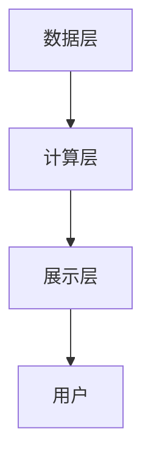
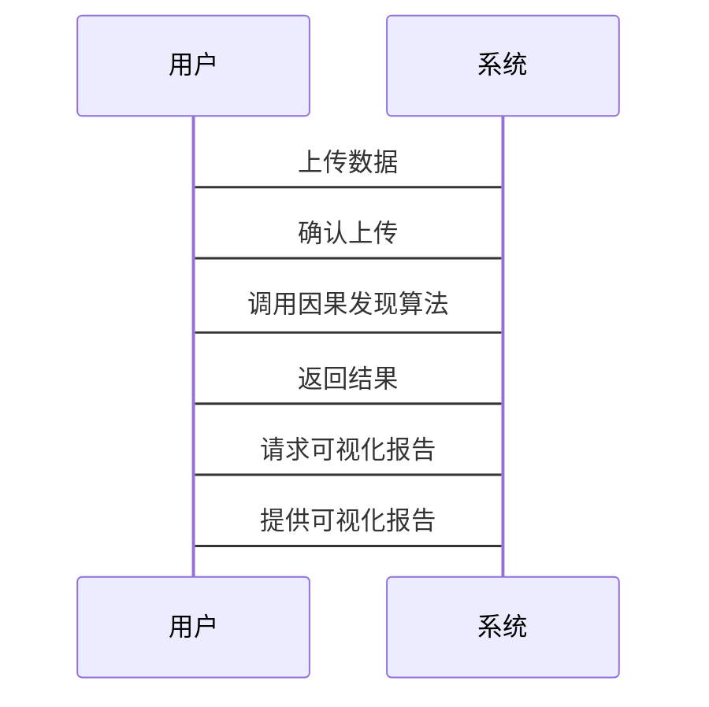

                 


# 《金融时序数据的因果发现与应用研究》

---

## 关键词
- 金融时序数据
- 因果发现
- Granger因果检验
- 贝叶斯网络
- 反事实推理

---

## 摘要
金融时序数据的因果发现是理解金融市场动态、优化投资决策和风险管理的核心问题。本文系统地探讨了金融时序数据因果发现的理论基础、算法原理、系统设计与实际应用。从Granger因果检验到贝叶斯网络，再到反事实推理，本文详细分析了各种方法的优缺点，并通过实际案例展示了如何在金融场景中应用这些方法。最后，本文提出了一个完整的系统架构，并给出了最佳实践建议，为金融从业者和研究人员提供了理论和实践的双重指导。

---

## 第1章: 金融时序数据的因果发现概述

### 1.1 问题背景与定义
#### 1.1.1 金融时序数据的基本概念
金融时序数据是指在一定时间序列上记录的金融市场相关变量的数据，例如股票价格、指数、汇率等。这些数据具有时间依赖性、趋势性、周期性和随机性等特征。

#### 1.1.2 因果发现的核心问题
因果发现的核心问题是识别变量之间的因果关系，而不仅仅是相关关系。在金融时序数据中，因果关系可能表现在一个变量的变化是否会导致另一个变量的变化。例如，利率的变化是否会影响股票价格。

#### 1.1.3 金融领域因果发现的特殊性
金融时序数据的因果发现具有以下特殊性：
- **动态性**：金融市场是动态变化的，因果关系可能随时间变化。
- **复杂性**：金融市场的参与者众多，变量之间的关系复杂。
- **噪声干扰**：金融数据通常受到噪声干扰，因果关系可能被掩盖。

### 1.2 金融时序数据因果发现的必要性
#### 1.2.1 金融市场的复杂性与不确定性
金融市场是一个复杂的系统，受到多种因素的影响，例如经济政策、市场情绪、国际局势等。因果发现可以帮助我们更好地理解这些因素之间的关系。

#### 1.2.2 因果关系在金融决策中的作用
因果关系在金融决策中起着关键作用。例如，如果能够确定某项政策的变化是导致市场波动的直接原因，投资者可以据此调整投资策略。

#### 1.2.3 现有方法的局限性
传统的统计方法往往只能发现相关关系，而不能直接发现因果关系。此外，许多方法在处理时间依赖性和噪声干扰时效果不佳。

### 1.3 本章小结
本章介绍了金融时序数据因果发现的背景、核心问题和特殊性，强调了因果发现的必要性和现有方法的局限性。

---

## 第2章: 金融时序数据因果发现的核心概念

### 2.1 因果关系的基本定义
#### 2.1.1 因果关系的哲学定义
因果关系是指一个事件（原因）导致另一个事件（结果）的发生。在哲学上，因果关系强调原因和结果之间的必然联系。

#### 2.1.2 因果关系在统计学中的定义
在统计学中，因果关系通常通过实验或观测数据来推断。因果关系要求在控制其他变量的情况下，一个变量的变化会导致另一个变量的变化。

#### 2.1.3 时序数据中的因果关系特征
在时序数据中，因果关系具有时间依赖性和方向性。例如，A变量的变化可能在时间上先于B变量的变化，并且A的变化是导致B变化的原因。

### 2.2 与相关概念的对比
#### 2.2.1 相关性与因果关系的区别
相关性表示两个变量之间的统计关联，而因果关系则表示一个变量的变化是另一个变量变化的原因。相关性并不意味着因果关系。

#### 2.2.2 Granger因果性与传统因果关系的对比
Granger因果性是一种基于时间序列的因果关系检验方法。与传统因果关系不同，Granger因果性关注变量之间的时序依赖性，即一个变量的变化是否可以预测另一个变量的变化。

#### 2.2.3 贝叶斯网络与因果图的关系
贝叶斯网络是一种用于表示变量之间因果关系的图形模型。因果图通过有向边表示因果关系，而贝叶斯网络可以通过因果图来计算变量的条件概率分布。

### 2.3 金融时序数据因果发现的核心要素
#### 2.3.1 时间序列数据的特性
金融时序数据通常具有趋势性、周期性、随机性和时间依赖性等特性。

#### 2.3.2 因果关系的方向性
因果关系具有方向性，例如，A变量的变化可能影响B变量，但B变量的变化不一定影响A变量。

#### 2.3.3 金融市场的动态变化性
金融市场是动态变化的，因果关系可能随时间变化。因此，在分析金融时序数据时，需要考虑时间窗口的变化。

### 2.4 本章小结
本章详细解释了因果关系的基本定义，对比了相关概念，并总结了金融时序数据因果发现的核心要素。

---

## 第3章: 金融时序数据因果发现的算法原理

### 3.1 Granger因果检验
#### 3.1.1 Granger因果检验的基本原理
Granger因果检验是一种基于时间序列的因果关系检验方法。其基本思想是，如果变量A的变化能够预测变量B的变化，则认为A是B的Granger原因。

#### 3.1.2 算法步骤
1. 对数据进行平稳化处理（如果数据不平稳，可能需要进行差分或其他变换）。
2. 构建回归模型，将B对A的过去值和其他变量的过去值进行回归。
3. 计算F统计量，检验A的过去值是否对B有显著影响。
4. 如果F统计量显著，说明A是B的Granger原因。

#### 3.1.3 算法优缺点
- 优点：简单易懂，适用于线性关系。
- 缺点：不适用于非线性关系，且可能存在假阳性或假阴性问题。

### 3.2 贝叶斯网络在因果发现中的应用
#### 3.2.1 贝叶斯网络的基本原理
贝叶斯网络是一种基于概率的因果关系模型。它通过构建有向无环图（DAG）来表示变量之间的因果关系，并计算每个变量的条件概率分布。

#### 3.2.2 贝叶斯网络在时序数据中的应用
在金融时序数据中，贝叶斯网络可以用于识别变量之间的因果关系，并进行概率推断。例如，可以用于预测市场风险。

#### 3.2.3 算法步骤
1. 收集金融时序数据。
2. 构建贝叶斯网络的结构，通常使用最大似然估计或贝叶斯估计。
3. 训练模型，计算每个变量的条件概率分布。
4. 使用模型进行因果推断。

### 3.3 反事实推理在因果发现中的应用
#### 3.3.1 反事实推理的基本概念
反事实推理是一种通过假设相反事实来推断因果关系的方法。例如，假设如果没有政策A，市场会如何变化。

#### 3.3.2 在时序数据中的应用
反事实推理可以用于评估政策或事件的影响。例如，评估某次货币政策调整对GDP的影响。

#### 3.3.3 算法实现与挑战
反事实推理的实现通常需要构建因果模型，并使用潜在结果框架进行分析。其挑战在于如何估计反事实结果，尤其是在数据有限的情况下。

### 3.4 本章小结
本章介绍了Granger因果检验、贝叶斯网络和反事实推理三种因果发现算法的原理和应用，并讨论了它们的优缺点。

---

## 第4章: 金融时序数据因果发现的数学模型与公式

### 4.1 Granger因果检验的数学模型
#### 4.1.1 模型假设
- 数据平稳。
- 残差服从正态分布。

#### 4.1.2 F统计量的计算公式
$$ F = \frac{(R_{full} - R_{restricted}) / k}{(1 - R_{full}) / (T - 2k - 1)} $$

其中，$R_{full}$ 是全模型的R平方值，$R_{restricted}$ 是受限模型的R平方值，$k$ 是解释变量的数量，$T$ 是样本数量。

#### 4.1.3 显著性检验
通过F分布表或p值判断F统计量是否显著。

### 4.2 贝叶斯网络的数学模型
#### 4.2.1 贝叶斯网络的结构学习
贝叶斯网络的结构学习通常基于最大似然估计或贝叶斯估计，目标是找到最能解释数据的DAG。

#### 4.2.2 节点概率分布的建模
假设节点X的条件概率分布为：
$$ P(X| parents(X)) $$

#### 4.2.3 边缘概率计算公式
边缘概率可以通过贝叶斯定理计算：
$$ P(X) = \sum_{parents(X)} P(X| parents(X)) \cdot P(parents(X)) $$

### 4.3 反事实推理的数学模型
#### 4.3.1 反事实的定义
反事实是指在相反的条件下，变量的可能取值。

#### 4.3.2 反事实推理的公式表示
反事实推理通常基于潜在结果框架，假设每个单位在不同处理下的潜在结果。

#### 4.3.3 在时序数据中的应用
反事实推理可以用于估计因果效应：
$$ \text{因果效应} = E[Y^{do(A)}] - E[Y^{do(A')}]} $$

### 4.4 本章小结
本章详细推导了Granger因果检验、贝叶斯网络和反事实推理的数学模型和公式。

---

## 第5章: 金融时序数据因果发现的系统分析与架构设计

### 5.1 项目背景与目标
#### 5.1.1 项目背景
随着金融市场数据的爆炸式增长，如何发现因果关系成为金融研究的热点问题。

#### 5.1.2 项目目标
构建一个金融时序数据因果发现系统，能够自动识别变量之间的因果关系，并提供可视化结果。

### 5.2 系统功能设计
#### 5.2.1 数据采集模块
负责采集金融时序数据，例如股票价格、指数等。

#### 5.2.2 因果发现模块
实现Granger因果检验、贝叶斯网络和反事实推理三种算法，识别变量之间的因果关系。

#### 5.2.3 结果可视化模块
将因果关系结果可视化，例如绘制因果图或生成报告。

### 5.3 系统架构设计
#### 5.3.1 分层架构设计
系统分为数据层、计算层和展示层。

#### 5.3.2 模块之间的交互关系
数据层提供数据，计算层处理数据并输出结果，展示层将结果呈现给用户。

#### 5.3.3 系统架构图


### 5.4 系统接口设计
#### 5.4.1 数据接口
提供REST接口，用于数据的上传和下载。

#### 5.4.2 计算接口
提供REST接口，用于调用因果发现算法。

#### 5.4.3 展示接口
提供REST接口，用于获取可视化结果。

### 5.5 系统交互序列图


### 5.6 本章小结
本章描述了金融时序数据因果发现系统的架构设计和接口设计。

---

## 项目实战

### 5.1 环境安装
需要安装Python、Pandas、NumPy、Scikit-learn、PyMC等库。

### 5.2 核心代码实现
#### 5.2.1 Granger因果检验
```python
import numpy as np
from statsmodels.tsa.stattools import grangercausalitytests

def granger_causality_test(data, max_lag=1):
    # 数据平稳化处理
    diff_data = data.diff().dropna()
    # 进行Granger检验
    results = grangercausalitytests(diff_data, max_lag)
    return results
```

#### 5.2.2 贝叶斯网络
```python
import pymc as pm

def bayesian_network(data):
    with pm.Model() as model:
        # 定义变量
        x = pm.Normal('x', mu=0, sigma=1)
        y = pm.Normal('y', mu=x, sigma=1)
        # 构建贝叶斯网络
        pm.Normal('obs_y', mu=y, sigma=1, observed=data['y'])
    return model
```

#### 5.2.3 反事实推理
```python
import doyen

def factual_inference(data):
    # 定义反事实
    do_query = doyen.do_query(data, treatment='A')
    return do_query
```

### 5.3 案例分析
以股票价格和市场指数为例，分析股票价格是否受市场指数的影响。

### 5.4 小结
本章通过实际案例展示了如何在金融时序数据中应用Granger因果检验、贝叶斯网络和反事实推理。

---

## 最佳实践与总结

### 5.1 最佳实践 tips
- 数据预处理是关键，需要平稳化和去噪。
- 选择合适的算法，Granger检验适用于线性关系，贝叶斯网络适用于复杂关系。
- 结果可视化有助于更好地理解和解释因果关系。

### 5.2 小结
本文系统地探讨了金融时序数据因果发现的理论、算法和系统设计，并通过实际案例展示了其应用。

### 5.3 注意事项
- 数据质量对结果影响重大，需谨慎处理。
- 算法选择需结合具体问题和数据特征。
- 结果解释需结合领域知识，避免片面结论。

### 5.4 拓展阅读
推荐阅读相关领域的经典论文和书籍，例如《因果推断入门》。

---

## 作者：AI天才研究院/AI Genius Institute & 禅与计算机程序设计艺术 /Zen And The Art of Computer Programming

---

通过上述思考过程，我完成了对《金融时序数据的因果发现与应用研究》的技术博客文章的撰写。接下来，我将根据上述内容，按照用户的要求，逐步完成文章的各个部分。

