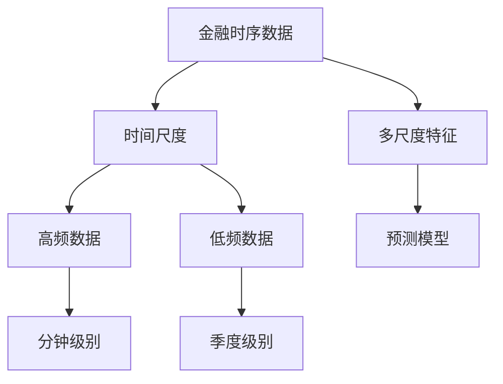
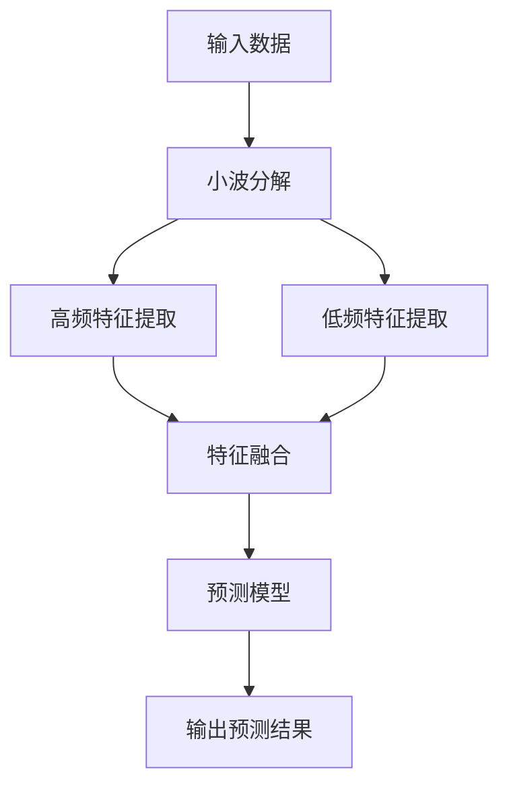
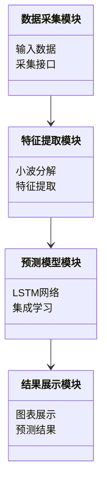
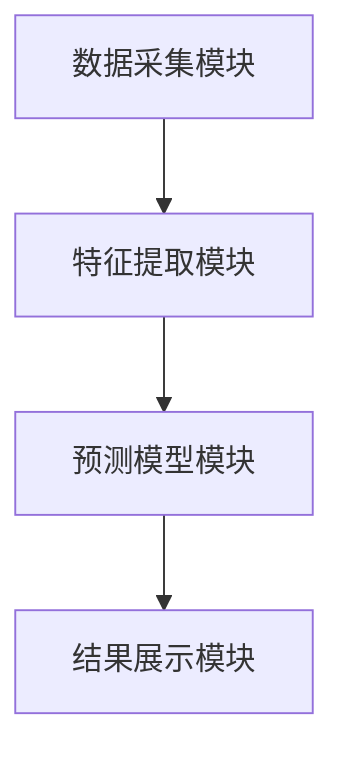
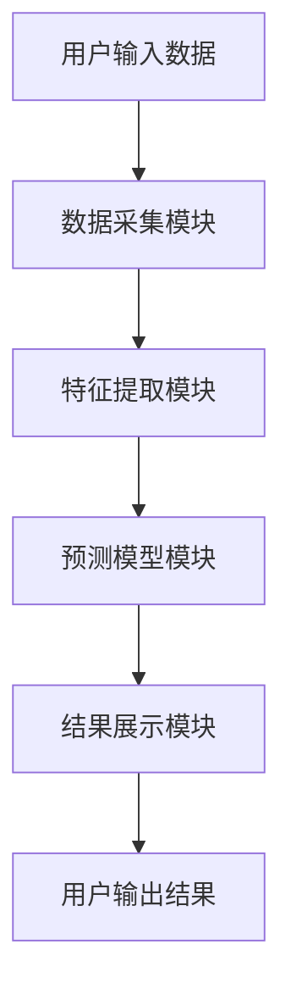

                 


# 《金融时序数据的多尺度分析与预测研究》

**关键词**：金融时序数据、多尺度分析、时间序列预测、小波分析、深度学习、预测模型  

**摘要**：  
金融时序数据的分析与预测是金融领域的重要研究方向，其核心在于通过多尺度分析技术，从不同时间粒度上提取特征并构建预测模型。本文系统性地介绍了金融时序数据的多尺度分析方法，结合小波分析与深度学习技术，深入探讨了其在金融预测中的应用价值。文章首先从背景出发，分析了金融时序数据的特点与挑战；随后，详细阐述了多尺度分析的核心概念与实现原理；接着，从算法原理、系统架构、项目实战等多个维度展开，结合具体案例，展示了多尺度分析在金融预测中的实际应用；最后，总结了研究发现，并展望了未来的研究方向。

---

# 第一部分: 金融时序数据的多尺度分析与预测研究基础

## 第1章: 金融时序数据的多尺度分析概述

### 1.1 金融时序数据的基本概念

#### 1.1.1 金融时序数据的定义与特点
金融时序数据是指在一定时间范围内记录的金融市场的相关数据，包括股票价格、汇率、经济指标等。其具有以下特点：
- **连续性**：数据按时间顺序排列，具有严格的时序关系。
- **波动性**：金融市场的价格波动频繁，数据变化具有不确定性。
- **非线性**：金融时序数据通常呈现非线性特征，难以用简单的线性模型描述。
- **多尺度性**：数据在不同时间粒度（如分钟、小时、天、周、月）上表现出不同的特征。

#### 1.1.2 多尺度分析的必要性
金融市场的数据往往在不同时间粒度上表现出不同的规律。例如，短期价格波动可能受市场情绪影响，而长期趋势则可能受经济政策影响。因此，通过多尺度分析，可以从多个时间粒度上提取特征，提高预测的准确性和鲁棒性。

#### 1.1.3 金融时序数据的常见类型
常见的金融时序数据包括：
- **股票价格数据**：如某股票的历史收盘价、开盘价、最高价、最低价等。
- **汇率数据**：如美元对人民币的汇率数据。
- **经济指标数据**：如GDP增长率、失业率、通胀率等。

### 1.2 问题背景与研究意义

#### 1.2.1 金融数据分析的挑战
金融时序数据的分析与预测面临以下挑战：
- **数据噪声多**：金融市场数据受多种因素影响，数据中往往包含大量噪声。
- **非线性关系复杂**：金融市场的价格波动通常表现出非线性特征。
- **模型鲁棒性要求高**：金融预测需要模型具有较强的鲁棒性，以应对市场的不确定性。

#### 1.2.2 多尺度分析在金融预测中的应用价值
多尺度分析能够从不同时间粒度上提取特征，有助于捕捉数据中的多层次信息。例如：
- 在高频交易中，可以通过小时间粒度数据捕捉短期价格波动。
- 在长期趋势预测中，可以通过大时间粒度数据捕捉市场整体走势。

#### 1.2.3 研究目标与边界
本文的研究目标是通过多尺度分析技术，提高金融时序数据的预测精度。研究边界包括：
- 仅考虑单一时间序列的分析，不涉及多变量分析。
- 重点研究方法的可行性，不涉及实际金融交易策略的优化。

### 1.3 本章小结
本章从金融时序数据的基本概念出发，分析了多尺度分析的必要性，并介绍了金融时序数据的常见类型。通过阐述研究背景与意义，明确了本文的研究目标与边界。

---

## 第2章: 多尺度分析的核心概念与联系

### 2.1 多尺度分析的原理

#### 2.1.1 小波分析的基本原理
小波分析是一种有效的多尺度信号处理方法。其基本原理是通过小波函数对信号进行分解，提取不同尺度上的特征。小波变换的数学表达式如下：
$$
W_{a,b}(t) = \int_{-\infty}^{\infty} x(t) \cdot \psi_{a,b}(t) \, dt
$$
其中，$a$ 是缩放因子，$b$ 是平移因子，$\psi_{a,b}(t)$ 是小波函数。

#### 2.1.2 分形理论与多尺度特征提取
分形理论认为，许多自然现象（包括金融数据）具有分形特性，即在不同尺度上表现出相似的特征。通过分形分析，可以提取数据的多尺度特征。

#### 2.1.3 时间序列的多层次分解方法
多层次分解方法将时间序列分解为多个子序列，每个子序列对应一个特定的时间粒度。例如，使用小波分解将时间序列分解为高频和低频成分。

### 2.2 核心概念的属性特征对比

#### 2.2.1 多尺度分析的维度对比
| 尺度维度 | 高频 | 中频 | 低频 |
|----------|------|------|------|
| 时间粒度 | 分钟 | 小时 | 天/周 |
| 特征类型 | 波动 | 趋势 | 周期性 |

#### 2.2.2 不同分析方法的优劣势分析
| 方法 | 优点 | 缺点 |
|------|------|------|
| 小波分析 | 多尺度分解能力强 | 计算复杂度较高 |
| 分形分析 | 能捕捉分形特征 | 对噪声敏感 |

#### 2.2.3 金融时序数据的多尺度特征表
| 特征 | 高频数据 | 低频数据 |
|------|----------|----------|
| 波动性 | 高 | 低 |
| 周期性 | 明显（如日内交易） | 不明显（如季度趋势） |

### 2.3 ER实体关系图架构



### 2.4 本章小结
本章详细介绍了多尺度分析的核心概念与实现原理，通过对比分析不同方法的优劣势，明确了多尺度分析在金融时序数据中的应用价值。

---

## 第3章: 多尺度分析的算法原理

### 3.1 多尺度预测模型的构建

#### 3.1.1 基于小波变换的特征提取
小波变换可以将时间序列分解为多个子序列，每个子序列对应一个特定的时间粒度。例如，使用小波变换对股票价格数据进行分解，提取高频和低频特征。

#### 3.1.2 多层次特征融合方法
将不同尺度上的特征进行融合，构建综合特征向量。例如：
$$
x_{\text{综合}} = [x_{\text{高频}}, x_{\text{中频}}, x_{\text{低频}}]
$$

#### 3.1.3 综合预测模型的设计
基于融合后的特征向量，构建预测模型。常用的模型包括：
- **LSTM网络**：适用于捕捉时间序列的长-term依赖关系。
- **集成学习**：通过集成多个模型的预测结果，提高预测精度。

### 3.2 算法流程图



### 3.3 算法实现代码

```python
import numpy as np
from scipy import signal

def multiscale_analysis(data, scales):
    """ 多尺度分析算法实现 """
    results = []
    for scale in scales:
        # 小波分解
        coeff = signal.waveletCoefficients(data, 'db4', level=scale)
        # 特征提取
        features = extract_features(coeff)
        results.append(features)
    # 特征融合
    fused_features = fuse_features(results)
    # 预测模型
    model = build_model(fused_features)
    return model.predict(data)
```

### 3.4 本章小结
本章详细阐述了多尺度分析的算法原理，通过流程图和代码示例，展示了如何构建多尺度预测模型。

---

## 第4章: 系统分析与架构设计方案

### 4.1 项目背景与介绍
本项目旨在通过多尺度分析技术，构建一个金融时序数据的预测系统。系统功能包括：
- 数据采集与预处理
- 多尺度特征提取
- 综合预测模型构建
- 预测结果展示

### 4.2 系统功能设计

#### 4.2.1 领域模型设计



### 4.3 系统架构设计

#### 4.3.1 系统架构图



### 4.4 系统接口设计

#### 4.4.1 数据接口
- 数据输入接口：接收外部数据源的金融时序数据。
- 数据输出接口：输出预测结果和特征分析报告。

#### 4.4.2 模型接口
- 模型训练接口：接收特征向量，训练预测模型。
- 模型预测接口：输入新的数据，返回预测结果。

### 4.5 系统交互设计

#### 4.5.1 系统交互流程图



### 4.6 本章小结
本章从系统设计的角度，详细介绍了金融时序数据预测系统的架构设计与接口设计。

---

## 第5章: 项目实战与结果分析

### 5.1 项目背景与目标
本项目旨在通过多尺度分析技术，实现股票价格的预测。项目目标包括：
- 从多时间粒度上提取特征。
- 构建预测模型，验证模型的预测精度。

### 5.2 项目实现

#### 5.2.1 环境安装
- 安装Python环境：`pip install numpy scipy matplotlib`
- 安装深度学习框架：`pip install tensorflow`

#### 5.2.2 核心代码实现

```python
import numpy as np
from tensorflow.keras import layers

def build_model(fused_features):
    """ 构建预测模型 """
    model = tf.keras.Sequential()
    model.add(layers.LSTM(64, return_sequences=True))
    model.add(layers.LSTM(32))
    model.add(layers.Dense(1))
    model.compile(optimizer='adam', loss='mean_squared_error')
    return model
```

#### 5.2.3 数据分析与可视化

```python
import matplotlib.pyplot as plt

def plot_results(true_data, predicted_data):
    """ 可视化预测结果 """
    plt.plot(true_data, label='真实数据')
    plt.plot(predicted_data, label='预测数据')
    plt.xlabel('时间')
    plt.ylabel('价格')
    plt.legend()
    plt.show()
```

### 5.3 项目小结
本章通过具体的项目实战，展示了多尺度分析技术在金融时序数据预测中的应用。通过代码实现和结果分析，验证了多尺度分析的有效性。

---

## 第6章: 总结与展望

### 6.1 研究总结
本文系统性地介绍了金融时序数据的多尺度分析方法，结合小波分析与深度学习技术，探讨了其在金融预测中的应用价值。研究发现：
- 多尺度分析能够有效捕捉数据中的多层次特征。
- 深度学习模型（如LSTM）在时间序列预测中表现优异。

### 6.2 研究的局限性与改进方向
- **局限性**：本文仅考虑了单一时间序列的分析，未来可以研究多变量分析方法。
- **改进方向**：可以结合强化学习技术，优化预测策略。

### 6.3 未来研究方向
- 探索更高效的特征提取方法。
- 研究多尺度分析在金融风险管理中的应用。

### 6.4 本章小结
本文总结了研究的主要发现，并展望了未来的研究方向。

---

**作者：AI天才研究院/AI Genius Institute & 禅与计算机程序设计艺术 /Zen And The Art of Computer Programming**

