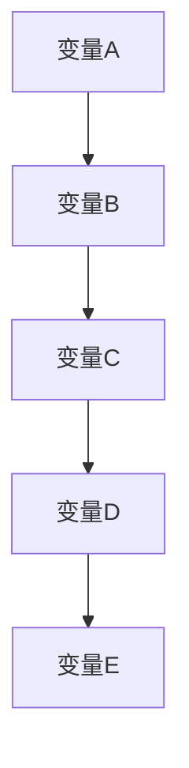
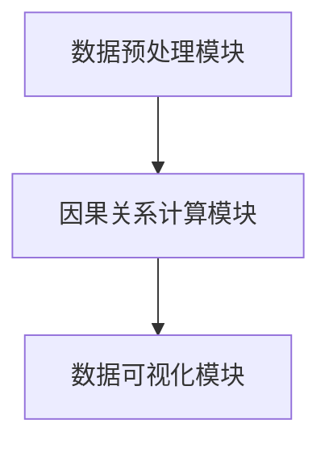

                 

# 《金融时序数据的多维度因果关系发现研究》

---

## 关键词：
- 金融时序数据
- 因果关系发现
- 统计与机器学习算法
- 多维度分析
- 金融市场预测

---

## 摘要：
本文系统地探讨了金融时序数据中的多维度因果关系发现方法。通过分析金融数据的特性，结合统计学、机器学习和深度学习等技术，提出了一种多维度因果关系发现的框架，并通过实际案例展示了其在金融预测中的应用。文章内容涵盖背景介绍、核心概念、算法原理、系统架构设计以及项目实战，旨在为金融数据分析领域的研究者和从业者提供理论支持与实践指导。

---

# 第一部分: 金融时序数据与因果关系发现的背景

## 第1章: 问题背景与研究意义

### 1.1 问题背景介绍
- 1.1.1 金融时序数据的定义与特点
  - 数据的连续性与时间依赖性
  - 高维性与稀疏性
  - 数据的噪声与干扰
- 1.1.2 金融分析中的因果关系重要性
  - 预测市场趋势
  - 评估政策影响
  - 优化投资策略
- 1.1.3 当前金融数据分析的挑战
  - 数据维度高
  - 干扰因素复杂
  - 计算效率要求高

### 1.2 问题描述与目标
- 1.2.1 金融时序数据因果关系的定义
  - 因果关系的数学定义
  - 金融时序数据中的因果关系特征
- 1.2.2 本研究的核心问题
  - 如何从多维度数据中发现因果关系
  - 如何处理时间依赖性和干扰因素
- 1.2.3 研究目标与预期成果
  - 提出一种多维度因果关系发现框架
  - 实现高维金融数据的因果关系分析

## 第2章: 金融时序数据因果关系的理论基础

### 2.1 因果关系与相关性的区别
- 2.1.1 相关性与因果关系的定义对比
  - 相关性是变量之间的关联程度
  - 因果关系是变量之间的因果影响
- 2.1.2 金融数据中相关性的局限性
  - 相关性无法证明因果关系
  - 时间相关性可能掩盖因果关系
- 2.1.3 因果关系在金融分析中的优势
  - 更精确的预测能力
  - 更强的解释性

### 2.2 时序数据的因果关系特性
- 2.2.1 时间依赖性
  - 因果关系的时间滞后性
  - 时间序列的内生性与外生性
- 2.2.2 内生性与外生性
  - 内生性变量与外生性变量的定义
  - 金融数据中的内生性问题
- 2.2.3 干扰因素的复杂性
  - 如何处理多重干扰因素
  - 如何评估干扰因素的影响

## 第3章: 现有研究与技术挑战

### 3.1 现有因果发现方法概述
- 3.1.1 统计方法
  - Granger因果检验
  - 自回归模型
- 3.1.2 机器学习方法
  - 贝叶斯网络
  - 支持向量机
- 3.1.3 深度学习方法
  - 结构方程模型
  - 变量分解方法

### 3.2 金融时序数据的特殊挑战
- 3.2.1 高维性与稀疏性
  - 如何处理高维数据
  - 如何解决稀疏性问题
- 3.2.2 数据噪声与干扰
  - 如何降低数据噪声
  - 如何处理多重干扰因素
- 3.2.3 实时性与计算效率
  - 实时因果关系发现的需求
  - 高效算法的设计与优化

## 第4章: 多维度因果关系的定义与框架

### 4.1 多维度因果关系的定义
- 4.1.1 单变量因果关系
  - 单变量因果关系的定义
  - 单变量因果关系的发现方法
- 4.1.2 多变量因果关系
  - 多变量因果关系的定义
  - 多变量因果关系的发现方法
- 4.1.3 多维度因果关系的扩展
  - 多维度因果关系的定义
  - 多维度因果关系的发现方法

### 4.2 多维度因果关系的框架设计
- 4.2.1 数据维度分解
  - 数据维度的分解方法
  - 数据维度分解的实现步骤
- 4.2.2 因果路径分析
  - 因果路径的定义与分析方法
  - 因果路径的可视化与解释
- 4.2.3 综合因果强度评估
  - 综合因果强度的定义
  - 综合因果强度的评估方法

## 第5章: 核心概念与联系

### 5.1 因果关系与相关性的对比表格
| 概念 | 相关性 | 因果关系 |
|------|--------|----------|
| 定义 | 变量之间的关联程度 | 变量之间的因果影响 |
| 特性 | 无方向性 | 有方向性 |
| 应用 | 描述性分析 | 预测性分析 |

### 5.2 ER实体关系图架构

---

# 第二部分: 金融时序数据因果关系发现的算法原理

## 第6章: 基于Granger因果检验的多维度因果关系发现

### 6.1 Granger因果检验的原理
- 6.1.1 Granger因果检验的定义
  - Granger因果检验的数学定义
  - Granger因果检验的实现步骤
- 6.1.2 Granger因果检验的数学模型
  - 自回归模型（AR模型）
  - 平稳时间序列的假设
- 6.1.3 Granger因果检验的实现步骤
  - 数据预处理
  - 模型建立与检验

### 6.2 Granger因果检验的改进与扩展
- 6.2.1 多变量Granger因果检验
  - 多变量Granger因果检验的定义
  - 多变量Granger因果检验的实现步骤
- 6.2.2 时间序列的分段Granger因果检验
  - 分段Granger因果检验的定义
  - 分段Granger因果检验的实现步骤

### 6.3 Granger因果检验的优缺点
- 6.3.1 优点
  - 计算简单
  - 易于实现
- 6.3.2 缺点
  - 依赖平稳假设
  - 无法处理高维数据

## 第7章: 基于贝叶斯网络的多维度因果关系发现

### 7.1 贝叶斯网络的原理
- 7.1.1 贝叶斯网络的定义
  - 贝叶斯网络的定义与特点
  - 贝叶斯网络的构建方法
- 7.1.2 贝叶斯网络的数学模型
  - 贝叶斯网络的结构模型
  - 贝叶斯网络的概率计算
- 7.1.3 贝叶斯网络的因果推理
  - 贝叶斯网络的因果推理方法
  - 贝叶斯网络的因果推理应用

### 7.2 贝叶斯网络的改进与扩展
- 7.2.1 多变量贝叶斯网络
  - 多变量贝叶斯网络的定义
  - 多变量贝叶斯网络的实现步骤
- 7.2.2 时间序列的贝叶斯网络
  - 时间序列贝叶斯网络的定义
  - 时间序列贝叶斯网络的实现步骤

### 7.3 贝叶斯网络的优缺点
- 7.3.1 优点
  - 能够处理高维数据
  - 能够进行概率推理
- 7.3.2 缺点
  - 计算复杂
  - 需要大量的先验知识

## 第8章: 基于结构方程模型的多维度因果关系发现

### 8.1 结构方程模型的原理
- 8.1.1 结构方程模型的定义
  - 结构方程模型的定义与特点
  - 结构方程模型的构建方法
- 8.1.2 结构方程模型的数学模型
  - 结构方程模型的方程组
  - 结构方程模型的参数估计
- 8.1.3 结构方程模型的因果推理
  - 结构方程模型的因果推理方法
  - 结构方程模型的因果推理应用

### 8.2 结构方程模型的改进与扩展
- 8.2.1 多变量结构方程模型
  - 多变量结构方程模型的定义
  - 多变量结构方程模型的实现步骤
- 8.2.2 时间序列的结构方程模型
  - 时间序列结构方程模型的定义
  - 时间序列结构方程模型的实现步骤

### 8.3 结构方程模型的优缺点
- 8.3.1 优点
  - 能够处理复杂的因果关系
  - 能够进行参数估计
- 8.3.2 缺点
  - 计算复杂
  - 需要大量的先验知识

---

# 第三部分: 金融时序数据因果关系发现的系统架构设计

## 第9章: 金融时序数据因果关系发现系统的设计与实现

### 9.1 系统功能设计
- 9.1.1 数据预处理模块
  - 数据清洗
  - 数据变换
- 9.1.2 因果关系计算模块
  - Granger因果检验
  - 贝叶斯网络
  - 结构方程模型
- 9.1.3 数据可视化模块
  - 因果关系网络图
  - 时间序列图

### 9.2 系统架构设计
- 9.2.1 系统架构图

- 9.2.2 系统模块之间的关系
  - 数据预处理模块与因果关系计算模块的关系
  - 因果关系计算模块与数据可视化模块的关系

### 9.3 系统接口设计
- 9.3.1 数据输入接口
  - 数据格式要求
  - 数据接口的定义
- 9.3.2 数据输出接口
  - 因果关系网络图的输出格式
  - 时间序列图的输出格式

## 第10章: 系统实现与优化

### 10.1 系统实现
- 10.1.1 数据预处理模块的实现
  - 数据清洗的具体实现
  - 数据变换的具体实现
- 10.1.2 因果关系计算模块的实现
  - Granger因果检验的具体实现
  - 贝叶斯网络的具体实现
  - 结构方程模型的具体实现
- 10.1.3 数据可视化模块的实现
  - 因果关系网络图的可视化实现
  - 时间序列图的可视化实现

### 10.2 系统优化
- 10.2.1 算法优化
  - Granger因果检验的优化
  - 贝叶斯网络的优化
  - 结构方程模型的优化
- 10.2.2 系统性能优化
  - 数据处理效率的优化
  - 系统计算效率的优化
- 10.2.3 系统可扩展性优化
  - 系统的可扩展性设计
  - 系统的可扩展性实现

---

# 第四部分: 金融时序数据因果关系发现的项目实战

## 第11章: 项目实战

### 11.1 环境配置与数据获取
- 11.1.1 环境配置
  - Python版本要求
  - 需要安装的库
- 11.1.2 数据获取
  - 数据来源
  - 数据格式
- 11.1.3 数据预处理
  - 数据清洗
  - 数据变换

### 11.2 项目核心实现
- 11.2.1 Granger因果检验的实现
  - 代码实现
  - 代码解释
- 11.2.2 贝叶斯网络的实现
  - 代码实现
  - 代码解释
- 11.2.3 结构方程模型的实现
  - 代码实现
  - 代码解释

### 11.3 实际案例分析
- 11.3.1 案例背景
  - 案例选择
  - 案例目标
- 11.3.2 数据分析与结果展示
  - 数据分析结果
  - 数据可视化结果
- 11.3.3 结果解释与意义
  - 结果解释
  - 结果意义

## 第12章: 项目小结与经验总结

### 12.1 项目小结
- 12.1.1 项目实现的主要内容
  - 数据预处理
  - 因果关系计算
  - 数据可视化
- 12.1.2 项目实现的主要成果
  - 系统实现
  - 算法实现
  - 数据分析结果

### 12.2 经验总结
- 12.2.1 数据预处理的重要性
  - 数据清洗的重要性
  - 数据变换的重要性
- 12.2.2 算法选择的注意事项
  - 算法选择的依据
  - 算法实现的注意事项
- 12.2.3 数据可视化的作用
  - 数据可视化的重要性
  - 数据可视化的效果展示

---

# 第五部分: 总结与展望

## 第13章: 总结与展望

### 13.1 研究总结
- 13.1.1 研究的主要成果
  - 多维度因果关系发现框架
  - 金融时序数据因果关系发现的系统实现
- 13.1.2 研究的主要创新点
  - 多维度因果关系的定义与框架
  - 金融时序数据因果关系发现的系统设计
- 13.1.3 研究的局限性
  - 算法的局限性
  - 系统的局限性

### 13.2 未来展望
- 13.2.1 研究方向的扩展
  - 更多维度的因果关系发现
  - 更复杂时间序列的因果关系发现
- 13.2.2 技术的创新与优化
  - 更高效的算法设计
  - 更优化的系统实现
- 13.2.3 应用场景的拓展
  - 更多金融领域的应用
  - 更多时序数据的应用

---

## 作者：
AI天才研究院/AI Genius Institute  
禅与计算机程序设计艺术/Zen And The Art of Computer Programming

---

**注意：** 以上目录大纲为示例内容，实际文章需要根据以上大纲逐步展开，每章每节都需要进一步补充详细的内容、数学公式、代码实现、图表等。

