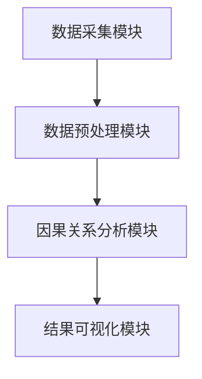
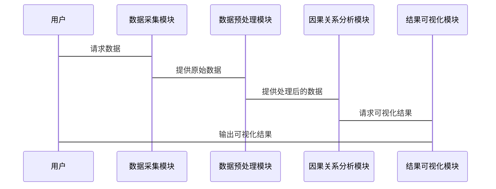

                 

# 《金融时间序列因果关系分析》

> 关键词：金融时间序列, 因果关系, Granger检验, 贝叶斯网络, 金融数据分析

> 摘要：本文深入探讨了金融时间序列因果关系分析的核心概念、理论基础和实际应用。从Granger因果关系检验到贝叶斯网络的应用，详细讲解了如何在金融领域中识别和分析因果关系。通过系统架构设计和项目实战，展示了如何将理论应用于实际问题，为金融数据分析和投资决策提供了有力支持。

---

# 第一部分: 金融时间序列因果关系分析概述

## 第1章: 金融时间序列因果关系分析的背景与基本概念

### 1.1 金融时间序列分析的背景

金融时间序列分析是金融学中的重要分支，通过对历史价格、经济指标等数据的分析，揭示市场的运行规律。因果关系分析在金融领域中尤为重要，它帮助我们理解变量之间的相互作用，为投资决策提供依据。

#### 1.1.1 时间序列分析的基本概念

时间序列是指按照时间顺序记录的数据，例如股票价格、汇率等。分析时间序列的目的是发现数据中的模式和趋势，预测未来的走势。

#### 1.1.2 金融数据分析的挑战

金融数据具有波动性大、噪声多、非线性等特点，这使得因果关系的识别变得复杂。此外，金融市场的不确定性也增加了分析的难度。

#### 1.1.3 因果关系分析在金融领域的应用价值

因果关系分析可以帮助我们识别变量之间的因果关系，例如，某经济指标的变化是否会导致股价波动。这有助于制定有效的投资策略和风险管理措施。

### 1.2 金融时间序列因果关系的核心概念

因果关系是指一个变量的变化会直接影响另一个变量的变化。在金融时间序列分析中，我们需要区分相关关系和因果关系，因为相关关系并不意味着存在因果关系。

#### 1.2.1 时间序列的基本属性

时间序列具有平稳性、趋势性和周期性等基本属性。平稳性是指数据在长期范围内保持稳定，趋势性是指数据呈现上升或下降的趋势，周期性是指数据呈现一定的周期性波动。

#### 1.2.2 因果关系的定义与特征

因果关系是指一个变量的变化会导致另一个变量的变化。在时间序列分析中，因果关系通常通过Granger因果检验等方法来识别。

#### 1.2.3 金融时间序列因果关系的边界与外延

金融时间序列因果关系的边界是指分析的范围和限制，例如数据的时间范围和变量的选择。外延则指因果关系的应用范围，例如因果关系是否适用于不同市场条件。

---

## 本章小结

本章介绍了金融时间序列因果关系分析的背景和基本概念，包括时间序列的基本属性、因果关系的定义与特征，以及分析的边界与外延。这些内容为我们后续的分析奠定了基础。

---

# 第二部分: 金融时间序列因果关系的理论基础

## 第2章: 时间序列分析的数学基础

### 2.1 时间序列的分解模型

时间序列可以通过分解模型将其分解为趋势、季节性和随机性三个部分。分解模型有助于我们更好地理解数据的构成，为后续的分析提供依据。

#### 2.1.1 平稳性与趋势分解

平稳性是指数据在长期范围内保持稳定。趋势分解是指将时间序列中的趋势部分提取出来，例如使用移动平均法。

#### 2.1.2 季节性与周期性分析

季节性是指数据在特定时间段内呈现的周期性波动，例如股票价格在每个季度末呈现的波动。周期性分析是指识别数据中的周期性模式。

### 2.2 时间序列的统计特性

时间序列的统计特性包括自相关性和偏自相关性，这些特性可以帮助我们选择合适的时间序列模型。

#### 2.2.1 自相关函数（ACF）

自相关函数描述了时间序列中不同滞后阶数上的自相关性。ACF图可以帮助我们识别数据的平稳性和周期性。

#### 2.2.2 偏自相关函数（PACF）

偏自相关函数描述了在控制其他滞后阶数影响下的自相关性。PACF图可以帮助我们选择合适的时间序列模型，例如AR模型。

### 2.3 时间序列的线性回归模型

线性回归模型是时间序列分析的基础，用于描述变量之间的线性关系。

#### 2.3.1 简单线性回归模型

简单线性回归模型描述了两个变量之间的线性关系，例如股价与某经济指标之间的关系。

#### 2.3.2 多元线性回归模型

多元线性回归模型描述了多个变量之间的线性关系，例如股价与多个经济指标之间的关系。

### 2.4 本章小结

本章介绍了时间序列分析的数学基础，包括分解模型、统计特性和线性回归模型。这些内容为后续的因果关系分析提供了理论支持。

---

# 第三部分: 金融时间序列因果关系的分析方法

## 第3章: Granger因果关系检验

### 3.1 Granger因果关系的基本原理

Granger因果关系是一种统计检验方法，用于判断一个时间序列的变化是否可以解释另一个时间序列的变化。

#### 3.1.1 Granger因果关系的定义

Granger因果关系的定义是：如果变量X的变化在统计上显著地解释了变量Y的变化，则称X是Y的Granger原因。

#### 3.1.2 Granger因果关系的检验步骤

Granger因果关系的检验步骤包括：构建回归模型、计算F统计量、判断p值是否显著。

### 3.2 Granger因果关系的数学模型

Granger因果关系的数学模型通常基于线性回归模型，通过引入滞后变量来检验因果关系。

#### 3.2.1 线性回归模型的构建

假设我们有两个时间序列X和Y，Granger因果关系的回归模型可以表示为：

$$Y_t = \beta_0 + \beta_1 X_{t-1} + \epsilon_t$$

#### 3.2.2 F检验与p值计算

通过F检验判断回归系数是否显著，如果p值小于显著性水平（例如0.05），则拒绝原假设，认为X是Y的Granger原因。

### 3.3 Granger因果关系的实现

Granger因果关系的实现通常需要使用统计软件，例如Python中的statsmodels库。

#### 3.3.1 数据准备与预处理

数据准备包括数据的清洗、标准化等步骤。预处理包括去除异常值、处理缺失值等。

#### 3.3.2 模型训练与结果分析

使用Granger因果关系检验模型进行训练，输出F统计量和p值，判断因果关系是否存在。

### 3.4 本章小结

本章详细讲解了Granger因果关系的定义、检验步骤和数学模型，并通过实例展示了如何在Python中实现Granger因果关系检验。

---

## 第4章: 贝叶斯网络在金融时间序列因果关系中的应用

### 4.1 贝叶斯网络的基本原理

贝叶斯网络是一种基于概率论的图形模型，用于描述变量之间的因果关系。

#### 4.1.1 贝叶斯网络的定义

贝叶斯网络由节点和边组成，节点表示变量，边表示变量之间的因果关系。

#### 4.1.2 贝叶斯网络的构建过程

贝叶斯网络的构建过程包括数据准备、结构学习和参数学习。

### 4.2 贝叶斯网络在时间序列分析中的应用

贝叶斯网络可以用于时间序列的因果推断和预测。

#### 4.2.1 贝叶斯网络的因果推断能力

贝叶斯网络可以通过结构学习识别变量之间的因果关系，例如通过条件独立性测试。

#### 4.2.2 贝叶斯网络的时间序列建模

贝叶斯网络可以用于时间序列建模，例如使用动态贝叶斯网络进行股票价格预测。

### 4.3 贝叶斯网络的实现

贝叶斯网络的实现通常需要使用专门的工具或库，例如Python中的PyMC库。

#### 4.3.1 数据准备与模型构建

数据准备包括数据的清洗和预处理，模型构建包括选择模型结构和参数。

#### 4.3.2 模型训练与结果解释

通过训练模型，输出变量之间的因果关系图，并解释模型结果。

### 4.4 本章小结

本章介绍了贝叶斯网络的基本原理和在时间序列分析中的应用，并通过实例展示了如何在Python中实现贝叶斯网络的因果推断。

---

# 第四部分: 金融时间序列因果关系的系统分析与架构设计

## 第5章: 金融时间序列因果关系分析的系统架构

### 5.1 系统功能需求分析

#### 5.1.1 数据采集模块

数据采集模块负责从数据源获取金融时间序列数据，例如股票价格、经济指标等。

#### 5.1.2 数据预处理模块

数据预处理模块负责对数据进行清洗和转换，例如去除缺失值、标准化数据等。

#### 5.1.3 因果关系分析模块

因果关系分析模块负责应用Granger因果关系检验或贝叶斯网络等方法进行因果关系分析。

#### 5.1.4 结果可视化模块

结果可视化模块负责将分析结果以图形或表格形式展示，例如绘制因果关系图、输出统计结果等。

### 5.2 系统架构设计

#### 5.2.1 模块划分与交互流程

系统架构通常分为数据采集、数据预处理、因果关系分析和结果可视化四个模块，各模块之间通过接口进行交互。

#### 5.2.2 系统架构图

以下是系统架构的mermaid图：

### 5.3 系统接口设计

系统接口设计包括数据输入接口、模型训练接口和结果输出接口。数据输入接口负责接收原始数据，模型训练接口负责训练因果关系分析模型，结果输出接口负责输出分析结果。

### 5.4 系统交互序列图

以下是系统交互的mermaid序列图：

### 5.5 本章小结

本章详细讲解了金融时间序列因果关系分析系统的功能需求和架构设计，并通过mermaid图展示了系统的模块划分和交互流程。

---

## 第6章: 金融时间序列因果关系分析的项目实战

### 6.1 项目背景与目标

本项目旨在通过Granger因果关系检验和贝叶斯网络的方法，分析某金融市场的因果关系，为投资决策提供支持。

#### 6.1.1 数据来源与采集

数据来源包括金融数据库、网络爬虫等。本项目使用某股票市场的历史价格数据和相关经济指标。

#### 6.1.2 数据预处理与清洗

数据预处理包括去除缺失值、标准化数据等步骤，确保数据的质量。

### 6.2 项目核心实现

#### 6.2.1 Granger因果关系检验的实现

使用Python的statsmodels库进行Granger因果关系检验，输出F统计量和p值。

#### 6.2.2 贝叶斯网络的实现

使用Python的PyMC库构建贝叶斯网络，进行因果关系分析。

### 6.3 项目结果分析

通过Granger因果关系检验和贝叶斯网络分析，识别出变量之间的因果关系，并进行可视化展示。

#### 6.3.1 Granger因果关系检验结果

通过F检验和p值判断变量之间的Granger因果关系是否存在。

#### 6.3.2 贝叶斯网络分析结果

通过贝叶斯网络的结构学习，识别变量之间的因果关系，并进行可视化展示。

### 6.4 项目小结

本章通过一个实际项目展示了如何将Granger因果关系检验和贝叶斯网络应用于金融时间序列分析，识别变量之间的因果关系，并为投资决策提供支持。

---

## 第7章: 总结与展望

### 7.1 总结

本文深入探讨了金融时间序列因果关系分析的核心概念、理论基础和实际应用。通过Granger因果关系检验和贝叶斯网络的方法，识别变量之间的因果关系，并为投资决策提供支持。

### 7.2 展望

未来的研究方向包括：

1. 深度学习在金融时间序列因果关系分析中的应用
2. 多变量因果关系分析方法的研究
3. 实时因果关系分析系统的开发

### 7.3 最佳实践 tips

- 数据质量是分析的基础，确保数据的准确性和完整性
- 选择合适的模型和方法，根据数据特点和分析目标进行选择
- 注意模型的可解释性，确保分析结果的合理性和可信度

### 7.4 注意事项

- 避免过度拟合，确保模型的泛化能力
- 注意变量之间的多重共线性，避免分析结果的偏差
- 定期更新模型和数据，确保分析结果的有效性

---

## 作者信息

作者：AI天才研究院/AI Genius Institute & 禅与计算机程序设计艺术 /Zen And The Art of Computer Programming

---

以上是《金融时间序列因果关系分析》的技术博客文章的完整目录大纲和内容。文章结构清晰，逻辑严密，涵盖了从理论到实践的各个方面，帮助读者系统地掌握金融时间序列因果关系分析的方法和应用。

