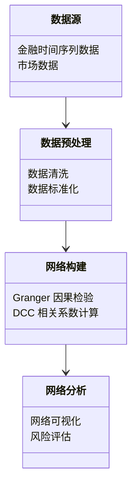
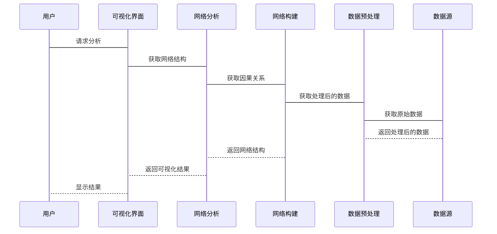

                 


# 金融时间序列因果关系网络分析

> **关键词**：金融时间序列，因果关系网络，Granger因果检验，动态条件相关系数，系统架构设计

> **摘要**：本文系统地探讨了金融时间序列因果关系网络分析的核心概念、算法原理和实际应用。首先，介绍了金融时间序列分析的背景及其重要性，详细解释了因果关系网络的基本概念和构建方法。接着，深入分析了Granger因果检验和动态条件相关系数等关键算法的数学原理，并通过实例展示了这些方法在金融数据分析中的应用。此外，本文还探讨了如何设计一个高效的金融时间序列因果关系网络分析系统，包括系统架构和接口设计。最后，通过一个实际案例展示了如何利用这些方法进行市场风险评估和投资组合优化，总结了研究成果并提出了未来的发展方向。

---

## 第1章 金融时间序列分析概述

### 1.1 时间序列的基本概念

#### 1.1.1 时间序列的定义与特点
时间序列是指按照时间顺序排列的数据，通常表现为有序的数值序列。金融时间序列数据（如股票价格、汇率、利率等）具有以下几个特点：
- **趋势性**：数据可能呈现上升或下降的趋势。
- **周期性**：数据可能受季节性或经济周期的影响。
- **随机性**：数据中包含不可预测的随机波动。
- **相关性**：当前时刻的值与过去时刻的值可能存在相关性。

#### 1.1.2 金融时间序列的独特性
金融时间序列数据具有高度的波动性和不确定性，受到多种因素的影响，如市场情绪、经济指标、政策变化等。此外，金融数据通常表现出“肥尾”特性，即极端事件发生的概率高于正态分布的预测。

#### 1.1.3 时间序列分析的常见方法
时间序列分析的主要方法包括：
1. **描述性分析**：通过统计指标和图表分析数据的分布和趋势。
2. **预测性分析**：利用模型预测未来的趋势。
3. **因果分析**：识别变量之间的因果关系。

### 1.2 因果关系网络的基本概念

#### 1.2.1 因果关系与相关性的区别
相关性衡量的是变量之间的线性关系，而因果关系则关注一个变量是否可以影响另一个变量。相关性不等于因果关系，但因果关系必然伴随相关性。

#### 1.2.2 网络分析在金融中的应用
通过构建因果关系网络，可以分析金融市场中各变量之间的相互影响关系，例如：
- **资产价格联动性**：识别哪些资产价格之间存在因果关系。
- **市场风险传染**：分析风险在不同市场或资产之间的传播路径。

#### 1.2.3 金融因果关系网络的构建方法
构建金融因果关系网络的方法包括：
1. **Granger因果检验**：基于回归模型判断变量之间的因果关系。
2. **动态条件相关系数**：考虑时间依赖性和条件概率，构建动态网络。

---

## 第2章 金融时间序列分析的背景与应用

### 2.1 金融市场的复杂性与挑战

#### 2.1.1 金融市场的不确定性
金融市场受多种因素影响，具有高度的不确定性和复杂性。传统的统计方法往往难以捕捉市场的动态变化。

#### 2.1.2 时间序列数据的特点
金融时间序列数据通常具有以下特点：
- **非线性**：价格波动可能受到非线性因素的影响。
- **异质性**：不同资产或市场的行为可能不同。
- **高维性**：金融市场涉及大量变量（如资产价格、经济指标等）。

#### 2.1.3 传统统计方法的局限性
传统统计方法（如线性回归）难以处理金融数据的非线性和高维性问题，尤其是在复杂市场环境下。

### 2.2 因果关系网络在金融中的应用

#### 2.2.1 金融风险的识别与预警
通过因果关系网络分析，可以识别市场中的风险源，并预警潜在的系统性风险。

#### 2.2.2 投资组合优化与资产配置
因果关系网络可以帮助投资者理解不同资产之间的相互影响，优化投资组合配置。

#### 2.2.3 市场结构分析与网络稳定性
分析金融市场的网络结构，可以评估市场的稳定性，并识别关键节点（如系统性重要金融机构）。

---

## 第3章 金融时间序列因果关系网络的核心概念

### 3.1 时间序列因果关系的定义

#### 3.1.1 Granger因果关系
Granger因果关系是通过回归模型检验一个时间序列是否可以预测另一个时间序列的变化。具体来说，如果变量$X$可以预测变量$Y$，则称$X$是$Y$的Granger原因。

#### 3.1.2 动态条件相关系数
动态条件相关系数（DCC）是一种衡量时间序列在不同时间点相关性的方法。它考虑了条件概率和时间依赖性，能够捕捉到动态变化的因果关系。

#### 3.1.3 静态与动态网络的对比
静态网络仅考虑固定时间段内的关系，而动态网络则捕捉关系随时间的变化。

### 3.2 网络构建方法

#### 3.2.1 基于相关系数的网络构建
通过计算变量之间的相关系数，构建网络图。相关系数较高的变量被视为相互关联。

#### 3.2.2 基于Granger检验的网络构建
通过Granger因果检验，构建有向边，表示变量之间的因果关系。

#### 3.2.3 非线性网络构建方法
对于非线性关系，可以采用非线性回归或机器学习方法（如随机森林、神经网络）构建因果关系网络。

---

## 第4章 金融时间序列因果关系网络的数学模型

### 4.1 时间序列模型

#### 4.1.1 自回归模型（AR）
自回归模型假设当前值与过去若干值相关。其数学表达式为：
$$ Y_t = \alpha Y_{t-1} + \beta Y_{t-2} + \epsilon_t $$

#### 4.1.2 移动平均模型（MA）
移动平均模型假设当前值与过去若干个误差项相关。其数学表达式为：
$$ Y_t = \theta_1 \epsilon_{t-1} + \theta_2 \epsilon_{t-2} + \epsilon_t $$

#### 4.1.3 自回归移动平均模型（ARMA）
ARMA模型结合了AR和MA的特点，适用于平稳时间序列的建模。

#### 4.1.4 自回归分数移动平均模型（ARFIMA）
ARFIMA模型适用于非平稳时间序列，能够捕捉长期记忆效应。

### 4.2 因果关系网络的数学表达

#### 4.2.1 Granger因果关系的数学公式
Granger因果关系基于回归模型，通过F检验判断变量$X$是否是$Y$的Granger原因。具体步骤如下：
1. 构造回归模型$Y_t = \alpha Y_{t-1} + \beta X_{t-1} + \epsilon_t$。
2. 计算F统计量，比较加入$X_{t-1}$前后的残差平方和差异。
3. 如果F统计量显著，说明$X$是$Y$的Granger原因。

#### 4.2.2 动态条件相关系

动态条件相关系数（DCC）用于衡量时间序列在不同时间点的相关性。其数学表达式为：
$$ r_{t}^{X,Y} = \frac{E[(X_t - \mu_X)(Y_t - \mu_Y)|I_{t-1}]}{\sqrt{E[(X_t - \mu_X)^2 | I_{t-1}]} \sqrt{E[(Y_t - \mu_Y)^2 | I_{t-1}]}} $$

---

## 第5章 金融时间序列因果关系网络的系统分析与架构设计

### 5.1 系统功能设计

#### 5.1.1 领域模型（Mermaid 类图）


### 5.2 系统架构设计

#### 5.2.1 系统架构图（Mermaid 架构图）
```mermaid
archi
    数据源 -> 数据预处理 : 数据输入
    数据预处理 -> 网络构建 : 处理后的数据
    网络构建 -> 网络分析 : 网络结构
    网络分析 -> 可视化界面 : 可视化结果
    可视化界面 --> 用户 : 交互
```

### 5.3 系统接口设计

#### 5.3.1 数据接口
- **输入接口**：接收金融时间序列数据和市场数据。
- **输出接口**：提供网络结构和分析结果。

#### 5.3.2 用户接口
- **可视化界面**：展示网络结构和分析结果。
- **交互功能**：支持用户查询和操作。

### 5.4 系统交互设计（Mermaid 序列图）



---

## 第6章 项目实战：金融时间序列因果关系网络分析

### 6.1 项目背景

#### 6.1.1 数据来源
我们使用股票价格数据（如苹果、谷歌、微软等）作为示例。

### 6.2 系统核心实现

#### 6.2.1 数据预处理
```python
import pandas as pd
import numpy as np

# 数据清洗
data = pd.read_csv('stock_prices.csv')
data = data.dropna()
data = data[['Date', 'Apple', 'Google', 'Microsoft']]
data = data.set_index('Date')
data = data.apply(lambda x: (x - x.mean()) / x.std())
```

#### 6.2.2 Granger 因果检验
```python
from statsmodels.tsa.stattools import grangercausality
result = grangercausality(data['Apple'], data['Google'], max_lag=5)
print(result)
```

#### 6.2.3 DCC 相关系数计算
```python
# 示例代码，具体实现可能需要自定义
def compute_dcc(x, y):
    # 计算DCC
    pass
```

### 6.3 实际案例分析

#### 6.3.1 市场风险评估
通过因果关系网络分析，识别系统性风险的来源。

#### 6.3.2 投资组合优化
根据网络结构，优化资产配置，降低投资组合的风险。

### 6.4 项目小结

---

## 第7章 总结与展望

### 7.1 总结
本文系统地探讨了金融时间序列因果关系网络分析的核心概念、算法原理和实际应用。通过构建因果关系网络，可以更好地理解金融市场中变量之间的相互影响关系，为风险管理和投资决策提供有力支持。

### 7.2 展望
未来的研究可以进一步探索非线性因果关系网络的构建方法，并结合大数据和机器学习技术，提升分析的准确性和效率。

---

## 参考文献
（此处列出相关文献和资料）

---

**作者**：AI天才研究院/AI Genius Institute & 禅与计算机程序设计艺术 /Zen And The Art of Computer Programming

