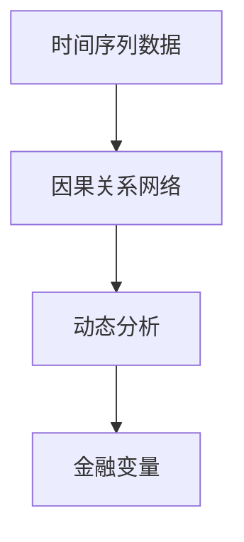

                 


# 《金融时间序列因果关系网络动态分析》

## 关键词：金融时间序列，因果关系网络，动态分析，Granger因果检验，系统架构设计，因果推断

## 摘要：  
本文详细探讨了金融时间序列数据中的因果关系网络动态分析方法，结合理论与实践，系统性地介绍了如何构建和分析动态因果关系网络。文章从背景、核心概念、算法原理到系统架构设计，再到项目实战，层层深入，旨在帮助读者理解如何通过技术手段揭示金融数据中的因果关系，为金融投资和风险管理提供科学依据。

---

## 第一部分：背景介绍

### 第1章：金融时间序列因果关系网络动态分析概述

#### 1.1 问题背景
- **金融时间序列分析的现状**：金融数据具有高度复杂性和不确定性，传统的统计分析方法在捕捉因果关系方面存在局限性。
- **因果关系在金融分析中的重要性**：因果关系网络能够揭示变量之间的动态依赖关系，为金融建模和预测提供更深入的洞察。
- **动态网络分析的必要性**：金融市场的动态变化要求因果关系网络能够实时更新，捕捉市场的瞬息万变。

#### 1.2 问题描述
- **金融时间序列数据的特点**：连续性、波动性、非线性等特性使得分析具有挑战性。
- **因果关系网络的定义**：一个网络结构，节点代表金融变量，边代表变量之间的因果关系。
- **动态网络分析的目标**：实时更新网络结构，反映金融市场变化。

#### 1.3 问题解决
- **时间序列分析的方法**：使用Granger因果检验等方法构建因果关系网络。
- **因果关系网络的构建**：通过统计方法或机器学习模型构建网络。
- **动态网络的更新与优化**：基于流数据处理技术，实时更新网络结构。

#### 1.4 边界与外延
- **金融时间序列分析的边界**：仅限于金融数据，不考虑非金融因素。
- **因果关系网络的适用范围**：适用于因果关系明确的金融变量。
- **动态网络分析的限制**：计算资源和数据实时性要求较高。

#### 1.5 核心要素组成
- **时间序列数据**：金融市场的开盘价、收盘价等数据。
- **因果关系网络**：由节点和边构成，反映变量间的因果关系。
- **动态分析方法**：流数据处理、实时计算等技术。

---

## 第二部分：核心概念与联系

### 第2章：因果关系网络与时间序列分析的核心概念

#### 2.1 因果关系网络的原理
- **因果关系的定义**：变量A的变化是由于变量B的变化引起的。
- **因果关系网络的构建方法**：基于Granger因果检验、贝叶斯网络等方法。
- **网络的动态特性**：网络结构随时间变化而更新。

#### 2.2 时间序列分析的核心概念
- **时间序列的分解**：趋势、周期性、随机性三部分。
- **时间序列预测模型**：ARIMA、GARCH等模型。
- **时间序列的因果关系**：通过Granger检验等方法确定变量间的因果关系。

#### 2.3 动态网络模型的属性特征对比

| 特性         | 静态网络             | 动态网络             |
|--------------|---------------------|---------------------|
| 时间依赖性   | 无                  | 有                  |
| 网络更新     | 定期更新            | 实时更新            |
| 数据类型     | 历史数据            | 流数据              |
| 计算复杂度   | 较低                | 较高                |

#### 2.4 ER实体关系图架构


---

## 第三部分：算法原理

### 第3章：算法原理

#### 3.1 Granger因果检验
- **定义**：通过回归分析检验变量间是否存在因果关系。
- **步骤**：构建回归模型，计算F统计量和p值。
- **代码示例**：
  ```python
  import statsmodels.api as sm

  def granger_causality_test(data, max_lag=1):
      results = {}
      for lag in range(1, max_lag+1):
          model = sm.tsa.VAR(data).fit(maxlags=lag)
          results[lag] = model.rsquared
      return results
  ```
- **数学模型**：
  $$ F = \frac{(R^2_{full} - R^2_{restricted}) / lag}{(1 - R^2_{full}) / (n - lag - 1)} $$

#### 3.2 动态网络构建算法
- **流数据处理**：实时处理金融市场数据。
- **算法流程**：
  ```mermaid
  graph TD
      A[数据流] --> B[滑动窗口] --> C[Granger检验] --> D[网络更新]
  ```
- **代码实现**：
  ```python
  def update_network(new_data):
      window_size = 30  # 滑动窗口大小
      window = new_data[-window_size:]
      model = VAR(window).fit()
      edges = get_edges(model)
      update_graph(edges)
  ```

#### 3.3 因果推断算法
- **贝叶斯网络**：构建概率图模型，推断因果关系。
- **数学公式**：
  $$ P(A|B) = \frac{P(B|A)P(A)}{P(B)} $$

---

## 第四部分：系统分析与架构设计

### 第4章：系统分析与架构设计

#### 4.1 问题场景介绍
- **场景描述**：实时监控金融市场动态，构建动态因果关系网络。
- **目标**：提供实时的因果关系分析结果，支持金融决策。

#### 4.2 系统功能设计
- **领域模型**：
  ```mermaid
  classDiagram
      class 数据源 {
          提供金融时间序列数据
      }
      class 数据处理 {
          执行滑动窗口和数据清洗
      }
      class 网络构建 {
          基于Granger检验构建网络
      }
      数据源 --> 数据处理
      数据处理 --> 网络构建
  ```

#### 4.3 系统架构设计
- **架构图**：
  ```mermaid
  architecture
      前端 --> 数据处理层 --> 网络构建层 --> 数据库
  ```

#### 4.4 系统接口设计
- **API接口**：RESTful API，提供网络更新和查询服务。
- **交互序列图**：
  ```mermaid
  sequenceDiagram
      用户 -> API: 请求网络更新
      API -> 数据处理层: 处理数据
      数据处理层 -> 网络构建层: 构建网络
      网络构建层 -> 数据库: 更新数据库
      API -> 用户: 返回结果
  ```

---

## 第五部分：项目实战

### 第5章：项目实战

#### 5.1 环境安装
- **工具**：Python、NumPy、Pandas、statsmodels、Mermaid。
- **依赖安装**：
  ```bash
  pip install numpy pandas statsmodels mermaid
  ```

#### 5.2 核心代码实现
- **数据加载**：
  ```python
  import pandas as pd
  data = pd.read_csv('financial_data.csv')
  ```
- **网络构建**：
  ```python
  from statsmodels.tsa.vector_ar.var_model import VAR

  def build_network(data):
      model = VAR(data).fit()
      return model.get_coefficients()
  ```

#### 5.3 案例分析
- **案例描述**：分析股票价格与市场指数的因果关系。
- **结果解读**：通过Granger检验确定因果方向。

#### 5.4 项目小结
- **总结**：动态因果关系网络能够有效捕捉金融市场变化。
- **注意事项**：模型需要定期更新，数据质量影响结果准确性。

---

## 第六部分：总结

### 第6章：总结

#### 6.1 最佳实践
- **数据质量**：确保数据准确性和完整性。
- **模型更新**：实时更新模型以适应市场变化。
- **工具选择**：选择高效的计算工具和库。

#### 6.2 小结
- 本文系统介绍了金融时间序列因果关系网络动态分析的方法和实践，强调了动态网络分析的重要性。

#### 6.3 注意事项
- 计算资源需求高，需优化算法性能。
- 数据隐私和安全问题需重视。

#### 6.4 拓展阅读
- 推荐书籍：《因果关系网络分析》、《时间序列分析与应用》。

---

## 作者：AI天才研究院/AI Genius Institute & 禅与计算机程序设计艺术 /Zen And The Art of Computer Programming

---

以上是《金融时间序列因果关系网络动态分析》的技术博客文章的完整目录和内容概述。

