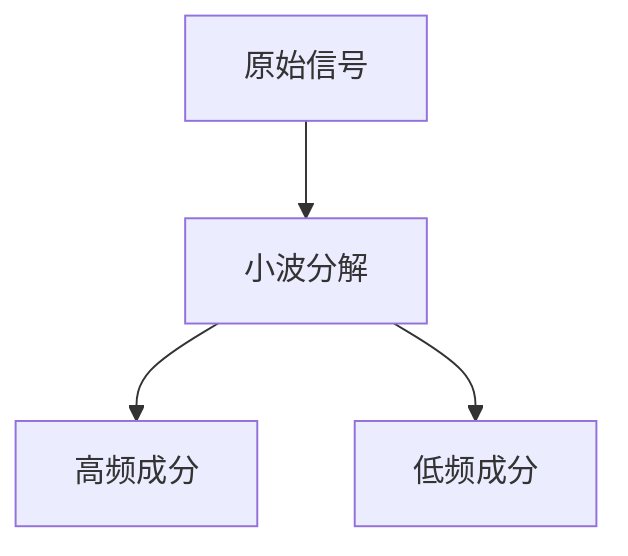
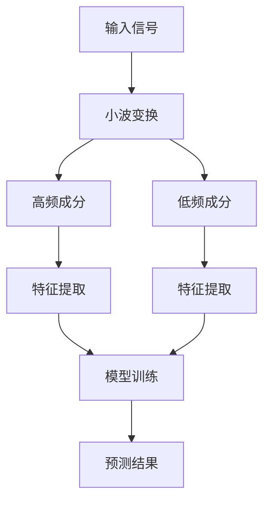

                 


# 《金融时间序列多尺度分析工具》

> 关键词：金融时间序列，多尺度分析，小波变换，金融预测，数据分析工具

> 摘要：本文深入探讨了金融时间序列多尺度分析工具的设计与实现。从金融时间序列的基本概念出发，分析了多尺度分析的必要性与优势，详细讲解了小波变换在多尺度分析中的应用原理，并通过实际案例展示了如何利用多尺度分析工具进行金融数据的特征提取、噪声消除和趋势预测。最后，本文总结了多尺度分析工具在金融领域的应用前景与未来发展方向。

---

# 第一部分: 金融时间序列多尺度分析工具概述

## 第1章: 金融时间序列分析基础

### 1.1 金融时间序列的基本概念

#### 1.1.1 时间序列的定义与特点
时间序列是指按照时间顺序排列的数据序列，通常用于描述某种现象在时间上的变化规律。金融时间序列是指与金融相关的时间序列数据，例如股票价格、汇率、指数等。金融时间序列具有以下特点：
- **连续性**：数据通常按照固定的时间间隔（如分钟、小时、天）记录。
- **波动性**：金融市场的不确定性导致数据波动较大。
- **相关性**：不同时间尺度上的数据往往存在相关性。
- **非线性**：金融数据通常表现出非线性特征，难以用简单的线性模型描述。

#### 1.1.2 金融时间序列的特殊性
金融时间序列具有以下几个特殊性：
- **噪声干扰**：金融数据受到多种噪声影响，例如市场噪声、交易噪声等。
- **趋势与周期性**：金融数据通常包含趋势和周期性成分，例如长期趋势和季节性波动。
- **非平稳性**：金融数据往往表现出非平稳性，即均值和方差随时间变化。

#### 1.1.3 多尺度分析的必要性
多尺度分析是指在不同时间尺度上对数据进行分析的方法。在金融时间序列分析中，多尺度分析具有重要意义：
- **捕捉多层次特征**：不同时间尺度上可能隐藏不同的特征，例如短期波动和长期趋势。
- **提高预测精度**：通过多尺度分析，可以更好地捕捉数据的局部特征，从而提高预测精度。
- **噪声消除**：通过多尺度分解，可以有效消除噪声，提取有用信号。

### 1.2 金融时间序列分析的常见方法

#### 1.2.1 经典时间序列分析方法
经典时间序列分析方法主要包括以下几种：
- **ARIMA模型**：自回归积分滑动模型，适用于线性平稳时间序列。
- **GARCH模型**：广义自回归条件异方差模型，适用于波动率预测。
- **指数平滑法**：简单易行，适用于短期预测。

#### 1.2.2 机器学习在时间序列分析中的应用
随着机器学习技术的发展，越来越多的算法被应用于金融时间序列分析，例如：
- **RNN/LSTM**：循环神经网络及其变体，适用于捕捉时间序列的长程依赖性。
- **XGBoost**：梯度提升树，适用于非线性特征提取。
- **注意力机制**：通过注意力机制捕捉时间序列的关键特征。

#### 1.2.3 多尺度分析的优势与挑战
多尺度分析在金融时间序列分析中的优势包括：
- **多层次特征提取**：能够同时捕捉短期和长期特征。
- **噪声消除**：通过多尺度分解，可以有效去除噪声，提取有用信号。
- **提高预测精度**：结合不同尺度的信息，可以提高预测的准确性。

多尺度分析的挑战包括：
- **计算复杂度**：多尺度分析通常涉及复杂的计算，可能增加计算成本。
- **参数选择**：需要选择合适的尺度参数，可能影响分析结果。

### 1.3 本书的目标与结构

#### 1.3.1 本书的核心目标
本书旨在介绍金融时间序列多尺度分析工具的设计与实现，帮助读者理解多尺度分析的核心原理，并掌握如何利用这些工具进行金融数据的分析与预测。

#### 1.3.2 本书的章节安排
- 第一部分：金融时间序列多尺度分析工具概述。
- 第二部分：多尺度分析的核心概念与原理。
- 第三部分：多尺度分析的算法原理与实现。
- 第四部分：多尺度分析的系统架构与设计。
- 第五部分：多尺度分析的项目实战与案例分析。

#### 1.3.3 本书的适用读者
本书适用于以下读者：
- 金融分析师：希望利用多尺度分析工具进行金融数据的分析与预测。
- 数据科学家：希望深入理解多尺度分析的核心原理并将其应用于实际项目。
- 研究人员：希望利用多尺度分析工具进行金融领域的学术研究。

---

# 第二部分: 多尺度分析的核心概念与原理

## 第2章: 多尺度分析的基本原理

### 2.1 多尺度分析的数学基础

#### 2.1.1 时间序列的分解与重构
时间序列的分解与重构是多尺度分析的基础。时间序列通常可以分解为多个不同尺度的成分，例如趋势、周期和噪声。通过分解与重构，可以分别分析不同尺度的特征。

#### 2.1.2 小波分析的基本原理
小波分析是一种有效的多尺度分析方法，其基本原理是利用小波函数对时间序列进行分解。小波函数具有局部化和多尺度分析的特点，能够捕捉时间序列的局部特征。

#### 2.1.3 多分辨率分析的数学模型
多分辨率分析是小波分析的一种扩展，通过在不同分辨率上分解信号，可以捕捉不同尺度的特征。数学模型如下：
$$ f(t) = \sum_{j} \int_{-\infty}^{\infty} c_j(k) \psi_{j,k}(t) dk $$

### 2.2 多尺度分析的核心概念

#### 2.2.1 小波变换的层次分解
小波变换的层次分解是指将信号分解为多个不同尺度的成分。通过层次分解，可以分别分析信号的高频成分和低频成分。

#### 2.2.2 多尺度模型的构建与选择
多尺度模型的构建需要选择合适的尺度参数和模型参数。模型选择通常需要考虑信号的特征和分析目标。

#### 2.2.3 尺度转换与特征提取
尺度转换是指在不同尺度上对信号进行变换，特征提取是指从不同尺度的成分中提取有用的特征。

### 2.3 多尺度分析与金融时间序列的关系

#### 2.3.1 多尺度分析在金融预测中的应用
多尺度分析可以用于金融预测，例如通过小波变换提取不同尺度的特征，然后利用机器学习算法进行预测。

#### 2.3.2 不同尺度下的信息提取
在不同尺度下，金融时间序列可能包含不同的信息。例如，短期波动可能反映市场情绪，长期趋势可能反映经济发展。

#### 2.3.3 多尺度分析的优劣势对比
多尺度分析的优势包括能够捕捉多层次特征和提高预测精度。其劣势包括计算复杂度较高和参数选择的困难。

---

## 第3章: 基于小波变换的多尺度分析

### 3.1 小波变换的基本原理

#### 3.1.1 小波变换的定义与数学公式
小波变换是一种多尺度分析方法，其数学公式如下：
$$ W_{a,b}(t) = \int_{-\infty}^{\infty} f(t) \psi_{a,b}(t) dt $$
其中，$a$ 是尺度参数，$b$ 是平移参数，$\psi_{a,b}(t)$ 是小波函数。

#### 3.1.2 小波变换的类型与选择
小波变换的类型包括连续小波变换和离散小波变换。选择小波类型需要考虑信号的特征和分析目标。

### 3.2 基于小波变换的金融时间序列分析

#### 3.2.1 小波变换在金融数据分解中的应用
通过小波变换，可以将金融时间序列分解为多个不同尺度的成分，例如高频成分和低频成分。

#### 3.2.2 小波变换的阈值去噪方法
小波变换的阈值去噪方法可以通过设置阈值去除噪声成分，保留有用信号。

#### 3.2.3 小波变换在趋势预测中的应用
通过小波变换提取特征后，可以利用机器学习算法进行趋势预测。

### 3.3 小波变换的实现代码

#### 3.3.1 Python代码实现小波变换
```python
import numpy as np
from scipy import signal

def wavelet_transform(signal, wavelet='db4'):
    # 小波分解
    coeffs = signal.wavelet_transform(signal, wavelet)
    return coeffs
```

#### 3.3.2 小波变换的可视化与分析
通过小波变换可以将信号分解为不同尺度的成分，如下图所示：


---

## 第4章: 多尺度模型与算法实现

### 4.1 多尺度模型的构建

#### 4.1.1 多尺度模型的层次结构
多尺度模型的层次结构通常包括多个不同尺度的子模型，例如高频子模型和低频子模型。

#### 4.1.2 多尺度模型的参数选择
多尺度模型的参数选择需要考虑信号的特征和分析目标。

### 4.2 多尺度分析的算法实现

#### 4.2.1 多尺度算法的流程图


#### 4.2.2 多尺度算法的数学模型
多尺度分析的数学模型可以通过小波变换实现，如下所示：
$$ f(t) = \sum_{j} \int_{-\infty}^{\infty} c_j(k) \psi_{j,k}(t) dk $$

---

# 第五部分: 项目实战与案例分析

## 第5章: 多尺度分析的项目实战

### 5.1 环境安装与配置

#### 5.1.1 Python环境的安装与配置
需要安装以下Python库：
- NumPy
- SciPy
- Matplotlib
- Scikit-learn
- PyWavelets

#### 5.1.2 数据获取与预处理
从金融数据源获取时间序列数据，并进行预处理，例如数据清洗和标准化。

### 5.2 系统核心实现

#### 5.2.1 多尺度分析模块的实现
实现小波变换模块，用于分解信号并提取特征。

#### 5.2.2 特征提取模块的实现
从不同尺度的成分中提取特征，例如均值、方差等。

#### 5.2.3 预测模型的实现
利用机器学习算法，例如LSTM，进行预测。

### 5.3 案例分析与解读

#### 5.3.1 案例背景介绍
以某股票价格预测为例，介绍案例的背景和目标。

#### 5.3.2 数据分析与特征提取
通过小波变换分解股票价格数据，提取不同尺度的特征。

#### 5.3.3 模型训练与预测
利用提取的特征训练模型，并进行预测。

### 5.4 项目小结

#### 5.4.1 项目总结
总结项目的主要成果和经验教训。

#### 5.4.2 最佳实践 tips
提供一些实用的建议，例如如何选择小波类型和参数。

#### 5.4.3 注意事项
提醒读者在实际应用中需要注意的问题。

#### 5.4.4 拓展阅读
推荐一些相关的阅读资料，帮助读者进一步学习。

---

# 第六部分: 总结与展望

## 第6章: 总结与展望

### 6.1 本书的核心内容总结
总结本书的主要内容和核心观点。

### 6.2 多尺度分析工具的未来发展方向
展望多尺度分析工具在金融领域的未来发展方向，例如结合深度学习和边缘计算。

---

# 作者信息

作者：AI天才研究院/AI Genius Institute & 禅与计算机程序设计艺术 /Zen And The Art of Computer Programming

---

以上是一个详细的技术博客文章目录大纲，涵盖了金融时间序列多尺度分析工具的核心内容。

