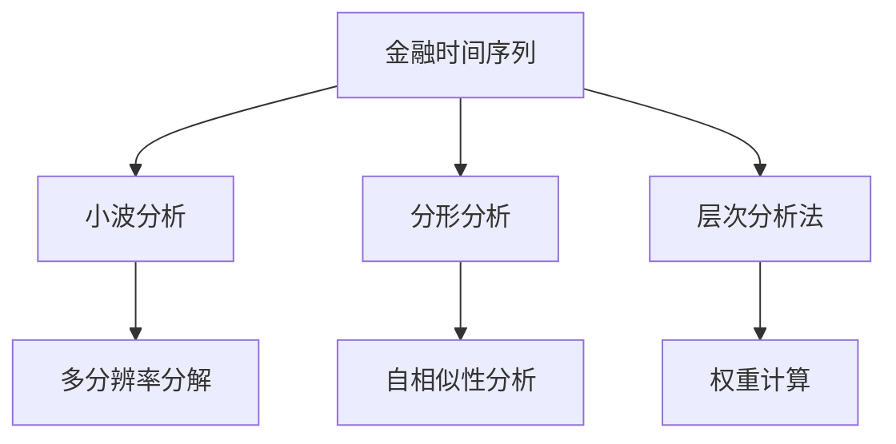
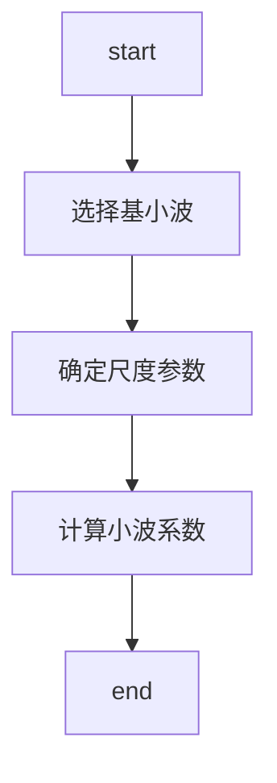
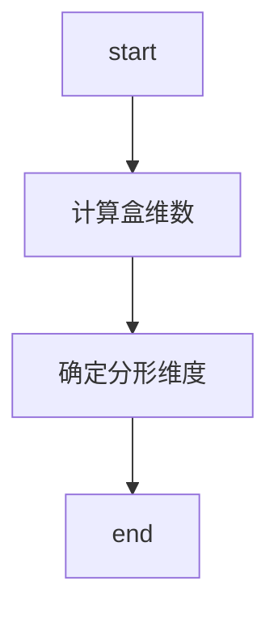
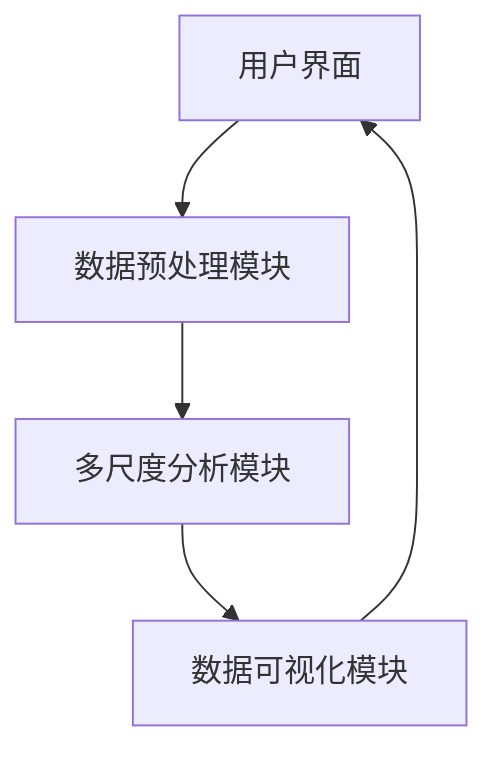
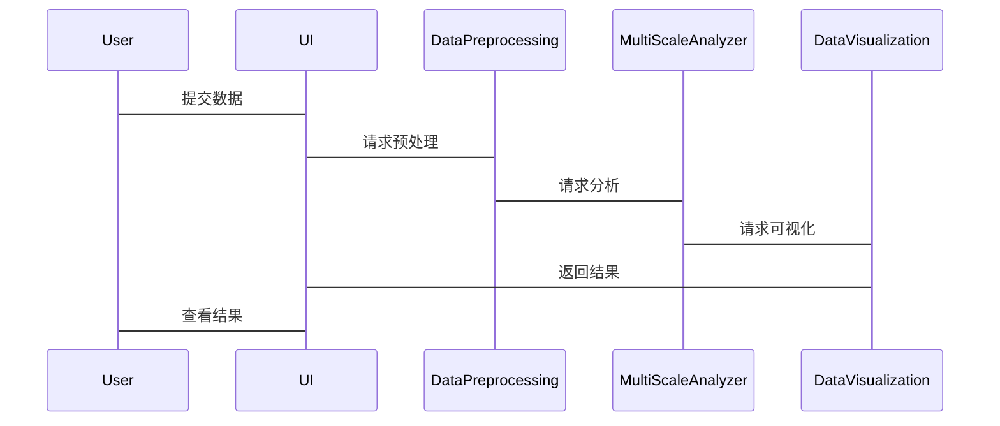

                 


# 《金融时间序列多尺度分析平台》

> 关键词：金融时间序列、多尺度分析、小波分析、分形分析、系统架构

> 摘要：本文介绍了一种基于多尺度分析的金融时间序列分析平台，旨在通过结合多种分析方法，实现对金融市场数据的多层次、多维度分析。文章详细阐述了平台的背景、核心概念、算法原理、系统架构，并通过实际案例展示了平台的应用价值。

---

## 第一部分: 金融时间序列多尺度分析平台背景介绍

### 第1章: 问题背景与描述

#### 1.1 问题背景

金融市场的复杂性和不确定性要求我们采用更精细的分析方法。传统的时间序列分析通常只考虑单一时间尺度，而金融市场的数据在不同时间尺度上表现出不同的特征，如短期波动和长期趋势。因此，引入多尺度分析方法能够更全面地捕捉市场信息。

#### 1.2 问题描述

金融时间序列数据在不同时间尺度上表现出不同的特性，例如高频数据反映短期波动，而低频数据则体现长期趋势。传统分析方法难以同时捕捉这些不同尺度的信息，导致分析结果的片面性。

#### 1.3 问题解决方法

通过引入多尺度分析，可以同时考虑多个时间尺度的信息，结合不同分析方法（如小波分析、分形分析）来提取更丰富的特征，从而提高分析的准确性和全面性。

#### 1.4 边界与外延

本平台专注于金融时间序列的多尺度分析，主要适用于股票、外汇等金融市场的数据分析。与其他数据分析工具相比，本平台的特色在于其多尺度分析能力。

#### 1.5 概念结构与核心要素

- **核心模块**：数据预处理模块、多尺度分析模块、数据可视化模块。
- **模块关系**：数据预处理模块负责清洗和转换数据，多尺度分析模块利用多种算法提取特征，数据可视化模块展示分析结果。
- **核心要素**：多尺度特征提取、跨尺度关联分析、综合分析结果。

---

## 第二部分: 核心概念与联系

### 第2章: 多尺度分析的基本原理

#### 2.1 多尺度分析的定义与特征

- **定义**：多尺度分析指在不同时间或空间尺度上对数据进行分析，以捕捉不同层次的特征。
- **特征**：多层次性、多分辨率、关联性。

#### 2.2 多尺度分析的数学

表格对比：

| 分析方法 | 小波分析 | 分形分析 | 层次分析 |
|----------|----------|----------|----------|
| 基础理论 | 波函数分解 | 分形维数 | 层次树结构 |
| 应用领域 | 信号处理 | 模拟复杂性 | 权重计算 |
| 特点 | 多分辨率 | 自相似性 | 层次性 |

Mermaid实体关系图：



---

## 第三部分: 算法原理讲解

### 第3章: 小波分析算法原理

#### 3.1 小波分析的定义与原理

小波分析是一种信号处理方法，通过分解信号到不同频率成分来分析其特性。小波变换公式：

$$ W_{a,b}(t) = \frac{1}{\sqrt{a}} \int_{-\infty}^{\infty} x(t') \psi\left(\frac{t' - t}{a}\right) dt' $$

#### 3.2 小波分析的流程



Python代码示例：

```python
import numpy as np
import pywt

def wavelet_analysis(data, wavelet='db4'):
    # 小波分解
    coeffs = pywt.wavedec(data, wavelet)
    # 提取高频和低频部分
    threshold = 0.1 * np.max(np.abs(coeffs[-1]))
    coeffs[1:] = [pywt.threshold(c, threshold, mode='soft') for c in coeffs[1:]]
    # 重构信号
    denoised_data = pywt.waverec(coeffs, wavelet)
    return denoised_data
```

---

### 第4章: 分形分析算法原理

#### 4.1 分形分析的定义与原理

分形分析用于描述数据的复杂性和自相似性。分形维数公式：

$$ D = \frac{\ln N}{\ln r} $$

其中，N为覆盖数据所需的相同小方块数量，r为缩放因子。

#### 4.2 分形分析的流程



Python代码示例：

```python
def fractal_dimension(data):
    # 计算盒维数
    max_box_size = max(data) - min(data)
    box_size = max_box_size / 100
    count = 0
    for i in range(len(data)):
        if i % box_size == 0:
            count += 1
    return np.log(count) / np.log(box_size)
```

---

## 第四部分: 系统分析与架构设计方案

### 第5章: 问题场景介绍

金融时间序列数据具有高维性和复杂性，需要高效的数据处理和分析方法。本平台旨在解决传统分析方法的局限性，提供多尺度分析能力。

### 第6章: 系统架构设计

#### 6.1 系统功能设计

- **数据预处理**：清洗、标准化。
- **多尺度分析**：小波分析、分形分析、层次分析。
- **数据可视化**：时间序列图、分词图、层次结构图。

#### 6.2 系统架构图



#### 6.3 接口设计

- 数据输入接口：接收原始数据。
- 分析接口：调用不同分析算法。
- 可视化接口：生成分析结果图表。

#### 6.4 交互流程



---

## 第五部分: 项目实战

### 第7章: 环境安装与代码实现

#### 7.1 环境安装

安装必要的Python库：

```bash
pip install numpy pandas pywt matplotlib
```

#### 7.2 核心功能实现

- 数据预处理：

```python
def preprocess(data):
    # 标准化处理
    from sklearn.preprocessing import StandardScaler
    scaler = StandardScaler()
    data_norm = scaler.fit_transform(data)
    return data_norm
```

- 多尺度分析：

```python
def multi_scale_analysis(data, wavelet='db4'):
    denoised_data = wavelet_analysis(data, wavelet)
    fractal_dim = fractal_dimension(denoised_data)
    return denoised_data, fractal_dim
```

#### 7.3 案例分析

以股票价格数据为例，展示分析结果：

```python
import pandas as pd
import matplotlib.pyplot as plt

data = pd.read_csv('stock_data.csv')['Price']
denoised, fractal_dim = multi_scale_analysis(data)
plt.figure(figsize=(12, 6))
plt.plot(data, label='Original Data')
plt.plot(denoised, label='Denoised Data')
plt.xlabel('Time')
plt.ylabel('Price')
plt.legend()
plt.show()
```

---

## 第六部分: 最佳实践与总结

### 第8章: 小结

本平台通过结合小波分析、分形分析等方法，实现了金融时间序列的多尺度分析，能够更全面地捕捉市场信息。

### 第9章: 注意事项

- 数据质量影响分析结果。
- 参数设置需根据具体场景调整。
- 结果需结合市场知识进行解释。

### 第10章: 拓展阅读

推荐学习小波分析的高级应用、复杂网络分析等技术，以进一步提升分析能力。

---

## 作者信息

作者：AI天才研究院/AI Genius Institute & 禅与计算机程序设计艺术 /Zen And The Art of Computer Programming

---

通过以上结构，文章详细讲解了金融时间序列多尺度分析平台的背景、核心概念、算法原理、系统架构，并通过实际案例展示了平台的应用价值。希望读者能够通过本文深入理解多尺度分析的方法及其在金融领域的应用。

