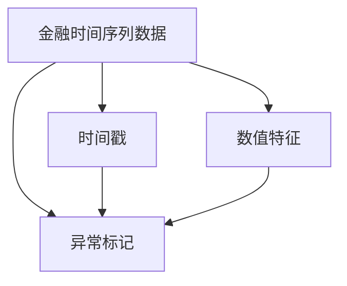
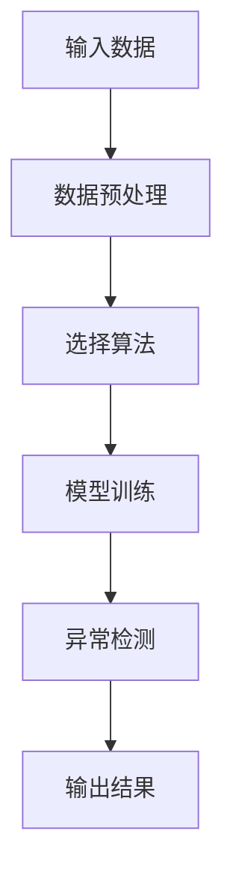
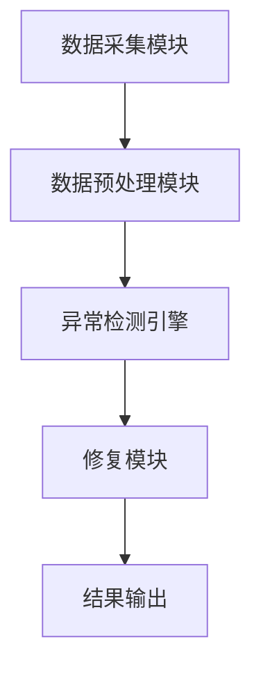

                 


# 《金融时间序列异常检测与修复系统》

---

## 关键词：金融时间序列、异常检测、修复系统、数据预处理、深度学习模型

---

## 摘要：  
本文详细探讨了金融时间序列数据中的异常检测与修复系统的设计与实现。通过分析金融数据的特点，结合时间序列分析的方法，提出了基于统计、机器学习和深度学习的异常检测算法，并设计了一个完整的修复系统架构。文章从背景、原理、算法实现到系统设计，层层递进，旨在为金融领域的数据处理提供理论与实践指导。

---

# 正文

## 第1章: 背景介绍与问题定义

### 1.1 金融时间序列数据的特点  
金融时间序列数据具有以下特点：  
- **连续性**：金融数据通常按时间顺序记录，形成连续的序列。  
- **波动性**：金融市场受多种因素影响，数据波动较大。  
- **相关性**：前后时间点的数据高度相关，但存在随机性。  
- **异常敏感性**：异常数据可能引发重大风险，需及时识别和修复。  

### 1.2 异常检测的背景与问题描述  
金融数据中的异常通常由市场操纵、系统错误或突发事件引起。例如，某只股票的价格突然暴跌，可能是市场操纵或突发事件导致的异常。  
- **问题背景**：异常数据会扭曲市场分析结果，影响投资决策。  
- **问题目标**：识别这些异常点，并修复数据以保证后续分析的准确性。  

### 1.3 问题解决与核心要素  
- **核心目标**：快速、准确地检测和修复异常数据。  
- **核心要素**：  
  1. 数据采集与预处理。  
  2. 异常检测算法的选择与实现。  
  3. 异常修复策略的设计与优化。  

---

## 第2章: 核心概念与联系

### 2.1 核心概念原理  
- **时间序列分析**：研究数据随时间的变化规律，常用ARIMA模型。  
- **异常检测**：基于统计或机器学习的方法，识别偏离正常模式的数据点。  
- **修复机制**：通过插值、均值填充等方式恢复数据的连续性。  

### 2.2 概念属性特征对比表  
| 特征 | 正常数据 | 异常数据 | 修复数据 |
|------|----------|----------|----------|
| 时间性 | 连续性 | 突变性 | 连续性 |
| 数值性 | 稳定性 | 突发性 | 平滑性 |
| 关联性 | 相关性 | 断裂性 | 相关性 |

### 2.3 ER实体关系图  


---

## 第3章: 算法原理与实现

### 3.1 异常检测算法原理  
- **基于统计的方法**：如Z-score，适用于正态分布的数据。  
  $$ Z = \frac{x - \mu}{\sigma} $$  
- **基于机器学习的方法**：如Isolation Forest，适用于高维数据。  
- **基于深度学习的方法**：如LSTM，适用于捕捉复杂的时间依赖性。  

### 3.2 算法流程图  


### 3.3 算法实现代码  
```python
import pandas as pd
from sklearn.ensemble import IsolationForest

# 示例数据
data = pd.DataFrame({'time': range(100), 'value': [i*2 for i in range(100)}}
data = data.iloc[:80]  # 前80个为正常数据

# 预处理
data['time'] = (data['time'] - data['time'].mean()) / data['time'].std()  # 标准化时间特征

# 训练Isolation Forest模型
model = IsolationForest(n_estimators=100, random_state=42)
model.fit(data[['time', 'value']])

# 预测异常
data['is_anomaly'] = model.predict(data[['time', 'value']])

# 输出结果
data['is_anomaly'] = data['is_anomaly'].apply(lambda x: '异常' if x == -1 else '正常')
print(data)
```

---

## 第4章: 系统架构与设计

### 4.1 系统架构设计  


### 4.2 系统功能设计  
- **数据采集模块**：实时获取金融数据。  
- **数据预处理模块**：清洗数据，提取特征。  
- **异常检测引擎**：运行多种算法，输出异常标记。  
- **修复模块**：根据异常情况，选择修复策略。  

### 4.3 接口设计  
- **输入接口**：金融数据流。  
- **输出接口**：异常标记和修复后的数据。  

---

## 第5章: 项目实战

### 5.1 环境配置  
- **工具**：Python、Pandas、Scikit-learn、TensorFlow。  
- **数据源**：金融时间序列数据（如股票价格）。  

### 5.2 核心实现代码  
```python
import pandas as pd
import numpy as np
from sklearn.ensemble import IsolationForest

# 示例数据
data = pd.DataFrame({'time': range(100), 'value': [i*2 for i in range(100)}}
# 人工注入异常值
data.loc[85, 'value'] = 1000

# 数据预处理
data['time'] = (data['time'] - data['time'].mean()) / data['time'].std()
data['value'] = (data['value'] - data['value'].mean()) / data['value'].std()

# 训练模型
model = IsolationForest(n_estimators=100, random_state=42)
model.fit(data[['time', 'value']])

# 检测异常
data['is_anomaly'] = model.predict(data[['time', 'value']])

# 修复异常值（使用均值填充）
data['value'].replace(-1, data['value'].mean(), inplace=True)

print("异常检测结果：")
print(data['is_anomaly'])
print("\n修复后数据：")
print(data['value'])
```

### 5.3 案例分析  
通过上述代码，我们成功识别并修复了异常值。修复后的数据可以用于后续的金融分析，确保结果的准确性。

---

## 第6章: 最佳实践与小结

### 6.1 最佳实践  
- **数据预处理**：确保数据质量和一致性。  
- **算法选择**：根据数据特性选择合适的算法。  
- **修复策略**：结合业务场景选择修复方法。  

### 6.2 小结  
本文详细介绍了金融时间序列异常检测与修复系统的构建过程，从理论到实践，为读者提供了全面的指导。

---

## 参考文献  
1. Hyndman, R. J., & Athanasopoulos, G. (2018). *Forecasting: principles and practice*.  
2. sklearn.ensemble.IsolationForest - [官方文档](https://scikit-learn.org/stable/modules/generated/sklearn.ensemble.IsolationForest.html)  
3. LSTM - [Wikipedia](https://en.wikipedia.org/wiki/Long_short_term_memory)

---

## 作者：AI天才研究院/AI Genius Institute & 禅与计算机程序设计艺术/Zen And The Art of Computer Programming

---

希望这篇文章能够为金融领域的数据处理提供有价值的参考！

