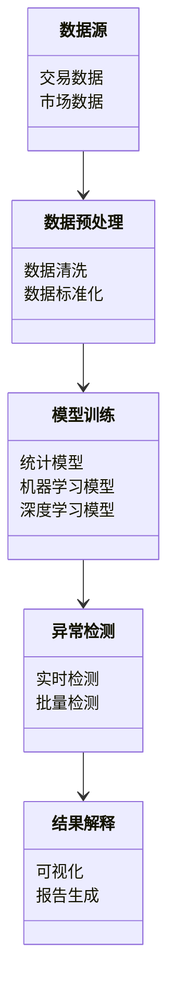

                 


# 《金融时间序列异常检测系统》

## 关键词：金融时间序列，异常检测，机器学习，深度学习，统计方法

## 摘要：本文系统地介绍金融时间序列异常检测的背景、核心概念、算法原理、系统设计、项目实战及高级主题。通过详细讲解多种异常检测方法，结合实际案例和系统架构设计，帮助读者掌握金融时间序列数据中的异常检测技术，提升金融数据分析能力。

---

# 第1章 金融时间序列数据与异常检测概述

## 1.1 金融时间序列数据的基本概念

### 1.1.1 时间序列数据的定义与特点
时间序列数据是按时间顺序排列的数据，通常用于分析随时间变化的趋势和模式。金融领域中的时间序列数据包括股票价格、汇率、交易量等。

### 1.1.2 金融领域中的时间序列数据
金融市场的波动性、周期性和趋势性使得时间序列数据在金融分析中具有重要意义。

### 1.1.3 异常检测的定义与重要性
异常检测是在数据中识别不符合预期模式或事件的过程，在金融领域中用于识别异常交易、风险管理等。

## 1.2 金融时间序列异常检测的应用场景

### 1.2.1 金融市场的异常交易检测
通过检测交易中的异常行为，识别潜在的市场操纵或欺诈行为。

### 1.2.2 风险管理中的异常识别
及时发现市场或交易中的异常波动，帮助机构进行有效的风险管理。

### 1.2.3 投资组合优化中的异常处理
通过识别异常数据，优化投资组合，提高收益。

## 1.3 本书的核心目标与结构

### 1.3.1 本书的核心目标
系统介绍金融时间序列异常检测的技术，包括算法原理、系统设计和实际应用。

### 1.3.2 本书的结构安排
从基础概念到高级算法，结合实际案例，全面讲解金融时间序列异常检测技术。

---

# 第2章 金融时间序列数据的特征分析

## 2.1 数据的连续性与波动性
金融时间序列数据通常具有高频波动，表现出高度的不稳定性。

## 2.2 数据的周期性与趋势性
许多金融数据表现出明显的周期性或趋势性，如月度或季度的周期性波动。

## 2.3 数据的稀疏性与噪声
金融数据中常存在缺失值或噪声，影响模型的准确性。

---

# 第3章 异常检测的核心概念与联系

## 3.1 异常检测的核心原理
通过统计、机器学习或深度学习方法，识别数据中的异常点。

## 3.2 核心概念对比与ER实体关系图

### 3.2.1 异常检测方法的对比分析
| 方法类型 | 描述 | 优缺点 |
|----------|------|--------|
| 统计方法 | 基于统计分布检测异常 | 简单高效，但对复杂模式识别能力有限 |
| 机器学习 | 基于模型学习正常数据分布 | 高度灵活，但需要大量数据 |
| 深度学习 | 基于神经网络学习复杂特征 | 高准确性，但计算资源需求高 |

### 3.2.2 ER实体关系图展示
```mermaid
er
  title 异常检测系统实体关系图
  rectangle 异常检测系统 {
    <很多数据表>
  }
  rectangle 数据源 {
    交易数据、市场数据
  }
  rectangle 异常检测算法 {
    统计方法、机器学习、深度学习
  }
  rectangle 结果解释 {
    可视化、报告
  }
  数据源 --> 异常检测系统
  异常检测算法 --> 异常检测系统
  异常检测系统 --> 结果解释
```

---

# 第4章 基于统计的异常检测算法

## 4.1 统计方法的基本原理

### 4.1.1 Z-score方法
通过计算数据点与均值的距离标准化值，判断是否为异常。

$$ z = \frac{x - \mu}{\sigma} $$

### 4.1.2 Exponentially Weighted Moving Average (EWMA)方法
基于加权平均数计算异常，适用于检测趋势性异常。

---

# 第5章 基于机器学习的异常检测算法

## 5.1 K-近邻（KNN）方法
通过计算数据点的最近邻居，判断其是否为异常。

## 5.2 Isolation Forest方法
通过构建隔离树，快速识别异常点。

---

# 第6章 基于深度学习的异常检测算法

## 6.1 LSTM网络
通过循环神经网络捕捉时间序列的长程依赖关系，用于异常检测。

$$ \text{LSTM}(t) = \text{sigmoid}(f(t)) $$

---

# 第7章 金融时间序列异常检测系统架构设计

## 7.1 问题场景介绍
系统需要处理高频、多维的金融数据，实时检测异常。

## 7.2 系统功能设计

### 7.2.1 领域模型设计


## 7.3 系统架构设计

### 7.3.1 分层架构


---

# 第8章 项目实战：金融时间序列异常检测系统实现

## 8.1 环境安装与数据获取
安装必要的Python库，如Pandas、NumPy、Scikit-learn等，获取金融数据集。

## 8.2 数据预处理与特征提取
对数据进行清洗、标准化，并提取有用的特征。

## 8.3 异常检测模型实现

### 8.3.1 统计模型实现
使用Z-score方法实现异常检测。

```python
import numpy as np
from sklearn.preprocessing import StandardScaler

# 标准化数据
scaler = StandardScaler()
data_scaled = scaler.fit_transform(data)

# 计算Z-score
z_scores = np.abs((data_scaled - np.mean(data_scaled)) / np.std(data_scaled))
threshold = 3
anomalies = np.where(z_scores > threshold)[0]
```

### 8.3.2 机器学习模型实现
使用Isolation Forest算法检测异常。

```python
from sklearn.ensemble import IsolationForest

# 训练模型
model = IsolationForest(n_estimators=100, random_state=42)
model.fit(data_scaled)

# 预测异常
outliers = model.predict(data_scaled)
outliers[outliers == -1] = 1
outliers[outliers == 1] = 0
```

### 8.3.3 深度学习模型实现
使用LSTM网络进行异常检测。

```python
from tensorflow.keras.models import Sequential
from tensorflow.keras.layers import LSTM, Dense

# 构建模型
model = Sequential()
model.add(LSTM(64, input_shape=(timesteps, features)))
model.add(Dense(1, activation='sigmoid'))
model.compile(loss='binary_crossentropy', optimizer='adam', metrics=['accuracy'])

# 训练模型
model.fit(x_train, y_train, epochs=10, batch_size=32)
```

## 8.4 系统实现与结果分析
对不同算法进行对比分析，评估其检测效果。

---

# 第9章 高级主题与未来展望

## 9.1 在线异常检测
实时处理数据流，及时发现异常。

## 9.2 模型调优与优化
通过超参数调优和特征选择提升模型性能。

## 9.3 集成学习与多模态数据
结合多种方法和数据源，提高检测准确率。

---

# 第10章 总结与展望

## 10.1 核心总结
本文系统地介绍了金融时间序列异常检测的各个方面，从基本概念到高级算法，再到系统设计和实战应用。

## 10.2 未来展望
未来，随着技术的发展，异常检测将更加智能化和自动化，应用场景也将更加广泛。

---

# 作者：AI天才研究院  
联系邮箱：contact@aicourse.org  
官方网站：https://www.aicourse.org

