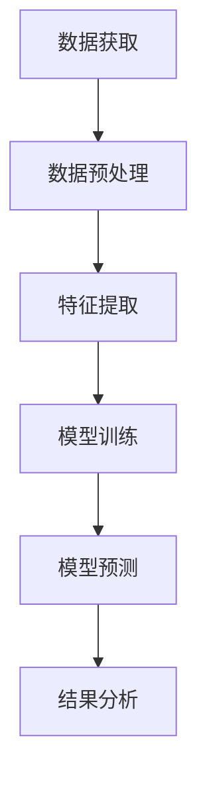
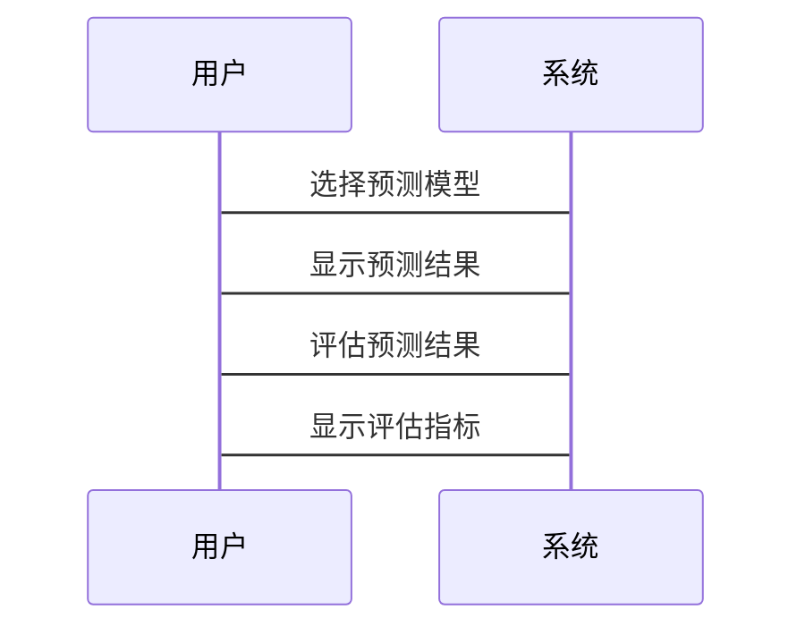

                 


# 金融时间序列数据预测：模型与方法

---

## 关键词：  
金融时间序列预测、ARIMA模型、LSTM、机器学习、深度学习、金融数据分析

---

## 摘要：  
金融时间序列数据预测是金融领域中的核心问题之一，其目标是通过历史数据预测未来的市场趋势和价格变化。本文系统地介绍了金融时间序列数据预测的基本概念、模型方法、数据预处理技术以及实际应用。我们从传统的时间序列模型（如ARIMA）到现代的机器学习和深度学习方法（如LSTM），详细探讨了各种模型的原理、优缺点及应用场景。同时，本文还结合实际案例，展示了如何通过Python代码实现这些模型，并对模型性能进行了全面的评估与优化。通过本文的学习，读者可以掌握金融时间序列数据预测的核心方法，并能够将其应用到实际的金融数据分析中。

---

## 第一部分: 金融时间序列数据预测概述

### 第1章: 金融时间序列数据预测概述

#### 1.1 金融时间序列数据的基本概念

##### 1.1.1 时间序列数据的定义与特点  
时间序列数据是一种按照时间顺序排列的数据，通常以等间隔的时间点记录观测值。金融时间序列数据具有以下特点：  
- **连续性**：数据按时间顺序排列，通常以日、小时或分钟为单位。  
- **趋势性**：数据可能呈现长期的上升或下降趋势。  
- **周期性**：数据可能受到季节性或周期性因素的影响。  
- **随机性**：数据中通常包含不可预测的随机波动。  

##### 1.1.2 金融时间序列数据的独特性  
金融时间序列数据具有以下独特性：  
- **高波动性**：金融市场通常表现出较大的波动性，数据分布可能不符合正态分布。  
- **非线性**：金融市场的价格变化通常是非线性的，受到多种因素的影响。  
- **异质性**：不同金融资产的时间序列数据可能具有不同的特征和模式。  

##### 1.1.3 金融时间序列数据的应用场景  
金融时间序列数据的应用场景包括：  
- **股票价格预测**：预测股票价格的变化趋势。  
- **外汇汇率预测**：预测不同货币之间的汇率变化。  
- **期货价格预测**：预测期货合约的价格走势。  
- **风险管理**：通过预测市场波动性，进行风险评估和管理。  

#### 1.2 金融时间序列数据预测的背景与意义  

##### 1.2.1 金融数据分析的重要性  
金融数据分析是金融领域中的核心任务之一。通过分析历史数据，可以发现市场规律，辅助投资决策，降低风险。  

##### 1.2.2 时间序列预测在金融中的作用  
时间序列预测在金融中的作用包括：  
- **投资决策支持**：通过预测股票价格或汇率变化，帮助投资者做出更明智的投资决策。  
- **风险管理**：通过预测市场波动性，帮助机构识别和管理潜在风险。  
- **交易策略优化**：通过预测短期价格变化，优化交易策略，提高交易效率。  

##### 1.2.3 金融时间序列预测的挑战与机遇  
金融时间序列预测的挑战包括：  
- **数据的复杂性**：金融数据通常具有高度的非线性和随机性。  
- **市场的不可预测性**：金融市场受到多种因素的影响，具有高度的不确定性。  
- **模型的选择与优化**：如何选择合适的模型，并对其进行优化，是一个复杂的任务。  

金融时间序列预测的机遇包括：  
- **技术进步**：随着人工智能和大数据技术的发展，越来越多先进的模型和算法被应用于金融时间序列预测。  
- **数据的可获得性**：随着金融市场的数字化，大量的金融数据可以通过公开渠道获取。  
- **研究的深度**：通过对金融时间序列数据的深入分析，可以发现更多的市场规律和潜在机会。  

#### 1.3 本书的核心内容与目标  

##### 1.3.1 本书的主要目标  
本书的主要目标是帮助读者系统地了解金融时间序列数据预测的核心方法和技术，包括数据预处理、模型选择、模型评估与优化等内容。  

##### 1.3.2 本书的核心内容框架  
本书的核心内容框架包括：  
1. 金融时间序列数据的基本概念与特点。  
2. 传统时间序列预测模型（如ARIMA）。  
3. 机器学习与深度学习模型（如随机森林、LSTM）。  
4. 模型的评估与优化方法。  
5. 金融时间序列数据预测的系统架构与实现。  
6. 实际项目实战与案例分析。  

##### 1.3.3 本书的适用读者  
本书适用于以下读者：  
- 金融从业者：如投资经理、风险管理师等。  
- 数据科学家与工程师：对时间序列数据预测感兴趣的技术人员。  
- 金融专业的学生与研究人员：希望深入学习金融时间序列数据预测的学生和研究者。  

---

## 第二部分: 时间序列数据的预处理与特征提取

### 第2章: 时间序列数据的预处理与特征提取

#### 2.1 时间序列数据的清洗与标准化  

##### 2.1.1 数据清洗的基本方法  
时间序列数据清洗的基本方法包括：  
- **缺失值处理**：删除、插值或使用模型预测缺失值。  
- **异常值处理**：识别并处理异常值，如通过Z-score或IQR方法。  
- **重复数据处理**：删除重复的观测值。  

##### 2.1.2 数据标准化与归一化  
数据标准化与归一化是将数据转换为统一尺度的过程，常用方法包括：  
- **标准化（Z-score标准化）**：将数据标准化为均值为0，方差为1。  
- **归一化（Min-Max标准化）**：将数据缩放到0到1之间。  

##### 2.1.3 数据变换  
数据变换是通过数学变换改变数据的分布，常用方法包括：  
- **对数变换**：用于减少数据的偏态。  
- **差分变换**：用于消除时间序列的趋势性和周期性。  

#### 2.2 时间序列特征的提取与分析  

##### 2.2.1 常见的时间序列特征  
常见的金融时间序列特征包括：  
- **均值**：数据的平均值。  
- **方差**：数据的离散程度。  
- **自相关性**：数据点之间的相关性。  
- **周期性**：数据的周期性特征，如日、周、月周期。  

##### 2.2.2 基于统计学的特征提取  
基于统计学的特征提取方法包括：  
- **移动平均（MA）**：计算一定时间窗口内的平均值。  
- **移动标准差（STD）**：计算一定时间窗口内的标准差。  
- **相对强弱指数（RSI）**：衡量市场的超买或超卖状态。  

##### 2.2.3 基于机器学习的特征提取  
基于机器学习的特征提取方法包括：  
- **主成分分析（PCA）**：通过降维提取主要特征。  
- **Lasso回归**：通过L1正则化提取重要特征。  

#### 2.3 时间序列数据的可视化  

##### 2.3.1 时间序列数据的常见可视化方法  
时间序列数据的常见可视化方法包括：  
- **折线图**：展示数据的变化趋势。  
- **柱状图**：展示数据在不同时间段的分布情况。  
- **K线图**：展示股票价格的开盘价、收盘价、最高价和最低价。  

##### 2.3.2 使用Python进行时间序列可视化  
以下是使用Python的matplotlib库进行时间序列可视化的示例代码：

```python
import matplotlib.pyplot as plt
import pandas as pd

# 假设data是一个包含时间序列数据的DataFrame，index为日期
data.plot(kind='line')
plt.title('Time Series Plot')
plt.xlabel('Time')
plt.ylabel('Value')
plt.show()
```

---

## 第三部分: 传统时间序列预测模型

### 第3章: 传统时间序列预测模型

#### 3.1 自动回归积分移动平均模型（ARIMA）

##### 3.1.1 ARIMA模型的基本原理  
ARIMA模型是一种广泛应用于时间序列预测的传统模型，其基本假设是时间序列数据可以通过自回归（AR）和移动平均（MA）过程来建模。  

##### 3.1.2 ARIMA模型的参数确定  
ARIMA模型的参数包括：  
- **p**：自回归阶数，表示模型中包含的过去观测值的数量。  
- **d**：差分阶数，表示对数据进行差分的次数。  
- **q**：移动平均阶数，表示模型中包含的过去误差的数量。  

##### 3.1.3 ARIMA模型的优缺点  
- **优点**：  
  - 模型简单，易于实现。  
  - 对线性时间序列数据表现良好。  
- **缺点**：  
  - 对非线性时间序列数据表现较差。  
  - 参数选择需要手动调整，可能需要较多的试错。  

##### 3.1.4 ARIMA模型的数学公式  
ARIMA模型的数学公式如下：  
$$
y_t = c + \phi_1 y_{t-1} + \phi_2 y_{t-2} + \dots + \phi_p y_{t-p} + \theta_1 \epsilon_{t-1} + \theta_2 \epsilon_{t-2} + \dots + \theta_q \epsilon_{t-q} + \epsilon_t
$$  

##### 3.1.5 ARIMA模型的Python实现  
以下是使用Python的statsmodels库实现ARIMA模型的示例代码：

```python
import statsmodels.api as sm
from statsmodels.tsa.arima.model import ARIMA

# 假设data是训练数据，train是True表示训练集
model = ARIMA(data, order=(p, d, q))
model_fit = model.fit()
forecast = model_fit.forecast(steps=5)
print(forecast)
```

#### 3.2 指数平滑模型（Exponential Smoothing）

##### 3.2.1 单变量指数平滑模型  
单变量指数平滑模型是一种简单的时间序列预测方法，适用于数据具有稳定趋势和波动的情况。  

##### 3.2.2 多变量指数平滑模型  
多变量指数平滑模型适用于考虑多个变量的预测，如多个相关资产的价格预测。  

##### 3.2.3 指数平滑模型的优缺点  
- **优点**：  
  - 模型简单，易于实现。  
  - 对数据的平滑处理能够捕捉到数据的短期趋势。  
- **缺点**：  
  - 对长期趋势的预测能力有限。  
  - 对异常值的鲁棒性较差。  

##### 3.2.4 指数平滑模型的数学公式  
指数平滑模型的数学公式如下：  
$$
\hat{y}_{t+1} = \alpha y_t + (1-\alpha)\hat{y}_t
$$  
其中，$\alpha$是平滑因子，取值范围在0到1之间。  

##### 3.2.5 指数平滑模型的Python实现  
以下是使用Python的statsmodels库实现指数平滑模型的示例代码：

```python
import statsmodels.api as sm
from statsmodels.tsa.holtwinters import ExponentialSmoothing

# 假设data是训练数据，train是True表示训练集
model = ExponentialSmoothing(data, trend='add', seasonal=None,)
model_fit = model.fit()
forecast = model_fit.forecast(steps=5)
print(forecast)
```

---

## 第四部分: 机器学习与深度学习模型

### 第4章: 机器学习与深度学习模型

#### 4.1 机器学习模型  

##### 4.1.1 随机森林（Random Forest）  
随机森林是一种基于决策树的集成学习方法，适用于处理非线性时间序列数据。  

##### 4.1.2 支持向量机（SVM）  
支持向量机是一种监督学习方法，适用于分类和回归任务。  

##### 4.1.3 K近邻回归（K-Nearest Neighbors, KNN）  
K近邻回归是一种基于邻近点的回归方法，适用于处理小规模数据集。  

##### 4.1.4 机器学习模型的优缺点  
- **优点**：  
  - 能够处理非线性数据。  
  - 模型表现稳定，鲁棒性较好。  
- **缺点**：  
  - 对特征工程要求较高。  
  - 计算复杂度较高，适用于小规模数据集。  

##### 4.1.5 机器学习模型的数学公式  
随机森林的数学公式如下：  
$$
\hat{y} = \frac{1}{n}\sum_{i=1}^{n} y_i
$$  
其中，$n$是随机森林中决策树的数量，$y_i$是第$i$棵决策树的预测值。  

#### 4.2 深度学习模型  

##### 4.2.1 长短期记忆网络（LSTM）  
LSTM是一种特殊的RNN（循环神经网络），适用于处理长序列数据。  

##### 4.2.2 多层感知机（MLP）  
多层感知机是一种前馈神经网络，适用于处理时间序列数据的特征提取。  

##### 4.2.3 Transformer模型  
Transformer模型是一种基于自注意力机制的深度学习模型，近年来在时间序列预测中表现出色。  

##### 4.2.4 深度学习模型的优缺点  
- **优点**：  
  - 能够处理复杂的非线性数据。  
  - 对长序列数据的建模能力较强。  
- **缺点**：  
  - 模型复杂，计算资源消耗较大。  
  - 对数据量要求较高，适用于大规模数据集。  

##### 4.2.5 深度学习模型的数学公式  
LSTM的数学公式如下：  
$$
f_t = \text{sigmoid}(W_f x_t + U_f h_{t-1} + b_f)
$$  
$$
i_t = \text{sigmoid}(W_i x_t + U_i h_{t-1} + b_i)
$$  
$$
o_t = \text{sigmoid}(W_o x_t + U_o h_{t-1} + b_o)
$$  
$$
c_t = f_t \cdot c_{t-1} + i_t \cdot \tanh(W_c x_t + U_c h_{t-1} + b_c)
$$  
$$
h_t = o_t \cdot \tanh(c_t)
$$  

##### 4.2.6 深度学习模型的Python实现  
以下是使用Python的Keras库实现LSTM模型的示例代码：

```python
import numpy as np
from tensorflow.keras.models import Sequential
from tensorflow.keras.layers import LSTM, Dense, Dropout

# 假设X_train是训练数据，y_train是目标变量
model = Sequential()
model.add(LSTM(50, return_sequences=True, input_shape=(timesteps, features)))
model.add(Dropout(0.2))
model.add(LSTM(50, return_sequences=False))
model.add(Dense(1))
model.compile(optimizer='adam', loss='mean_squared_error')
model.fit(X_train, y_train, epochs=10, batch_size=32)
```

---

## 第五部分: 模型评估与优化

### 第5章: 模型评估与优化

#### 5.1 模型评估指标  

##### 5.1.1 均方误差（MSE）  
均方误差是预测值与实际值之间平方差的平均值，公式如下：  
$$
\text{MSE} = \frac{1}{n}\sum_{i=1}^{n} (y_i - \hat{y}_i)^2
$$  

##### 5.1.2 平方根均方误差（RMSE）  
平方根均方误差是MSE的平方根，公式如下：  
$$
\text{RMSE} = \sqrt{\frac{1}{n}\sum_{i=1}^{n} (y_i - \hat{y}_i)^2}
$$  

##### 5.1.3 毛利率（MAE）  
毛利率是预测值与实际值之间的绝对差值的平均值，公式如下：  
$$
\text{MAE} = \frac{1}{n}\sum_{i=1}^{n} |y_i - \hat{y}_i|
$$  

##### 5.1.4 R平方（R²）  
R平方是模型解释力的度量，公式如下：  
$$
R^2 = 1 - \frac{\sum_{i=1}^{n} (y_i - \hat{y}_i)^2}{\sum_{i=1}^{n} (y_i - \bar{y})^2}
$$  
其中，$\bar{y}$是实际值的平均值。  

#### 5.2 模型优化  

##### 5.2.1 超参数优化  
超参数优化是通过调整模型的超参数（如学习率、批量大小等）来提高模型性能的过程。常用方法包括网格搜索和随机搜索。  

##### 5.2.2 正则化方法  
正则化方法是通过添加惩罚项来防止过拟合，常用方法包括L1正则化和L2正则化。  

##### 5.2.3 交叉验证  
交叉验证是一种通过将数据集分成训练集和验证集来评估模型性能的方法，常用方法包括K折交叉验证。  

#### 5.3 模型优化的Python实现  

##### 5.3.1 使用网格搜索优化超参数  
以下是使用Python的scikit-learn库进行网格搜索的示例代码：

```python
from sklearn.model_selection import GridSearchCV
from sklearn.tree import DecisionTreeRegressor

# 定义参数范围
param_grid = {'max_depth': [2, 3, 4, 5], 'min_samples_split': [2, 3, 4]}
grid_search = GridSearchCV(DecisionTreeRegressor(), param_grid, cv=5)
grid_search.fit(X_train, y_train)
best_params = grid_search.best_params_
print(best_params)
```

##### 5.3.2 使用K折交叉验证评估模型性能  
以下是使用K折交叉验证评估模型性能的示例代码：

```python
from sklearn.model_selection import KFold
from sklearn.metrics import mean_squared_error

# 初始化K折交叉验证
kf = KFold(n_splits=5)
scores = []
for train_index, test_index in kf.split(X):
    X_train, X_test = X[train_index], X[test_index]
    y_train, y_test = y[train_index], y[test_index]
    
    # 训练模型
    model.fit(X_train, y_train)
    
    # 预测测试集
    y_pred = model.predict(X_test)
    
    # 计算MSE
    mse = mean_squared_error(y_test, y_pred)
    scores.append(mse)
    
# 计算平均MSE
average_mse = np.mean(scores)
print(average_mse)
```

---

## 第六部分: 金融时间序列数据预测的系统架构与实现

### 第6章: 金融时间序列数据预测的系统架构与实现

#### 6.1 系统设计  

##### 6.1.1 系统功能设计  
金融时间序列数据预测系统的功能模块包括：  
- **数据获取**：从金融数据源获取数据。  
- **数据预处理**：清洗、特征提取和标准化。  
- **模型训练**：选择合适的模型并进行训练。  
- **模型预测**：使用训练好的模型进行预测。  
- **结果分析**：评估预测结果并生成报告。  

##### 6.1.2 系统架构设计  
以下是金融时间序列数据预测系统的架构图：



#### 6.2 接口设计  

##### 6.2.1 数据接口  
数据接口用于与金融数据源交互，常用接口包括：  
- **API接口**：通过API获取实时数据。  
- **数据库接口**：从数据库中获取历史数据。  

##### 6.2.2 模型接口  
模型接口用于与预测模型交互，常用接口包括：  
- **训练接口**：接收训练数据并返回训练好的模型。  
- **预测接口**：接收输入数据并返回预测结果。  

#### 6.3 交互设计  

##### 6.3.1 用户界面设计  
用户界面用于与用户交互，常用设计包括：  
- **数据可视化界面**：展示时间序列数据和预测结果。  
- **模型选择界面**：允许用户选择不同的预测模型。  
- **结果展示界面**：展示预测结果和评估指标。  

##### 6.3.2 系统交互流程  
以下是系统交互流程的序列图：



---

## 第七部分: 实际项目实战

### 第7章: 金融时间序列数据预测的实际项目实战

#### 7.1 项目背景  

##### 7.1.1 项目目标  
本项目的目标是通过时间序列数据预测模型，预测某只股票的未来价格走势。  

##### 7.1.2 数据来源  
数据来源为Yahoo Finance的公开数据，包括股票的历史价格和交易量。  

##### 7.1.3 工具与环境  
工具包括：Python、Pandas、NumPy、Matplotlib、Keras、TensorFlow。  

#### 7.2 项目实施  

##### 7.2.1 数据获取  
以下是使用Yahoo Finance API获取股票数据的Python代码：

```python
import pandas_datareader as pdr

# 下载数据
data = pdr.get_data_yahoo('AAPL', start='2020-01-01', end='2023-01-01')
```

##### 7.2.2 数据预处理  
数据预处理包括清洗、特征提取和标准化。以下是示例代码：

```python
import pandas as pd
import numpy as np
from sklearn.preprocessing import StandardScaler

# 清洗数据
data.dropna(inplace=True)

# 特征提取
features = ['Close', 'Volume']
target = 'Close'

# 标准化
scaler = StandardScaler()
data_scaled = scaler.fit_transform(data[features])

# 划分训练集和测试集
train_size = int(len(data_scaled) * 0.8)
X_train = data_scaled[:train_size]
y_train = data[features][train_size:]
```

##### 7.2.3 模型训练  
模型训练包括选择模型、训练模型并保存模型参数。以下是使用LSTM模型的示例代码：

```python
from tensorflow.keras.models import Sequential
from tensorflow.keras.layers import LSTM, Dense, Dropout

# 构建模型
model = Sequential()
model.add(LSTM(50, return_sequences=True, input_shape=(timesteps, features)))
model.add(Dropout(0.2))
model.add(LSTM(50, return_sequences=False))
model.add(Dense(1))
model.compile(optimizer='adam', loss='mean_squared_error')

# 训练模型
model.fit(X_train, y_train, epochs=50, batch_size=32)
```

##### 7.2.4 模型预测  
模型预测包括加载模型、输入测试数据并输出预测结果。以下是示例代码：

```python
# 加载模型
model.load_weights('model.h5')

# 预测测试集
y_pred = model.predict(X_test)

# 反标准化预测结果
y_pred_original = scaler.inverse_transform(y_pred)
```

##### 7.2.5 结果分析  
结果分析包括计算评估指标、绘制预测曲线并生成报告。以下是示例代码：

```python
from sklearn.metrics import mean_squared_error

# 计算MSE
mse = mean_squared_error(y_test, y_pred)
print(f'Mean Squared Error: {mse}')

# 绘制预测曲线
plt.plot(y_test, label='Actual Price')
plt.plot(y_pred_original, label='Predicted Price')
plt.title('Stock Price Prediction')
plt.xlabel('Time')
plt.ylabel('Price')
plt.legend()
plt.show()
```

#### 7.3 项目小结  

##### 7.3.1 项目总结  
本项目通过时间序列数据预测模型，成功预测了某只股票的未来价格走势，验证了模型的有效性和实用性。  

##### 7.3.2 经验与教训  
- **经验**：数据预处理和特征提取是模型性能的关键。  
- **教训**：模型的选择和优化需要根据数据特点和任务需求进行。  

##### 7.3.3 未来改进方向  
- **模型优化**：尝试不同的模型组合，如集成学习模型。  
- **特征工程**：探索更多的特征提取方法，如技术指标和市场情绪指标。  
- **实时预测**：将模型部署到实时预测系统中，实现自动化交易。  

---

## 第八部分: 总结与展望

### 第8章: 总结与展望

#### 8.1 本书总结  
本书系统地介绍了金融时间序列数据预测的核心方法和技术，包括数据预处理、模型选择、模型评估与优化等内容。通过理论与实践相结合的方式，帮助读者掌握金融时间序列数据预测的核心技能。  

#### 8.2 未来研究方向  

##### 8.2.1 集成模型的研究  
集成模型是通过组合多个模型的预测结果来提高模型性能的方法，未来可以研究如何将集成模型应用于金融时间序列预测。  

##### 8.2.2 高维时间序列数据的预测  
高维时间序列数据的预测是当前研究的热点之一，未来可以探索如何利用深度学习模型处理高维金融时间序列数据。  

##### 8.2.3 时间序列生成模型的研究  
时间序列生成模型是通过生成模型生成新的时间序列数据，未来可以研究如何将生成模型应用于金融时间序列数据的生成与模拟。  

#### 8.3 本书的结束语  
金融时间序列数据预测是一个复杂但充满挑战的领域，随着人工智能和大数据技术的不断发展，未来将有更多先进的模型和方法应用于金融时间序列预测。希望本书能够为读者提供有价值的参考和启发，帮助他们在金融时间序列数据预测领域取得更大的成功。

---

## 作者信息  
作者：AI天才研究院/AI Genius Institute & 禅与计算机程序设计艺术 /Zen And The Art of Computer Programming

