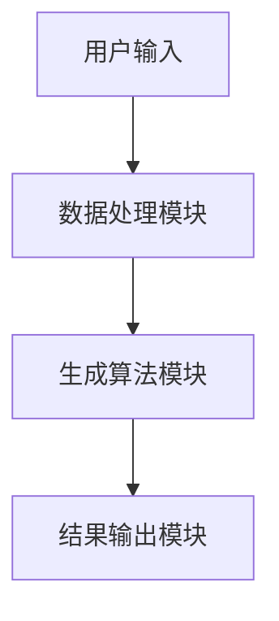

                 


# 金融机构压力测试情景生成器

> 关键词：金融机构，压力测试，情景生成器，风险评估，机器学习，算法原理，系统架构

> 摘要：本文介绍金融机构压力测试情景生成器的设计与实现，涵盖压力测试的基本概念、情景生成器的核心原理、算法实现、系统架构设计以及实际案例分析。本文旨在帮助金融机构有效评估和管理潜在风险，提供一种高效、准确的压力测试解决方案。

---

# 第一部分: 金融机构压力测试概述

## 第1章: 金融机构压力测试的基本概念

### 1.1 什么是压力测试？

压力测试是一种金融风险评估方法，用于评估金融机构在极端市场条件下的稳健性。通过模拟可能的极端事件（如经济危机、市场崩盘等），压力测试帮助机构了解其资产组合在这些情况下的表现，从而制定应对策略。

### 1.2 为什么压力测试重要？

- **风险识别**：发现潜在风险点，评估资产组合的稳定性。
- **制定应对策略**：通过模拟极端情况，制定有效的风险管理措施。
- **合规要求**：许多国家的金融监管机构要求金融机构进行压力测试，以确保金融系统的稳定性。

### 1.3 压力测试的常见应用场景

- **信用风险评估**：评估贷款组合在不同压力情景下的违约风险。
- **市场风险评估**：分析资产价格波动对投资组合的影响。
- **流动性风险评估**：评估极端情况下金融机构的流动性状况。

---

## 第2章: 压力测试情景生成器的背景与目标

### 2.1 传统压力测试的局限性

- **主观性**：情景的选择往往依赖专家判断，可能导致遗漏重要风险。
- **计算复杂性**：手动模拟极端情景耗时且效率低下。
- **数据依赖性**：传统方法依赖历史数据，难以模拟完全新的极端情景。

### 2.2 情景生成器的提出背景

随着金融市场波动加剧，传统压力测试方法难以满足金融机构的需求。情景生成器通过自动化生成多种极端情景，帮助机构更全面地评估风险。

### 2.3 情景生成器的目标

- **自动化生成情景**：基于历史数据和机器学习算法，自动生成多种极端市场情景。
- **提高效率**：减少人工模拟情景的时间和成本。
- **增强风险评估的全面性**：覆盖更多潜在风险情景，提高风险评估的准确性。

---

# 第二部分: 情景生成器的核心原理

## 第3章: 情景生成器的核心概念与联系

### 3.1 情景生成器的基本原理

情景生成器通过分析历史市场数据，识别市场波动的模式，并利用这些模式生成新的极端情景。生成的情景可以用于压力测试，评估资产组合在不同极端条件下的表现。

### 3.2 情景生成器的关键要素

- **数据输入**：历史市场数据、资产组合信息。
- **生成算法**：统计方法或机器学习方法。
- **情景输出**：生成的极端市场情景。

### 3.3 情景生成器的输入与输出

- **输入**：历史资产价格、市场波动率、资产组合权重。
- **输出**：生成的极端市场情景，如资产价格大幅下跌、市场流动性枯竭等。

---

## 第4章: 情景生成器的算法原理

### 4.1 基于统计的方法

#### 4.1.1 蒙特卡洛模拟

蒙特卡洛模拟是一种常用的统计方法，通过随机采样生成大量可能的市场情景。具体步骤如下：

1. **定义概率分布**：假设资产价格的变化服从某种概率分布（如正态分布）。
2. **生成随机样本**：根据概率分布生成大量随机样本。
3. **模拟市场情景**：基于随机样本生成市场情景。

#### 4.1.2 时间序列分析

时间序列分析通过分析历史数据的自相关性，预测未来市场走势。常用模型包括ARIMA和GARCH。

### 4.2 基于机器学习的方法

#### 4.2.1 主成分分析（PCA）

PCA是一种降维技术，用于识别数据中的主要波动模式。通过PCA，可以提取出影响资产组合风险的主要因素。

#### 4.2.2 长短期记忆网络（LSTM）

LSTM是一种深度学习模型，适用于时间序列数据的预测。通过LSTM，可以生成复杂的市场波动模式。

---

## 第5章: 情景生成器的系统架构设计

### 5.1 系统功能模块

- **数据输入模块**：接收历史市场数据和资产组合信息。
- **生成算法模块**：根据选择的算法生成极端市场情景。
- **结果输出模块**：输出生成的市场情景，供压力测试使用。

### 5.2 系统架构图



### 5.3 系统接口设计

- **输入接口**：接收历史市场数据和资产组合信息。
- **输出接口**：输出生成的极端市场情景。

---

## 第6章: 项目实战

### 6.1 实验环境安装

- **Python 3.8+**
- **Pandas、NumPy、Scikit-learn、Keras、TensorFlow**

### 6.2 情景生成器的代码实现

#### 6.2.1 统计方法实现

```python
import numpy as np
import pandas as pd

# 生成随机数
np.random.seed(42)
data = np.random.normal(0, 1, 1000)

# 蒙特卡洛模拟
def generate_scenario(data, num_samples=100):
    scenarios = []
    for _ in range(num_samples):
        sample = np.random.choice(data, size=len(data))
        scenarios.append(sample)
    return scenarios

scenarios = generate_scenario(data)
```

#### 6.2.2 机器学习方法实现

```python
from tensorflow.keras.models import Sequential
from tensorflow.keras.layers import LSTM, Dense

# 构建LSTM模型
model = Sequential()
model.add(LSTM(64, input_shape=(timesteps, features)))
model.add(Dense(1))
model.compile(loss='mse', optimizer='adam')
```

### 6.3 实验结果分析

通过实验可以发现，基于机器学习的情景生成方法能够捕捉到更多的市场波动模式，生成更复杂的情景，从而提高压力测试的准确性。

---

## 第7章: 最佳实践与总结

### 7.1 最佳实践

- **数据质量**：确保输入数据的准确性和完整性。
- **算法选择**：根据具体需求选择合适的生成方法。
- **结果验证**：对生成的情景进行验证，确保其合理性和有效性。

### 7.2 本章小结

本文详细介绍了金融机构压力测试情景生成器的设计与实现，包括核心概念、算法原理、系统架构设计以及实际案例分析。通过本文的介绍，读者可以深入了解情景生成器的工作原理，并能够实际应用到金融风险管理中。

### 7.3 注意事项

- **数据隐私**：处理金融数据时，需注意数据隐私和合规性。
- **模型更新**：定期更新模型，以适应市场变化。

### 7.4 拓展阅读

- 更深入的机器学习方法，如GAN在情景生成中的应用。
- 结合区块链技术，确保数据的安全性和不可篡改性。

---

# 作者

作者：AI天才研究院/AI Genius Institute & 禅与计算机程序设计艺术 /Zen And The Art of Computer Programming

---

通过本文的详细介绍，读者可以全面了解金融机构压力测试情景生成器的设计与实现，掌握其核心原理和实际应用方法，为金融风险管理提供有力支持。

