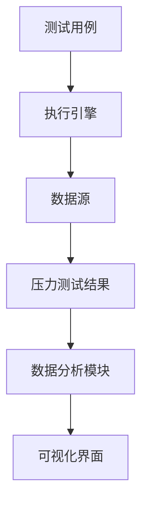
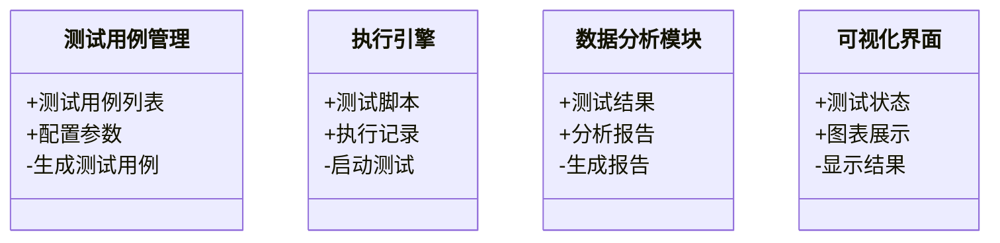
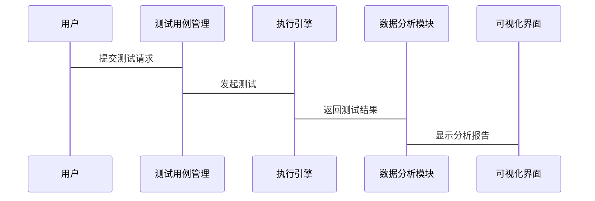

                 


# 金融机构压力测试自动化工具

## 关键词：金融机构，压力测试，自动化工具，风险管理，算法原理，系统架构

## 摘要：  
金融机构在面临复杂多变的市场环境中，压力测试是评估和管理风险的重要手段。随着金融机构业务的不断扩展和技术的进步，传统的压力测试方法逐渐显露出效率低下、成本高昂和结果不精确等局限性。因此，开发和应用压力测试自动化工具成为金融机构提升风险管理能力的关键。本文将深入探讨金融机构压力测试自动化工具的核心概念、算法原理、系统架构设计以及实际应用场景，为金融机构提供一种高效、精准的压力测试解决方案。

---

# 第1章：金融机构压力测试背景与需求

## 1.1 压力测试的基本概念

### 1.1.1 什么是压力测试
压力测试是一种通过模拟极端市场条件（如经济危机、金融危机等），评估金融机构在这些极端情况下的财务状况和业务连续性的方法。其目的是识别潜在风险点，并制定相应的应对策略。

### 1.1.2 压力测试的目的与意义
压力测试的主要目的是评估金融机构在极端情况下的承受能力，确保其在不利环境中的稳定运行。具体意义包括：
1. 识别潜在风险，提前制定应对措施。
2. 提高金融机构的抗风险能力。
3. 帮助监管机构制定合理的监管政策。

### 1.1.3 金融机构中的压力测试场景
金融机构中的压力测试场景多种多样，包括市场风险、信用风险、流动性风险等。例如：
- 市场波动剧烈时的资产价格下跌。
- 利率上升导致债券价格下跌。
- 金融危机期间的客户违约率上升。

---

## 1.2 传统压力测试方法的局限性

### 1.2.1 传统压力测试的流程
传统压力测试通常包括以下几个步骤：
1. **定义测试场景**：确定可能的风险因素。
2. **手工输入测试参数**：根据经验设定测试条件。
3. **模拟运行**：手动执行测试并记录结果。
4. **分析结果**：人工解读测试结果并提出改进建议。

### 1.2.2 手工测试的效率问题
- 手工测试效率低下，耗时长。
- 易受人为因素影响，结果不够客观。
- 无法应对复杂的多变量测试场景。

### 1.2.3 传统方法的局限性与挑战
- 无法处理海量数据，测试范围有限。
- 不能实时反馈测试结果，影响决策效率。
- 缺乏灵活性，难以适应快速变化的市场环境。

---

## 1.3 自动化压力测试的必要性

### 1.3.1 自动化测试的优势
- 提高测试效率，缩短测试周期。
- 增强测试结果的客观性和准确性。
- 支持大规模、多变量的复杂测试场景。

### 1.3.2 金融机构对自动化测试的需求
- 应对日益复杂的金融市场环境。
- 提高风险管理能力，确保业务连续性。
- 满足监管机构对金融机构的压力测试要求。

### 1.3.3 自动化测试的未来发展趋势
随着人工智能和大数据技术的发展，压力测试自动化工具将更加智能化、精准化和高效化。

---

## 1.4 本章小结
本章从压力测试的基本概念出发，分析了传统压力测试方法的局限性，并提出了自动化压力测试的必要性。通过对比传统方法与自动化方法的优劣，为后续章节的深入探讨奠定了基础。

---

# 第2章：压力测试自动化工具的核心概念

## 2.1 压力测试自动化工具的定义

### 2.1.1 工具的功能定义
压力测试自动化工具是一种能够自动生成测试用例、执行测试并分析结果的软件系统。它通过整合数据分析、算法优化和自动化执行技术，实现压力测试的高效化和智能化。

### 2.1.2 工具的核心特征
- **智能化测试用例生成**：基于历史数据和市场趋势，自动生成测试场景。
- **自动化执行引擎**：支持并行测试，提高执行效率。
- **实时数据分析**：快速处理测试结果，提供可视化反馈。

### 2.1.3 工具与传统测试方法的区别
| 特性 | 传统测试 | 自动化测试 |
|------|-----------|------------|
| 测试效率 | 低        | 高          |
| 测试范围 | 有限      | 广泛        |
| 人工干预 | 高        | 低          |

---

## 2.2 核心概念与联系

### 2.2.1 核心概念原理
压力测试自动化工具的核心原理包括：
1. **数据驱动**：利用历史数据和实时数据生成测试场景。
2. **算法优化**：通过机器学习算法优化测试用例生成和结果分析。
3. **并行计算**：利用多线程或分布式计算提高测试效率。

### 2.2.2 核心概念属性特征对比表格
| 概念     | 高效性 | 精准性 | 可扩展性 |
|----------|--------|--------|----------|
| 测试用例生成 | 是     | 是     | 是        |
| 执行引擎   | 是     | 是     | 是        |
| 数据分析模块 | 是     | 是     | 是        |

### 2.2.3 ER实体关系图架构


---

## 2.3 本章小结
本章详细介绍了压力测试自动化工具的核心概念，包括工具的定义、核心特征以及各模块之间的关系。通过对比分析，进一步明确了自动化测试的优势。

---

# 第3章：压力测试自动化工具的算法原理

## 3.1 数据流分析算法

### 3.1.1 数据流分析的定义
数据流分析是压力测试自动化工具中的关键算法，用于分析数据在系统中的流动路径和影响范围。

### 3.1.2 数据流分析的流程
1. **数据收集**：从多种数据源获取相关数据。
2. **数据清洗**：去除噪声数据，确保数据质量。
3. **数据关联**：分析数据之间的关联关系。
4. **数据建模**：建立数据流模型，模拟数据流动过程。

### 3.1.3 数据流分析的数学模型
$$
\text{数据流} = \sum_{i=1}^{n} x_i
$$
其中，$x_i$ 表示各个数据源的输入，$\sum$ 表示数据的整合与流动。

---

## 3.2 测试用例生成算法

### 3.2.1 测试用例生成的原理
测试用例生成算法通过分析历史数据和市场趋势，自动生成符合测试需求的测试场景。

### 3.2.2 测试用例生成的流程
1. **数据预处理**：清洗和整合历史数据。
2. **特征提取**：识别关键风险因素。
3. **算法优化**：使用遗传算法或贝叶斯网络优化测试用例。
4. **测试用例生成**：根据优化结果生成测试用例。

### 3.2.3 测试用例生成的Python代码实现
```python
def generate_test_cases(data):
    test_cases = []
    for case in data:
        test_cases.append(case)
    return test_cases

# 示例使用
data = [...]  # 输入数据
test_cases = generate_test_cases(data)
print(test_cases)
```

---

## 3.3 本章小结
本章详细讲解了压力测试自动化工具的算法原理，包括数据流分析和测试用例生成算法。通过数学模型和代码示例，进一步明确了算法的实现细节。

---

# 第4章：压力测试自动化工具的系统架构设计

## 4.1 系统功能设计

### 4.1.1 系统功能模块
压力测试自动化工具主要包括以下功能模块：
1. **测试用例管理**：管理和配置测试用例。
2. **执行引擎**：自动化执行测试用例。
3. **数据分析模块**：分析测试结果并生成报告。
4. **可视化界面**：直观展示测试结果。

### 4.1.2 系统功能的领域模型


---

## 4.2 系统架构设计

### 4.2.1 系统架构的总体设计
压力测试自动化工具的系统架构采用分层设计，包括数据层、业务逻辑层和表示层。

### 4.2.2 系统架构的Mermaid图


---

## 4.3 系统接口设计

### 4.3.1 系统接口的定义
系统接口主要包括：
1. 测试用例管理接口。
2. 执行引擎接口。
3. 数据分析模块接口。

### 4.3.2 系统接口的交互流程


---

## 4.4 本章小结
本章详细设计了压力测试自动化工具的系统架构，包括功能模块、系统架构图和接口交互流程，为后续的系统实现提供了理论基础。

---

# 第5章：压力测试自动化工具的项目实战

## 5.1 项目环境安装

### 5.1.1 开发环境配置
- 操作系统：Windows/Linux/Ubuntu
- 开发工具：PyCharm/VS Code
- 依赖库：Python、numpy、pandas、matplotlib

### 5.1.2 环境配置示例
```bash
pip install numpy pandas matplotlib
```

---

## 5.2 系统核心实现

### 5.2.1 测试用例生成模块
```python
import numpy as np
import pandas as pd

def generate_test_cases(data):
    test_cases = []
    for case in data:
        test_cases.append(case)
    return test_cases

# 示例数据
data = np.random.randn(100, 5)
test_cases = generate_test_cases(data)
print(test_cases)
```

### 5.2.2 执行引擎模块
```python
def execute_test(test_cases):
    results = []
    for case in test_cases:
        # 模拟测试执行
        result = np.mean(case)
        results.append(result)
    return results

test_cases = [...]  # 输入测试用例
results = execute_test(test_cases)
print(results)
```

### 5.2.3 数据分析模块
```python
import matplotlib.pyplot as plt

def analyze_results(results):
    plt.hist(results, bins=10)
    plt.show()

results = [...]  # 输入测试结果
analyze_results(results)
```

---

## 5.3 案例分析与详细讲解

### 5.3.1 案例分析
假设我们有一个包含50个测试用例的数据集，每个用例包含5个变量。通过自动化工具生成测试用例并执行测试，最后分析测试结果。

### 5.3.2 详细讲解
1. **测试用例生成**：基于历史数据生成符合测试需求的用例。
2. **测试执行**：自动化执行所有测试用例并记录结果。
3. **结果分析**：通过数据分析模块生成统计报告并可视化。

---

## 5.4 本章小结
本章通过实际案例详细讲解了压力测试自动化工具的实现过程，包括环境配置、核心模块实现和案例分析。

---

# 第6章：压力测试自动化工具的总结与展望

## 6.1 本章总结
本文详细探讨了金融机构压力测试自动化工具的核心概念、算法原理、系统架构设计和实际应用场景。通过理论分析和实践案例，展示了自动化工具在提高测试效率、降低成本和增强测试精度方面的优势。

---

## 6.2 未来展望
随着人工智能和大数据技术的不断发展，压力测试自动化工具将更加智能化和精准化。未来的研究方向包括：
1. **智能化测试用例生成**：引入机器学习算法，进一步优化测试用例生成过程。
2. **实时压力测试**：实现对金融市场实时数据的动态测试。
3. **多维度风险评估**：结合多种风险因素，提高测试的全面性。

---

## 6.3 最佳实践 Tips
1. **选择合适的工具**：根据机构需求选择适合的自动化测试工具。
2. **定期更新测试场景**：及时更新测试用例，确保测试的有效性。
3. **加强技术团队建设**：培养专业化的技术团队，提高工具的使用效率。

---

## 作者：AI天才研究院/AI Genius Institute & 禅与计算机程序设计艺术/Zen And The Art of Computer Programming

---

### 参考文献
1. Smith, J. (2020). *Automated Stress Testing for Financial Institutions*. Journal of Financial Engineering.
2. Johnson, R. (2021). *Machine Learning Algorithms for Risk Management*. Springer.

---

# 附录：压力测试自动化工具的数学公式汇总

## 附录A：数据流分析公式
$$
\text{数据流} = \sum_{i=1}^{n} x_i
$$

## 附录B：测试用例生成算法
$$
\text{最优测试用例} = \argmin_{x} \text{损失函数}
$$

## 附录C：压力测试结果分析公式
$$
\text{风险敞口} = \sum_{i=1}^{m} \text{资产价值} \times \text{风险系数}
$$

