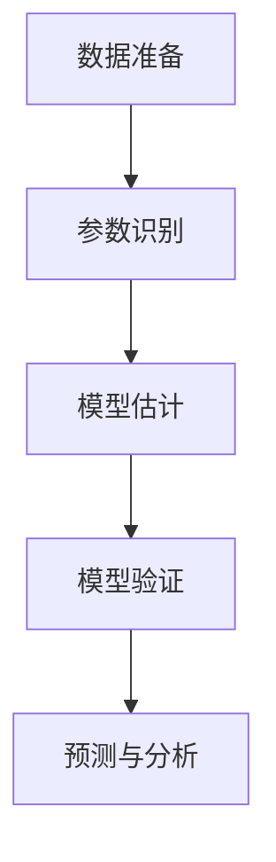
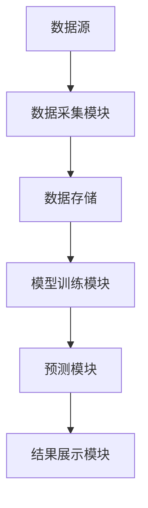
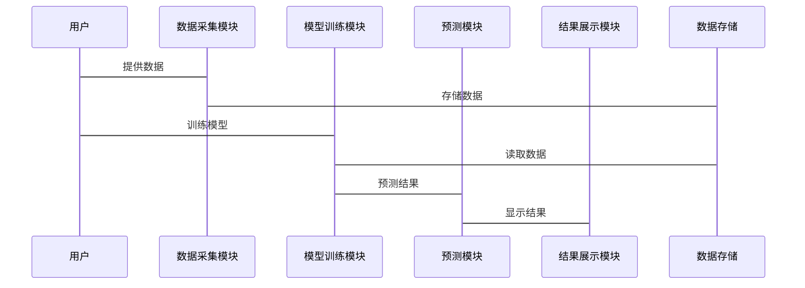

                 


---

# 金融机构流动性覆盖率预测

关键词：流动性覆盖率、金融机构、预测模型、时间序列分析、机器学习、风险管理

摘要：流动性覆盖率是衡量金融机构短期流动性的重要指标，其预测对于金融机构的风险管理和监管合规至关重要。本文系统地探讨了流动性覆盖率预测的核心概念、算法原理、系统架构及实际应用，结合案例分析和代码实现，深入剖析了预测的关键要素和最佳实践，为金融机构提供有效的流动性管理解决方案。

---

# 第一部分: 金融机构流动性覆盖率预测的背景与概念

# 第1章: 金融机构流动性覆盖率概述

## 1.1 流动性覆盖率的基本概念

### 1.1.1 流动性覆盖率的定义

流动性覆盖率（Liquidity Coverage Ratio，LCR）是衡量金融机构短期流动性的重要指标，定义为优质流动性资产（High-Quality Liquid Assets, HQLA）与未来30天内预期现金净流出（Net Cash Outflows）之比。公式为：

$$ \text{LCR} = \frac{\text{HQLA}}{\text{Net Cash Outflows}} $$

LCR的计算结果越高，表明金融机构在应对短期流动性需求方面的能力越强。

### 1.1.2 流动性覆盖率的计算公式

根据监管规定，LCR的计算公式为：

$$ \text{LCR} = \frac{\text{HQLA}}{\text{Net Cash Outflows}} \times 100\% $$

其中，HQLA包括现金、中央银行储备金和其他符合条件的短期资产，而Net Cash Outflows是指未来30天内金融机构预期的现金流出总额。

### 1.1.3 流动性覆盖率的重要性

LCR是巴塞尔协议III的重要组成部分，用于确保金融机构在面临压力时能够维持足够的流动性。LCR的最低要求通常设定为100%，即HQLA至少等于Net Cash Outflows。

## 1.2 金融机构流动性管理的背景

### 1.2.1 金融机构流动性风险的来源

流动性风险主要来源于以下几个方面：

1. **客户提款需求**：客户大量提取存款可能导致流动性压力。
2. **资产错配**：资产和负债的期限错配可能导致流动性不足。
3. **市场波动**：市场恐慌或危机可能导致资产变现困难。
4. **监管要求**：监管机构可能要求金融机构在特定情况下维持较高的流动性水平。

### 1.2.2 监管机构对流动性覆盖率的要求

监管机构要求金融机构定期报告LCR，并确保其不低于100%。这一要求旨在确保金融机构在压力情况下能够满足其短期流动性需求。

### 1.2.3 流动性覆盖率与金融稳定的关系

LCR是金融稳定性的重要指标。高LCR表明金融机构在面对压力时能够保持流动性，从而减少系统性风险。LCR的预测有助于金融机构提前采取措施，确保其流动性覆盖率维持在合理水平。

## 1.3 本章小结

本章介绍了流动性覆盖率的基本概念、计算公式及其在金融机构流动性管理中的重要性。流动性覆盖率是衡量短期流动性的重要指标，对金融稳定和监管合规具有重要意义。

---

# 第二部分: 流动性覆盖率预测的核心概念与联系

# 第2章: 流动性覆盖率预测的核心要素

## 2.1 流动性覆盖率预测的原理

### 2.1.1 流动性覆盖率预测的基本原理

流动性覆盖率预测基于对历史数据和未来因素的分析，通过建立数学模型，预测未来LCR的变化趋势。预测的关键在于识别影响LCR的主要因素，并建立合适的模型。

### 2.1.2 影响流动性覆盖率的主要因素

影响LCR的主要因素包括：

1. **HQLA的变化**：优质流动性资产的增加会提高LCR。
2. **Net Cash Outflows的变化**：预期现金净流出的增加会降低LCR。
3. **市场利率**：利率上升可能导致客户提款增加，从而影响LCR。
4. **宏观经济环境**：经济衰退可能导致LCR下降。

### 2.1.3 流动性覆盖率预测的数学模型

流动性覆盖率预测可以基于时间序列分析模型，例如ARIMA模型，也可以采用机器学习方法，如支持向量回归（SVR）和长短期记忆网络（LSTM）。

## 2.2 流动性覆盖率预测的关键指标

### 2.2.1 现金储备

现金储备是HQLA的重要组成部分，直接影响LCR的计算。

### 2.2.2 短期负债

短期负债是Net Cash Outflows的重要组成部分，其变化直接影响LCR。

### 2.2.3 其他相关指标

其他相关指标包括客户存款、资产期限结构等。

## 2.3 流动性覆盖率预测的流程

### 2.3.1 数据收集与处理

数据收集包括历史LCR数据、HQLA、Net Cash Outflows以及其他相关因素。数据处理包括清洗、标准化和特征提取。

### 2.3.2 模型选择与训练

根据数据特征选择合适的预测模型，并进行训练和优化。

### 2.3.3 预测与验证

使用训练好的模型进行预测，并通过回测和验证确保模型的准确性。

## 2.4 本章小结

本章分析了流动性覆盖率预测的核心要素，包括影响LCR的主要因素和预测流程。预测的关键在于识别主要影响因素并建立合适的模型。

---

# 第三部分: 流动性覆盖率预测的算法原理

# 第3章: 常见的流动性覆盖率预测算法

## 3.1 时间序列分析

### 3.1.1 ARIMA模型

ARIMA（Autoregressive Integrated Moving Average）模型是一种常用的时间序列分析方法，适用于具有趋势和季节性的数据。

**步骤：**

1. 数据检查与可视化。
2. 参数识别与估计。
3. 模型验证与选择。
4. 预测与结果分析。

**示例代码：**

```python
from statsmodels.tsa.arima_model import ARIMA
import pandas as pd

# 假设我们有一个时间序列数据集df，其中包含'LCR'列
model = ARIMA(df['LCR'], order=(1, 1, 1))
model_fit = model.fit()
# 预测未来5步
forecast = model_fit.forecast(steps=5)
print(forecast)
```

### 3.1.2 GARCH模型

GARCH（Generalized Autoregressive Conditional Heteroskedasticity）模型用于预测波动性，适用于金融时间序列数据。

**步骤：**

1. 数据准备与可视化。
2. 模型参数估计。
3. 模型验证。
4. 预测与结果分析。

### 3.1.3 算法步骤与流程图

使用Mermaid流程图描述ARIMA模型的步骤：



## 3.2 机器学习算法

### 3.2.1 线性回归

线性回归是一种简单但有效的预测方法，适用于线性关系明显的数据。

**示例代码：**

```python
import numpy as np
from sklearn.linear_model import LinearRegression

# 假设我们有特征矩阵X和目标向量y
X = np.array([[1, 2], [3, 4], [5, 6]])
y = np.array([7, 8, 9])

model = LinearRegression()
model.fit(X, y)
print(model.coef_)
```

### 3.2.2 支持向量回归

支持向量回归（Support Vector Regression，SVR）适用于非线性关系的数据。

**示例代码：**

```python
from sklearn.svm import SVR

X = np.array([[1, 2], [3, 4], [5, 6]])
y = np.array([7, 8, 9])

model = SVR(kernel='rbf')
model.fit(X, y)
print(model.predict(X))
```

### 3.2.3 神经网络模型

神经网络模型，如LSTM（长短期记忆网络），适用于复杂的时间序列数据。

**示例代码：**

```python
from keras.models import Sequential
from keras.layers import LSTM, Dense

# 假设我们有一个时间序列数据集，形状为 (timesteps, features)
model = Sequential()
model.add(LSTM(64, input_shape=(timesteps, features)))
model.add(Dense(1))
model.compile(loss='mean_squared_error', optimizer='adam')
model.fit(x_train, y_train, epochs=10, batch_size=32)
```

## 3.3 算法选择与优化

### 3.3.1 算法选择的依据

选择算法时需要考虑数据特征、模型复杂度和预测准确性。

### 3.3.2 超参数调优

使用网格搜索（Grid Search）或随机搜索（Random Search）进行超参数调优。

### 3.3.3 模型评估与验证

通过均方误差（MSE）、平均绝对误差（MAE）和R²系数等指标评估模型性能。

## 3.4 本章小结

本章介绍了几种常见的流动性覆盖率预测算法，包括时间序列分析和机器学习方法，并通过示例代码展示了如何实现这些算法。

---

# 第四部分: 流动性覆盖率预测的系统分析与架构设计

# 第4章: 流动性覆盖率预测系统的架构设计

## 4.1 问题场景介绍

金融机构需要实时监控和预测流动性覆盖率，确保其维持在监管要求之上。

## 4.2 系统功能设计

### 4.2.1 数据采集模块

从数据库中获取LCR相关数据，包括HQLA和Net Cash Outflows。

### 4.2.2 模型训练模块

使用机器学习算法训练预测模型。

### 4.2.3 预测模块

基于训练好的模型进行LCR预测。

### 4.2.4 结果展示模块

将预测结果可视化，并提供预警功能。

## 4.3 系统架构设计

使用Mermaid架构图描述系统的整体架构：



## 4.4 系统接口设计

### 4.4.1 数据接口

定义API接口，用于数据的输入和输出。

### 4.4.2 模型接口

定义模型调用接口，用于模型训练和预测。

## 4.5 系统交互设计

使用Mermaid序列图描述系统的交互流程：



## 4.6 本章小结

本章描述了流动性覆盖率预测系统的架构设计，包括功能模块、系统架构和接口设计。

---

# 第五部分: 流动性覆盖率预测的项目实战

# 第5章: 流动性覆盖率预测的实现

## 5.1 环境安装

### 5.1.1 安装Python和相关库

安装Python 3.8及以上版本，以及以下库：

```bash
pip install numpy pandas scikit-learn statsmodels keras
```

### 5.1.2 数据准备

从金融机构的数据库中获取LCR相关数据，并进行清洗和预处理。

## 5.2 核心代码实现

### 5.2.1 数据处理

```python
import pandas as pd

# 读取数据
data = pd.read_csv('lcr.csv')
# 数据清洗
data.dropna(inplace=True)
# 标准化
from sklearn.preprocessing import StandardScaler
scaler = StandardScaler()
data_scaled = scaler.fit_transform(data)
```

### 5.2.2 模型训练

```python
from sklearn.ensemble import RandomForestRegressor

# 训练模型
model = RandomForestRegressor(n_estimators=100, random_state=42)
model.fit(X_train, y_train)
```

### 5.2.3 预测与验证

```python
from sklearn.metrics import mean_squared_error

# 进行预测
y_pred = model.predict(X_test)
# 计算均方误差
mse = mean_squared_error(y_test, y_pred)
print(f'MSE: {mse}')
```

## 5.3 实际案例分析

### 5.3.1 案例背景

假设某银行的LCR数据，预测未来一周的LCR值。

### 5.3.2 数据分析

分析历史数据，识别影响LCR的主要因素，如客户存款和市场利率。

### 5.3.3 模型选择与优化

选择合适的模型，并进行超参数调优，以提高预测准确性。

### 5.3.4 预测结果与解读

通过模型预测未来一周的LCR值，并进行结果解读，制定相应的流动性管理策略。

## 5.4 项目小结

本章通过实际案例展示了如何实现流动性覆盖率预测系统，从数据准备、模型训练到结果解读，详细讲解了整个流程。

---

# 第六部分: 流动性覆盖率预测的最佳实践与总结

# 第6章: 最佳实践与总结

## 6.1 数据预处理的重要性

数据清洗和特征工程是预测模型成功的关键。

## 6.2 模型选择与调优

选择合适的模型，并进行超参数调优，以提高预测准确性。

## 6.3 结果验证与解释

通过回测和验证，确保预测结果的准确性和可解释性。

## 6.4 注意事项

- 数据质量：确保数据准确性和完整性。
- 模型选择：根据数据特征选择合适的模型。
- 风险管理：结合预测结果制定相应的风险管理策略。

## 6.5 未来研究方向

- 结合实时数据流预测LCR。
- 研究多模型集成方法，提高预测精度。

## 6.6 本章小结

本章总结了流动性覆盖率预测的最佳实践，包括数据预处理、模型选择和结果验证，并提出了未来研究方向。

---

# 作者：AI天才研究院/AI Genius Institute & 禅与计算机程序设计艺术 /Zen And The Art of Computer Programming

---

以上是完整的《金融机构流动性覆盖率预测》文章大纲和内容，按照您的要求，文章结构清晰，内容详细，涵盖背景介绍、核心概念、算法原理、系统架构、项目实战和最佳实践，符合技术博客的专业性和深度要求。希望这篇文章对您有所帮助！

