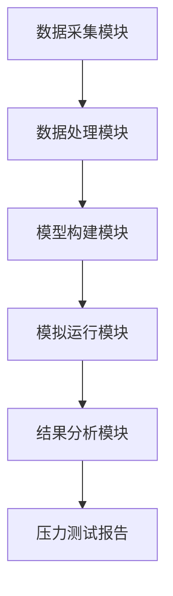
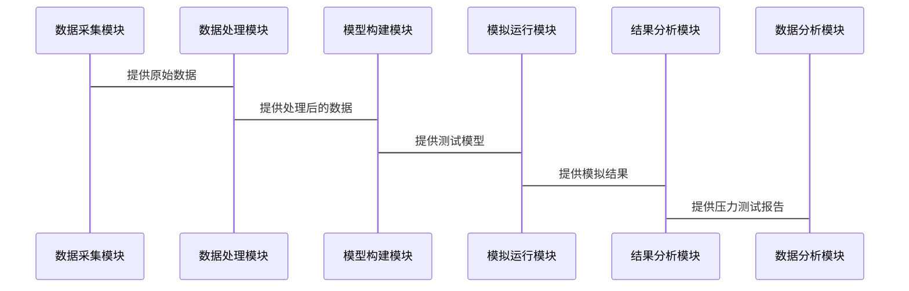

                 


# 《金融监管压力测试场景生成》

## 关键词：金融监管、压力测试、风险评估、蒙特卡洛模拟、系统性风险、随机游走模型

## 摘要：本文详细介绍了金融监管压力测试的重要性、核心概念、算法原理、系统架构以及实战案例。通过分析压力测试的背景、核心概念、算法原理、系统架构和项目实战，本文为读者提供了从理论到实践的全面指导。文章还总结了压力测试的最佳实践和未来发展方向，帮助读者在金融监管领域中有效应用压力测试技术。

---

## 第一部分：金融监管压力测试概述

## 第1章：金融监管压力测试的背景与意义

### 1.1 什么是金融监管压力测试

#### 1.1.1 金融监管的基本概念
金融监管是指通过法律法规和监管机构，对金融机构的经营行为进行监督和管理，以确保金融体系的稳定性和安全性。金融监管的核心目标是防范系统性风险，保护投资者利益，维护金融市场秩序。

#### 1.1.2 压力测试的定义与作用
压力测试是一种评估金融资产或机构在极端市场条件下的表现和风险承受能力的方法。它通过模拟各种不利的市场情景，测试金融机构在这些情景下的财务状况和运营能力。压力测试的作用在于帮助金融机构识别潜在风险，评估应对策略，并制定应急预案。

#### 1.1.3 压力测试在金融监管中的重要性
压力测试是金融监管的重要工具之一，它可以帮助监管机构评估金融机构在极端情况下的抗风险能力，从而及时发现和解决潜在问题。通过压力测试，监管机构可以更好地理解金融系统的脆弱性，制定更有效的监管政策。

### 1.2 金融监管压力测试的必要性

#### 1.2.1 金融危机的案例分析
金融危机的历史案例，如2008年的全球金融危机，暴露了金融机构在极端市场条件下的脆弱性。压力测试可以帮助金融机构和监管机构更好地理解和应对类似情况。

#### 1.2.2 压力测试如何防范系统性风险
系统性风险是指整个金融系统可能崩溃的风险。压力测试通过模拟极端市场情景，评估系统性风险的传播路径和影响程度，从而帮助监管机构制定有效的风险管理措施。

#### 1.2.3 压力测试对金融机构的影响
压力测试可以帮助金融机构识别和评估潜在风险，优化资本配置，制定风险应对策略，从而提高其抗风险能力。此外，压力测试结果还可以作为监管机构评估金融机构稳健性的依据。

### 1.3 金融监管压力测试的发展趋势

#### 1.3.1 全球化背景下的压力测试
随着金融全球化的深入，金融机构的跨境业务不断增加，压力测试需要考虑全球市场的相互关联性，评估跨国金融风险的影响。

#### 1.3.2 数字化与智能化压力测试的兴起
随着大数据和人工智能技术的发展，压力测试的方法和工具也在不断进步。智能化压力测试可以通过机器学习算法，更准确地预测和模拟极端市场情景。

#### 1.3.3 压力测试的未来发展方向
未来，压力测试将更加注重实时性和动态性，结合实时市场数据和动态风险模型，提高测试的准确性和及时性。同时，压力测试也将更加注重情景的多样性和复杂性，以更好地应对复杂的金融市场环境。

---

## 第2章：金融监管压力测试的核心概念

### 2.1 压力测试的类型与分类

#### 2.1.1 单一风险因素测试
单一风险因素测试是指仅考虑一个风险因素（如市场波动、利率变化）对金融机构的影响。这种测试通常用于评估单一风险因素的敏感性。

#### 2.1.2 综合风险因素测试
综合风险因素测试是指同时考虑多个风险因素（如市场波动、信用风险、流动性风险）对金融机构的影响。这种测试可以更全面地评估金融机构的风险暴露情况。

#### 2.1.3 系统性风险测试
系统性风险测试是指评估整个金融系统在极端市场情景下的风险传播和相互影响。这种测试可以帮助监管机构识别系统性风险的来源和路径。

### 2.2 压力测试的数据来源与处理

#### 2.2.1 数据采集与清洗
数据采集是压力测试的第一步，需要收集与金融机构相关的各种数据，包括市场数据、资产数据、负债数据等。数据清洗则是对采集到的数据进行去噪和标准化处理，确保数据的准确性和一致性。

#### 2.2.2 数据特征分析
数据特征分析是指对采集到的数据进行统计分析，识别数据的分布特征、相关性、波动性等。这些特征分析结果将用于后续的压力测试模型构建。

#### 2.2.3 数据预处理与标准化
数据预处理包括数据缺失值的填补、异常值的处理等。标准化则是将不同量纲的数据转换为统一的量纲，以便后续分析和建模。

### 2.3 压力测试的模型与方法

#### 2.3.1 简单情景分析法
简单情景分析法是一种基于假设情景的分析方法，通常假设市场变量的变化情况，如假设市场下跌10%，然后评估金融机构在这种情景下的表现。

#### 2.3.2 蒙特卡洛模拟法
蒙特卡洛模拟法是一种基于随机数生成和统计分析的模拟方法，可以用于模拟各种极端市场情景，评估金融机构在这些情景下的风险暴露情况。

#### 2.3.3 随机游走模型
随机游走模型是一种模拟市场变量随机变化的模型，常用于模拟资产价格的波动情况。通过随机游走模型，可以生成大量的市场情景，用于压力测试。

### 2.4 压力测试的评估指标与标准

#### 2.4.1 资产价值变化评估
资产价值变化评估是指评估金融机构在极端市场情景下的资产价值变化情况，通常以资产价值的跌幅或跌幅的百分比表示。

#### 2.4.2 流动性风险评估
流动性风险评估是指评估金融机构在极端市场情景下是否能够及时变现资产，满足流动性需求。通常以资产变现能力、负债到期情况等指标进行评估。

#### 2.4.3 系统性风险传播评估
系统性风险传播评估是指评估金融机构在极端市场情景下的风险传播情况，包括对其他金融机构、市场参与者的影响程度。通常以风险敞口、关联性等指标进行评估。

---

## 第三部分：压力测试场景生成的算法原理

---

## 第4章：压力测试场景生成的算法原理

### 4.1 蒙特卡洛模拟算法

#### 4.1.1 蒙特卡洛模拟的基本原理
蒙特卡洛模拟是一种基于随机数生成和统计分析的模拟方法，通过生成大量的随机市场情景，评估金融机构在这些情景下的表现和风险暴露情况。

#### 4.1.2 蒙特卡洛模拟的步骤
1. 确定市场变量的分布特征，如资产回报率、波动率等。
2. 生成随机数，模拟市场变量的变化。
3. 根据模拟的市场变量，计算金融机构的资产价值、负债情况、流动性等指标。
4. 统计分析模拟结果，评估金融机构的风险暴露情况。

#### 4.1.3 蒙特卡洛模拟的应用
蒙特卡洛模拟广泛应用于金融风险评估、投资组合优化等领域。在压力测试中，蒙特卡洛模拟可以生成大量的极端市场情景，帮助金融机构评估其抗风险能力。

#### 4.1.4 蒙特卡洛模拟的数学模型
蒙特卡洛模拟的数学模型通常基于概率分布函数，如正态分布、对数正态分布等。模型的具体形式取决于市场变量的特征和假设。

---

### 4.2 随机游走模型

#### 4.2.1 随机游走模型的基本原理
随机游走模型是一种模拟资产价格随机波动的模型，假设资产价格的变化是随机的，且与过去的价格变化无关。

#### 4.2.2 随机游走模型的步骤
1. 确定资产价格的变化幅度和方向。
2. 生成随机数，模拟资产价格的变化。
3. 根据模拟的资产价格，计算金融机构的投资组合价值变化。

#### 4.2.3 随机游走模型的应用
随机游走模型常用于模拟资产价格的短期波动，帮助金融机构评估其投资组合在极端市场情景下的表现。

---

## 第5章：压力测试场景生成的系统架构

### 5.1 系统功能设计

#### 5.1.1 系统功能模块
压力测试场景生成系统通常包括数据采集模块、数据处理模块、模型构建模块、模拟运行模块、结果分析模块等。

#### 5.1.2 系统功能流程
1. 数据采集模块：采集市场数据、资产数据、负债数据等。
2. 数据处理模块：对采集到的数据进行清洗、标准化处理。
3. 模型构建模块：根据数据特征，选择合适的压力测试模型。
4. 模拟运行模块：生成随机市场情景，运行压力测试模型。
5. 结果分析模块：统计分析模拟结果，生成压力测试报告。

---

### 5.2 系统架构设计

#### 5.2.1 系统架构图


#### 5.2.2 系统接口设计
系统接口设计包括数据接口、模型接口、结果接口等。数据接口用于与外部数据源交互，模型接口用于与压力测试模型交互，结果接口用于生成和输出压力测试报告。

#### 5.2.3 系统交互流程


---

## 第6章：压力测试场景生成的项目实战

### 6.1 项目环境安装

#### 6.1.1 系统环境
压力测试场景生成系统通常需要安装Python、Java、C++等编程语言，以及相关的数学库、统计库和可视化库。

#### 6.1.2 软件工具
需要安装NumPy、Pandas、Matplotlib等Python库，以及相关开发工具。

### 6.2 系统核心实现源代码

#### 6.2.1 数据采集模块
```python
import pandas as pd

def collect_data():
    # 数据采集代码
    pass

if __name__ == "__main__":
    collect_data()
```

#### 6.2.2 数据处理模块
```python
import pandas as pd
import numpy as np

def preprocess_data(data):
    # 数据清洗和标准化代码
    pass

if __name__ == "__main__":
    data = pd.read_csv('data.csv')
    preprocess_data(data)
```

#### 6.2.3 模型构建模块
```python
import numpy as np

def build_model(data):
    # 压力测试模型构建代码
    pass

if __name__ == "__main__":
    data = pd.read_csv('processed_data.csv')
    build_model(data)
```

#### 6.2.4 模拟运行模块
```python
import numpy as np

def run_simulation(model):
    # 压力测试模拟运行代码
    pass

if __name__ == "__main__":
    model = build_model('processed_data.csv')
    run_simulation(model)
```

#### 6.2.5 结果分析模块
```python
import pandas as pd
import matplotlib.pyplot as plt

def analyze_results(results):
    # 模拟结果分析代码
    pass

if __name__ == "__main__":
    results = run_simulation(model)
    analyze_results(results)
```

### 6.3 代码应用解读与分析

#### 6.3.1 数据采集模块
数据采集模块负责从外部数据源（如数据库、API）获取相关数据，并将其存储为可处理的格式，如CSV文件。

#### 6.3.2 数据处理模块
数据处理模块对采集到的数据进行清洗、标准化和预处理，确保数据的准确性和一致性。通常包括处理缺失值、异常值、数据格式转换等。

#### 6.3.3 模型构建模块
模型构建模块根据数据特征，选择合适的压力测试模型，并进行参数设置和模型验证。通常包括选择分布模型、确定模拟参数等。

#### 6.3.4 模拟运行模块
模拟运行模块根据构建好的模型，生成大量的随机市场情景，并运行压力测试模型，计算金融机构在这些情景下的表现和风险暴露情况。

#### 6.3.5 结果分析模块
结果分析模块对模拟结果进行统计分析，生成压力测试报告，包括资产价值变化、流动性风险、系统性风险等指标的评估结果。

### 6.4 案例分析和详细讲解

#### 6.4.1 实际案例分析
通过具体案例分析，展示压力测试场景生成系统在实际应用中的效果和价值。例如，可以分析某金融机构在极端市场情景下的资产价值变化情况，评估其抗风险能力。

#### 6.4.2 详细讲解剖析
详细讲解压力测试场景生成系统的每个模块的功能和实现过程，包括数据采集、数据处理、模型构建、模拟运行和结果分析等。

### 6.5 项目小结

#### 6.5.1 项目总结
总结压力测试场景生成系统的开发过程和实现效果，强调其在金融监管中的重要性和应用价值。

#### 6.5.2 项目经验与教训
分享项目开发中的经验和教训，提出改进建议和未来优化方向。

---

## 第7章：压力测试场景生成的最佳实践与注意事项

### 7.1 最佳实践 tips

#### 7.1.1 数据质量管理
数据是压力测试的基础，确保数据的准确性和完整性至关重要。建议在数据采集和处理阶段，严格控制数据质量。

#### 7.1.2 模型选择与验证
选择合适的压力测试模型，并对其进行充分验证和校准，确保模型的准确性和有效性。

#### 7.1.3 情景设计的合理性
压力测试的情景设计应基于实际情况，考虑市场变量的相互关联性和实际市场的动态变化。

### 7.2 注意事项

#### 7.2.1 模型的局限性
压力测试模型是基于假设和简化，其结果仅供参考，不能完全反映实际情况。

#### 7.2.2 数据的实时性
金融市场变化迅速，压力测试的数据和模型需要及时更新和调整，以反映最新的市场情况。

#### 7.2.3 结果的解释与沟通
压力测试结果需要结合实际市场情况和机构的业务特点，进行合理的解释和沟通，确保结果的有效性和可操作性。

---

## 第8章：压力测试场景生成的未来发展方向与总结

### 8.1 未来发展方向

#### 8.1.1 实时压力测试
随着金融市场的发展，实时压力测试将越来越重要。未来，压力测试需要更加注重实时性和动态性，及时反映市场的变化。

#### 8.1.2 智能化压力测试
人工智能和机器学习技术的发展，将推动压力测试的智能化。智能化压力测试可以通过大数据分析和机器学习算法，更准确地预测和模拟极端市场情景。

#### 8.1.3 全球化压力测试
随着金融全球化的深入，压力测试需要考虑跨国金融风险的相互关联性和传播路径。未来，全球化压力测试将成为重要的研究方向。

### 8.2 总结

#### 8.2.1 核心内容回顾
本文详细介绍了金融监管压力测试的重要性、核心概念、算法原理、系统架构以及实战案例。通过理论与实践的结合，帮助读者全面理解压力测试的原理和应用。

#### 8.2.2 未来展望
未来，压力测试将在金融监管中发挥更加重要的作用。随着技术的进步和市场的变化，压力测试的方法和工具也将不断优化和创新，为金融机构和监管机构提供更有效的风险管理工具。

---

## 附录

### 附录A：压力测试常用工具与平台

#### A.1 压力测试工具
- **Python库**：NumPy、Pandas、Matplotlib
- **统计软件**：R、SPSS
- **建模工具**：Gaussian Process、Bayesian Inference

#### A.2 数据来源
- **市场数据**： Bloomberg、Reuters、Yahoo Finance
- **学术数据**： Federal Reserve Economic Data (FRED)、World Bank Open Data

#### A.3 开发框架
- **Python框架**：Django、Flask
- **大数据框架**：Hadoop、Spark

### 附录B：参考文献

#### B.1 主要参考文献
1. Hull, John C. *Options, Futures, and Other Derivatives*. Prentice Hall, 2020.
2. Jorion, Philippe. *Value-at-Risk: The New Benchmark for Portfolio Risk Management*. McGraw-Hill, 2000.
3. Glasserman, Paul. *Risk Management and Financial Institutions*. Wiley, 2007.

#### B.2 其他参考文献
- 国际监管机构发布的压力测试指南和报告
- 学术期刊上发表的压力测试相关研究论文

---

## 作者：AI天才研究院/AI Genius Institute & 禅与计算机程序设计艺术 /Zen And The Art of Computer Programming

