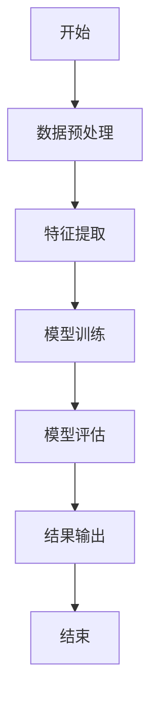
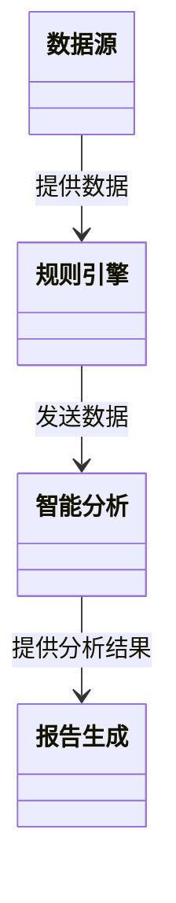
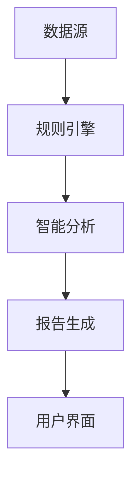
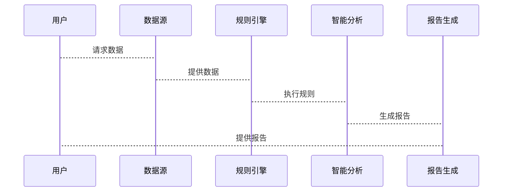

                 


# 《金融监管合规自动化工具》

---

## 关键词：  
金融监管、合规自动化、人工智能、大数据、区块链、系统架构、Python开发

---

## 摘要：  
金融监管合规自动化工具通过整合人工智能、大数据和区块链等先进技术，为金融机构和监管机构提供高效、精准的合规解决方案。本文从背景分析、核心概念、算法原理、系统架构到项目实战，全面解析金融监管合规自动化工具的设计与实现，探讨其在金融行业中的应用前景和价值。

---

# 第一部分: 金融监管合规自动化工具概述

---

# 第1章: 金融监管合规自动化工具的背景与意义

## 1.1 问题背景

### 1.1.1 传统金融监管的痛点  
传统金融监管模式依赖人工审核和线下流程，存在效率低、成本高、风险高的问题。金融机构需要频繁处理海量数据，监管机构则难以及时获取最新信息，导致监管滞后和覆盖面有限。

### 1.1.2 合规要求的复杂性  
金融行业面临日益复杂的合规要求，包括反洗钱、关联交易、信息披露等。这些要求涉及多个法规和标准，人工处理容易出错，且难以快速适应法规更新。

### 1.1.3 金融机构面临的挑战  
金融机构需要在合规性、业务效率和成本控制之间找到平衡。传统模式下，合规工作耗时长、资源消耗大，且难以应对动态变化的监管要求。

---

## 1.2 问题描述

### 1.2.1 金融监管的核心目标  
金融监管的核心目标是确保市场公平、透明，保护投资者利益，防范系统性风险。然而，传统监管手段难以应对金融机构的多样化和复杂化。

### 1.2.2 合规自动化的需求  
合规自动化是通过技术手段将合规检查、数据报送、风险预警等流程自动化，减少人工干预，提高效率和准确性。

### 1.2.3 金融机构与监管机构的双重压力  
金融机构需要在合规性、业务效率和成本控制之间找到平衡，而监管机构则需要应对海量数据和复杂规则的挑战。

---

## 1.3 问题解决

### 1.3.1 自动化工具的解决方案  
通过引入自动化工具，金融机构可以快速、准确地完成合规检查，同时监管机构能够实时获取数据，提高监管效率。

### 1.3.2 技术如何赋能金融监管  
人工智能、大数据和区块链等技术为金融监管提供了新的工具和方法，例如通过AI进行风险预测、利用区块链实现数据透明。

### 1.3.3 合规自动化的目标与路径  
合规自动化的目标是实现高效、精准的合规管理。路径包括数据采集、规则引擎、智能分析和报告生成等环节。

---

## 1.4 边界与外延

### 1.4.1 自动化工具的适用范围  
自动化工具适用于合规检查、风险预警、数据报送等场景，但不涵盖业务决策和战略规划。

### 1.4.2 与传统监管的区分  
传统监管依赖人工审核，而自动化工具通过技术手段实现快速、精准的合规检查。

### 1.4.3 技术边界与实施限制  
自动化工具的边界在于数据质量和规则的准确性，实施过程中可能面临数据孤岛、隐私保护等问题。

---

## 1.5 概念结构与核心要素

### 1.5.1 核心概念的组成  
金融监管合规自动化工具由数据采集、规则引擎、智能分析、报告生成等核心模块组成。

### 1.5.2 各要素之间的关系  
数据采集是基础，规则引擎是关键，智能分析是核心，报告生成是输出。

### 1.5.3 框架的整体逻辑  
数据采集 → 规则引擎 → 智能分析 → 报告生成。

---

## 1.6 本章小结

---

# 第2章: 金融监管合规自动化工具的核心概念

## 2.1 核心概念的定义

### 2.1.1 自动化工具的定义  
金融监管合规自动化工具是指利用技术手段，自动完成合规检查、数据报送和风险预警等任务的系统。

### 2.1.2 金融监管的核心要素  
包括数据采集、规则引擎、智能分析和报告生成等要素。

### 2.1.3 合规自动化的目标  
通过自动化技术，提高合规效率，降低合规成本，确保合规准确性。

---

## 2.2 核心概念的属性特征对比

### 2.2.1 技术属性对比  
| 技术属性 | 传统监管 | 自动化工具 |
|----------|----------|------------|
| 数据处理 | 人工处理 | 自动处理 |
| 效率     | 低       | 高         |
| 成本     | 高       | 低         |

### 2.2.2 业务属性对比  
| 业务属性 | 传统监管 | 自动化工具 |
|----------|----------|------------|
| 合规检查 | 人工检查 | 自动检查 |
| 数据报送 | 人工报送 | 自动报送 |
| 风险预警 | 事后预警 | 实时预警 |

### 2.2.3 综合对比分析  
自动化工具在效率、准确性和成本方面具有明显优势，但在规则复杂性和数据质量方面仍需依赖人工辅助。

---

## 2.3 ER实体关系图

```
```mermaid
erDiagram
    actor 用户
    actor 监管机构
    actor 金融机构
    actor 第三方服务
    class 数据源
    class 自动化工具
    class 合规报告
    class 系统日志
    用户 --> 数据源: 提供数据
    用户 --> 自动化工具: 调用工具
    自动化工具 --> 数据源: 获取数据
    自动化工具 --> 合规报告: 生成报告
    自动化工具 --> 系统日志: 记录日志
    监管机构 --> 自动化工具: 下发监管要求
    金融机构 --> 自动化工具: 提交数据
    第三方服务 --> 自动化工具: 提供支持
```

---

## 2.4 本章小结

---

# 第3章: 金融监管合规自动化工具的算法原理

## 3.1 算法原理概述

### 3.1.1 算法的核心思想  
通过机器学习算法，从海量数据中提取特征，识别异常行为，预测潜在风险。

### 3.1.2 算法的实现步骤  
1. 数据预处理：清洗、归一化、特征提取。  
2. 模型训练：使用逻辑回归、随机森林等算法训练模型。  
3. 模型评估：计算准确率、召回率、F1分数。  
4. 结果输出：生成合规报告和风险预警。

### 3.1.3 算法的优化方向  
优化特征选择、调整模型参数、引入 ensemble 方法提高准确率。

---

## 3.2 算法流程图

```


---

## 3.3 算法实现代码

### 3.3.1 Python代码实现

```python
import pandas as pd
from sklearn.model_selection import train_test_split
from sklearn.linear_model import LogisticRegression
from sklearn.metrics import accuracy_score, recall_score, f1_score

# 数据加载与预处理
data = pd.read_csv('data.csv')
data = data.dropna()
data = (data - data.min()) / (data.max() - data.min())

# 特征选择
features = data.drop(columns=['label'])
label = data['label']

# 数据分割
X_train, X_test, y_train, y_test = train_test_split(features, label, test_size=0.2)

# 模型训练
model = LogisticRegression()
model.fit(X_train, y_train)

# 模型预测
y_pred = model.predict(X_test)

# 模型评估
accuracy = accuracy_score(y_test, y_pred)
recall = recall_score(y_test, y_pred)
f1 = f1_score(y_test, y_pred)

print(f'准确率: {accuracy}')
print(f'召回率: {recall}')
print(f'F1分数: {f1}')
```

### 3.3.2 算法原理的数学模型和公式

#### 逻辑回归的数学模型

$$ P(y=1|x) = \frac{1}{1 + e^{-(\beta_0 + \beta_1x)}} $$

其中：
- \( y \) 是目标变量（二分类，0或1）
- \( x \) 是自变量
- \( \beta_0 \) 是截距项
- \( \beta_1 \) 是自变量的系数

#### 模型评估指标

- **准确率（Accuracy）**：  
$$ \text{准确率} = \frac{\text{正确预测的数量}}{\text{总样本数}} $$

- **召回率（Recall）**：  
$$ \text{召回率} = \frac{\text{真正预测为正的数量}}{\text{实际正样本的数量}} $$

- **F1分数（F1 Score）**：  
$$ \text{F1分数} = \frac{2 \times \text{准确率} \times \text{召回率}}{\text{准确率} + \text{召回率}} $$

---

## 3.4 本章小结

---

# 第4章: 系统分析与架构设计方案

## 4.1 问题场景介绍

### 4.1.1 系统目标  
开发一个金融监管合规自动化工具，实现数据采集、规则引擎、智能分析和报告生成功能。

### 4.1.2 项目介绍  
本项目旨在通过技术手段解决金融机构和监管机构的合规难题，提高效率和准确性。

---

## 4.2 系统功能设计

### 4.2.1 领域模型类图

```


### 4.2.2 系统架构图

```


### 4.2.3 系统接口设计  
- 数据源接口：提供数据采集和存储功能。  
- 规则引擎接口：定义合规规则和触发条件。  
- 智能分析接口：实现风险预测和异常检测。  
- 报告生成接口：输出合规报告和可视化结果。

### 4.2.4 系统交互序列图

```


---

## 4.3 本章小结

---

# 第5章: 项目实战

## 5.1 环境安装

### 5.1.1 开发环境配置  
安装Python、Jupyter Notebook、Pandas、Scikit-learn等工具。

### 5.1.2 数据源获取  
下载金融数据，例如通过API获取交易数据。

---

## 5.2 系统核心实现

### 5.2.1 数据采集与预处理

```python
import pandas as pd
import requests

# 数据采集
url = 'https://api.example.com/financial_data'
response = requests.get(url)
data = response.json()

# 数据转换为DataFrame
df = pd.DataFrame(data)
```

### 5.2.2 规则引擎实现

```python
def check_compliance(transaction):
    if transaction['amount'] > 10000:
        return 'high'
    elif transaction['amount'] > 5000:
        return 'medium'
    else:
        return 'low'
```

### 5.2.3 智能分析实现

```python
from sklearn.ensemble import RandomForestClassifier

# 特征选择
features = df.drop(columns=['label'])
label = df['label']

# 模型训练
model = RandomForestClassifier()
model.fit(features, label)
```

### 5.2.4 报告生成

```python
from datetime import datetime

def generate_report(model, data):
    report = {}
    report['timestamp'] = datetime.now().isoformat()
    report['accuracy'] = accuracy_score(y_test, y_pred)
    report['recall'] = recall_score(y_test, y_pred)
    return report
```

---

## 5.3 实际案例分析

### 5.3.1 案例背景  
某银行需要检测大额交易，防止洗钱行为。

### 5.3.2 数据分析  
通过自动化工具，检测到多笔大额交易，发现潜在的洗钱风险。

### 5.3.3 结果解读  
生成的报告指出，高风险交易占总交易的5%，并提供具体交易记录和建议。

---

## 5.4 本章小结

---

# 第6章: 总结与展望

## 6.1 最佳实践 tips

### 6.1.1 数据质量管理  
确保数据的完整性和准确性是关键。

### 6.1.2 模型优化  
定期更新模型，引入新数据和新规则，提高准确性。

### 6.1.3 安全与隐私保护  
在数据处理和存储过程中，确保符合隐私保护法规。

---

## 6.2 小结  
金融监管合规自动化工具通过技术手段解决了传统监管的痛点，提高了效率和准确性。

---

## 6.3 注意事项  
- 数据隐私保护是重点。  
- 模型需要定期更新和优化。  
- 系统设计需要考虑可扩展性和可维护性。

---

## 6.4 拓展阅读  
推荐阅读《金融监管科技》、《人工智能与金融》等书籍，深入了解相关领域的最新动态。

---

# 作者：AI天才研究院/AI Genius Institute & 禅与计算机程序设计艺术 /Zen And The Art of Computer Programming

