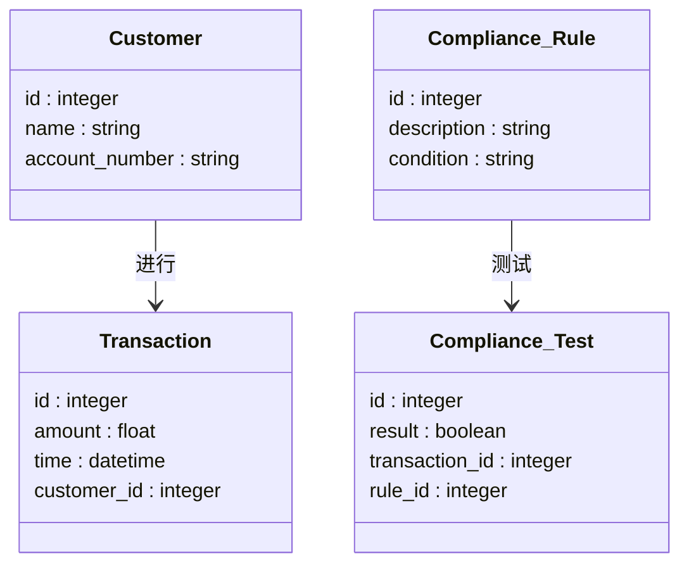
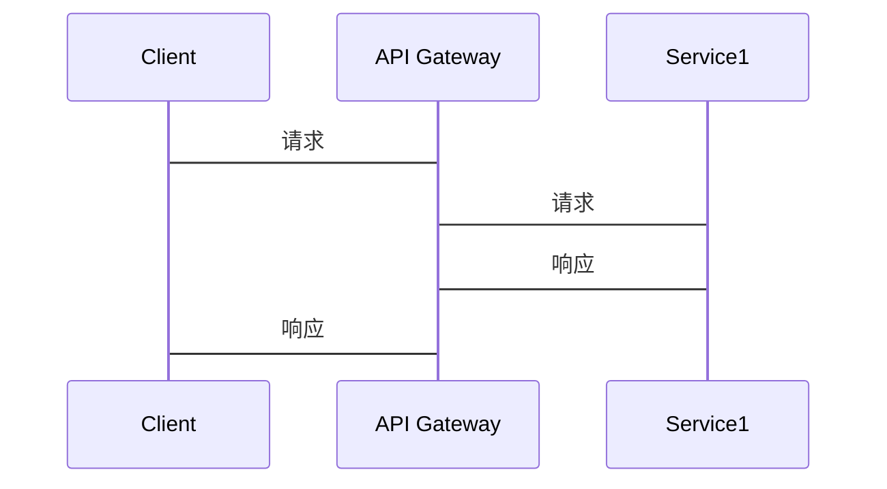

                 


# 《金融监管合规自动化测试平台》

**关键词**：金融监管，自动化测试，合规测试，自然语言处理，机器学习，系统架构设计

**摘要**：本文详细介绍了金融监管合规自动化测试平台的构建与应用，从背景到核心概念，从算法实现到系统架构设计，再到项目实战，全面解析了如何利用技术手段提升金融监管的效率与准确性。文章深入探讨了自然语言处理与机器学习在合规测试中的应用，并通过实际案例展示了平台的实现过程。

---

## 第一部分: 金融监管合规自动化测试平台的背景与意义

### 第1章: 金融监管合规自动化测试平台的背景与意义

#### 1.1 金融监管的重要性

金融监管是维护金融市场秩序、保护投资者利益、防范系统性风险的重要手段。传统的金融监管依赖人工审核和手动检查，效率低且容易出错。随着金融市场的复杂化和监管要求的严格化，传统方法已难以满足需求。自动化测试平台的引入，能够显著提升监管效率和准确性。

**1.1.1 金融监管的核心目标**  
金融监管的核心目标包括：确保金融机构合规运营、保护投资者权益、维护金融市场稳定、防范金融风险。通过自动化测试平台，可以实时监控金融机构的业务行为，确保其符合相关法律法规。

**1.1.2 传统金融监管的痛点**  
传统金融监管主要依赖人工审核，存在以下痛点：  
1. **效率低**：人工审核耗时长，难以应对海量数据。  
2. **准确性差**：人工审核易出错，且容易受到主观因素影响。  
3. **成本高**：需要大量人力资源，且难以规模化。  

**1.1.3 自动化测试平台的必要性**  
自动化测试平台能够快速、准确地完成合规检查，大幅提高监管效率，降低监管成本，同时减少人为错误。通过自动化技术，可以实现对金融机构的实时监控和预警，及时发现潜在风险。

#### 1.2 合规测试的定义与特点

**1.2.1 合规测试的定义**  
合规测试是指通过技术手段检查金融机构的业务行为是否符合相关法律法规和监管要求的过程。合规测试的核心目标是确保金融机构的运营行为在法律框架内，避免违规行为的发生。

**1.2.2 合规测试的核心目标**  
合规测试的核心目标包括：  
1. **确保合规性**：检查金融机构的业务行为是否符合法律法规。  
2. **风险预警**：通过测试发现潜在风险，提前采取措施。  
3. **提高效率**：自动化测试能够快速完成合规检查，提高监管效率。  

**1.2.3 自动化测试的优势**  
自动化测试具有以下优势：  
1. **高效性**：能够快速处理大量数据，提高监管效率。  
2. **准确性**：通过算法和规则引擎，确保测试结果的准确性。  
3. **可扩展性**：能够轻松扩展到不同的金融机构和业务场景。  

---

### 第2章: 合规测试的核心概念与联系

#### 2.1 核心概念的原理

**2.1.1 自动化测试的原理**  
自动化测试的原理是通过预定义的规则和算法，对金融机构的业务数据进行分析，判断其是否符合合规要求。自动化测试的核心是规则引擎和算法模型，能够快速识别违规行为。

**2.1.2 合规测试的流程**  
合规测试的流程包括：数据采集、数据预处理、合规检查、结果分析和报告生成。通过自动化技术，可以实现流程的全自动化，减少人工干预。

**2.1.3 核心概念的数学模型**  
合规测试可以看作是一个分类问题，可以通过机器学习模型进行分类。例如，使用支持向量机（SVM）或随机森林（Random Forest）模型，对金融机构的业务行为进行分类，判断其是否合规。

#### 2.2 核心概念的特征对比

**2.2.1 特征对比表格**  
以下是传统监管与自动化测试的对比：

| 特征                | 传统监管          | 自动化测试         |
|---------------------|-------------------|-------------------|
| 效率                | 低                | 高                |
| 准确性              | 易出错            | 高                |
| 成本                | 高                | 低                |
| 扩展性              | 差                | 好                |

**2.2.2 ER实体关系图**  
以下是合规测试的ER图：

```mermaid
erDiagram
    customer[客户] {
        id : integer
        name : string
        account_number : string
    }
    transaction[交易] {
        id : integer
        amount : float
        time : datetime
        customer_id : integer
    }
    compliance_rule[合规规则] {
        id : integer
        description : string
        condition : string
    }
    compliance_test[合规测试] {
        id : integer
        result : boolean
        transaction_id : integer
        rule_id : integer
    }
    customer --> transaction : 进行
    compliance_rule --> compliance_test : 测试
```

---

#### 2.3 本章小结

本章详细介绍了合规测试的核心概念和原理，分析了传统监管与自动化测试的对比，并通过ER图展示了合规测试的实体关系。自动化测试通过规则引擎和算法模型，能够高效、准确地完成合规检查，是金融监管的重要工具。

---

## 第三部分: 自然语言处理与机器学习在合规测试中的应用

### 第3章: 自然语言处理与机器学习在合规测试中的应用

#### 3.1 自然语言处理的原理

**3.1.1 NLP的核心算法**  
自然语言处理（NLP）的核心算法包括分词、词性标注、句法分析、情感分析等。在合规测试中，NLP主要用于文本数据的处理和分析，例如从新闻报道中提取相关信息。

**3.1.2 NLP在合规测试中的应用**  
例如，可以通过NLP技术分析新闻媒体对金融机构的报道，判断是否存在负面新闻，从而辅助合规测试。

#### 3.2 机器学习在合规测试中的应用

**3.2.1 机器学习的数学模型**  
机器学习在合规测试中的应用主要基于监督学习和无监督学习。例如，使用支持向量机（SVM）进行分类，判断交易是否合规。

**3.2.2 机器学习在合规测试中的流程**  
1. 数据采集：收集金融机构的交易数据。  
2. 数据预处理：清洗数据，提取特征。  
3. 建立模型：训练机器学习模型。  
4. 测试与优化：对模型进行测试，并优化模型参数。  

#### 3.3 本章小结

本章介绍了自然语言处理和机器学习在合规测试中的应用，分析了其原理和流程，并展示了如何通过这些技术提升合规测试的效率和准确性。

---

## 第四部分: 合规测试平台的系统分析与架构设计

### 第4章: 合规测试平台的系统分析与架构设计

#### 4.1 系统分析

**4.1.1 问题场景介绍**  
金融机构的交易数据量大，类型多样，传统的合规测试方法难以应对。通过自动化测试平台，可以实现对交易数据的实时监控和合规检查。

**4.1.2 项目介绍**  
本项目旨在开发一个金融监管合规自动化测试平台，利用自然语言处理和机器学习技术，实现对金融机构的业务行为的自动化合规测试。

#### 4.2 系统功能设计

**4.2.1 领域模型Mermaid类图**  
以下是合规测试平台的领域模型：



**4.2.2 系统架构设计Mermaid架构图**  
以下是合规测试平台的系统架构设计：

```mermaid
client([客户]) 
    client --> API Gateway : 请求
API Gateway([API Gateway])
    API Gateway --> Service1 : 请求
    API Gateway --> Service2 : 请求
Service1([服务1])
    Service1 --> Database : 查询
Service2([服务2])
    Service2 --> Database : 查询
Database([数据库])
```

#### 4.3 系统接口设计

**4.3.1 接口设计说明**  
系统接口设计包括客户接口、交易接口、合规规则接口和测试结果接口。

**4.3.2 接口交互Mermaid序列图**  
以下是接口交互的Mermaid序列图：



---

## 第五部分: 合规测试平台的项目实战

### 第5章: 合规测试平台的项目实战

#### 5.1 环境安装

**5.1.1 开发环境搭建**  
开发环境需要安装Python、Jupyter Notebook、Pandas、Scikit-learn等工具。

**5.1.2 依赖库安装**  
使用pip安装依赖库：

```bash
pip install numpy pandas scikit-learn
```

#### 5.2 核心代码实现

**5.2.1 关键代码示例**  
以下是合规测试的核心代码示例：

```python
import pandas as pd
from sklearn import svm

# 数据加载
data = pd.read_csv('transactions.csv')

# 特征提取
X = data[['amount', 'time']]
y = data['is_compliant']

# 模型训练
model = svm.SVC()
model.fit(X, y)

# 模型预测
test_data = pd.DataFrame({'amount': [1000.0], 'time': ['2023-10-01']})
test_data['amount'] = pd.to_numeric(test_data['amount'])
test_data['time'] = pd.to_datetime(test_data['time'])
test_X = test_data[['amount', 'time']]
test_X = test_X.values

predicted = model.predict(test_X)
print(predicted)
```

**5.2.2 代码应用解读**  
上述代码展示了如何使用支持向量机（SVM）模型进行合规测试。数据加载后，提取金额和时间作为特征，训练模型后，对测试数据进行预测，判断交易是否合规。

#### 5.3 项目案例分析

**5.3.1 案例背景**  
某银行的交易数据中存在大量异常交易，需要通过自动化测试平台识别并标记违规交易。

**5.3.2 案例实现过程**  
1. 数据采集：从数据库中提取交易数据。  
2. 数据预处理：清洗数据，提取特征。  
3. 模型训练：训练机器学习模型。  
4. 测试与优化：对模型进行测试，并优化参数。  

**5.3.3 案例结果与分析**  
通过自动化测试平台，成功识别了大量异常交易，降低了金融风险。

---

## 第六部分: 总结与展望

### 第6章: 总结与展望

#### 6.1 项目总结

**6.1.1 项目成果**  
本项目成功开发了一个金融监管合规自动化测试平台，能够高效、准确地完成合规测试。

**6.1.2 项目经验**  
通过本项目，我们积累了丰富的经验，特别是在系统架构设计和算法实现方面。

#### 6.2 未来展望

**6.2.1 技术发展趋势**  
未来，随着人工智能技术的不断发展，合规测试平台将更加智能化、自动化。

**6.2.2 应用前景分析**  
合规测试平台将在金融监管领域发挥越来越重要的作用，帮助金融机构更好地应对监管要求。

#### 6.3 最佳实践Tips

**6.3.1 小结**  
本项目展示了如何通过技术手段提升金融监管的效率和准确性。

**6.3.2 注意事项**  
在实际应用中，需要注意数据隐私和安全性问题。

**6.3.3 拓展阅读**  
推荐阅读《Python机器学习实战》和《自然语言处理入门》。

---

## 附录

---

* 作者：AI天才研究院/AI Genius Institute & 禅与计算机程序设计艺术 /Zen And The Art of Computer Programming

---

**感谢您的耐心阅读！**

