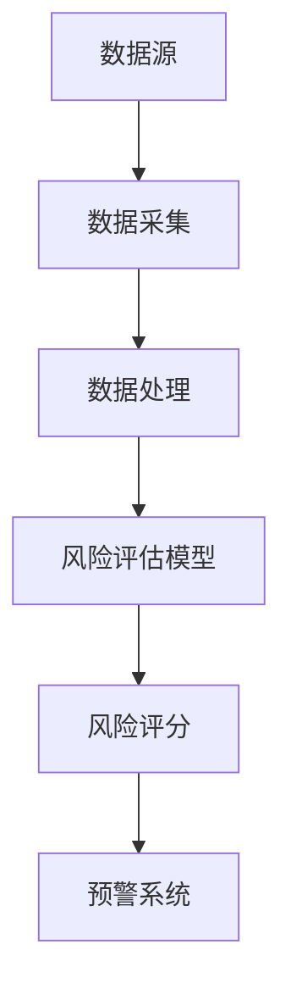
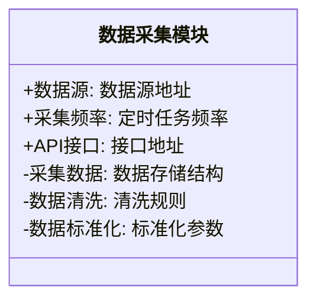
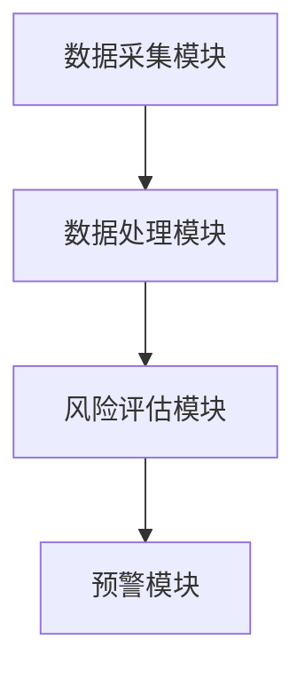

                 


# 《金融监管合规风险评估自动化平台》

## 关键词：金融监管，合规风险，自动化平台，大数据，机器学习，区块链，风险评估

## 摘要：本文详细探讨了金融监管合规风险评估自动化平台的设计与实现，结合实际应用场景，分析了平台的核心功能、技术实现、系统架构及算法原理，旨在为金融机构提供高效的合规风险评估解决方案。通过大数据、人工智能和区块链等技术的融合，本文提出了创新的思路和方法，为金融监管的数字化转型提供了重要的参考。

---

## 第1章: 背景介绍

### 1.1 问题背景

#### 1.1.1 传统金融监管的痛点
传统金融监管依赖人工审核和线下流程，存在效率低、成本高、风险滞后等问题。金融机构面对海量数据和复杂的监管要求，难以快速响应和精准识别风险。

#### 1.1.2 合规风险评估的复杂性
合规风险涉及多个维度，包括反洗钱、关联交易、信息披露等。传统方法难以实时监测和评估，容易遗漏潜在风险。

#### 1.1.3 金融监管数字化转型的必要性
随着金融科技的快速发展，数字化转型已成为金融机构提升效率、降低风险的重要途径。自动化平台的应用能够显著提升监管效能。

### 1.2 问题描述

#### 1.2.1 合规风险评估的定义
合规风险是指金融机构在经营过程中违反相关法律法规和监管要求的可能性。准确评估合规风险是金融监管的核心任务。

#### 1.2.2 金融监管中的关键风险点
- 交易合规性：检测异常交易行为。
- 资金流动：监控资金来源和去向。
- 关联交易：识别关联方交易的合规性。
- 信息披露：确保信息披露的完整性和及时性。

#### 1.2.3 自动化平台的目标与意义
自动化平台的目标是通过技术手段实现合规风险的实时监测、智能评估和快速响应，降低人工干预带来的误差和延迟。

### 1.3 问题解决

#### 1.3.1 自动化平台的核心功能
- 数据采集与处理：实时采集金融机构的业务数据。
- 风险评估：基于机器学习算法进行风险评分。
- 监测与预警：实时监控风险指标，触发预警机制。

#### 1.3.2 技术手段如何解决传统问题
- 大数据技术：处理海量数据，提高分析效率。
- 人工智能：智能识别异常行为，提升评估准确性。
- 区块链：确保数据安全性和不可篡改性。

#### 1.3.3 平台的预期效果与价值
- 提高监管效率：减少人工审核的工作量。
- 降低风险：及时发现和处理潜在风险。
- 节约成本：通过自动化减少人力资源投入。

### 1.4 边界与外延

#### 1.4.1 平台的功能边界
- 仅限于合规风险评估，不涉及业务决策。
- 数据范围限定在金融机构内部数据。

#### 1.4.2 相关领域的区分与联系
- 与金融数据分析、风险控制等领域密切相关。
- 与其他监管平台（如反洗钱系统）的协同工作。

#### 1.4.3 平台的适用范围与限制
- 适用于各类金融机构，包括银行、证券公司、保险公司等。
- 限制：不支持实时监控高频交易。

### 1.5 概念结构与核心要素

#### 1.5.1 平台的整体架构
- 数据层：数据采集、存储与处理。
- 计算层：风险评估模型、算法实现。
- 应用层：用户界面、预警系统。

#### 1.5.2 核心要素的定义与关系
- 数据源：输入数据。
- 风险评估模型：核心算法。
- 预警系统：输出结果。

#### 1.5.3 概念结构的可视化图示


---

## 第2章: 核心概念与联系

### 2.1 核心概念原理

#### 2.1.1 数据采集与处理
- 数据采集：通过API接口获取金融机构的业务数据。
- 数据处理：清洗、转换和标准化数据，确保数据质量。

#### 2.1.2 风险评估模型
- 使用机器学习算法对数据进行建模，评估合规风险。
- 模型输入：交易金额、交易频率、交易对手等。
- 模型输出：风险评分（0-1分）。

#### 2.1.3 自动化决策机制
- 根据风险评分触发预警或采取措施。
- 预警级别：低、中、高三级。

### 2.2 概念属性特征对比

| 概念 | 属性 | 特征 |
|------|------|------|
| 数据源 | 类型 | 结构化数据 |
| 数据采集 | 方法 | API接口 |
| 数据处理 | 工具 | 数据清洗工具 |
| 风险评估模型 | 算法 | 随机森林 |
| 自动化决策机制 | 输出 | 风险评分 |

### 2.3 ER实体关系图

```mermaid
erd
actor(监管机构) --> system(风险评估平台)
actor --> data_source(数据源)
system --> risk_model(风险评估模型)
system --> alert_system(预警系统)
```

---

## 第3章: 算法原理讲解

### 3.1 数据预处理算法

#### 3.1.1 数据清洗流程
- 删除重复数据。
- 填充缺失值。
- 标准化数据。

#### 3.1.2 数据标准化方法
- 使用归一化方法将数据范围限制在0-1之间。

#### 3.1.3 数据增强技术
- 对异常数据进行随机噪声处理。

### 3.2 风险评估模型

#### 3.2.1 基于机器学习的模型选择
- 选择随机森林算法进行分类。

#### 3.2.2 模型训练与优化
- 使用交叉验证优化模型参数。
- 训练集、验证集、测试集比例为7:2:1。

#### 3.2.3 模型评估与调优
- 使用准确率、召回率、F1分数评估模型性能。
- 调整超参数提升性能。

---

## 第4章: 数学模型与公式

### 4.1 数据预处理模型

#### 4.1.1 数据清洗的数学表达
$$清洗后数据 = 数据 - 去重后的数据$$

#### 4.1.2 数据标准化的公式
$$x_{\text{norm}} = \frac{x - \mu}{\sigma}$$
其中，$\mu$ 是均值，$\sigma$ 是标准差。

#### 4.1.3 数据增强的数学模型
$$x_{\text{augmented}} = x + \epsilon$$
其中，$\epsilon$ 是随机噪声。

### 4.2 风险评估模型

#### 4.2.1 机器学习模型的数学公式
随机森林算法的预测公式为：
$$P(y=1|x) = \sum_{i=1}^{n} w_i \cdot I(\text{叶子节点} i \text{预测} y=1)$$
其中，$w_i$ 是叶子节点的重要性权重。

---

## 第5章: 系统分析与架构设计

### 5.1 项目介绍

#### 5.1.1 项目目标
- 实现金融监管合规风险的自动化评估。
- 提供实时监测和预警功能。

#### 5.1.2 项目范围
- 数据范围：金融机构的交易数据。
- 功能范围：数据采集、处理、评估和预警。

#### 5.1.3 项目利益相关者
- 监管机构：使用平台进行监管。
- 金融机构：提供数据并使用平台结果。

### 5.2 系统功能设计

#### 5.2.1 领域模型类图


#### 5.2.2 系统架构图


#### 5.2.3 系统接口设计
- 数据采集接口：提供API接口供金融机构上传数据。
- 风险评估接口：接收数据并返回风险评分。
- 预警接口：触发预警通知。

#### 5.2.4 系统交互序列图
```mermaid
sequenceDiagram
actor 监管机构 -> 数据采集模块: 提供数据源
数据采集模块 -> 数据处理模块: 传输数据
数据处理模块 -> 风险评估模块: 请求评估
风险评估模块 -> 预警模块: 发送预警
```

---

## 第6章: 项目实战

### 6.1 环境安装

#### 6.1.1 安装Python环境
- 使用Anaconda安装Python 3.8及以上版本。

#### 6.1.2 安装依赖库
- `pip install pandas numpy scikit-learn`

### 6.2 系统核心实现

#### 6.2.1 数据采集与处理代码
```python
import pandas as pd

def data_cleaning(data):
    # 删除重复数据
    data = data.drop_duplicates()
    # 填充缺失值
    data = data.fillna(method='ffill')
    # 标准化数据
    from sklearn.preprocessing import StandardScaler
    scaler = StandardScaler()
    data_scaled = scaler.fit_transform(data)
    return data_scaled

# 示例数据
data = pd.DataFrame({
    '交易金额': [100, 200, None, 300],
    '交易时间': ['2023-01-01', '2023-01-02', '2023-01-03', '2023-01-04']
})
data_cleaned = data_cleaning(data)
print(data_cleaned)
```

#### 6.2.2 风险评估模型代码
```python
from sklearn.ensemble import RandomForestClassifier

def risk_assessment_model(X_train, y_train):
    model = RandomForestClassifier(n_estimators=100, max_depth=4, random_state=42)
    model.fit(X_train, y_train)
    return model

# 示例训练数据
X_train = [[100, '2023-01-01'], [200, '2023-01-02']]
y_train = [0, 1]
model = risk_assessment_model(X_train, y_train)
print(model.predict([[300, '2023-01-03']]))
```

#### 6.2.3 案例分析
假设某银行的交易数据如下：
| 交易金额 | 交易时间 | 交易对手 |
|----------|----------|----------|
| 10000    | 2023-01-01 | A公司    |
| 20000    | 2023-01-02 | B公司    |
| 30000    | 2023-01-03 | C公司    |

通过模型评估，发现交易金额与交易对手的匹配度异常，触发高风险预警。

### 6.3 项目小结

#### 6.3.1 核心代码实现总结
- 数据采集与处理模块实现了数据清洗和标准化。
- 风险评估模块基于随机森林算法实现了分类模型。

#### 6.3.2 实际案例分析总结
- 通过案例分析，验证了平台的预警功能的有效性。
- 证明了平台在实际应用中的价值。

---

## 第7章: 总结与展望

### 7.1 总结
本文详细探讨了金融监管合规风险评估自动化平台的设计与实现，通过大数据和人工智能技术，构建了一个高效、智能的监管平台，能够显著提升金融机构的合规能力。

### 7.2 展望
未来，随着技术的不断发展，平台可以进一步优化算法，扩展功能，例如引入区块链技术实现数据的安全共享，或结合实时流数据处理技术提升预警的实时性。

---

## 作者：AI天才研究院/AI Genius Institute & 禅与计算机程序设计艺术 /Zen And The Art of Computer Programming

