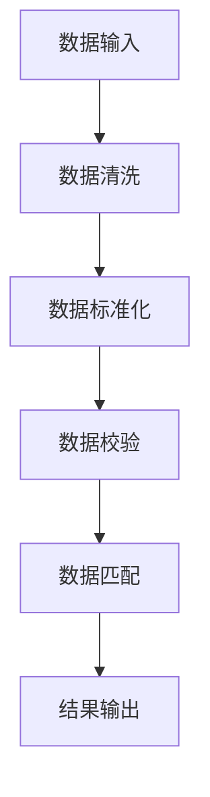
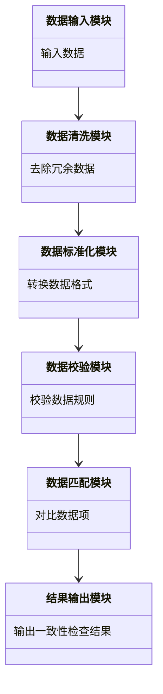
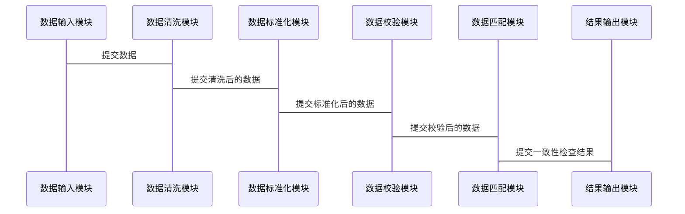

                 


# 《金融监管报告数据一致性检查工具》

---

## 关键词：
金融监管，数据一致性，数据清洗，数据校验，数据匹配，机器学习

---

## 摘要：
金融监管是维护金融市场秩序的重要手段，而数据一致性是金融监管工作的基石。本文深入探讨了金融监管报告数据一致性检查工具的设计与实现，从问题背景、核心概念、算法原理到系统架构、项目实战，再到最佳实践，全面解析了如何构建一个高效、准确的数据一致性检查工具。通过对比分析数据清洗与标准化方法，结合机器学习算法，提出了一套完整的解决方案，并通过实际案例验证了工具的有效性。本文旨在为金融监管机构和技术开发人员提供理论支持与实践指导。

---

# 第1章: 问题背景与目标

## 1.1 金融监管报告的重要性
### 1.1.1 金融监管的基本概念
金融监管是指通过法律、法规和制度，对金融机构的经营行为进行监督和管理，以维护金融市场秩序、保护投资者利益、防范系统性风险。金融监管的核心在于确保金融机构的透明度、合规性和稳定性。

### 1.1.2 金融监管报告的作用与意义
金融机构需要定期向监管机构提交各种报告，包括财务报表、风险评估报告、交易记录等。这些报告是监管机构评估金融机构健康状况、发现潜在风险的重要依据。数据的准确性和一致性直接关系到监管的有效性。

### 1.1.3 数据一致性在金融监管中的关键性
金融监管报告的数据一致性是指不同报告中同一数据项在格式、编码、内容等方面的一致性。例如，同一金融机构在不同报告中对“客户姓名”的填写方式是否统一，是否符合监管要求的格式。数据一致性是确保监管数据可比性、可分析性的基础，也是提高监管效率的关键。

## 1.2 数据一致性问题的背景
### 1.2.1 数据不一致的常见原因
- 数据来源多样：同一数据项可能来自不同的系统或部门，导致格式不统一。
- 人为错误：数据录入或填写过程中可能产生错误。
- 系统兼容性问题：不同系统对数据格式的处理可能存在差异。
- 业务规则不统一：不同部门或机构对同一数据项的定义可能存在差异。

### 1.2.2 数据不一致对金融监管的影响
- 影响监管决策的准确性：数据不一致可能导致监管机构对金融机构的经营状况判断失误。
- 增加监管成本：数据不一致需要额外的人力和时间进行核对和调整。
- 降低监管效率：数据不一致可能导致监管系统无法有效运行，影响监管工作的及时性。

### 1.2.3 数据一致性检查的必要性
为了确保金融监管报告的准确性和可比性，必须对数据进行一致性检查。通过自动化工具实现数据一致性检查，可以显著提高监管效率，降低监管成本。

## 1.3 本章小结
本章从金融监管的基本概念出发，分析了数据一致性在金融监管中的重要性，指出了数据不一致的常见原因及其对监管工作的负面影响。通过本章的分析，我们可以明确数据一致性检查的必要性和目标。

---

# 第2章: 数据一致性检查的核心概念

## 2.1 数据一致性检查的定义与属性
### 2.1.1 数据一致性的定义
数据一致性是指在不同的数据源或报告中，同一数据项在格式、编码、内容等方面保持一致。

### 2.1.2 数据一致性的关键属性对比
以下对比了数据一致性检查中的几个关键属性：

| 属性 | 描述 |
|------|------|
| 数据清洗 | 对数据进行预处理，去除冗余或错误数据 |
| 数据标准化 | 将数据转换为统一的格式或编码 |
| 数据校验 | 根据业务规则对数据进行验证 |
| 数据匹配 | 对比不同数据源中的数据项，找出不一致项 |

### 2.1.3 数据一致性检查的核心要素
- 数据清洗：去除冗余或错误数据，确保数据的准确性和完整性。
- 数据标准化：将数据转换为统一的格式或编码，例如将“客户姓名”统一为“张三”而不是“张三”或“ZHANGSAN”。
- 数据校验：根据业务规则对数据进行验证，例如检查日期格式是否符合要求。
- 数据匹配：对比不同数据源中的数据项，找出不一致项。

## 2.2 数据一致性检查的原理
### 2.2.1 数据清洗与标准化
数据清洗是数据一致性检查的第一步，主要目的是去除冗余或错误数据，例如重复项、空值、格式错误等。数据标准化则是将数据转换为统一的格式或编码，例如将日期格式统一为“YYYY-MM-DD”。

### 2.2.2 数据校验规则的设计
数据校验规则是数据一致性检查的核心，规则的设计直接影响检查的准确性和效率。常见的校验规则包括：
- 格式校验：检查数据是否符合指定的格式，例如日期格式、金额格式等。
- 值域校验：检查数据是否在指定的范围内，例如金额必须大于零。
- 逻辑校验：检查数据是否符合业务逻辑，例如借贷双方的金额是否相等。

### 2.2.3 数据匹配算法的实现
数据匹配是数据一致性检查的重要环节，主要用于对比不同数据源中的数据项，找出不一致项。常见的数据匹配算法包括：
- 基于规则的匹配：根据预定义的规则进行匹配，例如模糊匹配、精确匹配等。
- 基于机器学习的相似度计算：通过计算数据项的相似度，找出最接近的匹配项。

## 2.3 数据一致性检查的边界与外延
### 2.3.1 数据一致性检查的适用范围
数据一致性检查主要适用于金融监管报告中的数据，例如财务报表、交易记录等。对于非结构化数据（如文本、图像等），数据一致性检查的适用性较低。

### 2.3.2 数据一致性检查的局限性
- 数据一致性检查无法解决数据内容的准确性问题，例如数据项填写错误。
- 数据一致性检查依赖于数据清洗和标准化的效果，如果数据清洗或标准化不彻底，可能导致数据匹配失败。
- 数据一致性检查无法解决数据源的质量问题，例如数据缺失、数据重复等。

### 2.3.3 数据一致性检查与其他数据质量管理的联系
数据一致性检查是数据质量管理的重要组成部分，与数据清洗、数据标准化、数据集成等密切相关。数据质量管理的目标是确保数据的准确性、完整性和一致性，而数据一致性检查是实现这一目标的重要手段。

## 2.4 本章小结
本章从数据一致性检查的定义出发，分析了数据一致性检查的核心要素和原理，并通过对比分析数据清洗与标准化方法，指出了数据一致性检查的局限性和与其他数据质量管理的联系。通过本章的分析，我们可以更好地理解数据一致性检查的理论基础和实现方法。

---

# 第3章: 数据一致性检查工具的技术原理

## 3.1 数据一致性检查的算法原理
### 3.1.1 数据匹配算法的选择与实现
数据匹配算法是数据一致性检查的核心技术之一。以下对比了几种常见的数据匹配算法：

| 算法 | 描述 |
|------|------|
| 基于规则的匹配 | 根据预定义的规则进行匹配，例如模糊匹配、精确匹配 |
| 基于机器学习的相似度计算 | 通过计算数据项的相似度，找出最接近的匹配项 |
| 基于哈希的匹配 | 将数据项转换为哈希值，通过哈希值进行匹配 |

### 3.1.2 数据相似度计算方法
数据相似度计算是基于机器学习的匹配算法的核心。常用的相似度计算方法包括：
- 编辑距离：计算两个字符串的最小编辑操作次数，例如“apple”和“apply”的编辑距离为1。
- 余弦相似度：计算两个向量的夹角余弦值，公式为：
$$ \cos\theta = \frac{\sum_{i=1}^{n} x_i y_i}{\sqrt{\sum_{i=1}^{n} x_i^2} \sqrt{\sum_{i=1}^{n} y_i^2}} $$
- Jaccard相似度：计算两个集合的交集与并集的比例，公式为：
$$ J(A,B) = \frac{|A \cap B|}{|A \cup B|} $$

### 3.1.3 数据规则校验的逻辑设计
数据规则校验是数据一致性检查的重要环节，其逻辑设计直接影响检查的准确性和效率。以下是一个简单的数据校验逻辑设计示例：



### 3.1.4 数据一致性检查的数学模型
数据一致性检查的数学模型可以通过以下公式表示：
$$ \text{一致性检查结果} = \text{数据清洗} \circ \text{数据标准化} \circ \text{数据校验} \circ \text{数据匹配} $$

其中，$\circ$ 表示函数的复合操作。

## 3.2 数据一致性检查工具的系统架构
### 3.2.1 系统功能设计
以下是一个数据一致性检查工具的系统功能设计示例：



### 3.2.2 系统接口设计
以下是一个数据一致性检查工具的系统接口设计示例：



## 3.3 本章小结
本章从技术原理出发，详细讲解了数据一致性检查工具的算法原理和系统架构，通过对比分析数据匹配算法和数据相似度计算方法，提出了一个完整的系统架构设计方案。通过本章的分析，我们可以更好地理解数据一致性检查工具的技术实现。

---

# 第4章: 数据一致性检查工具的实现

## 4.1 数据一致性检查工具的开发环境
### 4.1.1 开发工具
- Python 3.8+
- 数据处理库：pandas
- 可视化库：matplotlib
- 机器学习库：scikit-learn

### 4.1.2 数据源
- 示例数据：金融机构提交的财务报表数据

## 4.2 数据清洗与标准化的实现
### 4.2.1 数据清洗
```python
import pandas as pd

# 读取数据
data = pd.read_csv('input.csv')

# 删除重复项
data.drop_duplicates(inplace=True)

# 处理空值
data.dropna(inplace=True)

# 保存清洗后的数据
data.to_csv('cleaned.csv', index=False)
```

### 4.2.2 数据标准化
```python
# 数据标准化示例：将日期格式统一为'YYYY-MM-DD'
data['日期'] = data['日期'].str.replace('/', '-')
```

## 4.3 数据校验与匹配的实现
### 4.3.1 数据校验
```python
# 数据校验示例：检查金额是否为正数
data['金额'] = data['金额'].apply(lambda x: x if x > 0 else 'Invalid')
```

### 4.3.2 数据匹配
```python
# 数据匹配示例：使用余弦相似度计算客户姓名的相似度
from sklearn.metrics.pairwise import cosine_similarity

# 将客户姓名转换为向量
vectorizer = ...
vectors = vectorizer.transform(data['客户姓名'])

# 计算相似度
similarity_matrix = cosine_similarity(vectors)
```

## 4.4 本章小结
本章通过具体的代码实现，展示了数据一致性检查工具的开发过程，包括数据清洗、数据标准化、数据校验和数据匹配的实现。通过本章的分析，我们可以更好地理解数据一致性检查工具的实际应用。

---

# 第5章: 数据一致性检查工具的优化与扩展

## 5.1 数据一致性检查工具的优化
### 5.1.1 算法优化
- 使用更高效的相似度计算算法，例如基于哈希的相似度计算。
- 使用分布式计算框架，例如Spark，提高数据处理效率。

### 5.1.2 系统优化
- 优化数据清洗和标准化的流程，减少数据处理时间。
- 使用缓存技术，提高数据匹配的效率。

## 5.2 数据一致性检查工具的扩展
### 5.2.1 支持更多数据源
- 支持更多数据格式，例如JSON、XML等。
- 支持多语言数据，例如中文、英文等。

### 5.2.2 支持更多数据类型
- 支持结构化数据，例如表格数据。
- 支持非结构化数据，例如文本、图像等。

## 5.3 本章小结
本章从优化与扩展的角度，分析了数据一致性检查工具的改进方向，包括算法优化、系统优化、支持更多数据源和数据类型等。通过本章的分析，我们可以更好地理解数据一致性检查工具的未来发展。

---

# 第6章: 结论与展望

## 6.1 本章总结
数据一致性检查工具是金融监管工作中不可或缺的工具，其作用在于确保金融监管报告的数据准确性和可比性。通过本章的分析，我们可以看到数据一致性检查工具在金融监管中的重要性及其技术实现的复杂性。

## 6.2 未来展望
随着金融监管需求的不断变化，数据一致性检查工具需要不断优化和扩展。未来，数据一致性检查工具将更加智能化、自动化，基于人工智能和大数据技术，实现更高效、更准确的数据一致性检查。

---

# 作者：AI天才研究院/AI Genius Institute & 禅与计算机程序设计艺术 /Zen And The Art of Computer Programming

