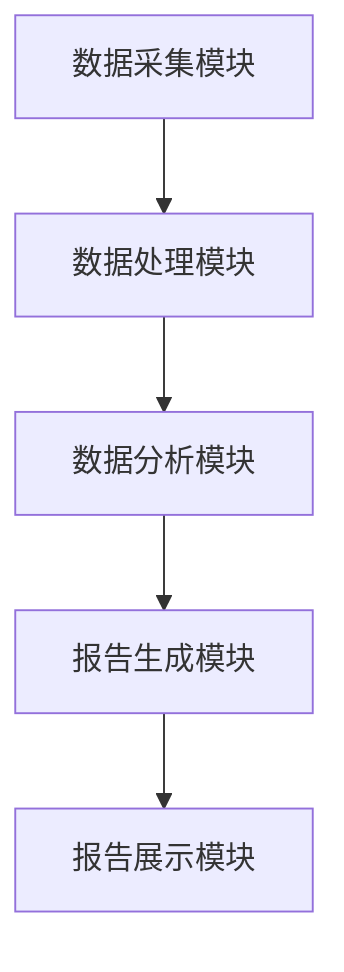
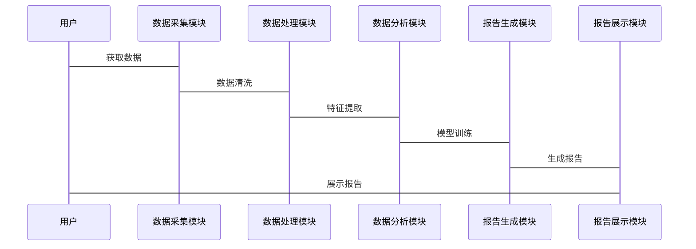

                 


# 金融监管报告自动化生成

> 关键词：金融监管，报告生成，自动化，人工智能，大数据分析，NLP，系统架构

> 摘要：本文详细探讨了金融监管报告自动化生成的技术实现，从背景介绍、核心概念、算法原理到系统架构设计、项目实战，层层剖析，结合实际案例，深入浅出地展示了如何利用先进的人工智能技术和大数据分析方法，构建高效的金融监管报告自动化生成系统。

---

## 第1章：背景介绍

### 1.1 问题背景与挑战

#### 1.1.1 传统金融监管报告的痛点
- 数据收集与处理效率低下：传统方式依赖人工录入和处理，耗时且容易出错。
- 标准化问题：不同机构的报告格式和内容标准不一，增加了统一管理的难度。
- 信息孤岛：数据分散在不同系统中，难以实现高效整合与分析。

#### 1.1.2 金融监管的重要性与复杂性
- 金融监管是维护市场秩序、保护投资者利益的重要手段。
- 监管对象复杂：涉及银行、证券、保险等多个领域，监管规则繁多且动态变化。

#### 1.1.3 自动化生成的必要性
- 提高监管效率：通过自动化技术快速生成报告，减少人工干预。
- 实时监控：能够及时发现异常情况，提升监管的时效性。

### 1.2 问题描述与目标

#### 1.2.1 金融监管报告的核心内容
- 包括市场分析、机构行为分析、风险评估等。
- 需要整合多个数据源，生成全面的监管报告。

#### 1.2.2 报告生成的流程与挑战
- 数据采集、清洗、分析、报告撰写和输出。
- 数据异构性和不完整性是主要挑战。

#### 1.2.3 自动化生成的目标与期望
- 实现数据到报告的自动化转换。
- 提供灵活的定制化功能，满足不同监管需求。

### 1.3 解决方案与技术路线

#### 1.3.1 自动化生成的基本思路
- 数据采集与整合：利用爬虫和API接口获取多源数据。
- 数据处理：清洗、转换和标准化。
- 模型训练与应用：使用NLP和机器学习生成报告内容。
- 报告输出：生成结构化或非结构化报告。

#### 1.3.2 关键技术与工具的选择
- 数据处理：Python的Pandas库。
- 自然语言处理：spaCy或NLTK。
- 机器学习：Scikit-learn。
- 可视化：Matplotlib或Plotly。

#### 1.3.3 系统架构的设计理念
- 分模块设计：数据采集、处理、分析、生成和展示。
- 高可用性：确保系统的稳定性和数据的安全性。

### 1.4 边界与外延

#### 1.4.1 自动化生成的适用范围
- 适用于常规监管报告，不涉及实时监控。
- 支持多种数据源，如文本、结构化数据等。

#### 1.4.2 系统的边界与限制
- 无法处理完全非结构化数据。
- 依赖数据质量和模型训练效果。

#### 1.4.3 与其他系统的交互关系
- 与数据源系统对接，如银行交易系统。
- 与监管机构的报告系统集成。

### 1.5 核心要素与概念结构

#### 1.5.1 核心要素的定义与作用
- 数据源：输入数据，包括结构化和非结构化数据。
- 处理流程：清洗、转换、分析。
- 生成过程：模型训练、内容生成、报告输出。

#### 1.5.2 概念结构的层次分解
- 数据层：原始数据。
- 处理层：数据清洗、转换。
- 分析层：模型训练、特征提取。
- 生成层：报告内容生成。
- 展示层：报告输出。

#### 1.5.3 核心要素之间的关系
- 数据源是处理流程的输入。
- 处理流程为分析层提供干净数据。
- 分析结果驱动生成层生成报告。

---

## 第2章：核心概念与联系

### 2.1 核心概念的原理与属性

#### 2.1.1 数据源的类型与特征
- 结构化数据：表格形式，如CSV。
- 非结构化数据：文本、文档等。
- 数据预处理：清洗、去重、标准化。

#### 2.1.2 自动化处理的流程与步骤
- 数据采集：通过爬虫或API获取数据。
- 数据清洗：去除无效数据，填补缺失值。
- 数据转换：标准化、归一化。

#### 2.1.3

---

## 第3章：算法原理

### 3.1 算法原理讲解

#### 3.1.1 算法流程
1. 数据预处理：清洗和标准化。
2. 特征提取：使用NLP技术提取关键词。
3. 模型训练：训练分类或生成模型。
4. 报告生成：根据模型输出生成报告内容。

#### 3.1.2 算法实现

##### 3.1.2.1 使用NLP模型生成报告内容
- 示例代码：
  ```python
  import spacy
  nlp = spacy.load("en_core_web_sm")
  doc = nlp("The company's revenue increased by 10%.")
  summary = " ".join([token.text for token in doc[:5]])
  print(summary)
  ```

##### 3.1.2.2 训练分类模型
- 示例代码：
  ```python
  from sklearn.feature_extraction.text import TfidfVectorizer
  from sklearn.svm import SVC
  vectorizer = TfidfVectorizer()
  X = vectorizer.fit_transform(corpus)
  y = [0, 1, 0, 1]
  model = SVC()
  model.fit(X, y)
  ```

#### 3.1.3 数学模型与公式

##### 3.1.3.1 TF-IDF计算公式
$$
TF-IDF(t, d) = TF(t, d) \times IDF(t)
$$
其中，$TF(t, d)$表示词$ t $在文档$d$中的词频，$IDF(t)$表示词$t$的逆文档频率。

##### 3.1.3.2 朴素贝叶斯分类公式
$$
P(c|x) = \frac{P(x|c)P(c)}{P(x)}
$$

---

## 第4章：系统分析与架构设计

### 4.1 问题场景介绍

#### 4.1.1 项目介绍
- 目标：构建一个金融监管报告自动化生成系统。
- 使用场景：银行、证券公司等金融机构的监管报告生成。

### 4.2 系统功能设计

#### 4.2.1 领域模型
- 领域模型图：展示系统中的主要实体及其关系。

#### 4.2.2 系统架构设计
- 模块划分：数据采集、处理、分析、生成、展示。
- 接口设计：RESTful API。

### 4.3 系统架构图

#### 4.3.1 系统架构图


#### 4.3.2 接口设计
- 数据采集模块接口：`GET /api/data-source`
- 数据处理模块接口：`POST /api/data-process`
- 报告生成模块接口：`POST /api/generate-report`

### 4.4 系统交互图

#### 4.4.1 系统交互图


---

## 第5章：项目实战

### 5.1 环境安装

#### 5.1.1 安装Python和必要的库
```bash
pip install python
pip install spacy
pip install scikit-learn
pip install pandas
pip install jupyter
```

### 5.2 核心代码实现

#### 5.2.1 数据采集与清洗
```python
import requests
import pandas as pd

def fetch_data(url):
    response = requests.get(url)
    data = response.json()
    df = pd.DataFrame(data['results'])
    return df

df = fetch_data('https://example.com/api/v1/data')
```

#### 5.2.2 数据处理与分析
```python
import spacy

nlp = spacy.load("en_core_web_sm")
text = "The company's revenue increased by 10% last quarter."
doc = nlp(text)
entities = [ent.text for ent in doc.ents]
print(entities)
```

#### 5.2.3 模型训练与生成
```python
from sklearn.feature_extraction.text import TfidfVectorizer
from sklearn.svm import SVC

vectorizer = TfidfVectorizer()
X = vectorizer.fit_transform(documents)
model = SVC()
model.fit(X, labels)
```

#### 5.2.4 报告生成与展示
```python
from jinja2 import Template

template = Template('''
<!DOCTYPE html>
<html>
<head>
    <title>{{ title }}</title>
</head>
<body>
    <h1>{{ title }}</h1>
    <p>{{ content }}</p>
</body>
</html>
''')

context = {'title': '监管报告', 'content': '收入增长10%'}
rendered = template.render(context)
print(rendered)
```

### 5.3 案例分析与详细解读

#### 5.3.1 案例分析
- 数据源：银行交易数据。
- 处理步骤：清洗、转换、分析。
- 报告生成：风险评估报告。

#### 5.3.2 详细解读
- 数据预处理：去除异常值。
- 特征提取：使用NLP提取关键词。
- 模型训练：训练分类模型识别风险点。
- 报告生成：根据模型输出生成报告内容。

---

## 第6章：最佳实践与小结

### 6.1 最佳实践

#### 6.1.1 数据质量的重要性
- 数据清洗和预处理是关键步骤。
- 数据来源的多样性和可靠性影响模型效果。

#### 6.1.2 模型优化技巧
- 使用交叉验证优化模型参数。
- 处理数据不平衡问题，使用过采样或欠采样方法。

#### 6.1.3 系统维护与更新
- 定期更新模型以适应新的监管规则。
- 监控系统性能，及时处理异常情况。

### 6.2 小结

#### 6.2.1 核心要点总结
- 数据采集、处理、分析和生成是自动化报告的关键步骤。
- 使用NLP和机器学习技术提高报告生成的准确性和效率。

#### 6.2.2 注意事项
- 确保数据安全和隐私保护。
- 定期测试和更新系统，适应监管政策的变化。

#### 6.2.3 未来发展方向
- 探索更先进的AI模型，如大语言模型（LLM）。
- 实现报告生成的实时监控和动态调整。

### 6.3 拓展阅读

#### 6.3.1 推荐书籍
- 《Python机器学习实战》
- 《自然语言处理入门》

#### 6.3.2 技术博客与资源
- TensorFlow官方文档
- PyTorch官方文档
- Keras官方文档

---

## 附录

### 附录A：常用工具与库

- Python：https://www.python.org/
- Pandas：https://pandas.pydata.org/
- Numpy：https://numpy.org/
- Scikit-learn：https://scikit-learn.org/
- spaCy：https://spacy.io/
- NLTK：https://www.nltk.org/
- Matplotlib：https://matplotlib.org/
- Seaborn：https://seaborn.pydata.org/

### 附录B：API接口规范

- 数据采集接口：`GET /api/data-source`
- 数据处理接口：`POST /api/data-process`
- 模型训练接口：`POST /api/train-model`
- 报告生成接口：`POST /api/generate-report`

---

## 参考文献

1. 刘燚. 《Python机器学习实战》. 北京: 清华大学出版社, 2020.
2. 王伟. 《自然语言处理入门》. 北京: 人民邮电出版社, 2021.
3. TensorFlow官方文档. https://tensorflow.google.cn/
4. PyTorch官方文档. https://pytorch.org/
5. spaCy官方文档. https://spacy.io/zh/docs

---

## 作者

作者：AI天才研究院/AI Genius Institute & 禅与计算机程序设计艺术/Zen And The Art of Computer Programming

---

以上是《金融监管报告自动化生成》的技术博客文章目录大纲和部分正文内容。希望这篇文章能够帮助读者全面理解金融监管报告自动化的实现过程，并能够实际操作相关技术。

